# 使用 Scikit-learn 绘制部分相关性图

> 原文：<https://towardsdatascience.com/partial-dependence-plots-with-scikit-learn-966ace4864fc>

## 数据科学基础

## 走向可解释的人工智能

部分相关图(PDP)是深入了解特征和预测之间关系的有用工具。它有助于我们理解特定特征的不同值如何影响模型的预测。在本帖中，我们将学习 PDP 的基本知识，并熟悉一些使用 Scikit-learn 绘制 PDP 的有用方法。


特里·维里斯迪斯的照片

# 📦数据

在这篇文章中，我们将使用[泰坦尼克号数据集](https://github.com/mwaskom/seaborn-data/blob/master/titanic.csv) ( *该数据可通过 Seaborn 获得，并持有 BSD-3 许可证*)。让我们导入库并加载数据集。然后，我们将训练一个随机森林模型，并评估其性能。

```
import numpy as np
import pandas as pd# sklearn version: v1.0.1
from sklearn.model_selection import train_test_split
from sklearn.ensemble import (RandomForestClassifier, 
                              AdaBoostClassifier)
from sklearn.neighbors import KNeighborsClassifier
from sklearn.metrics import roc_auc_score
from sklearn.inspection import (partial_dependence, 
                                PartialDependenceDisplay)import matplotlib.pyplot as plt
import seaborn as sns
sns.set(style='darkgrid', context='talk', palette='Set2')columns = ['survived', 'pclass', 'age', 'sibsp', 'parch', 'fare', 
           'adult_male']
df = sns.load_dataset('titanic')[columns].dropna()
X = df.drop(columns='survived')
y = df['survived']
X_train, X_test, y_train, y_test =  train_test_split(
    X, y, random_state=42, test_size=.25
)rf = RandomForestClassifier(random_state=42)
rf.fit(X_train, y_train)def evaluate(model, X_train, y_train, X_test, y_test):
    name = str(model).split('(')[0]
    print(f"========== {name} ==========")
    y_train_pred = model.predict_proba(X_train)[:,1]
    roc_auc_train = roc_auc_score(y_train, y_train_pred)
    print(f"Train ROC AUC: {roc_auc_train:.4f}")

    y_test_pred = model.predict_proba(X_test)[:,1]
    roc_auc_test = roc_auc_score(y_test, y_test_pred)
    print(f"Test ROC AUC: {roc_auc_test:.4f}")

evaluate(rf, X_train, y_train, X_test, y_test)
```

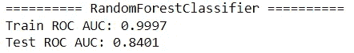

现在，让我们来学习 PDP 的基础知识。

# 📊部分相关图介绍

让我们以 PDP 为例开始讨论。我们将使用`[PartialDependenceDisplay](https://scikit-learn.org/stable/modules/generated/sklearn.inspection.PartialDependenceDisplay.html)`为`pclass`绘制一个:

```
var = 'pclass'
PartialDependenceDisplay.from_estimator(rf, X_train, [var]);
```

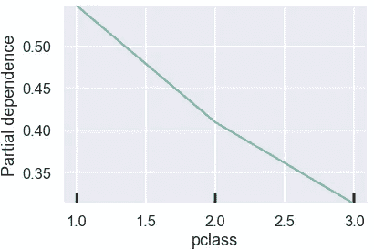

> 随着特征值的变化，PDP 显示了对预测的平均影响。

在上图中，纵轴显示预测概率，横轴显示`pclass`值。绿线表示平均预测概率随着`pclass`值的变化而变化。我们看到，随着乘客等级从 1 增加到 3，平均生存概率降低。

为了更好地理解 PDP，让我们简单地看一下如何手动构建先前的情节。我们首先会发现`pclass`的独特价值。Then️对于每个唯一值，我们将用它替换训练数据中的`pclass`列中的值，并记录预测如何变化。

```
values = X_train[var].sort_values().unique()
print(f"Unique values: {values}")
individual = np.empty((len(X_train), len(values)))
for i, value in enumerate(values):
    X_copy = X_train.copy()
    X_copy[var] = value
    individual[:, i] = rf.predict_proba(X_copy)[:, 1]
individual
```

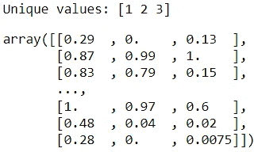

这里我们可以看到，如果我们更改`pclass`的值，训练数据集中每条记录的个体预测(*也称为个体条件期望，ICE* )将如何变化。通过平均这些预测值(*部分相关，PD* )，我们得到 PDP 的输入值。

```
individual.mean(axis=0)
```

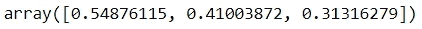

通过绘制这些值和`pclass`的唯一值，我们可以重现 PDP。与使用`PartialDependenceDisplay`相比，我们自己从原始值中绘图给了我们更多的灵活性和对如何可视化 PDP 的控制。

```
sns.lineplot(x=values, y=individual.mean(axis=0), style=0, 
             markers=True, legend=False)
plt.ylim(0.2,0.6)
plt.ylabel("Partial dependence")
plt.xlabel(var);
```

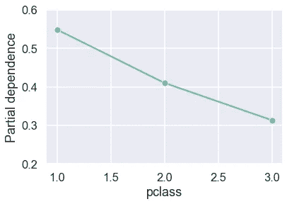

如上所述的手动计算对于学习和理解概念非常有用，但是，在实际用例中继续使用这种方法是不现实的。在实践中，我们将使用 Scikit-learn 更高效的`partial_dependence`函数来提取原始值。

```
raw_values = partial_dependence(rf, X_train, var, kind='both')
raw_values
```

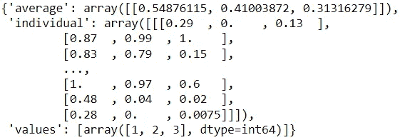

这里，我们指定了`kind='both'`来查看单个预测以及平均预测。如果我们只是在平均预测之后，我们可以用`kind='average'`:

```
partial_dependence(rf, X_train, var, kind='average')
```

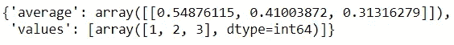

值得注意的是，`partial_dependence(…, kind='both')`和`partial_dependence(…, kind='average')`的平均预测可能不总是与一些机器学习算法完全匹配，其中更有效的`recursion`方法可用于后者。

让我们检查一下我们手动计算的值是否与 Scikit-learn 的版本相匹配:

```
print(np.array_equal(raw_values['individual'][0], individual))
print(np.isclose(raw_values['average'][0], 
                 np.mean(individual, axis=0)))
```

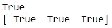

很好，他们很配！

`PartialDependenceDisplay`允许我们绘制单个预测的子集以及平均值，以更好地理解数据:

```
n = 50
PartialDependenceDisplay.from_estimator(
    rf, X_train, ['pclass'], kind="both", n_jobs=3, subsample=n
)
plt.legend(bbox_to_anchor=(1,1));
```

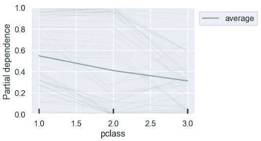

这提供了更多的上下文。我们可以从原始值中自己复制一个类似的图表:

```
sns.lineplot(x=values, y=individual.mean(axis=0), style=0, 
             markers=True, legend=False)
sns.lineplot(data=pd.DataFrame(individual, columns=values)\
                    .sample(n).reset_index().melt('index'), 
             x='variable', y='value', style='index', dashes=False, 
             legend=False, alpha=0.1, size=1, color='#63C1A4')
plt.ylabel("Partial dependence")
plt.xlabel(var);
```

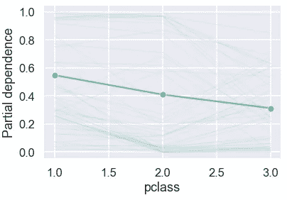

对于像`pclass`这样的离散变量，我们不必局限于线形图，甚至可以使用条形图，因为我们有充分的自由从原始值构建任何图表:

```
raw_df = pd.DataFrame(raw_values['individual'][0], 
                      columns=raw_values['values'])
sns.barplot(data=raw_df.melt(var_name=var), x=var, y='value')
plt.ylabel("Partial dependence");
```

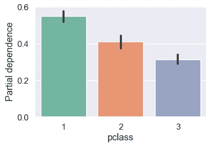

我们很可能会考虑 PDP 的多个变量。了解了基础知识之后，让我们来看看绘制多个变量的 PDP 的几种方法。

# 📈多个变量的 PDP

由于我们的玩具数据集有少量的功能，让我们为每个功能绘制 PDP。我们将首先使用`PartialDependenceDisplay`:

```
n_cols = 2
n_rows = int(len(X_train.columns)/n_cols)fig, ax = plt.subplots(n_rows, n_cols, figsize=(10, 12))
PartialDependenceDisplay.from_estimator(rf, X_train, X_train.columns, ax=ax, n_cols=n_cols)
fig.suptitle('Partial Dependence Plots')
fig.tight_layout();
```

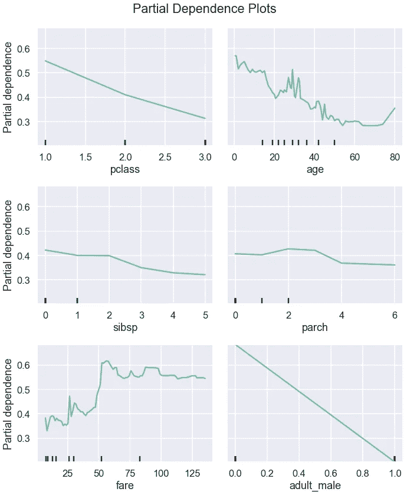

从这些图中，我们可以看到特征和预测之间的关系类型。一些关系看起来是线性的，而另一些则更复杂。

现在，让我们根据用`partial_dependence`提取的原始值绘制 PDP:

```
fig, ax = plt.subplots(n_rows, n_cols, figsize=(10,12), sharey=True)
for i, x in enumerate(X_train.columns):
    raw_values = partial_dependence(rf, X_train, i, kind='average')
    loc = i//n_cols, i%n_cols
    sns.lineplot(x=raw_values['values'][0], 
                 y=raw_values['average'][0], ax=ax[loc], style=0, 
                 markers=True, legend=False)
    ax[loc].set_xlabel(x)
    if i%n_cols==0:
        ax[loc].set_ylabel('Partial dependence')
fig.suptitle('Partial Dependence Plots')
fig.tight_layout()
```

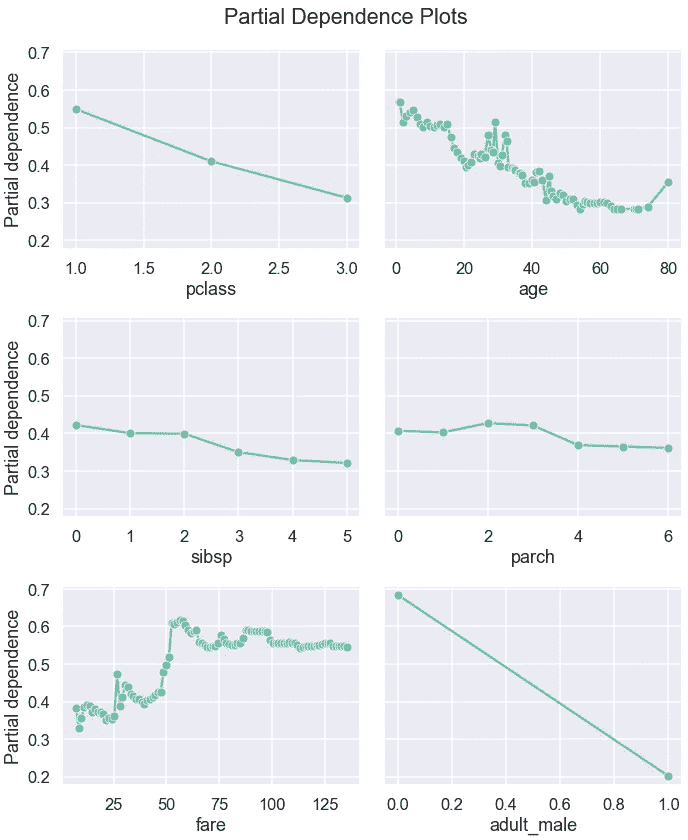

或者，我们也可以绘制单个预测的子集，为我们提供平均值背后的更多背景信息:

```
plt.figure(figsize=(10,12))
for i, x in enumerate(X_train.columns):
    raw_values = partial_dependence(rf, X_train, i, kind='both')
    ax = plt.subplot(n_rows, n_cols, i+1)
    sns.lineplot(x=raw_values['values'][0], y=raw_values['average'][0], 
                 style=0, markers=True, legend=False, ax=ax)
    sns.lineplot(data=pd.DataFrame(raw_values['individual'][0], 
                                   columns=raw_values['values'][0])\
                        .sample(n).reset_index().melt('index'), 
                 x='variable', y='value', style='index', dashes=False, 
                 legend=False, alpha=0.1, size=1, color='#63C1A4')
    ax.set_xlabel(x)
    ax.set_ylabel('Partial dependence')
plt.suptitle('Partial Dependence Plots')
plt.tight_layout()
```

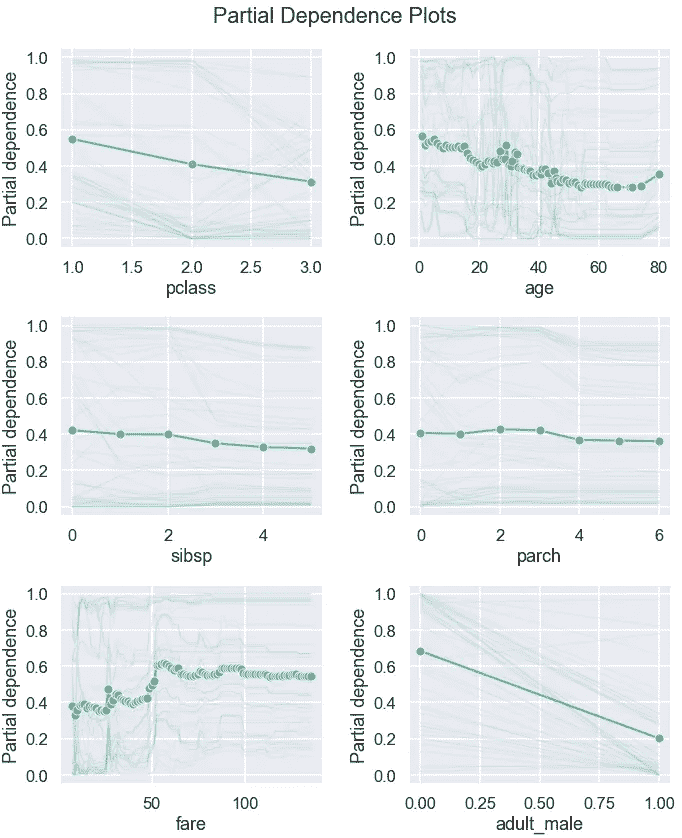

这些图帮助我们理解特征之间的关系以及它们对目标预测的影响，并检测模型学习的模式是否合理和可解释。PDP 还可以用来直观地评估和比较模型。在下一节中，我们将了解如何为多个模型绘制 PDP。

# 📉多个型号的 PDP

让我们再构建两个模型，并提取所有三个模型的原始值:

```
pclass_df = pd.DataFrame(columns=values)
pclass_df.loc['rf'] = partial_dependence(
    rf, X_train, var, kind='average'
)['average'][0]ada = AdaBoostClassifier(random_state=42)
ada.fit(X_train, y_train)
evaluate(ada, X_train, y_train, X_test, y_test)pclass_df.loc['ada'] = partial_dependence(
    ada, X_train, var, kind='average'
)['average'][0]knn = KNeighborsClassifier()
knn.fit(X_train, y_train)
evaluate(knn, X_train, y_train, X_test, y_test)
pclass_df.loc['knn'] = partial_dependence(
    knn, X_train, var, kind='average'
)['average'][0]
pclass_df
```

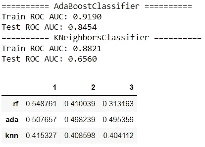

现在，我们可以绘制每个模型的部分相关性:

```
pclass_df = pclass_df.reset_index().melt('index')
sns.lineplot(data=pclass_df, x='variable', y='value', 
             hue='index');
sns.scatterplot(data=pclass_df, x='variable', y='value', 
                hue='index', legend=False)
plt.legend(bbox_to_anchor=(1, 1))
plt.ylabel("Partial dependence")
plt.xlabel(var);
```

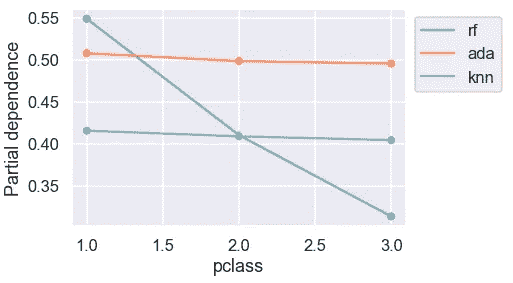

对于 AdaBoost 和 K-最近邻分类器，预测概率几乎与乘客类别无关。

现在让我们对所有变量进行类似的比较:

```
summary = {}
fig, ax = plt.subplots(n_rows, n_cols, figsize=(10,12), sharey=True)for i, x in enumerate(X_train.columns):
    summary[x] = pd.DataFrame(columns=values)
    raw_values = partial_dependence(rf, X_train, x, kind='average')
    summary[x] = pd.DataFrame(columns=raw_values['values'][0])
    summary[x].loc['rf'] = raw_values['average'][0]
    summary[x].loc['ada'] = partial_dependence(
        ada, X_train, x, kind='average'
    )['average'][0]
    summary[x].loc['knn'] = partial_dependence(
        knn, X_train, x, kind='average'
    )['average'][0]

    data = summary[x].reset_index().melt('index')
    loc = i//n_cols, i%n_cols
    if i==1:
        sns.lineplot(data=data, x='variable', y='value', 
                     hue='index',ax=ax[loc]);
        ax[loc].legend(bbox_to_anchor=(1, 1));
    else: 
        sns.lineplot(data=data, x='variable', y='value', 
                     hue='index', ax=ax[loc], legend=False);
    sns.scatterplot(data=data, x='variable', y='value', 
                    hue='index', ax=ax[loc], legend=False)
    ax[loc].set_xlabel(x)
    if i%n_cols==0:
        ax[loc].set_ylabel('Partial dependence')fig.suptitle('Partial Dependence Plots')
fig.tight_layout()
```

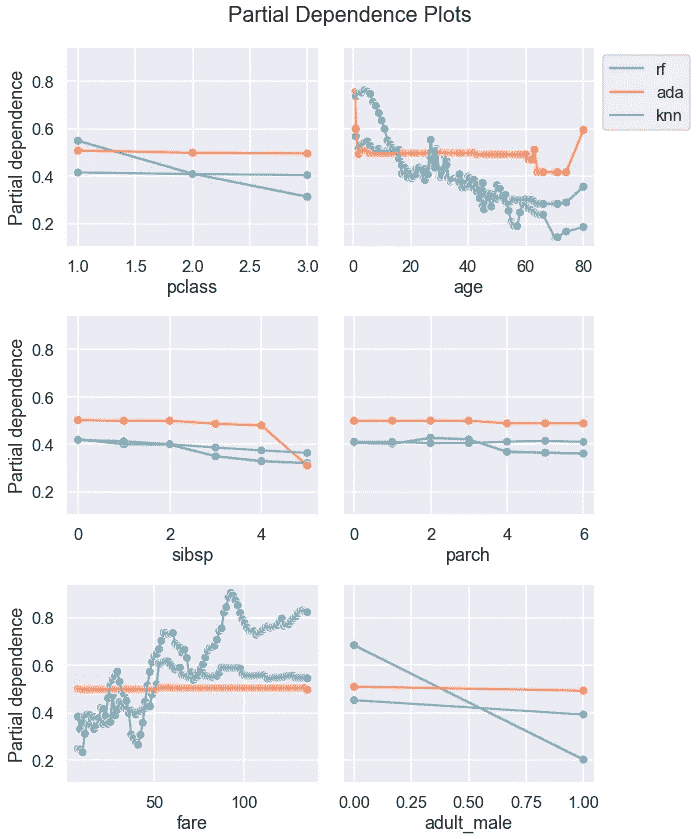

通过不同的模型查看 PDP 有助于选择一个更合理、更易于解释的模型。

部分相关图提供了预测如何受特征变化影响的见解。PDP 的一个缺点是它假设特性是相互独立的。虽然我们已经看到了分类用例，但是 PDP 也可以用于回归。在这篇文章中，我们主要关注最简单的 PDP 形式:单向 PDP。对于渴望了解 PDP 更多信息的学习者来说，能够洞察特性之间交互的双向和/或三向 PDP 是值得研究的有趣主题。


照片由[卡勒姆·肖](https://unsplash.com/@callumshaw?utm_source=medium&utm_medium=referral)在 [Unsplash](https://unsplash.com?utm_source=medium&utm_medium=referral) 上拍摄

*您想访问更多这样的内容吗？媒体会员可以无限制地访问媒体上的任何文章。如果你使用* [*我的推荐链接*](https://zluvsand.medium.com/membership)*成为会员，你的一部分会费会直接去支持我。*

感谢您阅读这篇文章。如果你感兴趣，这里有我的一些其他帖子的链接:
◼️️ [解释 scikit-learn models with shap](/explaining-scikit-learn-models-with-shap-61daff21b12a)
◼️️[会见 histgradientsboostingclassifier](/meet-histgradientboostingclassifier-54a9df60d066?source=your_stories_page-------------------------------------)
◼️️[从 ML 模型到 ML 管道](/from-ml-model-to-ml-pipeline-9f95c32c6512?source=your_stories_page-------------------------------------)
◼️️ [用 Python 绘制多个图形的 4 个简单技巧](/4-simple-tips-for-plotting-multiple-graphs-in-python-38df2112965c)
◼️ [美化熊猫数据帧](/prettifying-pandas-dataframes-75c1a1a6877d)
◼ [简单的数据可视化](/simple-data-visualisations-in-python-that-you-will-find-useful-5e42c92df51e)

再见🏃 💨