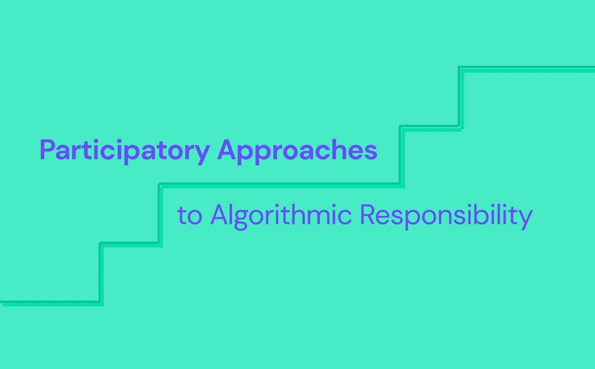
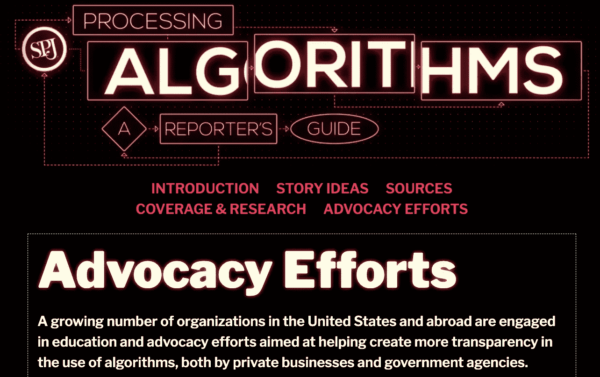
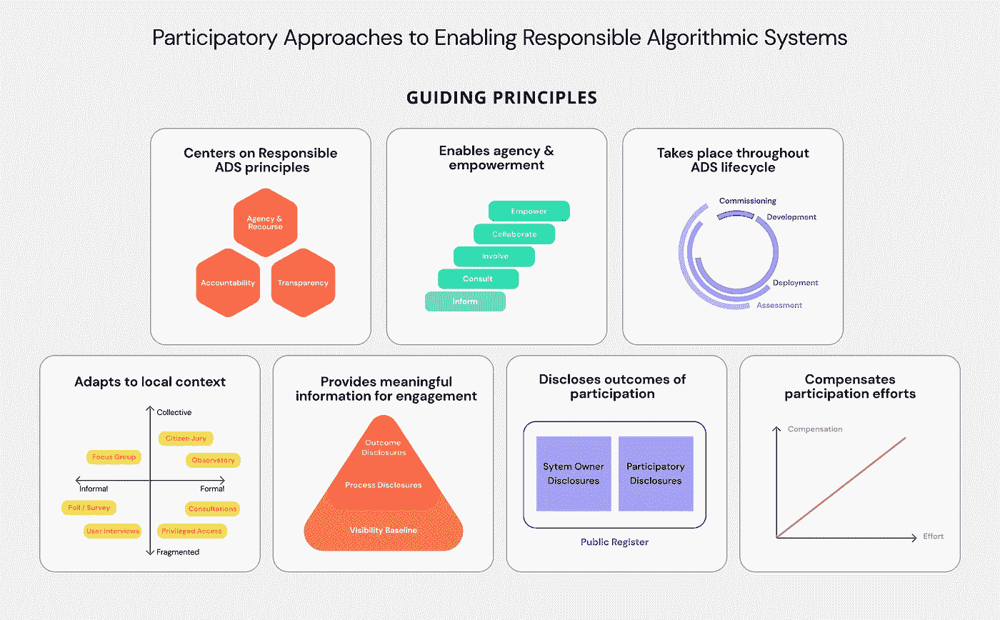
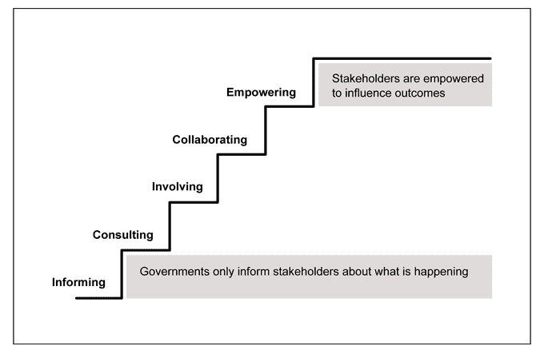
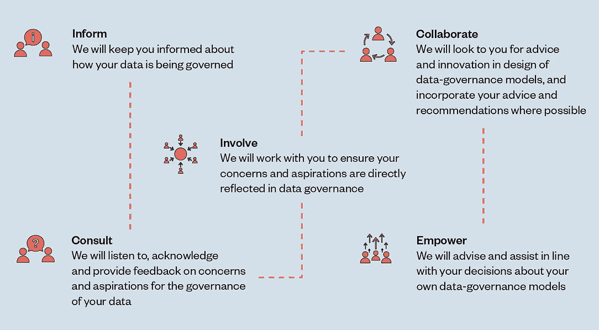
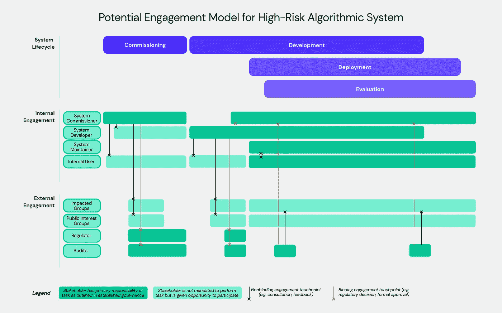

# 算法责任的参与式方法

> 原文：<https://towardsdatascience.com/participatory-approaches-to-algorithmic-responsibility-c349d0e96200>

## 人工智能伦理系列

## 一个让人们参与负责任地使用算法决策系统(ADS)的框架

来源:图片由作者提供

没有公民参与的规定，负责任的算法系统的框架将是不完整的(*和不太负责任的*)。

前提很简单:在协商民主中，公民应该有权决定如何使用他们的数据，并对影响他们福祉的政策拥有发言权。这种政策影响也应该延伸到由私人实体部署的算法决策系统(ADS)。

> **高风险广告**是算法决策系统，直接或间接影响个人或团体可以获得的利益、惩罚或机会。这里的风险是个人或群体受到决策系统输出的伤害，导致不正确或不公平的结果。高风险的广告实施目前正面临越来越大的监管压力。

在这篇文章中，我提出了一个广泛的框架，让公民能够负责任地设计、开发和部署算法决策系统。该框架旨在挑战公民社会对危险广告一无所知的现状。

# 公共利益团体如何为更好的算法透明度和问责制开辟道路

我们首先承认公共利益集团在**提供需求方**和**影响供应方问责机制**中发挥的现有作用。一个参与性框架应该考虑到公共利益团体在推进负责任的广告和实现其使命中的作用。

> **公益团体**由致力于保护和倡导公民社会和边缘群体权利的各种个人和组织组成。他们通常带来领域的专业知识，他们的工作可能有报酬，也可能没有报酬。公共利益团体可以包括倡导者、智囊团、调查记者、学者等。

有几个例子表明，公共利益团体在让有问题的广告实施变得可见方面发挥了关键作用(例如美国的[展示了司法累犯算法](https://www.propublica.org/article/machine-bias-risk-assessments-in-criminal-sentencing)中的偏见)以及帮助关闭有害系统(例如荷兰的[禁止入侵性和不准确的欺诈检测算法](https://algorithmwatch.org/en/syri-netherlands-algorithm/))。

这些例子说明了**需求方问责制**，在缺乏明确或迅速的监管行动的情况下，非国家行为者通常以自下而上的方式承担责任，挑战被认为有过错的利益相关者。

摘自职业记者协会的“记者处理算法指南”([来源](https://www.spj.org/algorithm/index.asp))。关于有问题的算法系统的新闻汇编可以在[这里](https://www.spj.org/algorithm/part-4-coverage-research.asp)找到。

公共利益团体在形成算法决策系统的政策和监管方面也发挥着关键作用。例如，在加拿大，[来自学术界和倡议者的审查人工智能在移民系统中的使用的呼吁](https://it3.utoronto.ca/wp-content/uploads/2018/10/20180926-IHRP-Automated-Systems-Report-Web.pdf) [有助于制止有问题的做法](https://www.sciencedirect.com/science/article/pii/S0308596120300689#bib52)并导致负责任的使用指南的创建[要求对公共部门部署的广告进行影响评估和质量保证措施](https://www.statcan.gc.ca/en/data-science/network/automated-systems)。

尽管 ADS 监管仍处于初级阶段，但公共利益团体可以通过继续向监管者施加压力来帮助发展供应方问责制。

更广泛地说，政府可以从民间社会早期参与反倾销监管的形成过程中获益。来自 OECD 的一份详细的[研究](https://www.oecd.org/gov/open-government/innovative-citizen-participation-new-democratic-institutions-catching-the-deliberative-wave-highlights.pdf)表明，实施代表审议流程可以带来更好的政策结果**。**

# 参与陷阱以及如何避免它们

在深入探讨如何增强参与式方法以实现透明和负责任的算法决策之前，我们应该首先检查一些常见的参与式陷阱:

1.  “自由审计师问题”，即依赖公共利益集团(而非国家行为者)的劳动来提供问责。
2.  公众参与的符号化和“参与洗”。

**第一个陷阱是** **主要依靠公共利益团体和更广泛的公民社会的劳动来实施**(在缺乏配套监管的情况下相当困难)**算法透明和问责机制**。人们担心行动的重担将落在为公众利益充当“自由审计员”的公民肩上。虽然一些公共利益团体在维护民间社会和/或特定少数群体的利益方面有具体的任务授权，但问责制的主要负担应由政府行为者承担。他们负责起草和执行监管，并可以部署激励和控制措施，以保证负责任地使用和开发算法决策系统。

话虽如此，公共利益集团应该继续在加强需求方透明度和问责制方面发挥关键作用。通过提供对 ADS 文档的特权访问****渠道**(特别是对于高风险系统)，有机会授权给公共利益团体并减轻劳动负担。目前，访问 ADS 文档构成了公共利益团体的一个主要痛点，[即使在访问应该受到“信息自由”法保障的情况下](https://www.opendemocracy.net/en/freedom-of-information/the-foi-system-is-utterly-broken-heres-how-to-fix-it/)。**

****另一个要避免的陷阱是*公众参与算法决策系统的设计和开发的符号化*，**由于这些系统与受信任的公共利益团体有关联，它们似乎可以在公众认知中获得合法性。这在以下情况下可能会有问题:广告的所有者公开分享被咨询方的名称，但不披露咨询的结果，或者如果公民的建议没有反映在系统的设计中。简而言之，公众咨询并不能保证更好的广告效果。还应该考虑如何披露民间社会的参与，同时避免“[参与清洗](https://arxiv.org/pdf/2007.02423.pdf)”。**

# **建立更好的参与框架**

**一个关于负责任的算法决策系统的详尽框架应该概述公共利益团体、受影响团体和更广泛社会的角色和参与模式，同时避免上述参与陷阱。**

**算法决策系统的参与式方法有 7 个指导原则。**

****

**算法决策系统参与式方法的指导原则。来源:图片由作者提供。**

**参与性框架应该:**

## ****1。以负责任的算法决策原则为中心****

**参与式方法应该支持负责任地使用算法决策系统。这意味着确保一个广告产生**公平**和**可解释的**结果，稳健地执行**，维护数据**安全**和**隐私**，以及**避免对受影响用户的伤害**。****

****为了维护这些价值观，参与性机制应该补充和加强已经到位的**透明度**、**问责制**和**机构**措施。****

********

****节选自[重温负责任的算法决策(ADS)框架](https://medium.com/towards-data-science/back-to-basics-revisiting-the-responsible-ai-framework-847fd3ec860b)。来源:图片由作者提供。****

****一个负责任的 ADS 框架的北极星是对人类代理的保护，包括允许受影响的个人质疑系统结果的追索权的可能性。****

## ****2.促进受影响群体的代理和赋权****

****在负责任的 ADS 框架的基础上，参与式方法应该能够增强相关群体的能力，特别是直接或间接受到相关系统影响的个人。****

****Arnstein 的“公民参与的阶梯”是一个思考如何提高公民控制和代理水平的基础框架。该框架已在数据管理框架中被采用，以支持负责任地使用、收集和管理数据。****

****************

****左:参与的阶梯。改编自 Arnstein，S.R. 1969 ( [来源](https://www.vpaunpacked.org/participation))。右图:参与数据管理的框架，阿达·洛芙莱斯研究所，2021 年([来源](https://www.adalovelaceinstitute.org/report/participatory-data-stewardship/))****

****在负责任地使用算法决策系统的背景下，“参与阶梯”框架也是有用的。在最低级别的机构中，受影响的群体被告知广告如何决定他们的结果。接下来，他们可以**咨询**相关广告，获得反馈和关注。他们可以**参与**广告的设计、开发和监控，确保反馈得到反映。他们还可以在 ADS 生命周期中与系统所有者合作，支持负责任的租户。最后，在最高级别的机构中，受影响的团体**被授权**挑战广告结果，要求资源并影响系统的设计。****

****这些级别的参与可以被认为是构建模块。我们首先需要告知公民不同的算法决策系统如何影响他们的结果——这是一个最低的参与门槛，遗憾的是，今天在大多数国家都没有这一要求。一旦公民被告知正在发生的事情，他们就可以在决策过程中被咨询、参与和授权。****

## ****3.贯穿广告的整个生命周期****

****有效的参与式参与模式，尤其是对于高风险决策系统，应该从**试运行阶段**开始，此时使用算法系统解决手头问题的意图实现。在此阶段，系统所有者应该研究手头的问题，研究不同的解决方案及其利弊，就解决方案提案达成一致，并为 ADS 制定路线图。确保以负责任的方式设计和策划广告的最有效机会发生在这个阶段。****

****试运行阶段的参与性参与应有助于回答以下问题:****

*   ****拟定的广告是否充分解决了问题或增加了程序的价值，同时将伤害风险降至最低？****
*   ****首先，广告是否合适(相对于其他决策系统)？****
*   ****提议的风险评估和缓解计划是否已经过潜在受影响群体或领域专家的验证？****

****除了试运行阶段，参与式参与有助于确保 ADS 已准备好启动，它有效地支持代理和求助，并且它实际上支持良好的决策。****

********

****高风险算法决策系统的内部和外部利益相关者之间基于生命周期的参与模型(说明性的)。来源:图片由作者提供。****

****在算法系统的整个生命周期中，注册可以是一个非常有用的工具，可以访问与算法系统相关的[过程和结果信息](/fighting-back-on-algorithmic-opacity-30a0c13f0224)，也可以很好地支持获取参与式方法的输入和结果。****

> ******ADS register**是一种治理工具，能够实现与一套算法决策系统相关的结果和流程的透明度。它基本上是不同利益相关者共享的关于算法系统在其整个生命周期中被治理的披露的日志。想了解更多关于算法寄存器的信息，请查看[我之前的文章](/ai-registers-101-7e2f58719781)。****

## ****4.适应当地环境****

****推荐的参与模式应受 ADS 的风险水平和应用该模式的当地环境的影响。****

****现有的政策提案计划采用一种**风险比例**的方法来监管广告。这种方法也可以扩展到推荐的参与模式。值得注意的是，所有 ADS 系统，无论风险如何，都应该有一个最低披露要求，以帮助验证风险级别是否正确分类。相关民间团体应可获得该文件，以进行评论或质疑。****

****研究现有审议程序中目前使用的现有参与模式，并将其作为参与性参与 ADS 的基础，可能会有所帮助。****

****参与模式可以是:****

*   ******正式**(纳入治理和监管)或**非正式**(无法律约束力的约定要求)；****
*   ******集体**(所有相关方达成一套决定或建议)或**分散**(代表独立的意见或建议)。****

********

****不同的参与模式(非详尽)。来源:图片由作者提供。****

## ****5.为互动提供有意义的信息****

****参与参与机制的个人或团体应:****

*   ****在推广负责任的广告方面有一个清晰明确的任务；****
*   ****获得相关文档和培训，帮助他们完成任务。****

****例如，如果一个可能会受到拟议广告影响的个人被要求对其影响评估发表意见，他们首先需要了解广告将如何工作。他们需要访问与其设计、测试和监控相关的信息。这些信息需要以个人能够理解的格式呈现。对于大多数人来说，访问原始代码甚至复杂的系统架构本身可能并不是有意义的信息。这里的个人希望了解影响他们的决策是如何做出的，以及有什么护栏来确保负责任地做出决策。****

******算法寄存器**可以是一个有用的工具，使参与的个人和团体能够访问关于被评估系统的**有意义的信息**。****

## ****6.披露参与结果****

****披露参与结果是避免“参与清洗”的一种方式，尤其是在参与的个人或团体不同意与广告相关的某些做法或决策的情况下。****

****在**具有集体产出的正式参与模式**的情况下，如公民投票或公民陪审团，参与结果通常是公开的。****

****主持**非正式**公开活动的实体通常没有义务披露受聘个人或团体的推荐。****

****理想情况下，ADS 所有者应该对他们利用的参与性方法以及随之而来的建议和决定保持透明。****

****还应该有第三方机制来清楚地证明 ADS 是否通过了不同参与模式的批准。这可以是证书或审计报告的形式。****

## ****7.补偿参与努力****

****最后，参与性的努力应该得到与投入的努力成比例的补偿。提出这一措施是为了避免大公司和国家行为者受益于并依赖公民社会成员的劳动，从而为有问题的广告带来透明度和问责制。****

****这一提议可能是最难实施的，因为一方面，这可能会阻碍组织采用参与式方法，另一方面，薪酬可能会扭曲参与式激励机制。****

****政府应该释放足够的资金，在需要时支持正式的参与模式。补偿参与者或将其作为公民义务的一部分是有法律先例的。****

****针对公益团体的定向资助可能是补偿非正式参与模式的潜在工具。****

****在私营部门，付费招募非正式用户研究和公民陪审团的参与者已经是一种惯例(查看来自微软的这个[例子)。希望扩大 ADS 覆盖范围的公司也应该考虑与建立负责任的流程相关的参与成本。](https://docs.microsoft.com/en-us/azure/architecture/guide/responsible-innovation/community-jury/)****

## ****把这些放在一起。****

****下面的数据库为 ADS 生命周期的每个阶段的参与模式提供了详细的建议。正确的参与模式在很大程度上取决于系统的风险水平和当地的实施环境。****

****负责任的广告生命周期管理数据库——由作者创建。****

# ****走向实施****

****参与机制应该是算法监管的基石。不幸的是，最近的监管提案中缺乏公民参与的条款。****

****对欧盟人工智能法案的一个批评是，它没有正确考虑面对风险广告时的公民授权。正如[阿达·洛芙莱斯研究所](https://www.adalovelaceinstitute.org/blog/three-proposals-strengthen-eu-artificial-intelligence-act/)指出的那样，拟议中的法规“未能为个人参与创造有意义的空间”。此外，初稿没有关于受影响的团体协商或追索权的规定。由于[公共利益集团的压力](https://algorithmwatch.org/en/joint-statement-draft-ai-act/)，已经增加了关于追索权的新条款，但是我们还没有看到关于告知最终用户他们受人工智能系统的约束并保证他们获得解释的权利的条款。****

****由于在广告生命周期中缺乏“供应方”执法来赋予公民权力，我们可以同时考虑“需求方”机制，如认证和第三方审计。****

****将价值观集中在负责任地使用广告上的公司将有机会以身作则。在缺乏实施监管的情况下，公共登记册可以成为邀请和鼓励参与模式的一个很好的工具。****

******关于该主题的其他资源:******

*   ****[机器学习的参与式方法](https://participatoryml.github.io/)，ICML 2020 研讨会****
*   ****[参与式数据管理](https://www.adalovelaceinstitute.org/report/participatory-data-stewardship/)，阿达·洛芙莱斯研究所(2021)****

*****基于我的研究生论文“* [*超越黑盒*](https://dspace.mit.edu/handle/1721.1/139092)*”(MIT 2021)的一系列关于负责任的 AI 的一部分。提出的想法是基于几个在管理、部署和评估人工智能系统方面有直接经验的从业者的反馈和支持而开发的。我正在分享和开源我的发现，以使其他人能够轻松地研究并为这个领域做出贡献。*****