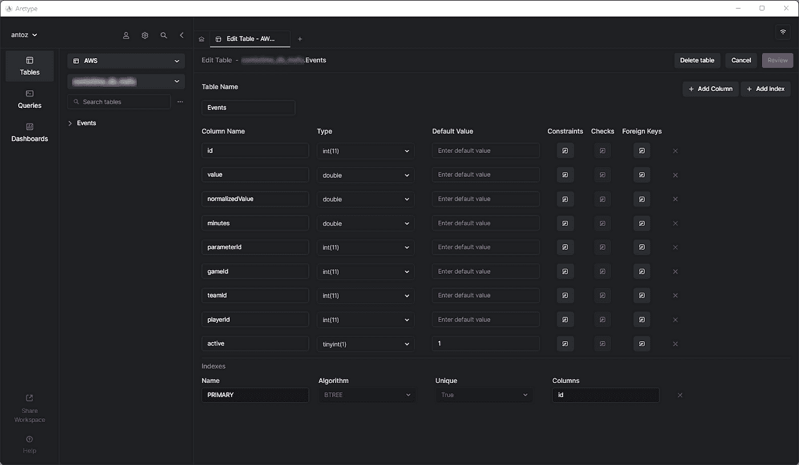
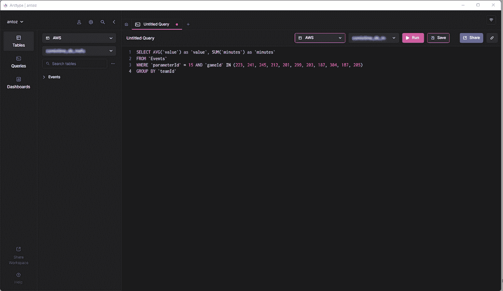

# 使用数据上下文划分十亿行体育数据表

> 原文：<https://towardsdatascience.com/partitioning-a-billion-row-table-of-sports-data-using-data-context-6eb94bb9f18a>

## 我的团队如何帮助一家数据驱动的初创公司处理十亿行的表格


布拉登·科拉姆在 Unsplash[拍摄的照片](https://unsplash.com?utm_source=medium&utm_medium=referral)

在本文中，您将学习如何在对数据库进行分区时使用数据背后的语义。这可以极大地提高应用程序的性能。而且，最重要的是，您将发现应该根据您独特的应用程序域来定制您的分区标准。

正如我在这里已经提到的，我已经与一家初创公司合作开发了一个 web 应用程序，供体育专家做出决策和探索数据。该应用程序支持任何运动，但我们位于欧洲，而欧洲人热爱足球。全世界每天玩的数百个游戏中的每一个都有数千行。仅仅几个月，我们应用程序中的`Events`表就达到了 5 亿行！

[](/working-for-a-data-driven-startup-whose-value-surged-700-in-less-than-one-year-168e8c43565a) [## 为一家数据驱动的初创公司工作，这家公司的价值在不到一年的时间里飙升了 700%

### 数据如何帮助您应对如此惊人的增长

towardsdatascience.com](/working-for-a-data-driven-startup-whose-value-surged-700-in-less-than-one-year-168e8c43565a) 

通过了解体育专家如何查询我们的数据，我们可以智能地对数据库进行分区。这个新表上的平均时间提高了 20 到 40 倍。所有查询的平均时间提高了 5 到 10 倍。

现在让我们深入研究这个场景，了解为什么在对数据库进行分区时不能忽略数据上下文。

# 介绍背景

我们的体育应用程序提供原始数据和聚合数据，尽管采用它的专业人士更喜欢后者。底层数据库包含来自多个提供商的数万亿字节的复杂、非结构化、异构数据。因此，最大的挑战是设计一个可靠、快速、易于探索的数据库。

## 应用领域

在这个行业中，许多提供商向他们的客户提供对最重要的足球比赛的访问。具体来说，它们为您提供与比赛中发生的事情相关的数据，如进球、助攻、黄牌、传球等等。包含这些数据的表格是迄今为止我们处理过的最大的表格。

## VPS 规格、技术和架构

我的团队一直在开发后端应用程序，它提供了最重要的数据探索特性。我们采用运行在 JVM ( [Java 虚拟机](https://arctype.com/mysql/drivers/java-mysql))之上的 [Kotlin v1.6](https://kotlinlang.org/docs/whatsnew16.html) 作为编程语言， [Spring Boot](https://spring.io/projects/spring-boot) [2.5.3](https://spring.io/blog/2021/07/22/spring-boot-2-5-3-is-now-available) 作为框架，[Hibernate](https://hibernate.org/)[5 . 4 . 32 . final](https://mvnrepository.com/artifact/org.hibernate/hibernate-core/5.4.32.Final)作为 ORM ( [对象关系映射](https://en.wikipedia.org/wiki/Object%E2%80%93relational_mapping))。我们选择这种技术堆栈的主要原因是速度是最重要的业务需求之一。因此，我们需要一种能够利用大量多线程处理的技术，而 Spring Boot 被证明是一种可靠的解决方案。

我们通过由 [Dokku](http://dokku.viewdocs.io/dokku/) 管理的 [Docker](https://arctype.com/mysql/install/docker-windows-mysql) 容器在 16GB 8CPU [VPS](https://it.wikipedia.org/wiki/Virtual_private_server) 上部署了我们的后端。它最多可以使用 15GB 的内存。这是因为 1gb 的 RAM 专用于基于 Redis 的缓存系统。我们添加它是为了提高性能，避免后端因重复操作而过载。

## 数据库和表结构

至于数据库，我们决定选择 [MySQL 8](https://arctype.com/mysql/connect/client-mysql) 。一个 8GB 和 2 个 CPU 的 VPS 当前托管数据库服务器，它支持多达 200 个并发连接。后端应用程序和数据库位于同一个服务器群中，以避免通信开销。我们[设计数据库](https://arctype.com/blog/er-diagram/)结构是为了[避免重复](https://arctype.com/blog/2nf-3nf-normalization-example/)并考虑到性能。我们决定采用关系数据库，因为我们希望有一个一致的结构来转换从提供者那里收到的数据。通过这种方式，我们将体育数据标准化，使其更易于探索并呈现给最终用户。

在撰写本文时，该数据库包含数百个表格，由于我签署了 [NDA](https://en.wikipedia.org/wiki/Non-disclosure_agreement) ，我无法一一呈现。幸运的是，一张表足以彻底分析我们为什么最终采用了您将要看到的基于数据上下文的分区。当我们开始在 Events 表上执行繁重的查询时，真正的挑战来了。但是在开始之前，让我们看看事件表是什么样子的:



事件表模式

正如您所看到的，它没有涉及很多列，但是请记住，出于保密的原因，我不得不省略其中的一些。但是这里真正重要的是`parameterId`和`gameId`列。我们使用这两个外键来选择参数的类型(例如，进球、黄牌、传球、点球)以及发生这种情况的比赛。

## 性能问题

`Events`表在短短几个月内就达到了 5 亿行。正如我们在这篇文章中已经深入讨论过的，主要问题是我们需要在查询中使用 slow 来执行聚合操作。这是因为比赛中发生的事情并不重要。相反，体育专家希望分析汇总的数据来发现趋势，并基于这些数据做出决策。

此外，虽然他们通常分析整个赛季或最近 5 或 10 场比赛，但用户通常希望从他们的分析中排除一些特定的比赛。这是因为他们不希望一场比赛打得特别差或特别好，使他们的结果两极分化。我们不能预先生成汇总数据，因为我们必须对所有可能的组合都这样做，这是不可行的。因此，我们必须存储所有数据，并即时汇总这些数据。

# 了解性能问题

现在，让我们深入到导致我们不得不面对的性能问题的核心方面。

## 百万行的表很慢

如果您曾经处理过包含数亿行的表，您就会知道它们天生就很慢。你甚至不能想到在如此大的表上运行`JOIN` s。然而，您可以在合理的时间内执行`SELECT`查询。当这些查询涉及简单的`WHERE`条件时尤其如此。另一方面，当使用集合函数或`IN`子句时，它们变得非常慢。在这些情况下，他们可以轻松地花费 80 秒，这实在是太多了。

## 索引是不够的

为了提高性能，我们决定[定义一些指标](https://arctype.com/blog/mysql-index-performance/)。这是我们寻找性能问题解决方案的第一种方法。但是，不幸的是，这导致了另一个问题。[索引需要时间和空间](https://arctype.com/blog/mysql-indexing-best-practices/)。这通常是无关紧要的，但在处理如此大的表时就不是这样了。事实证明，基于最常见的查询定义复杂的索引需要几个小时和几千兆字节的空间。此外，索引是有帮助的，但不是魔术

# 基于数据上下文的数据库分区解决方案

由于我们无法用自定义索引解决性能问题，我们决定尝试一种新方法。我们与其他专家交谈，在网上寻找解决方案，阅读基于类似场景的文章，最终决定对数据库进行分区是正确的方法。

## 为什么传统分区可能不是正确的方法

在划分所有最大的表之前，我们研究了 MySQL 官方文档[和有趣文章](https://dev.mysql.com/doc/refman/8.0/en/partitioning.html)中的主题。尽管我们都同意这是应该走的路，但是我们也意识到应用分区而不考虑我们特定的应用领域将是一个错误。具体来说，我们知道在对数据库进行分区时找到合适的标准是多么重要。一些分区专家告诉我们，传统的方法是根据行数进行分区。但是我们想找到比这更智能更有效的东西。

## 深入应用程序领域以找到划分标准

通过分析应用领域和采访用户，我们学到了重要的一课。体育专家倾向于分析同一场比赛中各场比赛的汇总数据。例如，足球中的[比赛可以是联赛、锦标赛，或者是你可以赢得奖杯的单项比赛。有成千上万种不同的比赛。欧洲最重要的是欧冠、英超、拉力加、意甲、德甲、荷甲、西甲、西甲。](https://en.wikipedia.org/wiki/List_of_association_football_competitions)

这意味着我们的用户很少考虑来自不同比赛的数据。此外，他们更喜欢逐季探索数据。换句话说，他们很少离开在特定季节进行的体育比赛所代表的背景。我们的数据库结构用一个名为`SeasonCompetition`的表表达了这个概念，它的目标是将一场比赛与一个特定的赛季相关联。因此，我们意识到一个好的方法是将我们的大表分成与特定的`SeasonCompetition`实例相关的子表。

具体来说，我们为这些新表定义了以下名称格式:`<tableName>_<seasonCompetitionId>`。

因此，如果我们在`SeasonCompetition`表中有 100 行，我们就必须将大的`Events`表分割成较小的`Events_1`、`Events_2`，...，`Events_100`表。根据我们的分析，这种方法在一般情况下会导致相当大的性能提升，尽管在极少数情况下会引入一些开销。

## 将标准与最常见的查询相匹配

在编码和启动脚本来执行这个复杂且可能不返回的操作之前，我们通过查看后端应用程序执行的最常见查询来验证我们的研究。但是这样做的时候，我们发现绝大多数的查询只涉及一个赛季比赛中的比赛。这使我们相信我们是对的。因此，我们使用刚才定义的方法对数据库中的所有大型表进行了分区。



我们的应用程序领域中的一个常见查询示例

```
SELECT AVG('value') as 'value', SUM('minutes') as 'minutes'
FROM 'Events'
WHERE 'parameterId' = 15 AND 'gameId' IN(223,241,245,212,201,299,187,304,187,205)
GROUP BY 'teamId'
```

现在，让我们研究一下这个决定的利弊。

## 赞成的意见

*   在一个最多包含 50 万行的表上运行查询比在一个包含 5 亿行的表上运行查询要高效得多，尤其是在聚合查询方面。
*   较小的表更容易管理和更新。添加一个列或索引在时间和空间上甚至比不上以前。另外，每个`SeasonCompetition`都是不同的，需要不同的分析。因此，它可能需要特殊的列和索引，而前面提到的分区允许我们轻松地处理这个问题。
*   提供商可能会修改一些数据。这迫使我们执行删除和更新查询，这在如此小的表上要快得多。加上它们总是只和某个特定`SeasonCompetition`的某些游戏相关，所以我们现在只需要只在单个桌上操作就可以了。

## 骗局

*   在对这些子表进行查询之前，我们需要知道与感兴趣的游戏相关的`seasonCompetitionId`。这是因为表名中使用了`seasonCompetitionId`值。因此，我们的后端需要在运行查询之前通过查看分析中的游戏来检索这些信息，这是一个很小的开销。
*   当一个查询涉及一组包含许多`SeasonCompetitions`的游戏时，后端应用程序必须在每个子表上运行一个查询。因此，在这些情况下，我们不能再在数据库级别聚合数据，我们必须在应用程序级别进行聚合。这在后端逻辑中引入了一些复杂性。同时，我们可以并行执行这些查询。此外，我们可以高效、并行地聚合检索到的数据。
*   管理一个拥有数千个表的数据库并不容易，而且在一个[客户机](https://arctype.com/blog/mysql-partition/arctype.com)中进行探索也是一项挑战。类似地，在每个表中添加新列或更新现有列也很麻烦，需要定制脚本。

# 基于数据上下文的分区对性能的影响

现在让我们看看在新的分区数据库中执行查询时获得的时间改进。

*   平均情况下的时间改进(仅涉及一个`SeasonCompetition`的查询):从 20x 到 40x
*   一般情况下的时间改进(涉及一个或多个`SeasonCompetitions`的查询):从 5 倍提高到 10 倍

# 最后的想法

对数据库进行分区无疑是提高性能的一个很好的方法，尤其是在大型数据库上。然而，不考虑您的特定应用程序域就这样做可能是一个错误，或者导致低效的解决方案。相反，花时间通过采访专家和用户以及查看执行最多的查询来研究领域对于构思高效的划分标准是至关重要的。本文向您展示了如何做到这一点，并通过一个真实的案例研究展示了这种方法的结果。

感谢阅读！我希望我的故事对你有所帮助。如果有任何问题、意见或建议，请随时联系我。