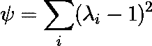
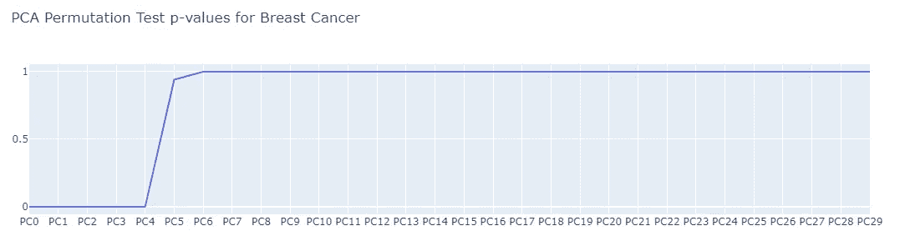
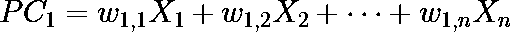
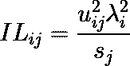

# PCA 102:该不该用 PCA？使用多少组件？如何解读它们？

> 原文：<https://towardsdatascience.com/pca-102-should-you-use-pca-how-many-components-to-use-how-to-interpret-them-da0c8e3b11f0>

## 对 PCA 分析中一些中间概念的探讨


约翰·施诺布里奇在 [Unsplash](https://unsplash.com?utm_source=medium&utm_medium=referral) 上的照片

主成分分析(PCA)是数据科学领域中最常用的降维技术之一。由于它的重要性，提高我们对它的理解是更好地使用这项技术的必要条件。

然而，在介绍性课程中经常可以看到 PCA 是如何制作的以及它代表了什么，然而，有些方面通常不会在这些课程中进行评论。一些改进 PCA 的想法只能在论文中找到，因此许多数据科学家没有接触过它。

这篇文章旨在提高对 PCA 的理解，提供工具来回答，至少在一定程度上，以下问题:

*   我如何知道是否应该对我的数据使用 PCA？
*   我应该使用多少个主成分？我怎么知道有多少是相关的？
*   我能解释主要成分并对它们有某种可解释性吗？

因此，首先，我们将(真正)简要描述一下 PCA 是如何构建的，之后，我们将直接回答这些问题。这款笔记本的代码(甚至更多)可以在 [Kaggle](https://www.kaggle.com/tiagotoledojr/a-primer-on-pca) 和 [Github](https://github.com/TNanukem/paper_implementations/blob/main/PCA.ipynb) 上获得。

这篇文章的灵感来自于论文[1]。

# 主成分分析的简要回顾

PCA 算法相当简单，在互联网上有广泛的解释。因此，这一节将快速概述算法。它的实现可以在上面链接的笔记本中找到。

因此，算法如下:

*   计算数据集的协方差矩阵
*   提取矩阵的特征向量和特征值
*   选择所需维度的数量，过滤特征向量以匹配它，并按照相关的特征值对它们进行排序
*   将原始空间乘以上一步生成的特征向量。

提醒一下，在应用 PCA 之前对数据进行标准化是一个很好的做法。这就避免了所有方差只在一个分量上的情况，因为方差只在一个或两个更大范围的变量上。

# 评估我们是否应该对空间应用 PCA

判断我们是否应该在机器学习问题上使用 PCA 的通常程序包括应用有和没有 PCA 的建模过程，并查看哪一个产生最好的结果。由于机器学习是一个非常经验性的领域，这对于几种方法来说是常见的。

然而，有一种更好的方法来评估主成分分析的有效性，而不必多次拟合昂贵的模型。

首先，重要的是要知道什么时候主成分分析产生的主成分是无用的:什么时候你的特征彼此不相关。

因此，验证 PCA 有用性的第一个方法是验证数据集的不相关程度。如果它是非常不相关的，那么你有一个不应用主成分分析的好理由。

有几个指标可以用来评估这一点。这里，我将关注两个有界的度量。无界度量需要一个比较度量，因此更难处理。

## 分散系数

该度量的几何解释是，数据集在空间上创建的超大体积随着数据集变量之间的相关性增加而减小。因此，我们期望该度量的非常低的值将指示使用 PCA 是一个好的选择。

从代数的角度来看，为了计算这个度量，我们只需要计算数据集的相关矩阵的行列式。此指标的最大值是空间的维数，最小值为零。

下面的代码片段包含使用和不使用标准化来计算该指标的代码:

```
def scatter_coefficient(X, normalize=True):
    corr = np.corrcoef(X, rowvar=False)
    if normalize:
        return np.linalg.det(corr) / np.trace(corr)
    else:
        return np.linalg.det(corr)
```

这种度量与另一种称为广义方差的度量非常相似，它使用协方差矩阵而不是相关性。

## Psi 指数

该度量寻找从相关矩阵获得的特征值的幅度。如果变量不相关，每个 PC 倾向于解释与单个变量一样多的方差，并且它们的特征值倾向于 1。因此，越靠近 y = 1 行，面积越小，数据集的不相关程度越高。

对于此指标，值越大越好。其最大值为 p(p-1)，最小值为零。它由以下等式给出:



我们可以用下面的代码很容易地计算出来:

```
def psi_index(X, normalize=False):
    corr = np.corrcoef(X, rowvar=False)

    # Eigenvalues and eigenvectors from the correlation matrix
    eig_val, eig_vec = np.linalg.eig(corr)
    idx = eig_val.argsort()[::-1]
    eig_val = eig_val[idx]if normalize:
        p = X.shape[0]
        return np.sum((eig_val - 1)**2) / (p*(p-1))
    else:
        return np.sum((eig_val - 1)**2)
```

# 选择主成分

选择要使用的主成分的通常方法是设置解释方差的阈值，例如 80%，然后选择产生尽可能接近该阈值的解释方差的累积和的成分的数量。

这种方法有两个主要问题:

*   它需要一个阈值的主观选择。在大多数情况下，选择 80%或 90%的门槛没有公平的动机，它们是任意的。
*   方差某些部分可能是纯噪声而不是信号。你无法事先知道，你选择的这个阈值是否只去除了噪声，如果是，去除了多少，或者你实际上是否去除了信号。

选择组件数量的一种方法是使用排列测试。

置换测试是统计学中一种非常常见的测试，它包括置换您正在评估的实例，以查看您从假设测试中获得的见解是否仍然成立。为了更好地解释排列测试，我强烈推荐[这个网站](https://www.jwilber.me/permutationtest/)。

因此，在处理 PCA 时，策略如下:

*   对您的数据运行 PCA，并保存每个主成分解释的方差
*   定义多个测试，例如 1000 个，并且对于每个测试，不替换地抽取彼此独立的数据集列
*   对这些测试中的每一个再次运行 PCA，并保存每个主成分解释的方差
*   将原始数据集的解释差异与置换版本进行比较

这里的想法是，通过对数据集的列进行采样，我们将去相关特征，因此，在这个新的采样数据集上，PCA 不应该生成良好的变换。因此，我们期望，如果主成分是相关的，在 PC 上置换解释的方差不应该大于最初解释的方差。

让我们把它编码起来，看看我们能得到什么。

## 编码排列测试

首先，让我们创建一个函数来消除数据列的相关性:

```
def de_correlate_df(df):
    X_aux = df.copy()
    for col in df.columns:
        X_aux[col] = df[col].sample(len(df)).values

    return X_aux
```

现在，让我们保存我们最初解释的方差比:

```
pca = PCA()
pca.fit(df)
original_variance = pca.explained_variance_ratio_
```

现在，我们将定义测试的数量，并创建一个矩阵来保存我们的实验结果:

```
N_permutations = 1000
variance = np.zeros((N_permutations, len(df.columns)))
```

最后，让我们生成新的数据集并保存结果:

```
for i in range(N_permutations):
    X_aux = de_correlate_df(df)

    pca.fit(X_aux)
    variance[i, :] = pca.explained_variance_ratio_
```

有了这些，我们就可以计算 p 值，看看哪些成分是相关的:

```
p_val = np.sum(variance > original_variance, axis=0) / N_permutationsfig = go.Figure()
fig.add_trace(go.Scatter(x=[f'PC{i}' for i in range(len(df.columns))], y=p_val, name='p-value on significance'))fig.update_layout(title="PCA Permutation Test p-values")
```

例如，如果将此应用于在 BSD 许可下在 [UCI 机器学习库](https://archive.ics.uci.edu/ml/datasets/Breast+Cancer+Wisconsin+(Diagnostic))上免费获得的乳腺癌数据集[2],结果将是前 5 个主成分是相关的，如图所示:



在乳腺癌数据集上获得置换检验的 p 值。由作者创作。

链接的笔记本有一些使用这种方法的实验，我强烈建议读者看看这在实践中的工作。事实上，这种方法似乎更适用于具有更好有用性度量的数据集。

# 解释主要成分

当手头的问题需要解释的时候，我在使用 PCA 时看到了很多阻力。这是一个合理的阻力，因为，例如，如果你要用 SHAP 来解释你的模型，它将输出主成分对模型的影响，而不是直接输出单个特征的影响，在大多数情况下，这是我们感兴趣的。

因此，在我们的 PCA 中增加一点可解释性可以在日常生活中给我们很大帮助。首先，我们将看一个可以用来估计每个主成分与我们的每个特征的相关程度的度量。

## 装货

首先，我们需要理解载荷的概念。假设每个分量是变量的线性组合，我们有:



这个组合的重量就是我们所说的主分量的载荷。如你所见，它们表明了每个变量在每个主成分上的权重。

寻找“归一化”载荷的一种常用方法是将特征向量乘以特征值的平方根。

## 负载指数(IL)

这是我们将用来估计每个变量和每个主成分之间的相关性的指标。它将使用载荷的平方值和特征值的平方值，如下所示:



其中 *sj* 分量是变量 *j 的标准差，uij* 是第 j 个变量对第 I 个 PC 的加载。

给定协方差矩阵，此指标计算起来很简单，下面的代码片段有一个非优化的实现:

```
def index_of_loadings_matrix(cov_matrix):
    eig_val, eig_vec = np.linalg.eig(cov_matrix)
    r = np.zeros((len(eig_vec), cov_matrix.shape[0]))
    for i in range(len(eig_vec)):
        for j in range(cov_matrix.shape[0]):
            r[i][j] = (eig_vec[i][j]**2 * eig_val[i])**2 / np.sqrt(cov_matrix[j][j])return r
```

这将返回一个矩阵，其中估计了变量和 PCs 之间的“相关性”。

# 结论

这里介绍的技术可以帮助我们在分析和日常建模实践中更好地利用 PCA。

有更多的评估有用性的方法，更多类型的排列测试，以及更多解释结果的方法。链接笔记本提供了一些其他的度量和方法，以及一些数据集的初步分析。

我希望通过这篇文章和笔记本，你可以开始提高你对这个工具的知识，而不仅仅是入门课程中通常教授的知识。

[1] Vieira，Vasco，估计主成分分析显著性的排列检验(2012)。计算生态学和软件。2.103–123.

[2] O. L. Mangasarian 和 W. H. Wolberg:“通过线性规划进行癌症诊断”，《暹罗新闻》，第 23 卷，第 5 期，1990 年 9 月，第 1 和 18 页。