# 主成分分析-增白 vs ZCA-增白:一个数字二维视觉

> 原文：<https://towardsdatascience.com/pca-whitening-vs-zca-whitening-a-numpy-2d-visual-518b32033edf>

## 标准化数据的矩阵方法

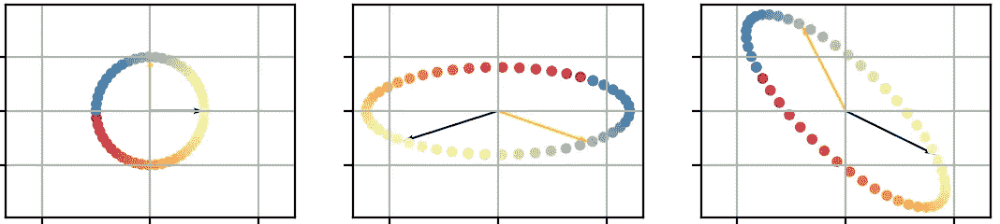

作者图片

***记得使用右边的“关注”按钮来关注我→:你会收到新文章的通知，并帮助我达到 100 个关注者的目标:)***

O 在数据科学和机器学习领域处理新数据的第一步通常是**标准化**——或者“扩展”——你的数据。最常见的程序——通常称为 [Z 值归一化](https://en.wikipedia.org/wiki/Standard_score) —就是从每个列特征中去除平均值，然后除以其标准偏差。剩下的要素具有 0 均值和 1 方差。这使得每个特征在规模上是“可比较”。下一步是检查你的数据，找出潜在的共线性，也就是相关性。如果您的数据完全不相关，则得到的协方差矩阵将是单位矩阵，即每列都有一个方差，并且与其他列完全去相关。但这在现实世界中从未发生过。

白化数据的过程在于变换，使得变换后的数据具有作为协方差矩阵的单位矩阵。这个过程也称为“球形化”数据。它有许多应用，最著名的是主成分分析中的降维。球形化数据使数据在“拓扑上”更简单，这反过来提高了数值分辨率的稳定性和收敛速度。

有很多方法可以“白化”你的数据，大多数常见的方法被称为 **PCA 白化**和 **ZCA 白化。**

请记住:白化你的数据不仅“标准化”，它还去相关的每个功能。

## 数据矩阵和协方差矩阵

设 X 是你的数据矩阵，m 个样本为行，n 个特征为列。让我们首先将数据沿列居中，使得每个特征列的平均值为 0。由于数据矩阵沿列具有 0 均值，我们可以简单地将样本协方差矩阵写成:

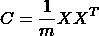

协方差矩阵

## PCA-增白

协方差矩阵 C 是实数且对称的，因此可以使用特征分解对角化****:这意味着我们可以将协方差矩阵重写为:****

**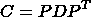**

**协方差矩阵的特征分解**

**其中 D 是对角线矩阵，特征值在对角线上，P 是正交非正规矩阵，也称为“旋转”矩阵。
然后，我们可以使用 D 和 P 来白化我们的数据矩阵 X，使用线性变换:**

**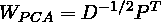**

**PCA-白化变换矩阵**

**这种变换实际上是用旋转 P^T 去相关数据，然后用 D^{-1/2}缩放新特征，使它们具有单位方差。**

**以下是变换数据的协方差矩阵是单位矩阵的证明:**

****

**W_PCA 白化数据矩阵 X 的证明**

## **ZCA 美白**

**ZCA 白化非常接近 PCA 白化:不同之处在于额外的旋转——或正交变换。**

**当 PCA-白化完成应用时，**

**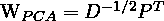**

**ZCA 美白是通过应用:**

**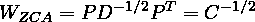**

**ZCA-白化变换矩阵**

**在数学上，可以示出 W_{ZCA}是矩阵 a，使得 X'=XA^T 具有作为协方差的单位矩阵(如预期的，因为我们正在白化我们的数据)，**和**最小化**

**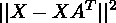**

**即**白化后的数据尽可能接近原始数据**。**

## **主成分分析白化和 ZCA 白化的关系**

**让我们回顾一下我们所做的:首先使用特征分解来分解输入数据矩阵 X 的中心数据协方差矩阵:**

**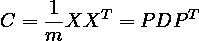**

**然后，通过以下变换完成 PCA 白化:**

****

**并且 ZCA 白化是通过应用变换来完成的:**

**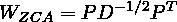**

**这样就很容易将两种变形联系起来:**

**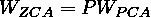**

****这最后一个等式表明，ZCA 白化数据只是具有附加旋转的 PCA 白化数据**(因为特征分解中的 P 是旋转矩阵)。**

## **我应该用哪一个**

**如你所见，PCA-白化和 ZCA-惠特宁等于旋转 P，但我们可以使用任何其他旋转:事实上，有无限多的变换可以白化我们的数据。**

**比如除了 PCA-美白和 ZCA-美白，[维基百科还提到了 Cholesky 美白](https://en.wikipedia.org/wiki/Whitening_transformation)。**

**你应该使用的方法，一如既往，取决于你想要什么:
— ZCA 白化是最大化白化和原始向量的每个分量之间的平均互协方差的唯一过程
— PCA 白化是唯一的球形化过程，其基于作为基础测量的互协方差，最大化原始向量 X 的所有分量在球形化向量 X’的每个分量中的积分或压缩。**

**也就是说:如果你计划减少数据的维度，使用 PCA-白化。如果你想你的白化数据接近你的原始数据，使用 ZCA 白化。**

# **用 numpy 增白**

**既然我们已经建立了理论，让我们来实践吧！**

**我们创建一个仲裁数据矩阵 X，并计算它的协方差矩阵:**

**然后，我们使用特征分解来分解协方差矩阵:**

**我们可以检查协方差矩阵确实是 C = PDP^T:**

**现在我们计算 D 的逆矩阵的平方根:因为 D 是对角矩阵，所以它的逆矩阵非常简单:**

**再次检查我们的计算是否有效:**

**我们现在可以使用上面的公式计算我们的变换矩阵，一个用于 PCA 白化，一个用于 ZCA 白化:**

**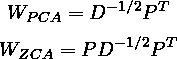**

## **测绘**

**现在我们已经有了所有需要的矩阵，是时候做一些绘图了:**

**你应该得到这样一个数字:**

**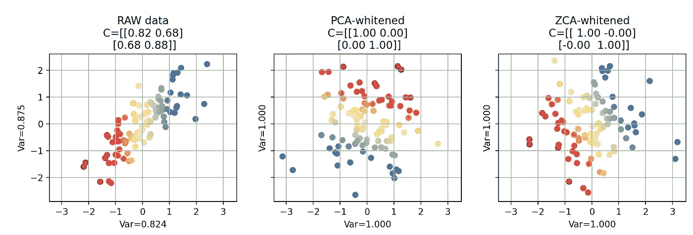**

**作者图片**

**我们可以注意到几件事:
—为了绘制原始数据，我们将单位矩阵作为变换矩阵传递，因为 X = I X
—PCA 白化数据和 ZCA 白化数据的协方差矩阵确实是单位矩阵， 因此，我们的白化在两种情况下都有效
—你可以说服自己 PCA 白化数据和 ZCA 白化数据在旋转后相等
—你可以看到 ZCA 白化数据的颜色方向与原始数据明显相同，而 PCA 白化数据可能有任何方向，与原始数据相差很大。**

## **感受转变**

**让我们通过添加几个向量来表示初始的 x 轴和 y 轴，以及一个彩色的圆来提高我们的可视化。**

**你可以把这些点想象成原始数据集中的新数据:就像我们的数据矩阵 X 一样，它们有一个 X 和 y 值，所以它们也位于与原始数据相同的初始空间中。**

**由于白化数据是通过应用线性变换完成的，因此我们可以对这些点(箭头和圆)应用相同的变换，并可视化它们是如何被变换的:**

**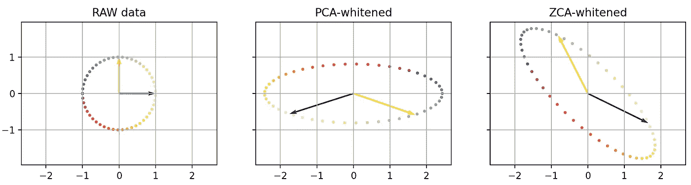**

**作者图片**

**再一次，你可以看到 PCA 和 ZCA 只是一个轮换阵容。还要注意圆圈上颜色的大致方向。**

**为了完整起见，让我们把一切都叠加起来:**

**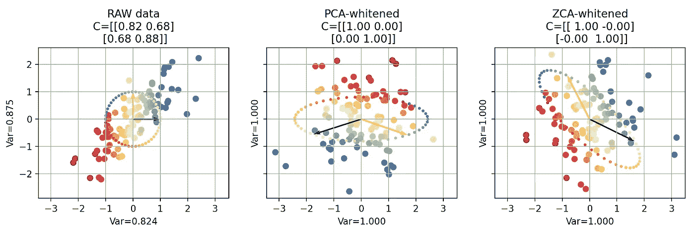**

**作者图片**

# **外卖食品**

**以下是你应该从这篇文章中记住的；
**-白化，也称为球化，包括转换你的数据，使其具有单位矩阵作为其协方差矩阵，即具有单位方差的非相关数据
-有无限种方法来白化你的数据，两种最常见的方法被称为 PCA-白化和 ZCA-白化
-PCA-白化和 ZCA-白化相当于旋转
-如果你计划减少数据的维度，请使用 PCA-白化。如果希望白化后的数据接近原始数据，请使用 ZCA 白化。****

**如果你喜欢这篇文章，并且觉得它内容丰富， ***请订阅，并查看我的其他文章，它们可能会说服你订阅:)*****

** [## 使用 numpy 将有限差分法的分辨率提高 300 倍

### 有限差分法是解决复杂问题的强大技术，numpy 使它变得更快！

towardsdatascience.com](/300-times-faster-resolution-of-finite-difference-method-using-numpy-de28cdade4e1)  [## 深入了解 seaborn:了解数据集

### Python 绘图:关于处理 seaborn 数据集您应该知道的一切

medium.com](https://medium.com/analytics-vidhya/deep-dive-into-seaborn-meet-the-datasets-8d08755a320b)  [## 包装 numpy 的数组

### 集装箱方法。

towardsdatascience.com](/wrapping-numpys-arrays-971e015e14bb)  [## 在 Jupyter 中交互绘制著名的 RC 电路

### ipywidgets 和 matplotlib 的又一步

towardsdatascience.com](/interactive-plotting-the-well-know-rc-circuit-in-jupyter-d153c0e9d3a) 

既然你一直往下读，这里有一个函数来白化你的数据，把它全部包装起来:**