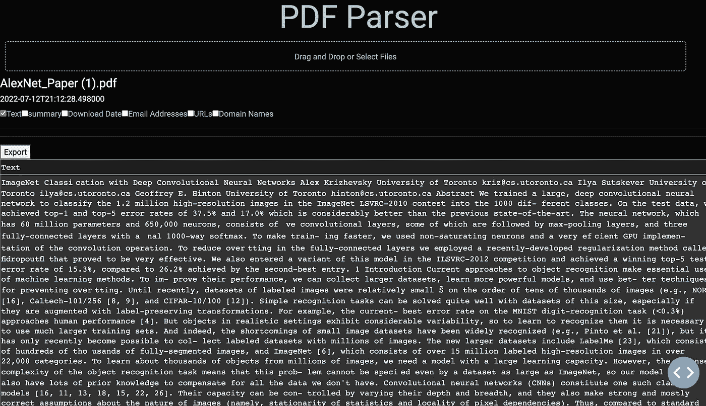
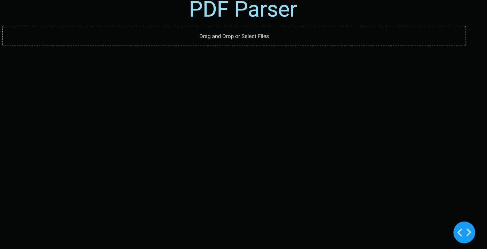
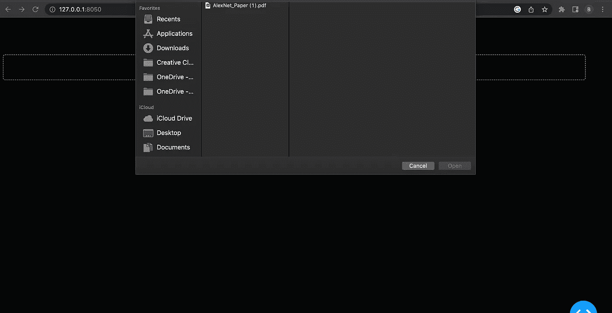
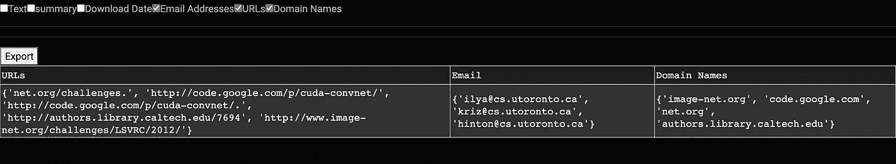

# 带有 Plotly 破折号的 PDF 解析仪表板

> 原文：<https://towardsdatascience.com/pdf-parsing-dashboard-with-plotly-dash-256bf944f536>

## 介绍如何在下一个仪表板中阅读和显示 PDF 文件。



PDF 解析器(图片来自作者)

# 介绍

我最近对在我的自然语言处理(NLP)项目中使用 PDF 文件产生了兴趣，你可能想知道，为什么？ PDF 文档包含大量信息，可以提取这些信息并用于创建各种类型的机器学习模型以及在不同数据中寻找模式。*问题？* PDF 文件在 Python 中很难处理。此外，当我开始在 Plotly dash 上为一个客户创建仪表板时，我几乎找不到关于如何在 Plotly 仪表板中摄取和解析 PDF 文件的信息。这种信息的缺乏将在今天改变，我将与你分享你如何上传和使用 PDF 文件在一个 Plotly 仪表板！

# 包裹

```
import pandas as pd 
from dash import dcc, Dash, html, dash_table
import base64
import datetime
import io
import PyPDF2
from dash.dependencies import Input, Output, State
import re
import dash_bootstrap_components as dbc
import spacy
from spacy.lang.en.stop_words import STOP_WORDS
from string import punctuation
from heapq import nlargest
```

上面的大多数包是您在部署 Dash 应用程序时通常会找到的。例如， **dash** 是我们将使用的主要 Plotly API，而 *dcc、dash、html 和 dash_table* 是我们添加功能所需的一些主要方法。当阅读 Python 中的 PDF 时，我倾向于使用[*py pdf 2*](https://pypi.org/project/PyPDF2/)*但是还有其他 API 可以探索，你应该总是使用最适合你的项目的 API。*

# *支持功能*

*支持功能有助于增加 dash 应用程序的交互性。我为这个应用程序创建了两个不同的类，允许 PDF 被分开解析。第一个类是 ***pdfReader 类。*** 这个类中的函数都与将 PDF 读入 Python 并将其内容转换成可用形式有关。此外，一些功能能够提取 PDF 中固有的元数据(即*创作日期、作者等。)**

```
*class pdfReader:    
    def __init__(self, file_path: str) -> str:
        self.file_path = file_path

    def PDF_one_pager(self) -> str:
        """A function that returns a one line string of the 
            pdfReader object.

            Parameters:
            file_path(str): The file path to the pdf.

            Returns:
            one_page_pdf (str): A one line string of the pdf.

        """
        content = ""
        p = open(self.file_path, "rb")
        pdf = PyPDF2.PdfFileReader(p)
        num_pages = pdf.numPages
        for i in range(0, num_pages):
            content += pdf.getPage(i).extractText() + "\n"
        content = " ".join(content.replace(u"\xa0", " ").strip().split())
        page_number_removal = r"\d{1,3} of \d{1,3}"
        page_number_removal_pattern = re.compile(page_number_removal, re.IGNORECASE)
        content = re.sub(page_number_removal_pattern, '',content)

        return content

    def pdf_reader(self) -> str:
        """A function that can read .pdf formatted files 
            and returns a python readable pdf.

            Returns:
            read_pdf: A python readable .pdf file.
        """
        opener = open(self.file_path,'rb')
        read_pdf = PyPDF2.PdfFileReader(opener)

        return read_pdf

    def pdf_info(self) -> dict:
        """A function which returns an information dictionary
        of an object.

        Returns:
        dict(pdf_info_dict): A dictionary containing the meta
        data of the object.
        """
        opener = open(self.file_path,'rb')
        read_pdf = PyPDF2.PdfFileReader(opener)
        pdf_info_dict = {}
        for key,value in read_pdf.documentInfo.items():
            pdf_info_dict[re.sub('/',"",key)] = value
        return pdf_info_dict

    def pdf_dictionary(self) -> dict:
        """A function which returns a dictionary of 
            the object where the keys are the pages
            and the text within the pages are the 
            values.

            Returns:
            dict(pdf_dict): A dictionary of the object within the
            pdfReader class.
        """
        opener = open(self.file_path,'rb')
        #try:
        #    file_path = os.path.exists(self.file_path)
        #    file_path = True
        #break
        #except ValueError:
        #   print('Unidentifiable file path')
        read_pdf = PyPDF2.PdfFileReader(opener)
        length = read_pdf.numPages
        pdf_dict = {}
        for i in range(length):
            page = read_pdf.getPage(i)
            text = page.extract_text()
            pdf_dict[i] = text
            return pdf_dict

    def get_publish_date(self) -> str:
          """A function of which accepts an information dictionray of an object
              in the pdfReader class and returns the creation date of the
              object (if applicable).

              Parameters:
              self (obj): An object of the pdfReader class

              Returns:
              pub_date (str): The publication date which is assumed to be the 
              creation date (if applicable).
          """
          info_dict_pdf = self.pdf_info()
          pub_date= 'None'
          try:
              publication_date = info_dict_pdf['CreationDate']
              publication_date = datetime.date.strptime(publication_date.replace("'", ""), "D:%Y%m%d%H%M%S%z")
              pub_date = publication_date.isoformat()[0:10] 
          except:
              pass
          return str(pub_date)*
```

*创建的第二个类是 ***pdfParser*** ，这个类执行我们希望在 Python 中的 PDF 上使用的主要解析操作。这些功能包括:*

1.  ***get_emails()** -能够在一串文本中找到所有邮件的功能。*
2.  *这个函数可以在一串文本中定位日期。对于这个控制面板，我们将找到下载 PDF 的日期。*
3.  ***get_summary()** -能够基于单词的重要性和用户希望从原始文本中放入摘要中的文本的百分比来创建文本主体的摘要的功能。*
4.  ***get_urls()** -这个函数将在一个文本字符串中找到所有的 URL 和域名。*

```
*class pdfParser:
    def __init__(self):
        return

    @staticmethod 
    def get_emails(text: str) -> set:
        """A function that accepts a string of text and
            returns any email addresses located within the 
            text

            Parameters:
            text (str): A string of text

            Returns:
            set(emails): A set of emails located within
            the string of text.
        """
        email_pattern = re.compile(r'[\w.+-]+@[\w-]+\.[\w.-]+')
        email_set = set()
        email_set.update(email_pattern.findall(text))

        return str(email_set)

    @staticmethod
    def get_dates(text: str, info_dict_pdf : dict) -> set:
        date_label = ['DATE']
        nlp = spacy.load('en_core_web_lg')
        doc = nlp(text)

        dates_pattern = re.compile(r'(\d{1,3}\.\d{1,3}\.\d{1,3}\.\d{1,3})')
        dates = set((ent.text) for ent in doc.ents if ent.label_ in date_label)
        filtered_dates = set(date for date in dates if not dates_pattern.match(date))

        return str(filtered_dates)

    @staticmethod
    def get_summary(text: str, per: float) -> str:

        """A function that accepts of a string of text as input
           and a percentange value as input and returns a summary
           of the text.

           Parameters:
           text (str): A string of text to be summarized.
           Per (int): Percentage value that effects the number of words 
           in a summary.

           Returns:
           summary (str): A summary of the text."""

        nlp = spacy.load('en_core_web_sm')
        doc= nlp(text)
        word_frequencies={}
        for word in doc:
            if word.text.lower() not in list(STOP_WORDS):
                if word.text.lower() not in punctuation:
                    if word.text not in word_frequencies.keys():
                        word_frequencies[word.text] = 1
                    else:
                        word_frequencies[word.text] += 1
        max_frequency=max(word_frequencies.values())
        for word in word_frequencies.keys():
            word_frequencies[word]=word_frequencies[word]/max_frequency
        sentence_tokens= [sent for sent in doc.sents]
        sentence_scores = {}
        for sent in sentence_tokens:
            for word in sent:
                if word.text.lower() in word_frequencies.keys():
                    if sent not in sentence_scores.keys():                            
                        sentence_scores[sent]=word_frequencies[word.text.lower()]
                    else:
                        sentence_scores[sent]+=word_frequencies[word.text.lower()]
        select_length=int(len(sentence_tokens)*per)
        summary=nlargest(select_length, sentence_scores,key=sentence_scores.get)
        final_summary=[word.text for word in summary]
        summary=''.join(final_summary)
        return summary

  @staticmethod
  def get_urls_domains(text: str) -> set:
      """A function that accepts a string of text and
          returns any urls and domain names located within
          the text.

          Parmeters:
          text (str): A string of text. 

          Returns:
          set(urls): A set of urls located within the text
          set(domain_names): A set of domain names located within the text.
      """
      #f = open('/Users/benmccloskey/Desktop/pdf_dashboard/cfg.json')
      #data = json.load(f)
      #url_endings = [end for end in data['REGEX_URL_ENDINGS']['url_endings'].split(',')]
      url_end = 'com,gov,edu,org,mil,net,au,in,ca,br,it,mx,ai,fr,tw,il,uk,int,arpa,co,us,info,xyz,ly,site,biz,bz'
      url_endings = [end for end in url_end.split(',')]
      url_regex = '(?:(?:https?|ftp):\\/\\/)?[\\w/\\-?=%.]+\\.(?:' + '|'.join(url_endings) + ')[^\s]+'
      url_reg_pattern = re.compile(url_regex, re.IGNORECASE)
      url_reg_list = url_reg_pattern.findall(text)

      url_set = set()
      url_set.update(url_reg_list)

      domain_set = set()
      domain_regex = r'^(?:https?:\/\/)?(?:[^@\/\n]+@)?(?:www\.)?([^:\/\n]+)'
      domain_pattern = re.compile(domain_regex, re.IGNORECASE)
      for url in url_set:
          domain_set.update(domain_pattern.findall(url))

      return str(url_set), str(domain_set)*
```

# *仪表板*

*在今天的例子中，我们将解析由 Alex Krizhevsky Ilya Sutskever 和 Geoffrey e . hint on【1】撰写的论文[*ImageNet class ification with Deep 卷积神经网络*](https://proceedings.neurips.cc/paper/2012/file/c399862d3b9d6b76c8436e924a68c45b-Paper.pdf) 。*

## *设置*

*您需要创建一个目录来保存您希望在仪表板中分析的 PDF 文件。然后，您需要初始化 Dash 应用程序。*

```
*directory = '/Users/benmccloskey/Desktop/pdf_dashboard/files'

app = Dash(__name__, external_stylesheets=[dbc.themes.CYBORG],suppress_callback_exceptions=True)* 
```

*我做了一个名为“文件”的文件夹，我把我想上传的 PDF 文件放在这个文件夹里。*

**

*PDF 解析器仪表板(图片来自作者)*

*如上所示，仪表板在初始化时非常简单，但这是意料之中的！没有向应用程序提供任何信息，此外，我不希望应用程序在开始时太忙。*

## *骷髅*

*下一步是创建 dash 应用程序的框架。这真的是 dash 应用程序的脚手架，我们可以在上面放置不同的部分，最终创建最终的架构。首先，我们将添加一个标题，并按照我们想要的方式设计它。你可以在这里得到与不同颜色相关的数字！*

```
*app.layout = html.Div(children =[html.Div(children =[html.H1(children='PDF Parser', 
                                          style = {'textAlign': 'center',
                                                   'color' : '#7FDBFF',})])*
```

*第二，我们可以使用 *dcc。上传*允许我们实际上传数据到我们的 dash 应用程序。*

*这是我第一次接受挑战的地方。*

*Plotly Dash 提供的示例没有显示如何读取 PDF 文件。我配置了以下代码块，并将其附加到 Plotly 提供的摄取代码中。*

```
*if 'csv' in filename:
            # Assume that the user uploaded a CSV file
            df = pd.read_csv(
                io.StringIO(decoded.decode('utf-8')))
        elif 'xls' in filename:
            # Assume that the user uploaded an excel file
            df = pd.read_excel(io.BytesIO(decoded))
        elif 'pdf' in filename:
            pdf = pdfReader(directory + '/' + filename)
            text = pdf.PDF_one_pager()
            emails = pdfParser.get_emails(text)
            ddate = pdf.get_publish_date()
            summary = pdfParser.get_summary(text, 0.1)
            df = pd.DataFrame({'Text':[text], 'Summary':[summary],
                               'Download Date' : [ddate],'Emails' : [emails]})*
```

*需要的主要改变是强制该函数查看文件名是否在标题末尾有“pdf”。然后，我能够从我最初启动的目录中提取 pdf。*请注意:在代码的当前状态下，任何上传到仪表板的 PDF 文件，如果不在目录文件夹中，将无法被仪表板读取和解析。这是未来的更新！* **如果你有任何与文本相关的功能，你可以在这里添加。***

*如前所述，我用来阅读 PDF 文件的包是 *PyPDF2* ，还有很多其他的包可以使用。在仪表板的开始启动类大大减少了框架内的混乱。我发现的另一个有用的技巧是，在上传 pdf 文件时解析它，并在代码的后面一行保存数据帧。对于本例，我们将显示与 PDF 文件相关的*文本、摘要、下载日期、*和*电子邮件地址*。*

**

*上传功能(图片来自作者)*

*单击上传按钮后，将会打开文件目录的弹出窗口，您可以选择想要解析的 pdf 文件(不要忘记，对于此设置，PDF 必须位于您的仪表板的工作目录中！).*

*文件上传后，我们可以通过返回带有日期时间的文件名来完成该功能，并创建一个 Plotly dash 清单，列出我们希望仪表板解析和显示的 PDF 中的不同功能。下面显示的是实例化回调之前仪表板的完整主体。*

```
*app.layout = html.Div(children =[html.Div(children =[html.H1(children='PDF Parser', 
                                          style = {'textAlign': 'center',
                                                   'color' : '#7FDBFF',})]),

html.Div([
    dcc.Upload(
        id='upload-data',
        children=html.Div([
            'Drag and Drop or ',
            html.A('Select Files')
        ]),
        style={
            'width': '100%',
            'height': '60px',
            'lineHeight': '60px',
            'borderWidth': '1px',
            'borderStyle': 'dashed',
            'borderRadius': '5px',
            'textAlign': 'center',
            'margin': '10px'
        },
        # Allow multiple files to be uploaded
        multiple=True
    ), 
    #Returns info, above the datatable,
    html.Div(id='output-datatable'),
    html.Div(id='output-data-upload')#output for the datatable,
]),

  ])

def parse_contents(contents, filename, date):
    content_type, content_string = contents.split(',')

    decoded = base64.b64decode(content_string)
    try:
        if 'csv' in filename:
            # Assume that the user uploaded a CSV file
            df = pd.read_csv(
                io.StringIO(decoded.decode('utf-8')))
        elif 'xls' in filename:
            # Assume that the user uploaded an excel file
            df = pd.read_excel(io.BytesIO(decoded))
        elif 'pdf' in filename:
            pdf = pdfReader(directory + '/' + filename)
            text = pdf.PDF_one_pager()
            emails = pdfParser.get_emails(text)
            ddate = pdf.get_publish_date()
            summary = pdfParser.get_summary(text, 0.1)
            df = pd.DataFrame({'Text':[text], 'Summary':[summary],
                               'Download Date' : [ddate],'Emails' : [emails],
 '                      URLs' : [urls], 'Domain Names' : [domains]})
    except Exception as e:
        print(e)
        return html.Div([
            'There was an error processing this file.'
        ])

    return html.Div([
        html.H5(filename),#return the filename
        html.H6(datetime.datetime.fromtimestamp(date)),#edit date
        dcc.Checklist(id='checklist',options = [
            {"label": "Text", "value": "Text"},
             {"label": "summary", "value": "Summary"},
            {"label": "Download Date", "value": "Download Date"},
            {"label": "Email Addresses", "value": "Email Addresses"}
        ],
            value = []),
        html.Hr(),
        dcc.Store(id='stored-data' ,data = df.to_dict('records')),

        html.Hr(),  # horizontal line

    ])*
```

## *仪表板清单*

***检查表**。这是我们开始向仪表板添加一些功能的地方。使用 *dcc。Checklist* 函数，我们可以创建一个列表，允许用户选择他们想要显示的 PDF 的哪些特性。例如，用户可能只想一次看一个特征，这样他们就不会不知所措，可以检查一个特定的模式。或者，用户可能希望将摘要与整个正文进行比较，以查看摘要中是否缺少任何可能需要添加的信息。使用清单的方便之处在于，您可以查看 pdf 中不同批次的功能，这有助于减少感官超负荷。*

**

*清单(图片来自作者)*

*pdf 上传后，将显示一个清单，其中没有选择任何项目。在下一节中，看看当我们在清单中选择不同的参数时会发生什么！*

## *复试*

*回调在 Plotly 仪表盘中极其重要。它们向仪表板添加功能，并使其与用户交互。第一个回调用于上传功能，并确保我们的数据可以上传。*

*第二个回调显示数据表中的不同数据。它通过调用上传 PDF 时最初创建的已保存数据框来实现这一点。根据选择了清单中的哪些框，将决定数据表中当前显示的信息。*

```
*@app.callback(Output('output-datatable', 'children'),
              Input('upload-data', 'contents'),
              State('upload-data', 'filename'),
              State('upload-data', 'last_modified'))
def update_output(list_of_contents, list_of_names, list_of_dates):
    if list_of_contents is not None:
        children = [
            parse_contents(c, n, d) for c, n, d in
            zip(list_of_contents, list_of_names, list_of_dates)]
        return children

@app.callback(Output('output-data-upload', 'children'),
              Input('checklist','value'),
              Input('stored-data', 'data'))

def table_update(options_chosen, df_dict):
    if options_chosen == []:
        return True
    df_copy = pd.DataFrame(df_dict)
    text = df_copy['Text']
    emails = df_copy['Emails']
    ddate = df_copy['Download Date']
    summary = df_copy['Summary']
    value_dct = {}
    for val in options_chosen:
        if val == 'Text':
            value_dct[val] = text
        if val == 'Summary':
            value_dct['Summary'] = summary
        if val == 'Download Date':
            value_dct['Download Date'] = ddate
        if val == 'Email Addresses':
             value_dct['Email'] = emails
    dff =  pd.DataFrame(value_dct)
    return dash_table.DataTable(
            dff.to_dict('records'),
            [{'name': i, 'id': i} for i in dff.columns],
            export_format="csv"
            style_data={
                'whiteSpace': 'normal',
                'height': 'auto',
                'textAlign': 'left',
                  'backgroundColor': 'rgb(50, 50, 50)',
                  'color': 'white'},
            style_header={'textAlign' : 'left',
                    'backgroundColor': 'rgb(30, 30, 30)',
                    'color': 'white'
                    })*
```

*例如，如果我们想查看位于 PDF 中的*电子邮件*、*网址*和*域名*该怎么办？通过检查清单中的这三个选项，该数据将填充表格并显示在仪表板上。*

**

*清单示例(图片来自作者)*

*最后，虽然我们可以轻松地将条目复制并粘贴到我们选择的另一个电子表格或数据库中，但左上角的“导出”按钮允许我们下载表格并将其保存到 CSV 文件中！*

*就是这样！这几个代码块就是在 Plotly 仪表板中对 pdf 执行基本解析功能所需的全部内容。*

# *结论*

*今天，我们探讨了数据科学家将 PDF 上传到 Plotly 仪表板并向用户显示特定内容的一个方向。这对于必须从 pdf 中提取特定信息的人来说非常有用。可能是客户的电子邮件、姓名和电话号码)并需要分析这些信息。虽然这个仪表板是基本的，但它可以针对不同风格的 pdf 进行调整。例如，您可能想要创建一个分析仪表板，显示您正在阅读的研究论文 PDF 中的引文，以便您可以保存或使用这些引文来查找其他论文。今天试着把这段代码写出来，如果你添加了任何酷的功能，请告诉我！*

*如果你喜欢今天的阅读，请关注我，并告诉我你是否还有其他想让我探讨的话题！如果你没有中等账号，就通过我的链接 [**这里**](https://ben-mccloskey20.medium.com/membership) **报名吧！另外，在**[**LinkedIn**](https://www.linkedin.com/in/benjamin-mccloskey-169975a8/)**上加我，或者随时联系！感谢阅读！***

# *完整代码*

```
*import pandas as pd 
from dash import dcc, Dash, html, dash_table
import base64
import datetime
import io
import PyPDF2
from dash.dependencies import Input, Output, State
import re
import dash_bootstrap_components as dbc
import spacy
from spacy.lang.en.stop_words import STOP_WORDS
from string import punctuation
from heapq import nlargest

directory = '/Users/benmccloskey/Desktop/pdf_dashboard/files'

external_stylesheets = ['https://codepen.io/chriddyp/pen/bWLwgP.css']

app = Dash(__name__, external_stylesheets=[dbc.themes.CYBORG],suppress_callback_exceptions=True)

class pdfReader:    
    def __init__(self, file_path: str) -> str:
        self.file_path = file_path

    def PDF_one_pager(self) -> str:
        """A function that returnss a one line string of the 
            pdfReader object.

            Returns:
            one_page_pdf (str): A one line string of the pdf.

        """
        content = ""
        p = open(self.file_path, "rb")
        pdf = PyPDF2.PdfFileReader(p)
        num_pages = pdf.numPages
        for i in range(0, num_pages):
            content += pdf.getPage(i).extractText() + "\n"
        content = " ".join(content.replace(u"\xa0", " ").strip().split())
        page_number_removal = r"\d{1,3} of \d{1,3}"
        page_number_removal_pattern = re.compile(page_number_removal, re.IGNORECASE)
        content = re.sub(page_number_removal_pattern, '',content)

        return content

    def pdf_reader(self) -> str:
        """A function that can read .pdf formatted files 
            and returns a python readable pdf.

            Returns:
            read_pdf: A python readable .pdf file.
        """
        opener = open(self.file_path,'rb')
        read_pdf = PyPDF2.PdfFileReader(opener)

        return read_pdf

    def pdf_info(self) -> dict:
        """A function which returns an information dictionary
        of an object associated with the pdfReader class.

        Returns:
        dict(pdf_info_dict): A dictionary containing the meta
        data of the object.
        """
        opener = open(self.file_path,'rb')
        read_pdf = PyPDF2.PdfFileReader(opener)
        pdf_info_dict = {}
        for key,value in read_pdf.documentInfo.items():
            pdf_info_dict[re.sub('/',"",key)] = value
        return pdf_info_dict

    def pdf_dictionary(self) -> dict:
        """A function which returns a dictionary of 
            the object where the keys are the pages
            and the text within the pages are the 
            values.

            Returns:
            dict(pdf_dict): A dictionary of the object within the
            pdfReader class.
        """
        opener = open(self.file_path,'rb')

        read_pdf = PyPDF2.PdfFileReader(opener)
        length = read_pdf.numPages
        pdf_dict = {}
        for i in range(length):
            page = read_pdf.getPage(i)
            text = page.extract_text()
            pdf_dict[i] = text
            return pdf_dict

    def get_publish_date(self) -> str:
          """A function of which accepts an information dictionray of an object
              in the pdfReader class and returns the creation date of the
              object (if applicable).

              Returns:
              pub_date (str): The publication date which is assumed to be the 
              creation date (if applicable).
          """
          info_dict_pdf = self.pdf_info()
          pub_date= 'None'
          try:
              publication_date = info_dict_pdf['CreationDate']
              publication_date = datetime.datetime.strptime(publication_date.replace("'", ""), "D:%Y%m%d%H%M%S%z")
              pub_date = publication_date.isoformat()[0:10] 
          except:
              pass
          return str(pub_date)

class pdfParser:
    def __init__(self):
        return

    @staticmethod 
    def get_emails(text: str) -> set:
        """A function that accepts a string of text and
            returns any email addresses located within the 
            text

            Parameters:
            text (str): A string of text

            Returns:
            set(emails): A set of emails located within
            the string of text.
        """
        email_pattern = re.compile(r'[\w.+-]+@[\w-]+\.[\w.-]+')
        email_set = set()
        email_set.update(email_pattern.findall(text))

        return str(email_set)

    @staticmethod
    def get_dates(text: str, info_dict_pdf : dict) -> set:
        date_label = ['DATE']
        nlp = spacy.load('en_core_web_lg')
        doc = nlp(text)

        dates_pattern = re.compile(r'(\d{1,3}\.\d{1,3}\.\d{1,3}\.\d{1,3})')
        dates = set((ent.text) for ent in doc.ents if ent.label_ in date_label)
        filtered_dates = set(date for date in dates if not dates_pattern.match(date))

        return str(filtered_dates)

    @staticmethod
    def get_summary(text, per):
        """A function that accepts of a string of text as input
           and a percentange value as input and returns a summary
           of the text.

           Parameters:
           text (str): A string of text to be summarized.
           Per (int): Percentage value that effects the number of words 
           in a summary.

           Returns:
           summary (str): A summary of the text."""

        nlp = spacy.load('en_core_web_sm')
        doc= nlp(text)
        word_frequencies={}
        for word in doc:
            if word.text.lower() not in list(STOP_WORDS):
                if word.text.lower() not in punctuation:
                    if word.text not in word_frequencies.keys():
                        word_frequencies[word.text] = 1
                    else:
                        word_frequencies[word.text] += 1
        max_frequency=max(word_frequencies.values())
        for word in word_frequencies.keys():
            word_frequencies[word]=word_frequencies[word]/max_frequency
        sentence_tokens= [sent for sent in doc.sents]
        sentence_scores = {}
        for sent in sentence_tokens:
            for word in sent:
                if word.text.lower() in word_frequencies.keys():
                    if sent not in sentence_scores.keys():                            
                        sentence_scores[sent]=word_frequencies[word.text.lower()]
                    else:
                        sentence_scores[sent]+=word_frequencies[word.text.lower()]
        select_length=int(len(sentence_tokens)*per)
        summary=nlargest(select_length, sentence_scores,key=sentence_scores.get)
        final_summary=[word.text for word in summary]
        summary=''.join(final_summary)
        return summary

app.layout = html.Div(children =[html.Div(children =[html.H1(children='PDF Parser', 
                                          style = {'textAlign': 'center',
                                                   'color' : '#7FDBFF',})]),

html.Div([
    dcc.Upload(
        id='upload-data',
        children=html.Div([
            'Drag and Drop or ',
            html.A('Select Files')
        ]),
        style={
            'width': '100%',
            'height': '60px',
            'lineHeight': '60px',
            'borderWidth': '1px',
            'borderStyle': 'dashed',
            'borderRadius': '5px',
            'textAlign': 'center',
            'margin': '10px'
        },
        # Allow multiple files to be uploaded
        multiple=True
    ), 
    #Returns info, above the datatable,
    html.Div(id='output-datatable'),
    html.Div(id='output-data-upload')#output for the datatable,
]),

  ])

def parse_contents(contents, filename, date):
    content_type, content_string = contents.split(',')

    decoded = base64.b64decode(content_string)
    try:
        if 'csv' in filename:
            # Assume that the user uploaded a CSV file
            df = pd.read_csv(
                io.StringIO(decoded.decode('utf-8')))
        elif 'xls' in filename:
            # Assume that the user uploaded an excel file
            df = pd.read_excel(io.BytesIO(decoded))
        elif 'pdf' in filename:
            pdf = pdfReader(directory + '/' + filename)
            text = pdf.PDF_one_pager()
            emails = pdfParser.get_emails(text)
            ddate = pdf.get_publish_date()
            summary = pdfParser.get_summary(text, 0.1)
            df = pd.DataFrame({'Text':[text], 'Summary':[summary],
                               'Download Date' : [ddate],'Emails' : [emails]})
    except Exception as e:
        print(e)
        return html.Div([
            'There was an error processing this file.'
        ])

    return html.Div([
        html.H5(filename),#return the filename
        html.H6(datetime.datetime.fromtimestamp(date)),#edit date
        dcc.Checklist(id='checklist',options = [
            {"label": "Text", "value": "Text"},
             {"label": "summary", "value": "Summary"},
            {"label": "Download Date", "value": "Download Date"},
            {"label": "Email Addresses", "value": "Email Addresses"}
        ],
            value = []),

        html.Hr(),
        dcc.Store(id='stored-data' ,data = df.to_dict('records')),

        html.Hr(),  # horizontal line

    ])

@app.callback(Output('output-datatable', 'children'),
              Input('upload-data', 'contents'),
              State('upload-data', 'filename'),
              State('upload-data', 'last_modified'))
def update_output(list_of_contents, list_of_names, list_of_dates):
    if list_of_contents is not None:
        children = [
            parse_contents(c, n, d) for c, n, d in
            zip(list_of_contents, list_of_names, list_of_dates)]
        return children

@app.callback(Output('output-data-upload', 'children'),
              Input('checklist','value'),
              Input('stored-data', 'data'))

def table_update(options_chosen, df_dict):
    if options_chosen == []:
        return True
    df_copy = pd.DataFrame(df_dict)
    text = df_copy['Text']
    emails = df_copy['Emails']
    ddate = df_copy['Download Date']
    summary = df_copy['Summary']
    value_dct = {}
    for val in options_chosen:
        if val == 'Text':
            value_dct[val] = text
        if val == 'Summary':
            value_dct['Summary'] = summary
        if val == 'Download Date':
            value_dct['Download Date'] = ddate
        if val == 'Email Addresses':
             value_dct['Email'] = emails
    dff =  pd.DataFrame(value_dct)
    return dash_table.DataTable(
            dff.to_dict('records'),
            [{'name': i, 'id': i} for i in dff.columns],
            style_data={
                'whiteSpace': 'normal',
                'height': 'auto',
                'textAlign': 'left',
                  'backgroundColor': 'rgb(50, 50, 50)',
                  'color': 'white'},
            style_header={'textAlign' : 'left',
                    'backgroundColor': 'rgb(30, 30, 30)',
                    'color': 'white'
                    })

if __name__ == '__main__':
    app.run_server(debug=True)*
```

1.  *克里日夫斯基、亚历克斯、伊利亚·苏茨基弗和杰弗里·e·辛顿。"使用深度卷积神经网络的图像网络分类."*ACM 的通信*60.6(2017):84–90。*