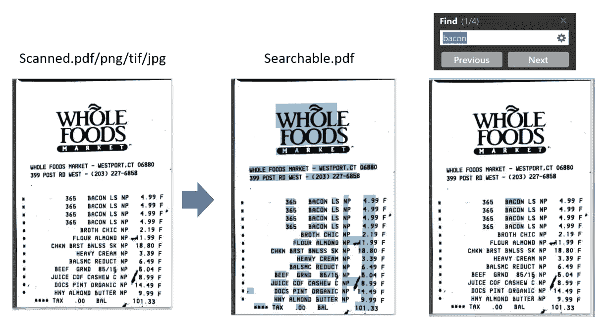
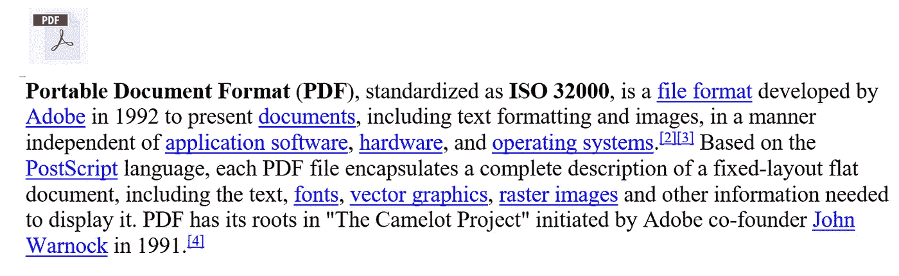
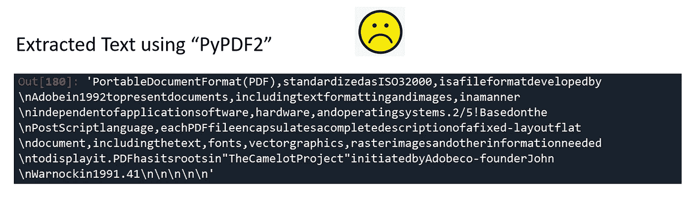
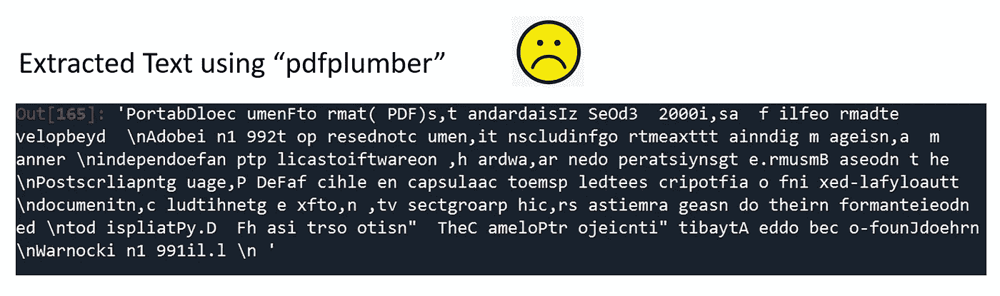
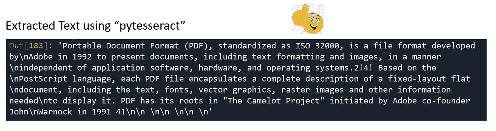

# 使用 Python 和 Pytesseract 提取 PDF 文本，同时保留空白

> 原文：<https://towardsdatascience.com/pdf-text-extraction-while-preserving-whitespaces-using-python-and-pytesseract-ec142743e805>

## 使用 pdf2image 和 pytesseract 的 OCR PDF 和图像文件



作者图片

在数据科学项目中，PDF 数据可能很难处理。例如，您尝试从自然语言处理(NLP)项目的 PDF 中提取文本，您可能会遇到**在单词**之间缺少空格或者**用随机空格分隔整个单词的情况。** *如果单词之间没有正确的空格，你就无法开发任何有意义的自然语言处理模型。*在本文中，我将介绍一种在保留空白的同时从 PDF 中提取文本的替代方法: **pdf2image** 和**pytesserac。**

有许多软件包(如 PyPDF2、pdfPlumber、Textract)可以从 PDF 中提取文本。每一种都有自己的优点和缺点。一个包可能更擅长处理表格，另一个更擅长提取文本。但是没有放之四海而皆准的解决方案。

以下面的 PDF 文件为例，我们想从这一段中提取文本。这看起来很简单，但是如果不能正确指定单词之间的空格，这可能会很麻烦。



examle.pdf(作者图片)

## 问题 1:缺少空白

在下面的代码中，“PyPDF2”包用于提取 PDF。如您所见，空白没有保留。如果我们的机器学习模型需要理解文本的上下文，输出将是无用的。

```
import PyPDF2
file = open('examle.pdf', 'rb')
pdfReader = PyPDF2.PdfFileReader(file)
ocr_text = pdfReader.getPage(0).extractText()
```



作者图片

## 问题 2:随机和无用的空白

在下面的代码中，使用了“pdfplumber”包。如您所见，没有正确指定空白。并且整个单词的随机分离使得输出对于 NLP 项目毫无用处。

```
import pdfplumber
file = pdfplumber.open('examle.pdf')
ocr_text = file.pages[0].extract_text()
```



作者图片

# 使用 **pdf2image** 和 Pytesseract 保留有意义的空白

我们可以将 PDF 转换为图像，然后使用 OCR 引擎(例如，<https://en.wikipedia.org/wiki/Tesseract_(software>)**)从图像中提取文本，而不是依赖 PDF 结构来提取底层文本。**

## ****所需库****

*   ****pdf2image** :将 pdf 文件转换为图像**
*   ****pytesserac**:从图像中提取文本**

## **安装库**

```
pip install **pdf2image**
pip install **pytesseract**
```

## **下载并安装附加软件**

**我们需要额外的软件来使用这些库。**

*   **对于 **pdf2image，**我们必须为 windows 用户下载 [poppler](http://poppler for windows users. https://github.com/oschwartz10612/poppler-windows/releases/) 。**
*   **对于**宇宙魔方，**我们将需要安装[宇宙魔方-OCR 引擎](https://tesseract-ocr.github.io/tessdoc/Downloads.html)。**

## **导入库**

```
import pytesseract
from pdf2image import convert_from_path
```

## ****初始化 pytesseract 和 pdf2image****

**下载并安装软件后，可以将它们的可执行路径添加到**环境变量**中。或者，您可以在程序中直接包含它们的路径。**

```
poppler_path = '...\pdf2image_poppler\Release-22.01.0-0\poppler-22.01.0\Library\bin'
pytesseract.pytesseract.tesseract_cmd = r'C:\Program Files\Tesseract-OCR\tesseract.exe'
```

**实现很简单。“convert_from_path”用于将 PDF 转换为图像。“pytesseract.image_to_string”用于从图像中提取文本。正如您所看到的，在这个例子中，单词之间的空格被正确地指定。**

```
# convert PDF to image
images = convert_from_path('examle.pdf', poppler_path=poppler_path)
# Extract text from image
ocr_text = pytesseract.image_to_string(images[0])
```

****

**作者图片**

## **处理 PDF 中的多个页面**

**如果一个 PDF 中有多个页面，我们可以简单地使用一个循环函数来合并所有页面的文本。**

```
images = convert_from_path('example.pdf', poppler_path=poppler_path)
ocr_text = ''
for i in range(len(images)):        
    page_content = pytesseract.image_to_string(images[i])
    page_content = '***PDF Page {}***\n'.format(i+1) + page_content
    ocr_text = ocr_text + ' ' + page_content
```

## **不仅仅是 PDF，Pytesseract 也适用于图像文件**

**使用**pytesserac**而不是其他包的另一个优点是*它可以直接从图像文件*中提取文本。**

```
pytesseract.image_to_string('example.tif')
pytesseract.image_to_string('example.jpg')
pytesseract.image_to_string('example.png')
```

## **将图像转换为可搜索的 PDF**

**如果您想将图像格式(如 tif、png、jpg)的扫描文件转换为可搜索的 PDF。过程很简单。**

```
PDF = pytesseract.**image_to_pdf_or_hocr**('Receipt.PNG', extension='pdf')
# export to searchable.pdf
with open("searchable.pdf", "w+b") as f:
    f.write(bytearray(PDF))
```

****

**作者图片**

## **将同一文件夹中的多个图像转换为单个可搜索的 PDF**

**如果您想将同一文件夹中的大量**图像转换为单个可搜索的 PDF 文件，您可以使用 **os.walk** 为同一文件夹中的所有图像文件创建一个路径列表，然后使用上述相同的功能处理图像并导出为单个可搜索的 PDF 文件。****

```
all_files = []
for (path,dirs,files) in **os.walk**('images_folder'):
    for file in files:
        file = os.path.join(path, file)
        all_files.append(file)pdf_writer = PyPDF2.PdfFileWriter()
for file in all_files:
    page = pytesseract.image_to_pdf_or_hocr(file, extension='pdf')
    pdf = PyPDF2.PdfFileReader(io.BytesIO(page))
    pdf_writer.addPage(pdf.getPage(0))

with open("searchable.pdf", "wb") as f:
    pdf_writer.write(f)
```

**如果你想继续探索 PDF 抓取，请查看我的其他文章:**

*   **[**使用 Python 和 PDFQuery 从 PDF 文件中抓取数据**](/scrape-data-from-pdf-files-using-python-and-pdfquery-d033721c3b28)**
*   **[**使用 Python 和 tabula-py 从 PDF 文件中抓取数据**](/scrape-data-from-pdf-files-using-python-fe2dc96b1e68)**
*   **[**如何使用 Python 和 Pytesseract 将扫描文件转换为可搜索的 PDF**](https://python.plainenglish.io/convert-scanned-files-to-searchable-pdf-using-python-and-pytesseract-3ee31ee6f01f)**
*   **[**使用 Python 和 Pytesseract**](/pdf-text-extraction-while-preserving-whitespaces-using-python-and-pytesseract-ec142743e805) 提取 PDF 文本，同时保留空白**

# **感谢您的阅读！！！**

**如果你喜欢这篇文章，并且想**请我喝杯咖啡，**请[点击这里](https://ko-fi.com/aaronzhu)。**

**您可以注册一个 [**会员**](https://aaron-zhu.medium.com/membership) 来解锁我的文章的全部访问权限，并且可以无限制地访问介质上的所有内容。如果你想在我发表新文章时收到电子邮件通知，请订阅。**