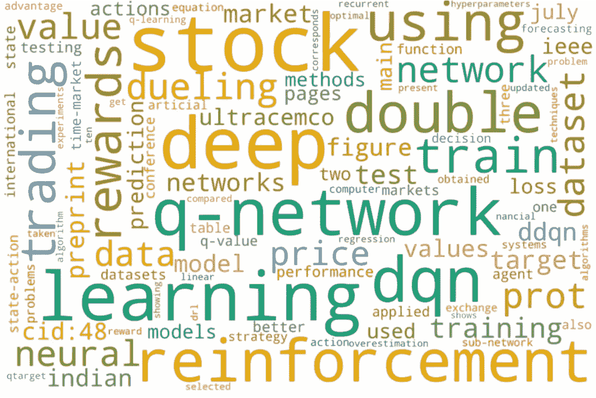
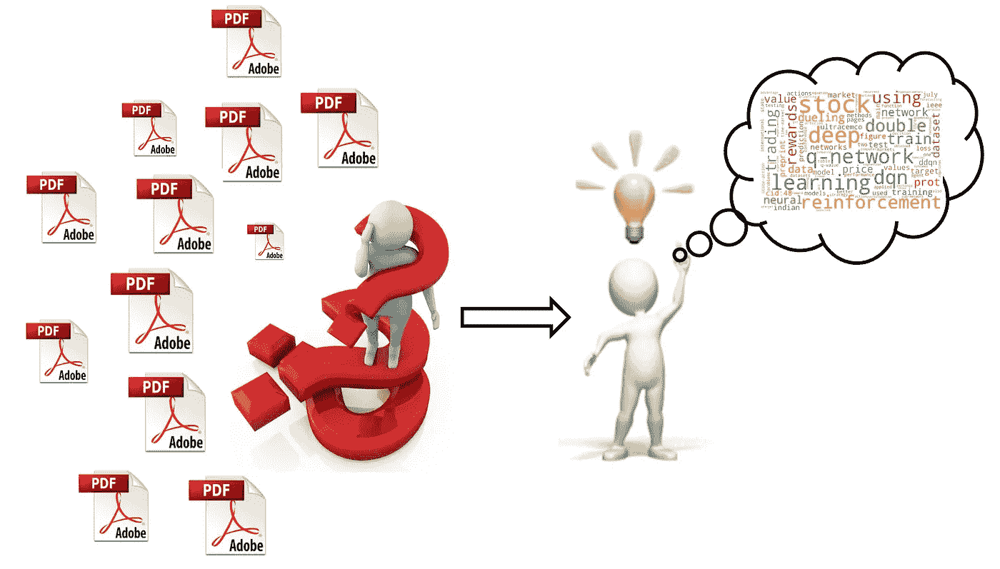
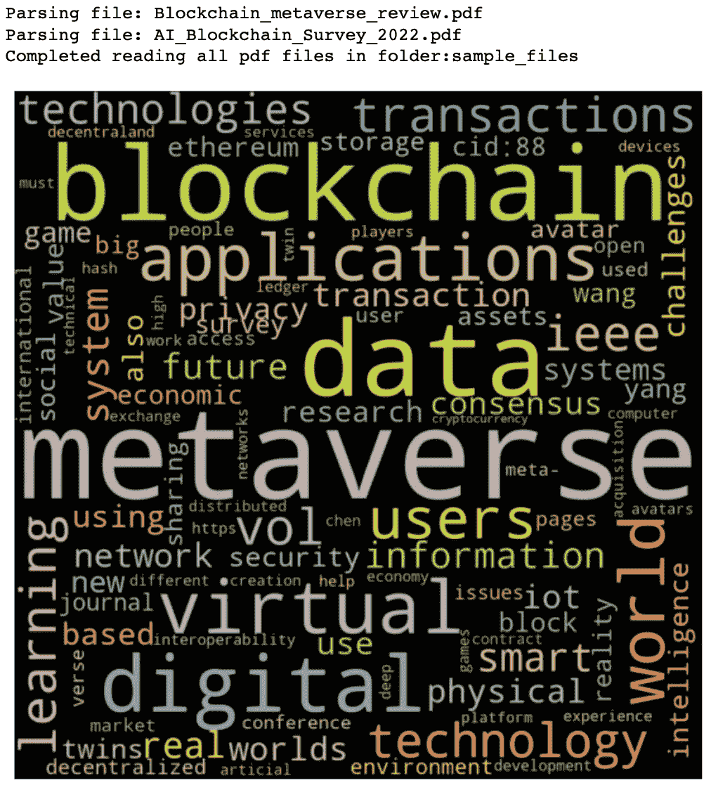

# pdf 到 Word Cloud 只需 3 个步骤

> 原文：<https://towardsdatascience.com/pdfs-to-word-cloud-in-3-steps-73ccbff6d835>

## 从多个文档生成单词云的快速指南

单词云是一种数据可视化工具，用于在图像中描绘单词。每个单词的大小不同，它代表了单词的重量。尺寸越大，其重要性越高。在大多数情况下，单词出现的频率被用作其权重。

词云在数据科学领域有多种应用。它通常用于 NLP 任务的探索性数据分析阶段。它给出了大型文本语料库中频繁出现的术语的快速概览，并且还给出术语相对于语料库中其他术语的用法的指示。它应用于情感分析任务，其中可以可视化总体情感的快速摘要。它还应用于主题建模任务，其中主题术语可以在词云中快速发现。

这里有一个词云的例子。



**单词云示例**(图片由作者提供)

词云给出了创建它的文本语料库的快速摘要。查看上面的词云，很容易识别出文本语料库是关于使用强化学习的，特别是股票数据集上的深度 q 网络方法。



***被几个 PDF 文件卡住了？？*** (图片由作者提供)

在这篇文章中，我们将学习如何阅读多个 pdf 文档，将它们拆分成关键词，并用最常用的关键词创建一个词云。

# 我们开始吧

这个过程包括三个简单直接的步骤。

*   **第一步:**读取文件
*   **步骤 2:** 确定关键词
*   **第三步:**创建单词云

# 必需的 PYTHON 包

在开始实现之前，这里是需要的包的列表。

```
pip install PyPDF2
pip install textract
pip install wordcloud
pip install nltk
pip install collection
```

下面是*为什么*我们需要这些包:

*   *PyPDF2* :解析 PDF 文件(方法 1)
*   *textract* :解析 PDF 文件(方法 1)
*   *文字云*:创建文字云图像
*   *nltk* :获取停用词并将字符串标记为关键词
*   *集合*:获取关键字到其出现次数的映射

# 第一步:阅读文件

有多种方法可以将 pdf 文件的内容读入字符串。这里我们将研究两种这样的方法。

## 方法 1:使用 textract 包

除 pdf 文件外，textract 包还支持多种文件类型。参考[官方文档](https://textract.readthedocs.io/en/stable/)了解其他支持的文件类型。

这里我们将使用基本的解析器来处理文件的内容，并将其作为字符串返回。默认情况下，返回类型是一个字节字符串，需要对其进行解码，以将其提取为一个字符串。

## 方法 2:使用 PyPDF2 包

PyPDF2 是一个开源 python 包，专门用于执行 PDF 特定的功能，如读取、分割、合并、裁剪和转换 PDF 文件的页面。请参考[此链接](https://pypdf2.readthedocs.io/en/latest/)以获取关于 PyPDF2 包的更多详细信息。

下面的代码片段从文件路径中读取 PDF 并以字符串形式返回其内容。

上面提到的任何包都可以用来提取 PDF 文件的内容。就我个人而言，我觉得 textract 包的结果比 PyPDF2 的结果更好，因此将它设置为默认值。

# 第二步:识别关键词

阅读 PDF 文件的内容后，下一步是将它分割成关键字。为了实现这一点，我们使用 nltk 包中的 [word_tokenize](https://www.nltk.org/api/nltk.tokenize.html) 。它接受一个字符串作为输入，并将它分成一系列子字符串。

标点符号将从最终的关键字列表中删除。nltk 包中定义的常见单词(停用词)从关键字列表中删除。此外，如果这个列表中有一些额外的单词需要忽略，那么它可以作为一个列表传递给这个函数。

最后，函数返回一个关键字列表。默认情况下，数字从列表中删除，单词转换为小写。这可以通过参数设置来覆盖。

# 第三步:创建单词云

提取关键词后的最后一步是根据每个词的出现频率绘制词云。出现频率较高的词在词云中会有较大的字号，突出其意义。

这里我们使用的是 [wordcloud 包](https://pypi.org/project/wordcloud/)中提供的 WordCloud。单词云中显示的单词数量及其大小和颜色设置是可配置的。

# 把它们放在一起

一旦这 3 个函数可用，我们就可以用 3 行代码为 PDF 文件生成单词云了。

## 单个文件的 WORD CLOUD


**pdf 文件中前 200 个单词的 Wordcloud】(图片由作者提供)**

## 文件夹中所有文件的 WORD CLOUD

同样的代码可以扩展为一个文件夹中的多个文档创建一个单词云。这将给出文档中常见单词的概述。

在下面的示例中，输出是从 sample_files 文件夹中的两个示例 pdf 文件中提取的(请参考 git repo 来访问这些文件)。

文件夹中所有 pdf 文件的关键字合并列表被创建，该关键字列表用于生成单词云。



**Wordcloud，包含文件夹中所有文档的前 100 个单词**(图片由作者提供)

# 源代码

从下面的链接下载 Jupyter 笔记本，用它来生成你自己的 word cloud:[word cloud _ from _ docs](https://github.com/Lakshmi-1212/wordcloud_from_docs)

# 结论

本文解释了从多个 pdf 文件中读取并创建单词云的多种可能方法之一。

可以探索其他方法来执行相同的任务，如使用不同的 PDF 解析器，使用 TFIDF 代替计数器，使用具有计数映射的字典/数据帧代替所有关键字列表，生成漂亮的单词云图像等。探索愉快！！

# *参考文献:*

*PDF 文档引用实例创建文字云:*

杨，赵，黄和郑，2022。将区块链和人工智能与元宇宙融合:一项调查。arXiv 预印本 arXiv:2201.03201。

*Gadekallu，T.R .，Huynh-The，t .，Wang，w .，Yenduri，g .，Ranaweera，p .，Pham，Q.V .，da Costa，D.B .和 Liyanage，m .，2022。元宇宙的区块链:综述。arXiv 预印本 arXiv:2203.09738。*

南巴杰派，2021。深度强化学习在印度股票交易自动化中的应用。 *arXiv 预印本 arXiv:2106.16088* 。