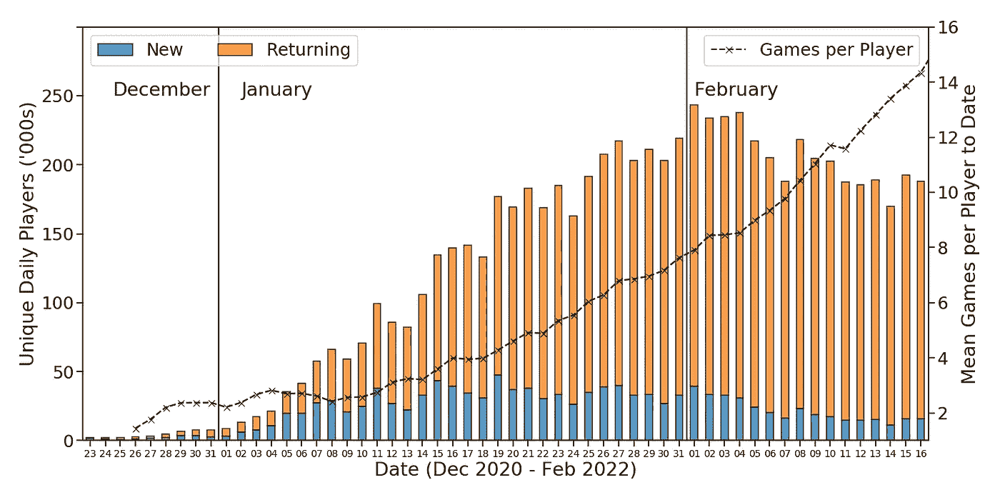
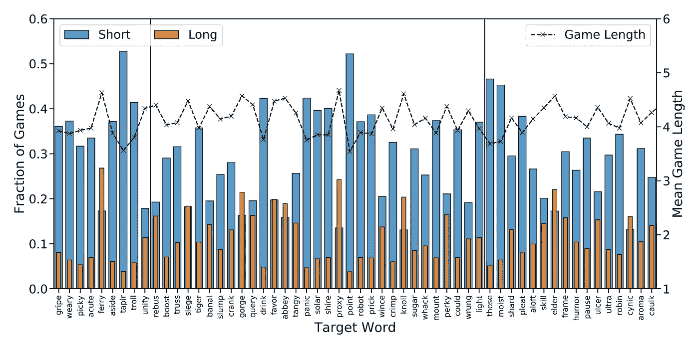
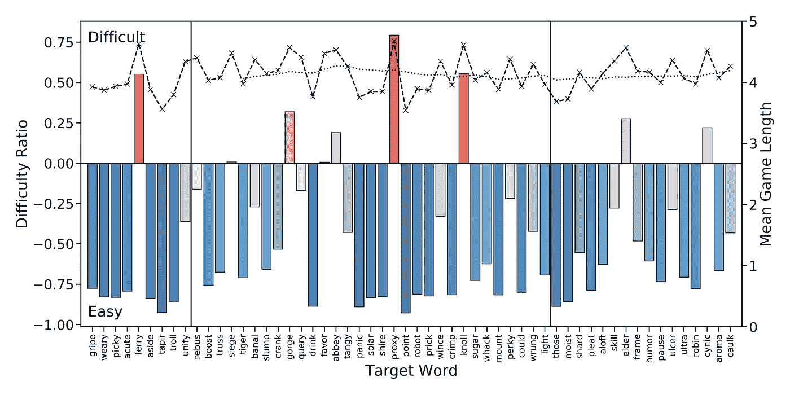

# 峰值单词和单词难度

> 原文：<https://towardsdatascience.com/peak-wordle-word-difficulty-64907be4c177>

## 根据《纽约时报》最近的调整，对 700 万个单词游戏的分析告诉了我们什么关于单词难度

发布到 Twitter 上的 Wordle 游戏蒙太奇。图片作者。

自从最近被[纽约时报](https://www.nytimes.com/2022/01/31/business/media/new-york-times-wordle.html)收购后，关于 [Wordle 是否改变了](https://www.theguardian.com/media/2022/feb/14/is-wordle-getting-harder-viral-game-tests-players-after-new-york-times-takeover)已经有不少报道了。一些人声称游戏变得更难了，关于 NYT 是否修改了游戏使其更具挑战性的猜测越来越多。虽然 NYT 承认对游戏的单词表做了一些小的调整，但他们否认以任何方式改变游戏。

> “游戏的玩法没有任何改变，”《纽约时报》通讯主管乔丹·科恩(Jordan Cohen)在一封电子邮件中说。— [卫报](https://www.theguardian.com/media/2022/feb/14/is-wordle-getting-harder-viral-game-tests-players-after-new-york-times-takeover?utm_campaign=22041&utm_medium=gawker&utm_source=newsletter&utm_session=e0c10df0-cd31-4340-8390-b9061ae41f6a)

查看游戏的源代码[没有任何编码变化的迹象](https://www.cnet.com/news/wordle-isnt-getting-harder-because-of-the-new-york-times-sorry/)，但是对使用的文字有一些小的调整。例如,“AGORA”这个词被删除了，这引起了一些关注，因为人们仍然在使用旧版本的 Wordle 为“AGORA”演奏，而我们其他人则在闪亮的新 NYT 版本上为“AROMA”演奏。

最近引起一些玩家愤怒的词——ULTRA、CAULK 和犬儒主义者——从一开始就被[放进了 Wordle](https://www.theverge.com/tldr/2022/2/14/22933007/wordle-new-york-times-harder-words-debunk-guesses)，因此与新的 NYT 版本无关。这是否意味着目前的争议只不过是茶杯里的风暴，或者是人们对变化反应不好的例子，或者只是通常的单词难度的随机波动？

我认为再看看人们在 Twitter 上分享的游戏能告诉我们这方面的信息会很有趣。

R 最近，我写了一篇关于在 Twitter 上分享的 Wordle 游戏的大规模分析的文章(这里是[这里是](/three-million-wordle-tweets-later-3d3af23bd5c7)和[这里是](/the-cost-of-a-bad-start-in-wordle-how-to-avoid-it-2cdd63f8d599)),使用的是一月份收集的大量数据；Twitter 好心地给了我一张学术许可证，以便大规模收集推文。经过几个星期的游戏，这个数据集现在包括了近 130 万不同玩家玩的 700 多万个游戏。

在最近的一篇文章中，我注意到 Wordle 的用户群在稳步增长，至少在 Twitter 上分享游戏的用户方面是如此。然而，下面更新的图表表明，我们可能正在经历*峰值，因为 Twitter 上每日分享的游戏总数在 2 月 1 日达到最大值——NYT 宣布收购的第二天——此后一直在下降。此外，这种下降在 twitter 上发布的游戏总数(下面的橙色+蓝色条)和在 Twitter 上发布第一个游戏的*新*玩家总数(蓝色条)中都很明显。*

2021 年 12 月 23 日至 2022 年 2 月 16 日期间在 Twitter 上发布 Wordle 游戏的玩家(新玩家和回归玩家)数量。线形图显示了同一时期每个玩家发布到 Twitter 上的平均游戏数量。作者配图。

我们达到顶峰了吗？或者这仅仅是 Twitter 帖子数量的下降？这很难说，但毫无疑问，时间会证明一切。至少这一结果表明，Wordle 的增长目前可能已经稳定，但我怀疑它将在未来几天回到一个更积极的领域。

但是今天真正的问题是 NYT 的摆弄是否像一些人声称的那样导致了更难的单词被使用。我们能在 Twitter 数据中看到任何证据吗？最近的单词比合理预期的更难解决吗？

在我最近的分析中，我根据 Twitter 数据研究了两种评估单词难度的不同方法:

1.  最简单的方法是查看每个目标单词的平均游戏长度，理由是更短的游戏指向更简单的单词。问题是，一个简单的平均值可以掩盖很多正在发生的事情。
2.  一个更有趣且可能有用的方法是比较*短*游戏(最多 3 次猜测的游戏)和*长*游戏(需要 6 次猜测的游戏)的比例。如果一个单词主要与短游戏相关联，那么它比一个主要与长游戏相关联的单词更容易。

下图显示了从 12 月 23 日到 2 月 16 日(昨天撰写本文时)官方目标词的这些衡量标准。所有这三项指标都有相当大的差异。一些单词有许多短游戏而相对较少的长游戏(例如，SIDE，TAPIR，POINT，LIGHT)，而另一些单词有大得多的长游戏而较少的短游戏(例如，FERRY，GORGE，ABBEY，PROXY，ELDER，犬儒派)。

从 2021 年 12 月 23 日到 2022 年 2 月 16 日，目标词的短/长游戏和平均游戏长度的分数。作者配图。

要将此转换为单一的难度衡量标准，使用单词的长短局比率是有意义的；我们从结果中减去 1，这样，对于一个给定的单词，*难度比> 0* 意味着长游戏比短游戏多，反之亦然。

这个难度比显示在下面，根据难度比是正还是负，帮助突出显示最难的单词(红色)和最容易的单词(蓝色);这些条也是用颜色编码的，所以颜色的强度反映了实际难度比的大小。该图还覆盖了每个单词的平均游戏时长和平均游戏时长的 14 天滚动平均值。

2021 年 12 月 23 日至 2022 年 2 月 16 日目标词的难度比。还显示了每个单词的平均游戏长度(虚线)以及平均游戏长度的 14 天滚动平均值(虚线)。作者配图。

现在我们可以清楚地看到最难的单词(渡口、峡谷、修道院、代理人、克诺、长老和愤世嫉俗者)以及几个边界情况(围攻和青睐)，它们的难度比率勉强高于 0。

我之前提到过这些难词更有可能有重复字母，最近的难词也是如此(ELDER 和犬儒派)。作为题外话，我之前也向[展示过](/three-million-wordle-tweets-later-3d3af23bd5c7)难词更有挑战性，因为它们包括罕见的字母和不寻常的字母组合；犬儒派中的“CY”就是一个很好的例子。

As 是否有证据表明 Wordle 变得更具挑战性？在我看来，这并没有得到 Twitter 数据的支持。游戏时长的 14 天滚动平均值保持非常稳定，但更具挑战性的单词确实会不时出现。一月份有四个，到目前为止，我们在二月的前半个月有两个，尽管二月份的单词(长者和愤世嫉俗者)的难度比率并不是特别高，至少与一月份最具挑战性的单词相比是这样。

当然，这可能是我们从 Wordle 的随机目标词列表中所期待的。事实上，至少对于最近一些更有争议的词汇——ULTRA 和 CAULK 跃入脑海——数据中没有任何东西让它们显得特别困难。事实上，这两个词的短博弈比长博弈多得多，所以大多数人似乎都能应付自如。

如果有什么不同的话，这些结果表明，在一月底和二月初之间，难词变少了。诺尔和艾尔德之间有整整两个星期，这是迄今为止两个难词之间最长的间隔。从随机性的角度来看，这没有什么不寻常的，但也许玩家已经习惯了一串挑战性较小的单词，所以当一个更具挑战性的单词出现时，他们会措手不及。

至少就目前而言，我认为可以有把握地断定*新词*就像*原词*。它的包装有点不同，但游戏性是一样的，文字是一样的(除了一些小的例外)，明天会和昨天一样有趣。享受吧。

如果你想更多地了解 Wordle 的数据能告诉我们人们如何打球，你可以更有效地打球，那么看看我最近的帖子:

*   [我从玩了一百多万场 Wordle 游戏中学到了什么](/what-i-learned-from-playing-more-than-a-million-games-of-wordle-7b69a40dbfdb)
*   [如何在 Wordle 中猜对](/how-to-guess-well-in-wordle-d21167aae444)
*   三百万条 Wordle Tweets 之后:对 Tweets 的分析揭示了关于 Wordle、它的词汇和它的玩家的什么。
*   [沃尔得开局不利的代价以及如何避免。](/the-cost-of-a-bad-start-in-wordle-how-to-avoid-it-2cdd63f8d599)