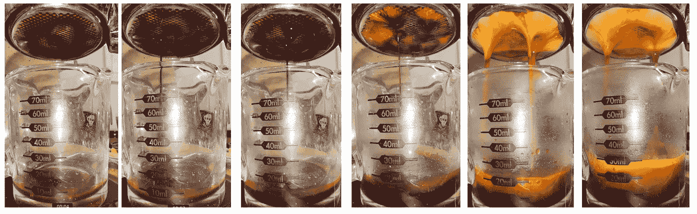
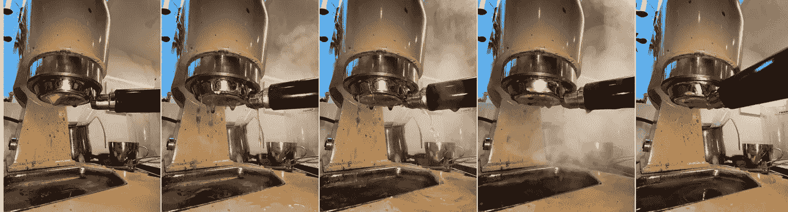
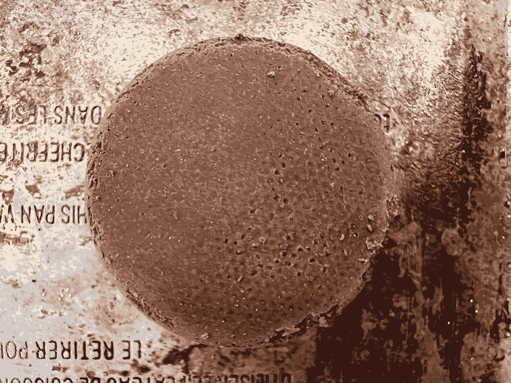
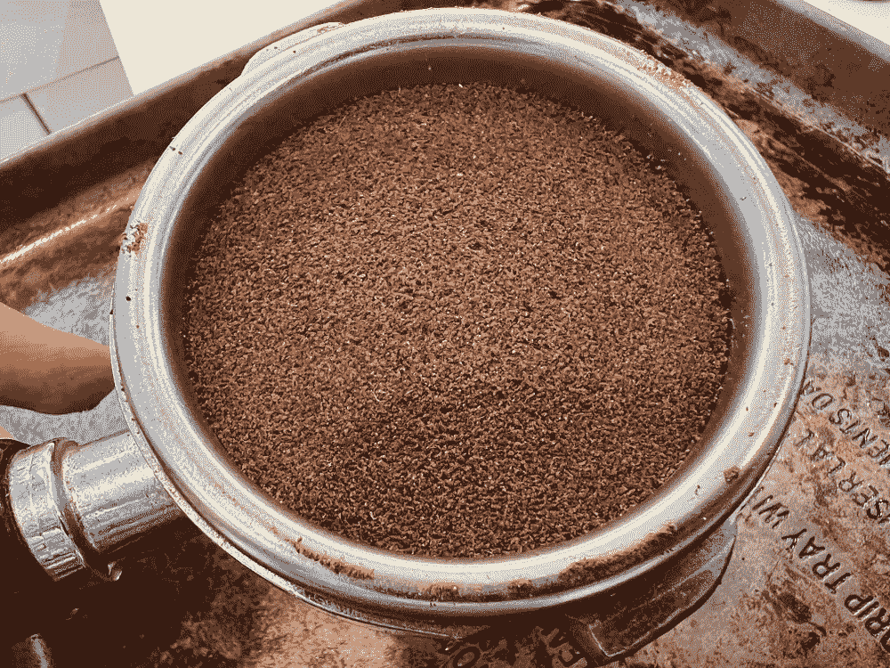
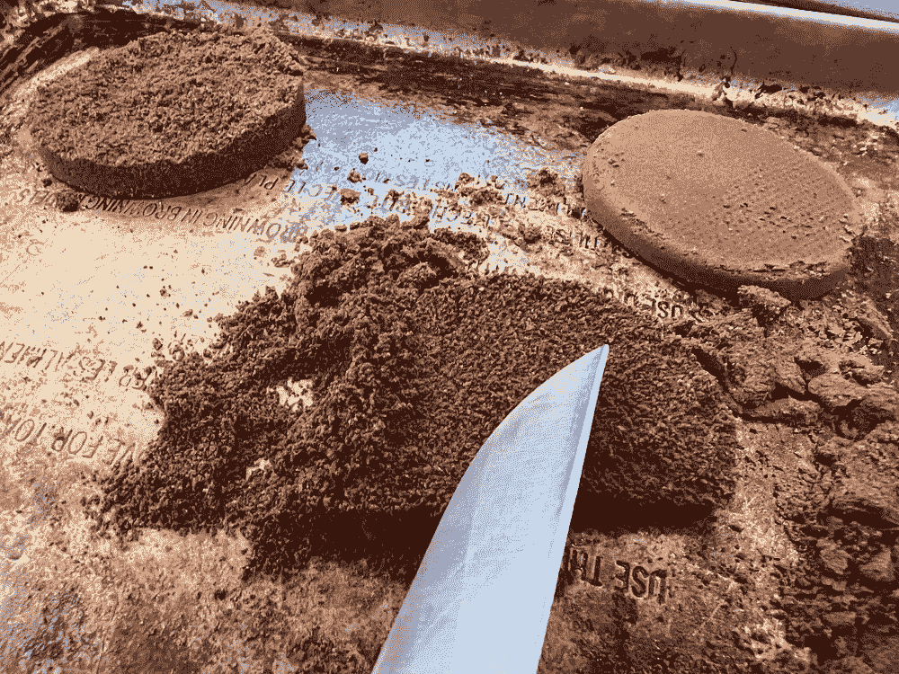
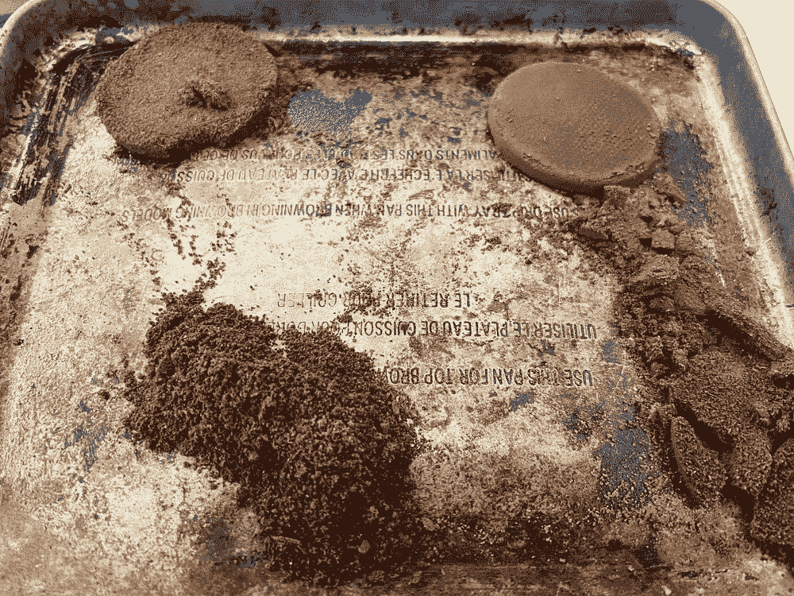
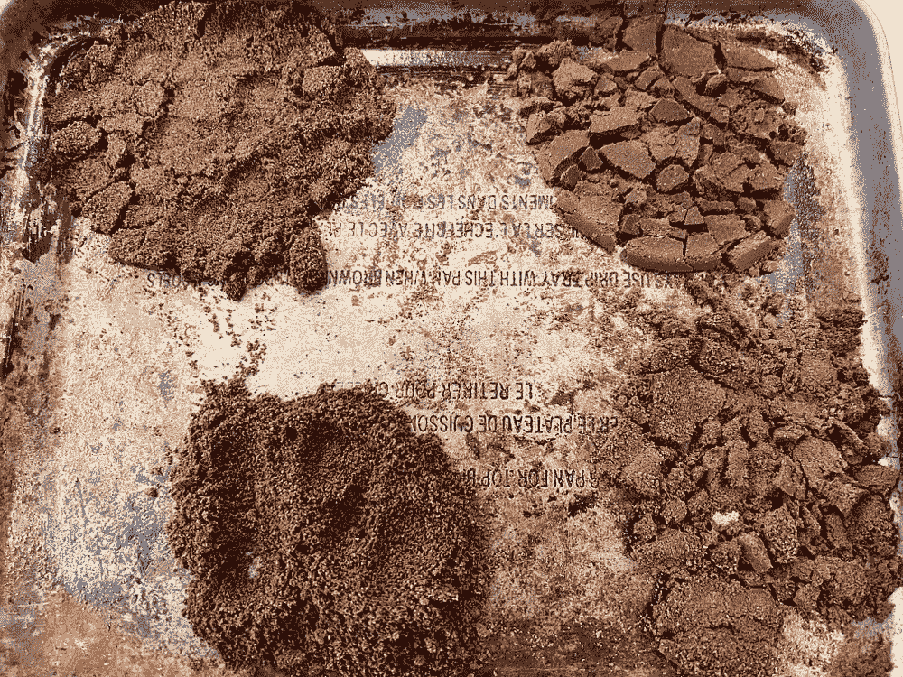
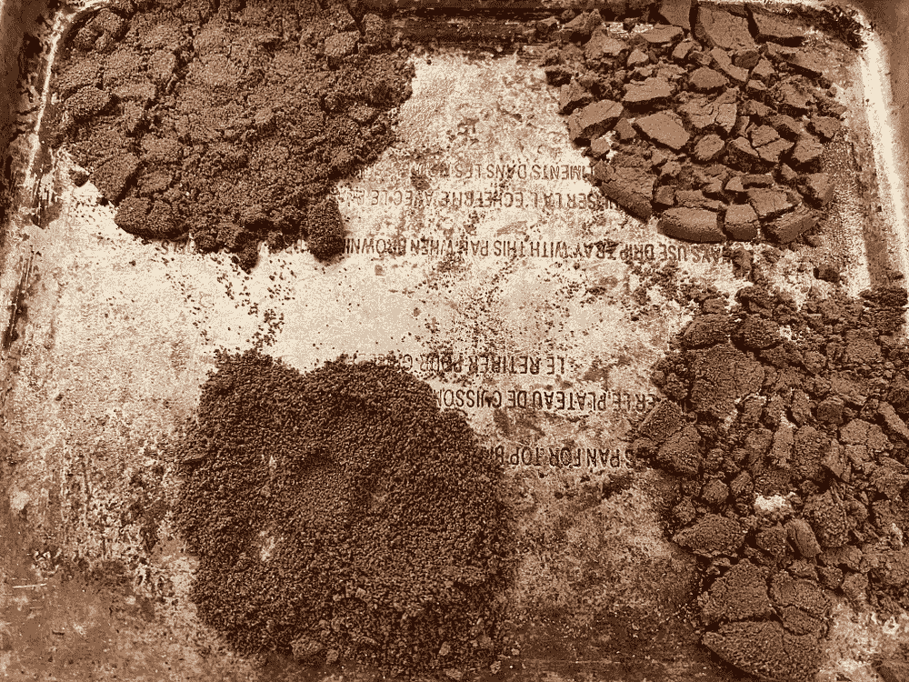
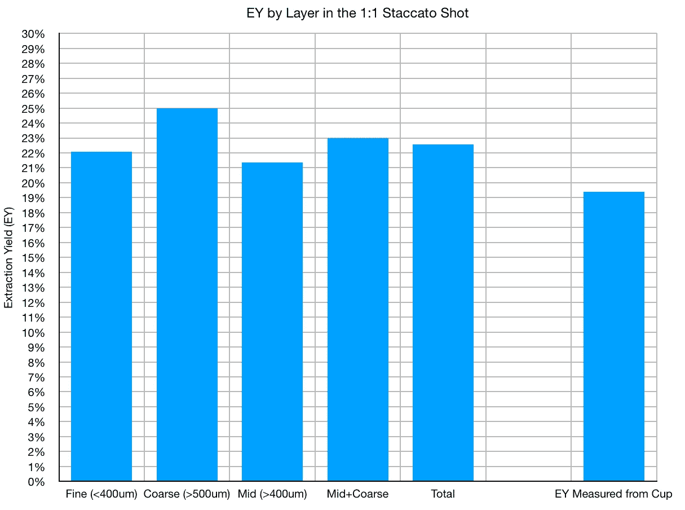
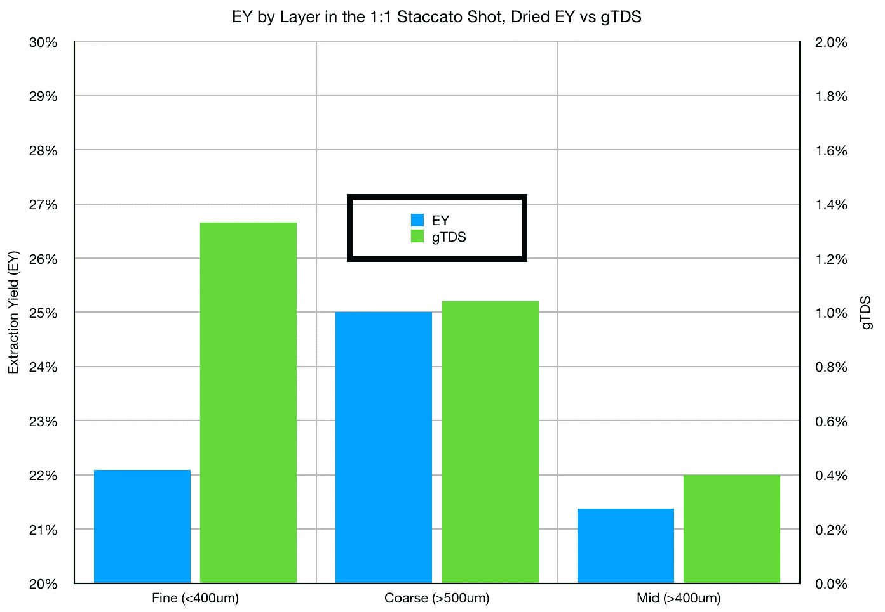

# 在断奏中揭开浓缩咖啡萃取的神秘面纱

> 原文：<https://towardsdatascience.com/peeling-back-the-mystery-of-espresso-extraction-in-staccato-14a0645238a4>

## 咖啡数据科学

# 在断奏中揭开浓缩咖啡萃取的神秘面纱

## 更深入理解分层的一次性测试

我以前检查过[断奏](https://medium.com/overthinking-life/espresso-machine-maintenance-or-lack-thereof-dfd1c8c802b4)和[断奏捣实](/staccato-tamping-improving-espresso-without-a-sifter-b22de5db28f6)浓缩咖啡的[逐层提取](/espresso-extraction-by-layer-fc2780335aee)，但那些镜头通常是 3 比 1(输出对输入)。我的大部分镜头都是在 1:1 和剩下的 3:1 之间分割，因为我用的是杠杆机，很难在 1:1 停止拍摄。所以我用两杯，第二杯不喝。

经过一番深思熟虑和排练，我决定在 1:1 的断奏镜头后立即关闭 portafilter。然后我可以切开圆盘，一层一层地测量提取了多少咖啡。

# 设备/技术

[浓缩咖啡机](/taxonomy-of-lever-espresso-machines-f32d111688f1):金特快

咖啡研磨机:[小生零](/rok-beats-niche-zero-part-1-7957ec49840d)

咖啡:[家庭烘焙咖啡](https://rmckeon.medium.com/coffee-roasting-splash-page-780b0c3242ea)，中杯(第一口+ 1 分钟)

镜头准备:[断奏](https://medium.com/overthinking-life/staccato-espresso-leveling-up-espresso-70b68144f94)

[预灌注](/pre-infusion-for-espresso-visual-cues-for-better-espresso-c23b2542152e):长

输液:[压力脉动](/pressure-pulsing-for-better-espresso-62f09362211d)

[过滤篮](https://rmckeon.medium.com/espresso-baskets-and-related-topics-splash-page-ff10f690a738) : 20g VST

其他设备: [Atago TDS 计](/affordable-coffee-solubility-tools-tds-for-espresso-brix-vs-atago-f8367efb5aa4)、 [Acaia Pyxis 秤](/data-review-acaia-scale-pyxis-for-espresso-457782bafa5d)

# 这一枪

我准备了一个断奏镜头(细 10.1g，粗 6.6g，中 5.3g)。然后我用 20 秒的预灌注时间开始注射，总共用时 28 秒。

所有图片由作者提供

然后我很快地把便携式过滤器从机器里拿出来，弄得一团糟。

我让冰球晾干，然后我看了看。

我小心翼翼地在托盘上切了几层。

我在 93 度的烤面包机里把它烘干了。

左图:干燥前。右图:干燥后

# 衡量

**总溶解固体量** (TDS)使用折射仪测量，该数值结合咖啡的输出重量和输入重量，用于确定提取到杯中的咖啡百分比，称为提取率(EY)。

[**【gTDS】**](/other-coffee-measurements-using-a-refractometer-85d0fb28d3d7)**咖啡渣 TDS 是通过取一些咖啡渣，将它们放在数字折光仪上(在这种情况下是 Atago)，加入少量水，并测量 TDS 来确定的。这让我们知道还有多少可溶物在地下。**

**我测量了拍摄的 EY，然后我称量了干燥的废地面，以确定每层 EY 的估计值。我还对综合 EY 进行了估算。请记住，拉下 portafilter 不是即时的，所以有一些咖啡没有被收集。因此，这些值应该与从干燥地面测得的总 EY 进行比较。**

****

**我还测量了三层的 GTD，并将这些测量值与干燥层进行了比较。较高的 gTDS 表示提取较少。**

****

**底部精细，中间粗糙，顶部中等**

**对于细粒层，gTDS 较高，干 EY 较低。中间层很有趣，因为干 EY 很低，但提取也很低。**

**这些结果与 3:1 的结果不一致，该结果显示精细层的提取率高于顶部两层。然而，从[的另一个实验](/the-duality-of-coffee-an-extract-and-a-filter-5a6a83777e5e)中，我发现咖啡渣同样可以吸收可溶物，所以很有可能粗中层的可溶物停留在细层。这是很有可能的，因为从 TDS 中，只有 19%被提取出来，或者如果你想考虑杯子中没有收集到的液体，只有 20%。一般来说，这个节目会以 3:1 的比例抽取 28%左右。**

**这个实验是对冰球的一次小小窥视，以了解发生了什么。更好的办法是在冰球里放一个折射计来测量整个击球过程中的 TDS。espresso puck 的神秘非常引人注目，但要完全理解却非常具有挑战性。**

**如果你愿意，可以在推特、 [YouTube](https://m.youtube.com/channel/UClgcmAtBMTmVVGANjtntXTw?source=post_page---------------------------) 和 [Instagram](https://www.instagram.com/espressofun/) 上关注我，我会在那里发布不同机器上的浓缩咖啡照片和浓缩咖啡相关的视频。你也可以在 [LinkedIn](https://www.linkedin.com/in/robert-mckeon-aloe-01581595?source=post_page---------------------------) 上找到我。也可以关注我在[中](https://towardsdatascience.com/@rmckeon/follow)和[订阅](https://rmckeon.medium.com/subscribe)。**

# **[我的进一步阅读](https://rmckeon.medium.com/story-collection-splash-page-e15025710347):**

**[我未来的书](https://www.kickstarter.com/projects/espressofun/engineering-better-espresso-data-driven-coffee)**

**[浓缩咖啡系列文章](https://rmckeon.medium.com/a-collection-of-espresso-articles-de8a3abf9917?postPublishedType=repub)**

**[工作和学校故事集](https://rmckeon.medium.com/a-collection-of-work-and-school-stories-6b7ca5a58318?source=your_stories_page-------------------------------------)**

**个人故事和关注点**

**[乐高故事启动页面](https://rmckeon.medium.com/lego-story-splash-page-b91ba4f56bc7?source=your_stories_page-------------------------------------)**

**[摄影飞溅页面](https://rmckeon.medium.com/photography-splash-page-fe93297abc06?source=your_stories_page-------------------------------------)**

**[改善浓缩咖啡](https://rmckeon.medium.com/improving-espresso-splash-page-576c70e64d0d?source=your_stories_page-------------------------------------)**

**[断奏生活方式概述](https://rmckeon.medium.com/a-summary-of-the-staccato-lifestyle-dd1dc6d4b861?source=your_stories_page-------------------------------------)**

**[测量咖啡磨粒分布](https://rmckeon.medium.com/measuring-coffee-grind-distribution-d37a39ffc215?source=your_stories_page-------------------------------------)**

**[浓缩咖啡中的粉末迁移](https://medium.com/nerd-for-tech/rebuking-fines-migration-in-espresso-6790e6c964de)**

**[咖啡萃取](https://rmckeon.medium.com/coffee-extraction-splash-page-3e568df003ac?source=your_stories_page-------------------------------------)**

**[咖啡烘焙](https://rmckeon.medium.com/coffee-roasting-splash-page-780b0c3242ea?source=your_stories_page-------------------------------------)**

**[咖啡豆](https://rmckeon.medium.com/coffee-beans-splash-page-e52e1993274f?source=your_stories_page-------------------------------------)**

**[浓缩咖啡用纸质过滤器](https://rmckeon.medium.com/paper-filters-for-espresso-splash-page-f55fc553e98?source=your_stories_page-------------------------------------)**

**[浓缩咖啡篮及相关主题](https://rmckeon.medium.com/espresso-baskets-and-related-topics-splash-page-ff10f690a738?source=your_stories_page-------------------------------------)**

**[意式咖啡观点](https://rmckeon.medium.com/espresso-opinions-splash-page-5a89856d74da?source=your_stories_page-------------------------------------)**

**[透明 Portafilter 实验](https://rmckeon.medium.com/transparent-portafilter-experiments-splash-page-8fd3ae3a286d?source=your_stories_page-------------------------------------)**

**[杠杆机维护](https://rmckeon.medium.com/lever-machine-maintenance-splash-page-72c1e3102ff?source=your_stories_page-------------------------------------)**

**[咖啡评论和想法](https://rmckeon.medium.com/coffee-reviews-and-thoughts-splash-page-ca6840eb04f7?source=your_stories_page-------------------------------------)**

**[咖啡实验](https://rmckeon.medium.com/coffee-experiments-splash-page-671a77ba4d42?source=your_stories_page-------------------------------------)**