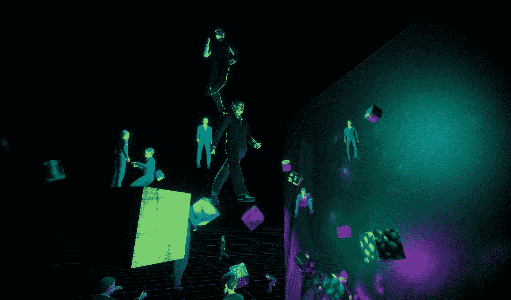
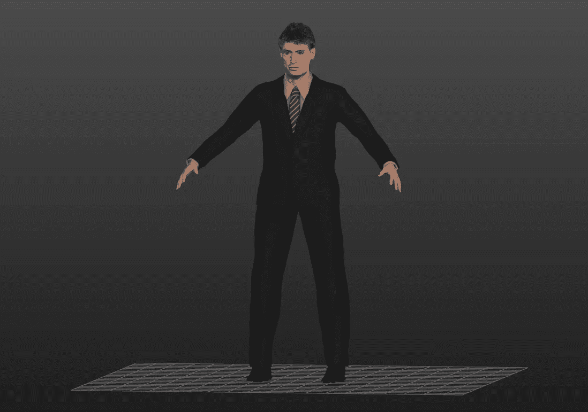
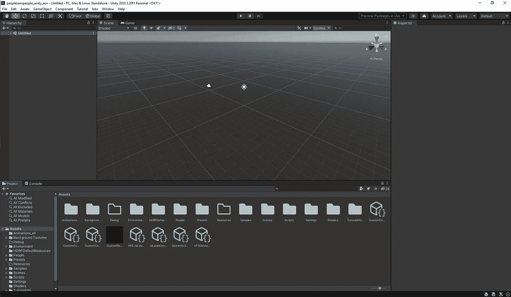
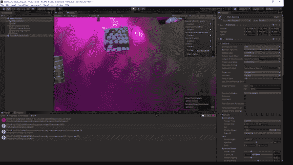
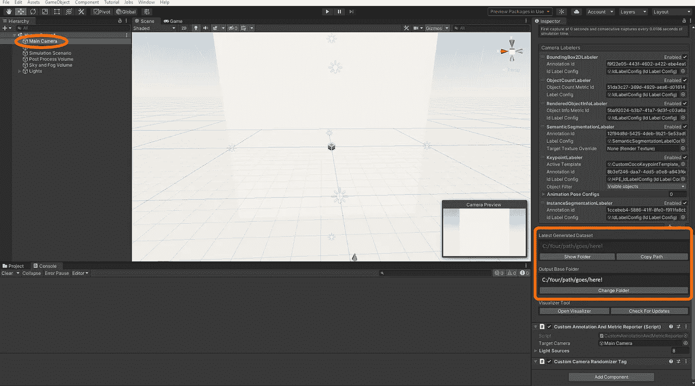
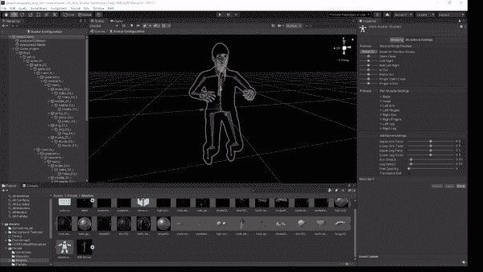
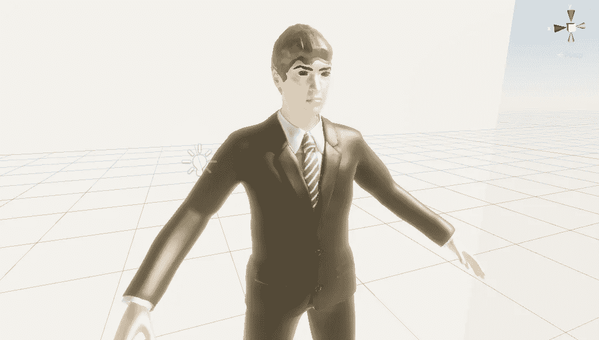
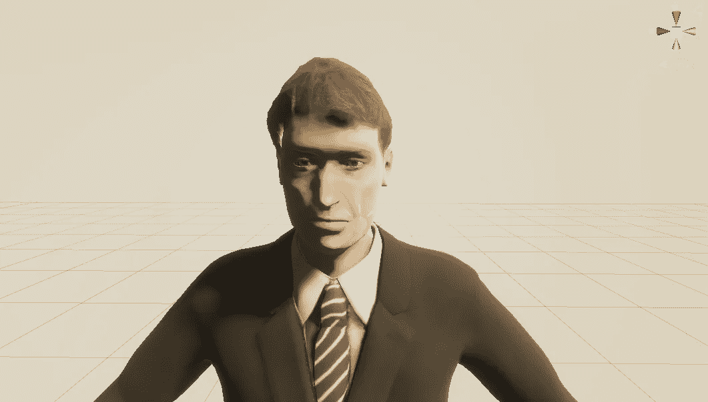
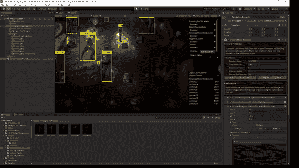

# PeopleSansPeople:在 Unity 中生成虚拟人的合成数据

> 原文：<https://towardsdatascience.com/peoplesanspeople-generating-synthetic-data-of-virtual-human-beings-in-unity-a1847a56895c>

## 为计算机视觉创建人类的 3D 模型从未如此简单

使用 PeopleSansPeople 项目创建的超现实合成场景(由作者创建)。

# 介绍

获取大量高质量的标注训练数据是很难的。收集高质量的数据、收集足够的数据、招募并培训标注团队、确保标注干净一致、确保其充分代表模型在现实世界中可能遇到的各种情况，等等。需要大量的时间和努力。当这些数据涉及到人类时，事情变得更加棘手。现在，你有责任确保你的数据不侵犯隐私，不包含个人身份信息，你可以与你的标签共享数据，并在年龄，性别，种族，文化等方面保持平衡。你用这些数据训练的任何模型也要尊重这些道德界限。

难怪人们对使用模拟来生成大量合成训练数据的兴趣正在稳步增长。但是计算机渲染的数据能像真实世界一样有效吗？

通过在虚幻引擎中创建高质量的模拟， [AI 的研究人员。Reverie](https://aireverie.com/rareplanes) 展示了他们可以将所需的真实世界训练数据量减少 90%,同时实现几乎相同的性能。也就是说，在真实世界的数据集中，你需要的每十张图片中就有一张[ [1](https://arxiv.org/abs/2006.02963) ]。谷歌的研究人员证明，通过在一个具有 ImageNet 权重[[2](https://arxiv.org/abs/1710.10710)的模型上使用合成数据进行微调，可以在没有任何标记的训练数据的情况下近似得到相同的结果*。合成数据的使用甚至已经破坏了行业，包括[亚马逊 Go](https://venturebeat.com/2019/06/05/amazon-go-uses-synthetic-data-to-train-cashierless-store-algorithms/) 商店、[丰田](https://medium.com/toyotaresearch/teaching-home-robots-73f7d5e3601f)和 [OpenAI](https://openai.com/blog/solving-rubiks-cube/) 等等。合成数据也被用来补充真实世界的训练数据，以训练谷歌 MediaPipe 框架的一部分 [Objectron](https://ai.googleblog.com/2020/03/real-time-3d-object-detection-on-mobile.html) 中的 3D 边界框检测模型，从而将其准确性提高了 10%。*

## 为什么是合成数据？

越来越明显的是，投资合成数据可以大大加快你的 ML 研究。以下是学习创建自己的合成数据对您有所帮助的几个原因:

*   以微不足道的成本生成无限量的训练数据
*   假设-测试新想法，无需花费时间/金钱来获取和标记数据
*   标签是由一个确定性的过程生成的，该过程确保标签是正确的(即使是广泛使用的 ML 基准数据集[也充满了错误](https://labelerrors.com/about)
*   轻松对传感器、环境和姿势等因素进行消融研究(如 Hinterstoisser 等人[ [2](https://arxiv.org/abs/1710.10710) ])
*   模拟罕见但重大的“黑天鹅”事件(如车祸)
*   实现可比的性能，同时大幅减少所需的真实训练数据
*   通过分布模拟[ [3](https://arxiv.org/abs/1812.07252) ]快速加快强化学习的速度

然而，虽然标记真实世界的数据花费大量的时间和金钱，但是为单个 ML 任务创建模拟也不是一件小事。它需要具备专业技能的工程师和 3D 艺术家的投入，他们了解要解决的问题的复杂性。众所周知，创造虚拟人更加困难(至少是那些避开恐怖谷的人)。有许多公司提供合成数据生成服务，如 [AI。遐想](https://aireverie.com/)、[数据生成](https://www.datagen.tech/)和[动态视觉](https://kinetic-vision.com/machine-learning-synthetic-data-generation/)。我们自己生成合成数据而不必马上参与合作关系，这不是很好吗？

## Unity 技术公司

Unity 是世界上最受欢迎的跨平台游戏引擎之一的制造商，最近发布了一个名为 [Unity Perception](https://github.com/Unity-Technologies/com.unity.perception) 的开源工具包，将合成标签放在你自己的手中。Unity Perception toolkit 抽象了标签生成过程，甚至允许 Unity 业余爱好者配置 Unity 场景，该场景可以使用 2D 边界框、3D 边界框、语义分割遮罩、实例分割遮罩、对象计数等生成无数图像。

统一计算机视觉:增压你的计算机视觉训练(YouTube)。为了更深入地展示统一感知的可能性，请查看来自[标准认知](https://standard.ai/)的[案例研究](https://youtu.be/D1In3thbuH4)。

此外，他们在此基础上再次扩展，创建了[people sans people](https://github.com/Unity-Technologies/PeopleSansPeople)[[4](https://arxiv.org/pdf/2112.09290.pdf)](PSP)，这是一套建立在感知基础上的额外工具，可以生成 2D 和 3D 边界框，实例和语义分割遮罩，以及用于操纵人类 3D 模型的 COCO 姿势标签。

使用 Unity Perception 和 PeopleSansPeople 生成的合成数据的催眠蒙太奇。

## SynthDet:合成数据的早期尝试

如果你看了上面的视频，你可能会问自己:为什么这些合成图像看起来如此…迷幻？合成训练数据不应该看起来更像真实生活吗？答案在 2019 年的一篇论文中，名为“保存的注释是获得的注释:使用完全合成训练进行对象实例检测” [5](https://arxiv.org/pdf/1902.09967.pdf) 。简而言之，作者发现，与其试图逼近目标域(由于神经网络强大的记忆技能，不可避免地会出现不足)，不如积极地随机化训练数据更有效。此后不久，Unity 发布了一个名为 [SynthDet](https://github.com/Unity-Technologies/SynthDet) 的开源项目，该项目使用感知包实现了论文中描述的方法。要深入解释为什么这种通常被称为*域随机化*的策略如此有效，请看一下[Lilian Weng](https://lilianweng.github.io/posts/2019-05-05-domain-randomization/)的这篇精彩文章。

在本教程中，我们将进一步探索这一技术，利用 Unity Perception、PeopleSansPeople 和第三个名为 [MakeHuman](http://www.makehumancommunity.org/) 的工具来为机器学习生成合成人类的标记训练数据。本教程面向 ML 从业者，假设没有 3D 艺术或游戏开发经验。请注意，我们将在本教程中假设一个基于 Windows 的系统，但是所有的工具都应该与 Linux 兼容。本教程也不需要任何编码经验，因为不会有任何代码！让我们开始吧。

# 制造人类

从 [Mixamo](https://www.mixamo.com/) 到 [Turbosquid](https://www.turbosquid.com/) ， [Sketchfab](http://sketchfab.com/feed) 到 [CGTrader](https://www.cgtrader.com/3d-models/character) ，现在有很多很多的方法来获取 3D 模型。你可以使用一个低级但功能强大的工具，如 Maya 或 Blender，自己制作它们。甚至还有一些专门用于制造人类的专有工具，如 Reallusion 的[角色创造者](https://www.reallusion.com/character-creator/)或 Epic Games 的[超能力者创造者](https://www.unrealengine.com/en-US/metahuman-creator)。然而，当你想尝试看看什么是有效的，为什么不保持快速和负担得起的东西呢？

进入 [MakeHuman](http://www.makehumancommunity.org/) ，一款免费开源的工具，用于快速创建人类的参数化 3D 模型。这个工具可以追溯到 2000 年，它允许你制作并导出一个[全套装备的](https://en.wikipedia.org/wiki/Skeletal_animation)人体模型，带有高级滑块，就像你在视频游戏中创造一个角色一样。还有一个活跃的社区，以防你需要任何具体的帮助。他们的代码是在 GNU AGPL 许可证下提供的，其产生的所有资产都受到 CC0 许可证的保护(更多细节，请参见此处的)。

## 设置 MakeHuman

使用 MakeHuman 非常简单。首先通过从[下载页面](http://www.makehumancommunity.org/content/makehuman_120.html)下载稳定版进行安装。在 Windows 上，只需解压下载文件并执行附带的*。exe* 文件。在 Linux 上，有 [PPA 安装指令](https://launchpad.net/~makehuman-official/+archive/ubuntu/makehuman-community)。现在启动程序。你应该会看到一个相当橙色的默认人类和一些滑块在左边，如下所示。

启动 MakeHuman 时首先看到的是。我继续添加衣服到我的，以保持东西 SFW，但我会得到这一点(由作者创建)。

UI 由左右两侧的设置栏和顶部的三个工具栏组成。第一行工具包括常见的新建/保存/打开按钮、撤消/重做，以及一些视图选项，如切换网格或查看网格。第二行是 MakeHuman 中大多数工具的存放位置。创建新模型时，通常会沿着这些选项卡从左向右移动。第三行根据第二行的上下文进行更改。接下来，我们将创建一个非常快速的人类模型进行演示。

## 创造一个人类

在“建模”选项卡中，您可以编辑主要属性，如身高和年龄，或者更深入地研究面部、躯干、手臂和腿等。请注意当您选择这些选项卡时，右列中的选项是如何变化的。这些给了你对模型非常精细的控制。还有一个随机选项卡，可以随机修改所有这些属性。正如你所料，结果并不总是很好，但是为了时间和乐趣，我们就这样吧。按“随机化”几次，直到你对结果满意。

现在，直接跳到“几何图形”选项卡。在这里，您可以编辑基础服装，并为各种头发、眼睛、牙齿和更多选项选择基础几何体。股票期权是有限的，但是你可以下载更多的期权或者用各种[插件](http://www.makehumancommunity.org/content/plugins.html)比如 Blender MakeClothes 2 插件自己制作。把这些也浏览一遍，挑出你喜欢的。只要确保选择至少一件衣服，因为我将展示我们如何在 Unity 中随机化纹理。

接下来，“材料”这些选项会替换皮肤、头发、眼睛等的纹理。再一次，选择你喜欢的，继续前进。在“姿势/动画”选项卡上，我们只想改变一件事。选择“骨骼”选项卡，并将装备预设更改为“游戏引擎”这个装备将使我们能够统一的动画角色。这样我们就可以完成对我们的基本角色的编辑了。10 分钟 0 美元还不算太寒酸！

一个来自 MakeHuman 的完全建模、装配和纹理化的模型，名为“Mark”(由作者创建)。

## 输出你的人类

现在让我们导出。在“Files”选项卡下，选择“Save”选项卡来保存我们的模型，以防我们以后需要进行更改。给你的人类一个“人类名”和一个文件名。两个字段我都选了“马克”，当然也选自己喜欢的。如果你想做更多，你可能希望使用一个命名约定。现在选择“导出”选项卡。在“网格格式”下，选择“Filmbox (fbx)”，这是 Autodesk 制作的一种常见文件格式。在右栏中，确保选中“地面英尺”并将“比例单位”设置为“米”，因为 Unity 使用默认的米单位。我们还设置了“脚踏实地”，这样 Unity 中的位置坐标将与他们的脚的位置相对应，使得在场景中放置和移动我们的人变得更加容易。现在输出你的*。fbx* 文件，我们完成了这一步。

# 人民

如前所述，PeopleSansPeople 是由 Unity Technologies 创建的一个开源工具，用于创建域随机化的合成人的注释数据。我们可以从 GitHub 下载这个工具。进入 [GitHub 项目页面](https://github.com/Unity-Technologies/PeopleSansPeople)和`git clone`或将该项目下载到您电脑上合适的位置。回想下一步这个项目在哪里。

接下来我们需要安装 Unity，特别是 Unity Hub。如果您已经安装了 Unity Hub，请跳过此部分。

## 安装 Unity 集线器

Unity Hub 是一个版本和项目管理程序，可组织您电脑上的所有 Unity 项目和版本。强烈建议第一次使用 Unity 的用户使用。从 [Unity 下载](https://unity3d.com/get-unity/download)页面下载 Unity Hub 并启动。您应该看到左边有四个选项卡，包括“项目”，右边有两个按钮，分别是“添加”或“新建”PSP 项目预先配置了 Unity 场景，所以点击“添加”打开之前下载的文件夹，选择子文件夹`peoplesanspeople_unity_env`，点击“选择文件夹”这可能需要一个你还没有的 Unity 版本(在撰写本文时是 *2020.3.20f1* )。Unity Hub 会给你一个安装它的选项。使用默认选项安装，然后打开项目。

## PeopleSansPeople 项目

第一次加载这个项目可能需要几分钟，但是一旦完成，你应该会看到 Unity 编辑器。

默认的 Unity 编辑器(由作者创建)。

Unity 是一个复杂而强大的程序，可能有点令人望而生畏，但我会尽量保持它的最小化，只是为了让你开始。有很多关于正确使用的很棒的资源，包括 [Unity 自己的教程](https://learn.unity.com/)，如果你更倾向于使用它的话。现在，要知道 Unity 项目被分组在所谓的“场景”中这些基本上是定义对象的布局和行为(2D 或 3D)的设置。想象一下电子游戏中不同的“关卡”。场景可以像视频一样播放，这就是顶部的大播放和暂停按钮的作用。默认情况下，你应该看到一个空的场景。让我们打开这个项目的“人类场景”。在底部的文件管理器中，双击名为“场景”的文件夹，然后双击名为“人类场景”的文件

这就是奇迹发生的地方。点击播放按钮来明白我的意思(**光敏警告:场景会以许多不同的颜色快速闪烁**)。

播放默认的 PSP 场景(由作者创建)。

这个超现实的场景将重复播放 100 次，生成 RGB 图像、边界框标签、姿势标签和分段蒙版。要找出在哪里，点击左边层次中的“主摄像机”对象。屏幕右侧的 Inspector 选项卡应该会显示您选择的对象的属性。(在 Unity 中,“检查器”面板中的每一行都称为一个“组件”,本质上是附加到对象的类，用于定义其在场景中的行为。)向下滚动到“感知摄像机”组件。这来自感知包，它定义了如何从场景中捕捉帧，应用哪些注释，以及将它们保存在计算机上的什么位置。如果你打算使用感知，这里有许多重要的领域(特别是“相机贴标机”部分，在那里你定义你希望产生的标签和类别的类型)，但现在我们将掩饰细节。

感知相机组件，您可以在其中配置感知场景的渲染设置。它位于“主相机”对象上(由作者创建)。

寻找“最后生成的数据集”字段，然后单击“显示文件夹”或“复制路径”以查看文件资源管理器中的数据。请随意浏览这些文件夹，感受一下这个工具可以产生什么样的数据。

## 添加您的人员

当前场景的一个明显问题是你的人不在里面！要添加您创建的 3D 模型，我们需要对其进行一些更改，以使其与 PSP 兼容。首先，让我们输入你的个人信息。再次查看底部的文件浏览器。(如果它显示的是“控制台”，请单击它旁边的标签“项目”如果不知何故“项目”不在那里，点击应用程序工具栏上的“窗口”>“常规”>“项目”。打开文件夹“资产/人/网格”并拖动“.fbx”文件(以及它旁边的“纹理”文件夹)。Unity 会自动导入。

单击 Unity 文件浏览器中的人体模型，并在文件浏览器中查找“装备”选项卡。将“动画类型”更改为“人形”，然后单击“应用”(如果你得到一个关于“没有足够的骨骼”的错误，你可能忘了在 MakeHuman 中分配“游戏引擎”装备。)这将转换模型的装备，以兼容 Unity 的[化身系统](https://docs.unity3d.com/Manual/AvatarCreationandSetup.html)。简单地说，这允许为一个人形模型设计的动画与另一个无缝地工作，只要它们每个都共享这个化身系统。如果您想验证它是否正常工作，请单击“配置”。在检查器的“肌肉&设置”面板中，你可以调整滑块来测试模型是否可以正常动画。要返回你的场景，点击最左边“层级”中“头像配置”左边的“<”箭头。

“肌肉&设置”面板允许你预览连接到你的模型(由作者创建)的化身。

现在钻机完成了！让我们看看我们的人。将你的人从底部的文件浏览器拖到左边的“层次”中，添加到场景中。

首次导入时的人员模型。注意粘土般的纹理和不透明的眼睛和眉毛(由作者创作)。

嗯，这看起来不太对。我的人有一个不自然的光泽，眼睛和头发缺乏透明度。我们需要编辑这些材料。材质嵌入在模型中，因此我们必须先提取它们才能编辑它们。在文件检查器(不在层级中)中点击你的人*来选择。又是 fbx 文件。这次在检查器中选择“材料”标签。单击“提取材料…”按钮，选择一个文件夹来保存材料。现在，在按钮下方，您应该看到“重新映射的材质”字段现在有了您可以选择和编辑的材质。*

其中一个问题是“金属”滑块完全在我们的材料上。我们实际上希望它们都设置为 0。您可以逐个选择它们，也可以一次选择所有材质以同时编辑它们。我还把“平滑度”值设为 0.1，我觉得看起来更自然一点。我们还注意到，这里的“表面类型”设置为“不透明”,即使是头发和眉毛等使用透明度的材质。对于眉毛、睫毛、眼睛和头发材质，您需要将其更改为“透明”。根据您在 MakeHuman 中的选择，这些材质的名称可能有所不同。

具有调整材料的人物模型(由作者创建)。

这些材料选择现在应该可以了。现在，我们需要将一些组件附加到模型上，使其具有我们在领域随机化场景中想要的行为。感知带有几个随机发生器组件，在模拟场景的每次迭代中随机调整位置、旋转、姿势、纹理等内容。我们希望现在添加以下组件:

*   自定义前景旋转随机发生器标签
*   customforegroundscalenchanozertag
*   标记
*   动画随机发生器标签

在“层次结构”中点击你的人的实例，在检查器中选择“添加组件”按钮来添加每个需要的组件。前两个分别随机调整模型的旋转和缩放。第三个为您的模型提供了一个标签方案。这就是如何为模型的标签配置特定的类。最后一个从几个动画中随机选择一个应用于模型。

打开“标签”组件，查看“从现有标签配置”字段。下面的行是已经包含在场景中的标签配置文件。“IdLabelConfig”有一个名为“person”的名称，在这里应该没问题。单击“添加新标签”，将标签名称更改为“个人”这样，你的模型的标签将有“人”的类别附加。

还有一件事。打开“动画随机发生器标签”并选择“添加文件夹”选择“Assets/Animations_all”文件夹，将默认动画添加到您的个人中。现在我们差不多可以开始了。

我们现在需要为我们的人创建一个“预制品”。一个预置本质上是一个可重用的统一对象，我们可以创建它的实例(如果需要可以修改)。本质上，预置是 Unity 中的预置实例，就像类是面向对象编程中的对象一样。将 person 实例拖到“资产/人/预置”文件夹中。在这种情况下，选择“预设变体”，因为原始的，未修改的模型在技术上已经是一个预设。现在，您可以从“层次结构”中禁用或删除您的人员实例。

我们现在处于最后冲刺阶段！我们只需要让我们的模拟意识到我们的新人预设，然后我们就可以开始生成数据。单击层次结构中的“模拟场景”并查看“固定长度场景”组件。这决定了模拟的设置，例如要运行多少场景迭代，每次迭代有多少帧，以及要使用的随机化器。很快的，简单介绍一下背景。我刚才提到的 SynthDet 项目由对象场景组成，这些对象被分为“背景”对象(也称为干扰对象)和“前景”对象，这是我们希望注释的对象。显然，我们的人应该是一个“前景”对象。

打开“CustomForegroundObjectPlacementRandomizer”组件。在“预设”下，点击“添加选项”向列表中添加一个空行。如果您愿意，也可以单击“清除选项”来删除其他选项。将您的联系人拖到这个新位置。现在，您应该准备好开始模拟了。再次点按“播放”按钮，验证您的人是否像您预期的那样四处走动。验证标签是否也显示出来。

带有自定义人物模型的已完成场景(由作者创建)。

# 结论

这就结束了！这至少可以让你开始任何你想从事的合成人数据项目。Unity Perception 和 PeopleSansPeople 软件包是大规模生成合成数据的强大而灵活的方法。随意试验不同的动画，不同类型的服装，以及不同的 3D 模型来源。如果你最终广泛使用 MakeHuman，我鼓励你[支持他们在 Patreon](https://www.patreon.com/makehuman) 上的项目。

# 参考

[1] Jacob Shermeyer，Thomas Hossler，Adam Van Etten，Daniel Hogan，瑞恩·刘易斯，Daeil Kim — [稀有飞机:合成数据飞行](https://arxiv.org/abs/2006.02963) (2020)，WACV 2021

[2] Stefan Hinterstoisser，Vincent Lepetit，Paul Wohlhart，Kurt Konolige — [关于深度学习的预训练图像特征和合成图像](https://arxiv.org/abs/1710.10710) (2017)，ECCV 2018

[3] Stephen James，Paul Wohlhart，Mrinal Kalakrishnan，Dmitry Kalashnikov，Alex Irpan，Julian Ibarz，Sergey Levine，Raia Hadsell，Konstantinos Bousmalis — [通过 Sim-to-Sim 实现 Sim-to-Real:通过随机到规范的适应网络实现数据高效的机器人抓取](https://arxiv.org/abs/1812.07252) (2018)，CVPR 2019

[4]Salehe Erfanian Ebadi，You-Cyuan Jhang，Alex Zook，Saurav Dhakad，Adam Crespi，Pete 帕里西，Steven Borkman，Jonathan Hogins，su joy Ganguly—[PeopleSansPeople:以人为中心的计算机视觉的合成数据生成器](https://arxiv.org/abs/2112.09290) (2021)，预印本

[5] Stefan Hinterstoisser，Olivier Pauly，Hauke Heibel，Martina Marek，Martin Bokeloh — [保存的注释是获得的注释:使用完全合成训练进行对象实例检测](https://arxiv.org/pdf/1902.09967.pdf) (2019)，ICCV 2019