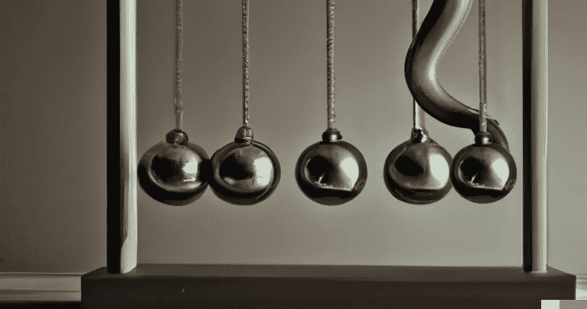
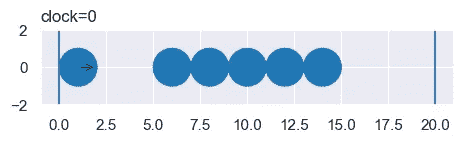
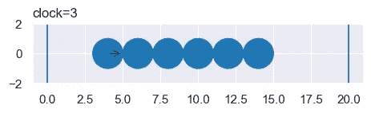
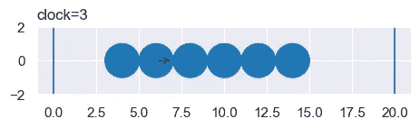
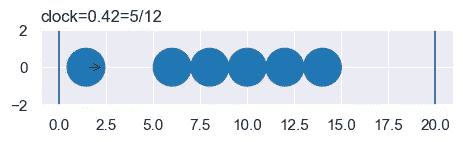
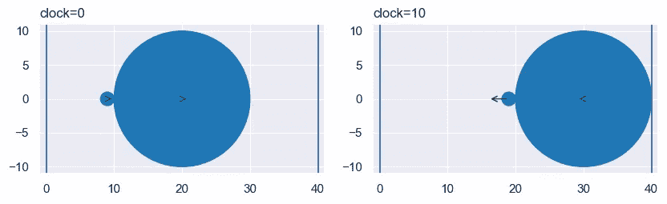

# Python 中完美的、无限精确的游戏物理学(第 1 部分)

> 原文：<https://towardsdatascience.com/perfect-infinite-precision-game-physics-in-python-part-1-698211c08d95>

## 绝对准确，编程“牛顿的摇篮”，“网球和篮球下降”，等等



牛顿的摇篮与 Python——来源:编辑[https://openai.com/dall-e-2/](https://openai.com/dall-e-2/)

这是向您展示如何用 Python 编写一个完美的物理引擎的四篇文章中的第一篇。这是我将所有物理、数学、甚至哲学转化为编程的宏伟目标中的一小步。通过这个项目，我们将发现惊喜，增加了解，并且(我希望)玩得开心。[所有代码都可以在 GitHub](https://github.com/CarlKCarlK/perfect-physics) 上获得。

我们将在许多方面限制引擎——例如，限制圆和线之间的牛顿碰撞。然而，我们不会限制引擎的准确性。它将用精确的表达式表示所有时间、位置和速度，如`8*sqrt(3)/3`。换句话说，它避免了所有的数值近似。

结果将是完美的模拟，例如，牛顿的摇篮玩具。(要重放/暂停视频，请按左下角的按钮。声音是有帮助的。)

常规牛顿摇篮(6 视频秒/66 模拟单位)

绝对精确的物理引擎有什么用？除了其他方面，它可以提高我们对物质世界的理解。在本文(第 1 部分)中，我们将看到这些新的发现:

*   **网球速度限制** —在一个流行的物理演示中，你用篮球丢下一个网球。网球弹起的速度比落下的速度快得多。快了多少？我们会看到“上升”速度永远不会超过“下降”速度的三倍。即使我们把篮球做得无限大，这也是成立的。
*   良好的振动——想象一个移动的网球被困在一个篮球和一堵墙之间。在两帧视频之间的短暂时间里，网球可以弹跳 80 次。使用近似的引擎可能会错过一些反弹。我们的引擎计算每一个。

同样，在下一篇文章中([第二部分](https://medium.com/towards-data-science/perfect-infinite-precision-game-physics-in-python-part-2-360cc445a197)):

*   **台球破裂** —即使有无限的精确度，台球破裂实际上也无法逆转。我们会看到，即使我们去除了“蝴蝶效应”和量子不确定性，世界仍然是随机的和不确定的。

我们完美的物理引擎的缺点是速度。对于大多数模拟来说，随着时间的推移，时间、位置和速度的表达式变得越来越复杂。在你可以在[第二部](https://medium.com/towards-data-science/perfect-infinite-precision-game-physics-in-python-part-2-360cc445a197)中看到的台球世界中，这将我们的模拟限制在 20 个左右的“事件”。(我们将在后面定义“事件”。)能不能提高速度？只会一点点。这将是[第四部](/perfect-infinite-precision-game-physics-in-python-part-4-9cdd609b3e6c#19f5-510d38fe7d32)的主题。

## *制造引擎*

假设我们已经有 Python 函数用于:

*   给定世界上任意两个(可能移动的)物体，返回它们刚好接触的准确时间跨度。答案可能是“永远不会”。
*   给定任意两个碰撞的物体，碰撞将如何改变它们的速度和方向？

我们将在第 3 部分中看到如何创建这样的函数。现在，考虑如何将这些功能变成一个完美的物理引擎。

让我们通过观察三个物理世界来研究一种方法，从牛顿的摇篮开始。

## 牛顿的摇篮

我们引擎的总体想法是找到世界上下一次碰撞的准确时间。向前移动到那个时间。调整碰撞物体的速度。重复一遍。

对于牛顿的摇篮，我们先设置圆圈和墙壁。

```
from perfect_physics import World, Circle, Wall

circle_list = [Circle(x=1, y=0, r=1, vx=1, vy=0, m=1)]
for i in range(1, 6):
    circle_list.append(Circle(x=i * 2 + 4, y=0, r=1, vx=0, vy=0, m=1))
wall_list = [Wall(x0=0, y0=0, x1=0, y1=1), Wall(x0=20, y0=0, x1=20, y1=1)]
world = World(circle_list, wall_list, xlim=(-1, 21), ylim=(-2, 2))
world.show()
```



接下来:

*   **在每对物体之间，找出它们碰撞的确切时间跨度(如果有的话)。**忽略其他配对和碰撞。-在这种情况下，第一个(移动的)圆将在时间跨度 3 处与第二个圆碰撞。忽略那次碰撞，它还会在时间跨度 5 处与第三个圆发生碰撞，以此类推。它将在时间跨度 18 处与远壁碰撞。
*   **找出第一次碰撞的时间跨度，并准确地将世界时钟调快。**在这种情况下，3。



*   **调整这些碰撞中所有物体的速度。**如牛顿摇篮所料，第一个圆静止不动，第二个圆开始移动。



*   **根据需要重复。**在本例中，第二个和第三个球将在时间跨度 0 内碰撞。这个视频展示了一个接一个的事件。(“事件”是将时间向前移动到碰撞或根据碰撞调整速度)

牛顿摇篮事件(35 视频秒/16 模拟单元)

为了将这些事件转换成常规视频，我们需要以规则的间隔生成帧，例如，每 1/24 秒。第一帧将显示 0 点的世界。玩了几个选项后，我决定每个模拟时间单位要有 10 秒的视频。因此，第二帧将用于时钟 10/24(也称为 5/12)。我们知道在时钟 3 之前没有碰撞，所以我们可以不考虑碰撞只移动圆。它的位置将是精确的。



一般来说，对于每一帧，我们:

*   找出该帧的模拟时钟值。
*   找出该时钟值之前的冲突事件。
*   从前面碰撞的世界开始，将圆移动到帧的时钟值。(根据设计，在移动过程中，圆圈不会与任何东西发生碰撞。)

所有的位置和时间都是精确的。文章开头的视频展示了结果。

## 圆形和三角形

我声称时间和位置都是准确的，但是你相信我吗？这是通过一个三角形内接的圆得到的一些证据。首先，这是显示事件的视频。可以看到时钟设置为`8*sqrt(3)/3`这样的表达式。

三角形事件内接的圆(31 视频秒/48 模拟单位)

这是三角形中圆圈的常规视频:

三角形内接的规则圆(26 视频秒/250 模拟单位)

在这种情况下，模拟陷入一种模式。没有无限的精度，模式可能会被遗漏。

## 网球和篮球下落

让我们再看一个物理世界，看看无限精度的另一个优势。这个世界包括一个网球和篮球以速度 1 向一面墙移动。篮球的质量是网球的 1000 倍。(我们的世界没有重力。)

```
from perfect_physics import World, Circle, Wall

big_radius = 10
world_width = 40
folder = root / f"part1/two_size{big_radius}"

big = Circle(x=world_width // 2, y=0, r=big_radius, vx=1, vy=0, m=big_radius**3)
little = Circle(x=big.x - big_radius - 1, y=0, r=1, vx=1, vy=0, m=1)
circle_list = [big, little]
wall_list = [Wall(x0=0, y0=0, x1=0, y1=1), Wall(x0=world_width, y0=0, x1=world_width, y1=1)]
world = World(circle_list, wall_list, xlim=(-1, world_width + 1), ylim=(-big_radius - 1, big_radius + 1))
world.run_in_place(2, show=True)
print([circle.vx for circle in world.circle_list])
```

在 10 点整，球从右边的墙上弹开。网球的速度从 1 到 2999/1001，而篮球稍微慢了一点，到 997/1001。



不出所料(如果你已经在物理世界尝试过这个)，网球加速了。然而，令我惊讶的是，它只快了三倍。

让我们暂时跳过，使用我们将在[第 3 部分](https://medium.com/towards-data-science/perfect-infinite-precision-game-physics-in-python-part-3-9ea9043e3969)中开发的工具。这段 Python 代码展示了质量无限大的篮球对网球的影响。网球进去的速度是 1，出来的速度正好是 3。

```
from sympy import limit, simplify, oo
from perfect_physics import load
cc_velocity_solution = load("data/cc_velocity_solution.sympy")
a_vx, a_vy, b_vx, b_vy  = cc_velocity_solution.subs([("a_x", 10), ("a_y", 0), ("a_r", 10), ("a_vx", -1), ("a_vy", 0),
                            ("b_x", -1), ("b_y", 0), ("b_r", 1), ("b_vx", 1), ("b_vy", 0), ("b_m", 1)])
print(simplify(b_vx))
limit(b_vx, "a_m", oo)
# prints (1 - 3*a_m)/(a_m + 1)
# returns -3
```

如果像我一样，你期待网球加速到无穷大，那么像我一样，你从这个物理引擎中学到了一些真实世界的物理知识。

当我让发动机运转更长时间时，它让我更加吃惊。看看在视频时间 20 秒(模拟时间 200)发生了什么:

常规网球和篮球投掷(39 视频秒/386 模拟单位)

篮球挤压网球。这导致网球在单个视频帧中来回反弹超过 80 次。网球的速度超过了 31 英里。在视频的音频轨道上，网球的振动产生了超过 2000 Hz(节拍/秒)的音调。

如果不是精确计算，我们只是每帧采样一次，我们将错过(或误算)这一快速动作。

## 总结第 1 部分

有用！我们有一个完美的物理引擎。我们已经把一点物理变成了程序。

我们假设我们从两个 Python 函数开始，这两个函数告诉我们——对于任何一对对象——两件事:1)直到它们下一次碰撞(如果有的话)的时间，以及 2)碰撞对它们速度的影响。我们看到了如何通过重复将这两个功能转变为完美的物理引擎:在时间上向前移动，直到下一次碰撞，并调整碰撞中涉及的所有对象的速度。

我们通过查找视频帧之前的碰撞来创建视频，然后将时间向前移动(不用担心碰撞)到该帧。

牛顿的摇篮，第一个世界，表现如预期。第二个世界，三角形内接的圆，使用`8*sqrt(3)/3`等表示时间的表达式等。，发现了一个规律。网球篮球下落揭示了网球速度的一个令我吃惊的极限。此外，它产生的反弹比不太完美的方法所能计算的还要快。

下一篇文章，[第二部分](https://medium.com/towards-data-science/perfect-infinite-precision-game-physics-in-python-part-2-360cc445a197)，模拟了一次台球休息，带来了令我惊讶的哲学结果。接下来，在第三部分中，我们将看到如何让计算机创建这两个启动函数。最后，在第 4 部分的[中，我们将加速引擎一点(但还不够)并讨论局限性。](/perfect-infinite-precision-game-physics-in-python-part-4-9cdd609b3e6c#19f5-510d38fe7d32)

如果你有想让我运行的模拟的想法，请发给我。它们可能成为第五部分的基础。

你可以从[CarlKCarlK/perfect-physics(github.com)](https://github.com/CarlKCarlK/perfect-physics)下载这段代码。让我知道如果有兴趣，我会创建一个更好的安装程序。

请跟随[卡尔·m·卡迪— Medium](https://medium.com/@carlmkadie) 获取后续零件的通知。所有部分都将免费阅读。最后，在 YouTube 上，我有更老的(近似的)[物理模拟](https://www.youtube.com/playlist?list=PLyBBVRUm1CyScgmzqpLGiKqwM-BxaiCnE)和一些[试图幽默的自然视频](https://www.youtube.com/playlist?list=PLyBBVRUm1CyRr8tgjNdarj7cq55YFHhbf)。