# Python 中完美的、无限精确的游戏物理学(第 3 部分)

> 原文：<https://towardsdatascience.com/perfect-infinite-precision-game-physics-in-python-part-3-9ea9043e3969>

## 使用 Python SymPy 将数学和物理转化为编程


一个平衡数学方程的 Python 来源:[https://openai.com/dall-e-2/](https://openai.com/dall-e-2/)

> 这是向您展示如何用 Python 编写一个完美的物理引擎的四篇文章中的第三篇。这是我将所有物理、数学、甚至哲学转化为编程的宏伟目标中的一小步。[所有代码都可以在 GitHub](https://github.com/CarlKCarlK/perfect-physics) 上获得。

这篇文章是关于让计算机为我们做数学。不仅仅是数值计算，还有代数和微积分相关的操作。这很有用，因为:

*   我——也许还有你——不记得我高中和大学的所有数学知识了。
*   在学校，老师只给我们能解决的问题。我想解决我解决不了的问题。

回想一下，在本系列的[第 1 部分](/perfect-infinite-precision-game-physics-in-python-part-1-698211c08d95)和[第 2 部分](https://medium.com/towards-data-science/perfect-infinite-precision-game-physics-in-python-part-2-360cc445a197)中，我们开发了顶级的完美物理引擎。它使用像`175–9*sqrt(3)/2`这样的表达式来精确地表示时间、位置和速度，也就是说，没有近似值。我们将该引擎应用于牛顿的摇篮、一个网球和篮球下落以及一次台球休息。这些模拟产生了令我惊讶的关于物理甚至哲学的发现。

在第三部分中，我们将使用计算机从基本物理定律中推导出所需的表达式。我们将分五步完成这项工作:

1.  模拟两个运动的圆圈。使用 SymPy 精确地找到两个移动的圆何时“刚好接触”。理解为什么 SymPy 返回多个答案。
2.  模拟一个圆和一面墙。找到他们接触的时间。加一个关于角度的“秘密”第六方程(但不要用角度)。
3.  尝试用动量和能量守恒来模拟圈与圈之间的碰撞。你不能。加一个关于角度的“秘密”第四方程(但不要用角度)。
4.  假设墙的质量无限大。从墙上反弹回来的圆违反了动量守恒。用限制来解决这个问题。
5.  两个物体可以相互接触，也可以相互远离。用极限来找这些。将它们从碰撞对象列表中移除。

我们从两个圆圈开始。

# 第一步:模拟两个移动的圆圈。使用 SymPy 精确地找到两个移动的圆何时“刚好接触”。理解为什么 SymPy 返回多个答案。

我们将把世界建模为在无限二维平面上运动的圆圈。圆圈匀速运动，直到它们碰撞。圆圈可能会相互碰撞或撞到墙上。墙是(无限长的)线。

我们需要回答的第一个问题是，两个移动的圆何时(如果有的话)会开始接触。为了回答这个问题，我们将设计一组方程式。然后我们会让计算机解方程并给我们答案。

为了设计我们的第一个方程，考虑两个圆， *a* 和 *b* 。每个都有一个位置( *x* ， *y* )，一个速度( *vx* ， *vy* )，一个半径， *r* 。你能预测一个圆在任意时间 *t 的未来位置( *x '，y'* )吗？*


我们的第一个等式表示圆 *a* 在时间 *t* 的 *x* 位置是其当前 *x* 位置加上其 *vx* 速度乘以时间*t*的数学表达式:

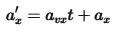

等式 2 将告诉我们圆圈 *a* 在未来的 *y* 位置。等式 3 和 4 会告诉我们 *b* 的 *x* 和 *y* 的未来位置。

作为将数学转化为编程的第一步，我们将用 Python 的 [**SymPy** 包](https://www.sympy.org/en/index.html)写出这四个方程。SymPy 是一个[计算机代数系统](https://en.wikipedia.org/wiki/Computer_algebra_system)，类似于 Mathematica 和 Maple。然而，与这些系统不同，SymPy 是免费的，可以在 Python 中获得。

> 旁白#1:不要混淆 S **y** mPy(一个用于符号数学的 Python 包)和 S **i** mPy(一个用于模拟的 Python 包)。
> 
> 旁白#2:计算机代数系统将表达式表示为嵌套的计算机对象。这种“符号”表示使一些事情对计算机来说变得容易——例如，处理分数或对其他表达式求导。即使有了符号表示，一些任务对计算机来说仍然是困难的——例如，求积分或解非线性方程组。这与人们容易和困难的事情相一致。我喜欢使用计算机代数系统，因为在大多数任务中，无论简单还是困难，它们都比我强。

以下是我们在 Python & SymPy 中的四个方程:

```
from sympy import symbols, Eq

# define symbols
t = symbols("t")
a_x, a_y, a_vx, a_vy, a_r, aprime_x, aprime_y = symbols("a_x, a_y, a_vx, a_vy, a_r, a'_x, a'_y")
b_x, b_y, b_vx, b_vy, b_r, bprime_x, bprime_y = symbols("b_x, b_y, b_vx, b_vy, b_r, b'_x, b'_y")

# define equations
eq1 = Eq(aprime_x, a_x + a_vx * t)
eq2 = Eq(aprime_y, a_y + a_vy * t)
eq3 = Eq(bprime_x, b_x + b_vx * t)
eq4 = Eq(bprime_y, b_y + b_vy * t)p
```

我们仍然需要设计两个圆“刚好接触”的概念。我们用第五个方程来计算。它说，当两个圆的圆心距离等于半径之和时，这两个圆刚好接触。(我们通过对两边求平方来避免使用`sqrt`函数。)在数学符号中:

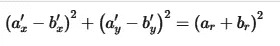

在 Python 和 SymPy 中:

```
eq5 = Eq((aprime_x - bprime_x) ** 2 + (aprime_y - bprime_y) ** 2,
         (a_r + b_r)**2)
```

如果我们给前四个方程关于两个圆和一个时间的信息，它们会告诉我们当时圆的位置。方程五可以告诉我们，两个圆在那个时候刚好接触。

换句话说，给定一个时间，这些方程可以回答“这两个圆在时间 *t* 刚好接触吗？”但这不是我们想要的。我们想把里面翻出来，回答这个问题“这两个圆什么时候会接触？”

要回答感兴趣的问题，数学告诉我们只要“求解”方程。可悲的是，套用芭比的话，“数学(求解包含正方形的方程)很难。”幸运的是，数学对 SymPy 来说并不难:

```
from sympy import nonlinsolve
from perfectphysics import savecc_all_solutions = nonlinsolve([eq1, eq2, eq3, eq4, eq5], t, aprime_x, aprime_y, bprime_x, bprime_y)
cc_time_solutions = [t for t, aprime_x, ap_y, bp_x, bp_y in cc_all_solutions]
save(cc_time_solutions, "cc_time_solutions.sympy")
cc_time_solutions[0]
```

在大约 30 秒的时间里，SymPy 找到了两个一般性的，象征性的解决方案。这里只是第一个解决方案的一点，`cc_time_solutions[0]`用数学符号表示:


在我们看来这很复杂。然而，这对计算机来说并不复杂。

为什么有两种解决方案？评估它们可以帮助我们理解。考虑这种情况:两个半径为 1 的圆，蓝球以速度 2 移动:

```
from perfect_physics import Circle, plot
a = Circle(x=0,y=0,r=1,vx=2,vy=0)
b = Circle(x=4,y=0,r=1,vx=0,vy=0)
plot([a, b], colors=["tab:blue","tab:red"], xlim=(-2,8), ylim=(-2,2), figsize=(4,2), font_scale=1)
```

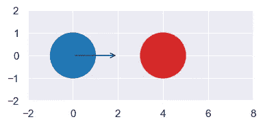

我们使用 SymPy `.subs`(替换)方法找到圆 a 和`b`刚好接触的两个时间。我们也在这些时候画出圆圈。

```
from perfect_physics import load
cc_time_solutions = load("cc_time_solutions.sympy")
times = [time_solution.subs([("a_x", a.x), ("a_y", a.y), ("a_r", a.r), ("a_vx", a.vx), ("a_vy", a.vy),
                             ("b_x", b.x), ("b_y", b.y), ("b_r", b.r), ("b_vx", b.vx), ("b_vy", b.vy)])
         for time_solution in cc_time_solutions]
print(times)
for time in times:
    plot([a.tick_clone(time), b.tick_clone(time)], clock=time,
    colors=["tab:blue","tab:red"], xlim=(-2,8), ylim=(-2,2), figsize=(4,2), font_scale=1)
```

Python 打印`[3, 1]`并绘图:

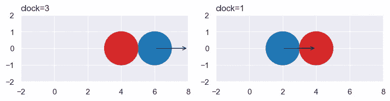

换句话说，在时间 3(忽略碰撞)，蓝色圆圈将刚好接触红色圆圈。同样，在时间 1。如果我们想知道下一次碰撞之前的时间，我们只需要取较小的时间，对吗？

可悲的是，更小的时间可能也不对。考虑这种情况，其中圆圈彼此远离。他们什么时候会触碰？

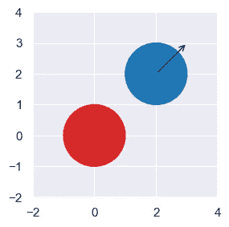

```
a = Circle(x=2,y=2,r=1,vx=1,vy=1)
b = Circle(x=0,y=0,r=1,vx=0,vy=0)
plot([a, b], colors=["tab:blue","tab:red"], xlim=(-2,4), ylim=(-2,4), figsize=(3,3), font_scale=1)
times = [time_solution.subs([("a_x", a.x), ("a_y", a.y), ("a_r", a.r), ("a_vx", a.vx), ("a_vy", a.vy),
                             ("b_x", b.x), ("b_y", b.y), ("b_r", b.r), ("b_vx", b.vx), ("b_vy", b.vy)])
         for time_solution in cc_time_solutions]
print(times)
```

Python 回答`[-2 + sqrt(2), -2 — sqrt(2)]`。(注意，它的回答是无限精确的，而不是像`[-0.59, -3.41]`这样的近似值)。这些时间是负的，意味着圆圈将只接触过去。我们不关心过去的碰撞，所以我们忽略负时间。

总结一下:答案会给我们两次，我们保留最小的，非负的时间，对吗？没有。我们还必须提防另外两种复杂情况。第一，当圆圈静止或以相同速度一起运动时，时间将是`[nan, nan]`，即浮点“不是一个数”。

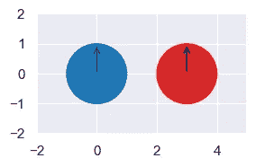

第二，当圆圈移动时，它们的路径永远不会相交，时间将类似于`[2 + sqrt(2)*I, 2 — sqrt(2)*I]`，包含[虚数](https://en.wikipedia.org/wiki/Imaginary_number)。

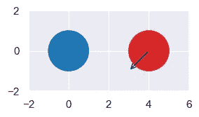

最后，我们的程序是用 SymPy 得到两次，然后:

*   过滤掉包含虚数的答案
*   筛选出`nan`个答案
*   过滤掉否定的答案
*   保留最小的剩余答案(如果有)

这个结果会是我们期望的下一次碰撞的无限精确时间吗？差不多了。当它说它们将在时间零点接触时，这两个圆可能会彼此远离。这种情况不算碰撞。我们将在步骤 5 中研究这个问题。

注意，如果我们可以处理两个圆，我们可以处理任意数量的圆。我们只需要查看所有的圆对，并返回最小的时间(如果有的话)。

我认为我们在这一步所做的非常酷。我们只需要设计出五个简单的方程式，关于圆圈在时间中前进并检测距离。Python SymPy 包随后为我们做了困难的计算。它创建了一个函数，精确地告诉我们*何时(如果有的话)圆会接触。*

在第三步中，我们将看到触摸如何改变每个圆圈的速度。然而，接下来，让我们与 SymPy 合作，找出圆何时会碰壁。

# 第二步:建立一个圆形和一面墙的模型。找到他们接触的时间。加一个关于角度的“秘密”第六方程(但不要用角度)。

假设我们有圆 *a* 和墙 *w* 。和之前一样，圆有位置( *x* ， *y* )，速度( *vx* ， *vy* )，半径， *r* 。这堵墙是一条(无限长的)线。我们沿着墙指定任意两个不同的点， *(x0，y0)* 和 *(x1，y1)* 。

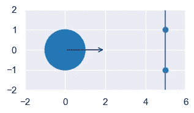

为了找到圆和墙刚好接触的时间，我们再次模拟圆在时间 *t* 的位置(*x’，y’*)。

```
from sympy import symbols, Eq
t = symbols("t")
a_x, a_y, a_vx, a_vy, a_r, aprime_x, aprime_y = symbols("a_x, a_y, a_vx, a_vy, a_r, a'_x, a'_y")
eq1 = Eq(aprime_x, a_x + a_vx * t)
eq2 = Eq(aprime_y, a_y + a_vy * t)
```

接下来，我们在墙上的圆和墙接触的地方建模。称此点为 *(x2，y2)。*在壁定义点 *(x0，y0)* 和 *(x1，y1)* 之间会有一个比例 *p* 。例如，如果 *p* 是 1/2，则 *(x2，y2)* 是两个壁定义点的中点。此外，通过让 *p* 的范围小于 0 且大于 1，我们可以将 *(x2，y2)* 移动到沿墙的任何位置:

```
p = symbols("p")
x0, y0, x1, y1, x2, y2 = symbols("x_0, y_0, x_1, y_1, x_2, y_2")
eq3 = Eq(x2, x0 + (x1-x0) * p)
eq4 = Eq(y2, y0 + (y1-y0) * p)
```

当圆的中心点*(x’，y’)*与其接触的墙壁上的位置 *(x2，y2)* 之间的距离等于圆的半径时，圆将接触墙壁。换句话说:

```
eq5 = Eq((x2-aprime_x)**2 + (y2-aprime_y)**2, a_r**2)
```

然而，当我们要求 SymPy 求解并应用这五个方程时，它给出了这样奇怪的解:

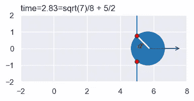

SymPy 认为这解决了我们的方程，因为圆的中心*离墙上的某个点*有一个半径(两个红点)。然而，这不是我们想要的解决方案，因为圆与墙重叠。

第六个方程可以解决这个问题。要求墙壁和白线之间的角度α为 90 度(见上图)。我们可以用*斜率*来说这个，不需要明确的角度或者三角函数。墙的坡度是`(y1-y0)/(x1-x0)`。图中白线的斜率为`(aprime_y-y2)/(aprime_x-x2)`。当一条直线的斜率是另一条直线的负倒数时，两条直线相交于 90 度。在 SymPy 中，我们说:

```
slope_0 = (y1-y0)/(x1-x0)
slope_1 = (aprime_y-y2)/(aprime_x-x2)
eq6 = Eq(slope_0, -1/slope_1)
```

我们要求 SymPy 像这样为我们解决这个问题:

```
from sympy import nonlinsolve
from perfect_physics import save
cw_all_solutions = nonlinsolve([eq1, eq2, eq3, eq4, eq5, eq6], t, p, aprime_x, aprime_y, x2, y2)
cw_time_solutions = [t for t, p, aprime_x, aprime_y, x2, y2 in cw_all_solutions]
save(cw_time_solutions, "cw_time_solutions.sympy")
```

工作 7 分钟后(比我强吧！)，它返回两个解。下面是用数学符号表示的第一个解(比上次更易读):


当我们将这些解决方案应用于上述情况时，Python 返回时间跨度`[2, 3]`:

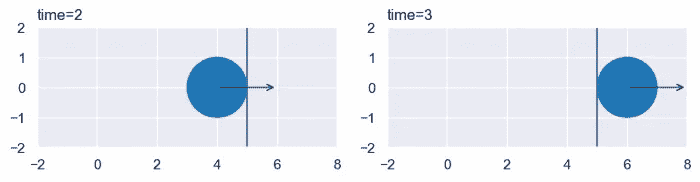

*先不说:解表达式看起来像是来自* [*二次方程*](https://en.wikipedia.org/wiki/Quadratic_equation) *的东西。这表明一个优秀的应用数学家可以手动解决这个问题。对他们有好处。然而，我很乐意通过计算机解决这个问题。*

我们将应用与步骤 1 中相同的规则，过滤掉负面的、复杂的、`nan`，并保留最小的时间(如果有的话)。当一个圆圈蹭到一堵墙时，我们可能会遇到一个新问题:

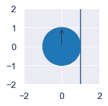

这个世界将会回归`[nan, zoo]`。其中`zoo`是复数无穷大的 SymPy 符号。我们会把它过滤掉，因为我们不关心掠射碰撞。

让我们将这个结果添加到步骤 1 的结果中。我们现在可以找到一个圆与一个圆或一面墙之间下一次“接触”的精确的、无限精确的时间。

接下来，让我们弄清楚圆圈-圆圈触摸是如何改变圆圈的速度和方向的。

# 第三步:尝试用动量和能量守恒来模拟圈与圈之间的碰撞。你不能。加一个关于角度的“秘密”第四方程(但不要用角度)。

我第一次尝试模拟两个圆之间的碰撞时，我以为我只需要两条定律:动量守恒和能量守恒。我错了。我们来看看为什么。

能量守恒说，碰撞前后的能量应该是一样的。对于我们的世界，唯一的能量类型是动能，所以 *E= mv /2* ，其中 *m* 是质量，而 *v* 是速度。我们假设碰撞是弹性的，也就是说，没有能量转化为热量、声音等。在数学符号中，这变成:

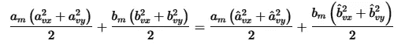

其中圆 *a* 的质量为 *aₘ* ，碰撞前的速度为*(aᵥᵧaᵥₓ)*，碰撞后的速度为*(âᵥᵧâᵥₓ)*。圆圈 *b* 也是如此。

在 SymPy 中，我们写道:

```
from sympy import symbols, Eq
a_x, a_y, a_vx, a_vy, a_r, a_m, ahat_vx, ahat_vy = symbols("a_x, a_y, a_vx, a_vy, a_r, a_m, ahat_vx, ahat_vy")
b_x, b_y, b_vx, b_vy, b_r, b_m, bhat_vx, bhat_vy = symbols("b_x, b_y, b_vx, b_vy, b_r, b_m, bhat_vx, bhat_vy")
energy_before = a_m * (a_vx**2 + a_vy**2) / 2 + b_m * (b_vx**2 + b_vy**2) / 2
energy_after = a_m * (ahat_vx**2 + ahat_vy**2) / 2 + b_m * (bhat_vx**2 + bhat_vy**2) / 2
eq1 = Eq(energy_before, energy_after)
```

动量守恒给了我们另外两个方程，一个是关于 *x* 维度的，一个是关于 *y* 维度的。动量是质量乘以速度，所以:

```
eq2 = Eq(a_m * a_vx + b_m * b_vx, a_m * ahat_vx + b_m * bhat_vx)
eq3 = Eq(a_m * a_vy + b_m * b_vy, a_m * ahat_vy + b_m * bhat_vy)
```

我们现在有三个方程，希望 SymPy 给我们四个未知数的解，即碰撞后速度: *âᵥₓ，âᵥᵧ，b* ̂ *ᵥₓ，b* ̂ *ᵥᵧ.*那不行。我们需要和未知数一样多的方程。

我第一次注意到这个丢失的等式时，它难倒了我。我想不出任何其他适用的物理定律。我终于想通了第四个缺失的“定律”:

> *当圆碰撞时，它们的速度与碰撞方向成 90°不变。*

考虑这种情况:

```
from perfect_physics import Circle, plot
a = Circle(x=0, y=0, r=1, vx=1, vy=2, m=1)
b = Circle(x=2, y=0, r=1, vx=0, vy=0, m=1)
plot([a, b], colors=["tab:red", "tab:blue"], xlim=(-2, 4), ylim=(-2, 2), figsize=(4, 2), font_scale=1)
```

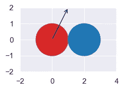

“撞击方向”是从一个中心到另一个中心的方向，这里是水平方向。圆 a 与水平面成 90°的速度为 *aᵥᵧ* 为 2。所以，我们期望这个方向的后碰撞速度， *âᵥᵧ* 也是 2。

但是如果圆心不水平也不垂直呢？考虑这种情况:

```
from sympy import sqrt
from perfect_physics import Circle, plot
a = Circle(x=0, y=0, r=1, vx=1, vy=0, m=1)
b = Circle(x=sqrt(2), y=sqrt(2), r=1, vx=0, vy=0, m=1)
plot([a, b], colors=["tab:red", "tab:blue"], xlim=(-2, 4), ylim=(-2, 3), figsize=(4, 2), font_scale=1)
```

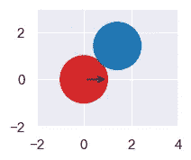

我们可以用正弦和余弦函数从撞击方向求出速度 90。然而，用单位向量来做可以让我们避免引入这些函数。我们想要一个向量 *< ux，uv >* ，它有一个单位长，并且从圆心之间的直线延伸 90 度。我们可以通过除以 *d* 得到长度为 1，即中心之间的距离。我们可以用第二步中使用的-1/斜率得到我们想要的方向。具体来说，这表示撞击方向的速度 90 不变:

```
from sympy import sqrt
d = sqrt((b_x-a_x)**2 + (b_y-a_y)**2)
ux = -(b_y-a_y)/d
uy = (b_x-a_x)/d
eq4 = Eq((b_vx - a_vx) * ux + (b_vy - a_vy) * uy, (bhat_vx-ahat_vx) * ux + (bhat_vy-ahat_vy) * uy)
```

我们已经很好地解决了我们的方程:

```
from sympy import nonlinsolve
from perfect_physics import save
cc_velocity_solutions = nonlinsolve([eq1, eq2, eq3, eq4], ahat_vx, ahat_vy, bhat_vx, bhat_vy)
cc_velocity_solutions = list(cc_velocity_solutions)
save(cc_velocity_solutions[1], "cc_velocity_solution.sympy")
```

2 或 3 分钟后，它返回两个解决方案。令人惊讶的是，第一个解说后速度等于前速度。换句话说，这是当两个圈互相错过时的解决方案。

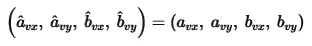

第二个解，我们关心的解，是长的。这里就不展示了。

让我们用上面的两个例子来解决这个问题。在第一个例子中，之前的速度是`a.vx=1, a.vy=2, b.vx=0, b.vy=0`。他们成为`a.vx=0, a.vy=2, b.vx=1, b.vy=0`之后。

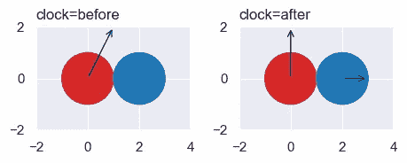

在第二个例子中，之前的速度是`a.vx=1, a.vy=0, b.vx=0, b.vy=0`。他们成为`a.vx=1/2, a.vy=-1/2, b.vx=1/2, b.vy=1/2`后。

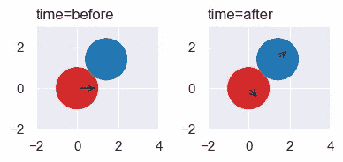

酷！所以，我们现在可以预测圆是如何相互弹开的。我们以后会看到，这个解适用于不同质量和不同半径的圆。

接下来，我们试着将这些守恒定律应用到从墙上反弹回来的圆上。令人惊讶的是，反弹似乎违反了“动量守恒”。

# 第四步:假设墙的质量无限大。从墙上反弹回来的圆违反了动量守恒。用限制来解决这个问题。

对于一个从墙上弹回的球，我们可以作弊。你可能还记得学校里的答案，那就是“入射角等于反射角”:

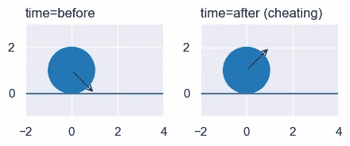

但是这怎么可能是对的呢？反弹前圆的*y*-动量(即质量乘以*y*-速度)为-1。反弹后是 1。这违反了动量守恒。包括墙的动量没有帮助，因为它的质量是无限的，它的速度是 0，给了我们一个未定义的动量。

也许我们可以把墙建模成大圆，然后使用第三步的解决方案。这里我们给大圆半径 20，质量 1000。

```
a = Circle(x=0, y=1, r=1, vx=1, vy=-1, m=1)
b = Circle(x=0, y=-20, r=20, vx=0, vy=0, m=1000)
```

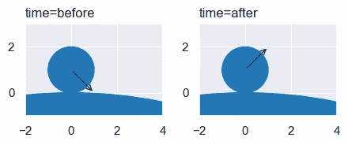

这几乎行得通。后速度为`a.vx=1, a.vy=999/1001, b.vx=0, b.vy=-2/1001`。如果我们把无穷大作为大圆的质量和/或半径。可悲的是，结果是未定义的值。

让我们看看能否从守恒定律入手，找到正确的答案。我们假设墙的质量有限，速度为 0。我们放入能量守恒(方程 1)，动量守恒(方程 2，方程 3)，圆周沿壁的相对速度不应该改变。

```
from sympy import symbols, Eq, sqrt
a_x, a_y, a_vx, a_vy, a_r, a_m, ahat_vx, ahat_vy = symbols("a_x, a_y, a_vx, a_vy, a_r, a_m, ahat_vx, ahat_vy")
w_x0, w_y0, w_x1, w_y1, w_m, what_vx, what_vy = symbols("w_x0, w_y0, w_x1, w_y1, w_m, what_vx, what_vy")
energy_before = a_m * (a_vx**2 + a_vy**2) / 2 + w_m * 0
energy_after = a_m * (ahat_vx**2 + ahat_vy**2) / 2 + w_m * (what_vx**2 + what_vy**2) / 2
eq1 = Eq(energy_before, energy_after)
eq2 = Eq(a_m * a_vx + w_m * 0, a_m * ahat_vx + w_m * what_vx)
eq3 = Eq(a_m * a_vy + w_m * 0, a_m * ahat_vy + w_m * what_vy)
d = sqrt((w_x1-w_x0)**2 + (w_y1-w_y0)**2)
ux = (w_x1-w_x0)/d
uy = (w_y1-w_y0)/d
eq4 = Eq(a_vx * ux + a_vy * uy, (ahat_vx-what_vx) * ux + (ahat_vy-what_vy) * uy)
```

我们再次应用`nonlinsolve`,得到一个没有命中(忽略)的结果和一个命中的结果。我们的下一步是新的。当墙的质量趋于无穷大时，我们用 SymPy 来取极限。

```
from sympy import nonlinsolve, limit, oo, Tuple
from perfect_physics import save
no_hit, cw_velocity_solution = nonlinsolve(
    [eq1, eq2, eq3, eq4], ahat_vx, ahat_vy, what_vx, what_vy
)
a_vx_limit, a_vy_limit, w_vx_limit, w_vy_limit = [
    limit(velocity, w_m, oo) for velocity in cw_velocity_solution
]
assert w_vx_limit == 0 and w_vy_limit == 0
cw_velocity_limits = Tuple(a_vx_limit, a_vy_limit)
save(cw_velocity_limits, "cw_velocity_limits.sympy")
```

结果是在`vx`和`vy`之后出现了圆圈和墙壁。正如所希望的，墙的速度为零。我们保存了圆的后速度公式。

当我们应用这个公式时，我们得到了“入射角等于反射角”的预期结果:

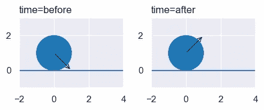

和

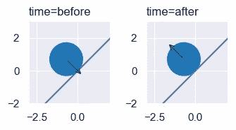

那么，我们现在准备好解决物理作业问题，创作动画，制作游戏了吗？不完全是。我忽略了一个问题:两个物体接触并不总是意味着它们在碰撞。我们接下来会看到这一点。

# 第五步:两个物体可以相互接触，也可以相互远离。用极限来找这些。将它们从碰撞对象列表中移除。

我们如何检测两个圆是否在相向运动？我原本以为我们可以只检查他们的相对速度。然而，在这两种情况下，红圈的相对速度是相同的。在第一种情况下，它们朝着彼此移动，而在第二种情况下，它们没有。

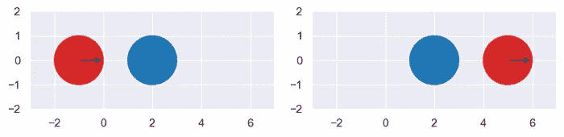

一个更好的方法是看这些中心是否越来越靠近。但是什么时候？他们开始时可能会靠得更近，但后来会彼此远离。我们可以问一下他们在零点是否越来越接近了吗？这是行不通的，因为在任何时刻，他们的距离都是不变的。

解决方法是再次使用限制。我们将测试在时间零点之后的瞬间，它们是否越来越近。

```
from sympy import symbols, limit, sqrt
from perfect_physics import save
a_x, a_y, a_vx, a_vy, b_x, b_y, b_vx, b_vy, t = symbols("a_x, a_y, a_vx, a_vy, b_x, b_y, b_vx, b_vy, t")
d0 = sqrt((a_x - b_x) ** 2 + (a_y - b_y) ** 2)
d1 = sqrt((a_x + t * a_vx - (b_x + t * b_vx)) ** 2 + (a_y + t * a_vy - (b_y + t * b_vy)) ** 2)
speed_toward = (d0 - d1) / t
instant_speed = limit(speed_toward, t, 0)
save(instant_speed, "instant_speed.sympy")
```

在上面的第一个示例中，应用结果公式返回 1。在第二个示例中，它返回-1。两种结果都在意料之中。

为了观察一个圆是否正在向一面墙移动，我们找到了 *(x₂，y₂)* ，圆的中心可能会碰到墙上的点。这需要四个可以用 SymPy `linsolve`求解的方程。然后，我们使用刚刚发现的`instant_speed`公式，来查看圆朝着或远离该点的速度:

```
from sympy import symbols, linsolve, Eq, simplify
from perfect_physics import load, save
a_x, a_y, a_vx, a_vy, t = symbols("a_x, a_y, a_vx, a_vy, t")
x0, y0, x1, y1, x2, y2, p = symbols("x_0, y_0, x_1, y_1, x_2, y_2, p")
eq1 = Eq(x2, a_x + a_vx * t)
eq2 = Eq(y2, a_y + a_vy * t)
eq3 = Eq(x2, x0 + (x1-x0) * p)
eq4 = Eq(y2, y0 + (y1-y0) * p)
x2_formula, y2_formula, _, _ = list(linsolve([eq1, eq2, eq3, eq4], (x2, y2, p, t)))[0]
instant_speed = load("instant_speed.sympy")
instant_speed_wall = simplify(instant_speed.subs({"b_x": x2_formula, "b_y": y2_formula, "b_vx": 0, "b_vy": 0}))
save(instant_speed_wall, "instant_speed_wall.sympy")
```

例如，在这种情况下，我们发现圆圈以速度`sqrt(5)`向墙移动。

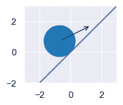

```
from sympy import sqrt
from perfect_physics import Circle, Wall, plot, load
a = Circle(x=-sqrt(2) / 2, y=sqrt(2) / 2, r=1, vx=2, vy=1)
w = Wall(x0=-1, y0=-1, x1=1, y1=1)
plot(circle_list=[a], wall_list=[w], xlim=(-3, 3), ylim=(-2, 3), figsize=(4, 2), font_scale=1)
instant_speed_wall = load("instant_speed_wall.sympy")
instant_speed_wall.subs({"a_x": a.x, "a_y": a.y, "a_vx": a.vx, "a_vy": a.vy,
                         "x_0": w.x0, "y_0": w.y0, "x_1": w.x1, "y_1": w.y1})
```

我们现在已经拥有了制造无限精确的物理引擎所需的一切。

# 总结第三部分

在这一部分中，我们已经看到了如何使用 Python SymPy 包来查找为圆形和墙壁的 2d 世界创建完美的物理引擎所需的低级表达式。我们找到了两个物体接触的时间表达式。当它们接触时，我们找到了它们新速度的表达式。

通过查看细节，我们看到:

*   工程方程相对容易，但手动求解非线性方程组会很困难。令人高兴的是，计算机为我们做了这项艰苦的工作。
*   能量和动量守恒不足以预测碰撞后的速度。我们需要第四个方程，说明碰撞产生的速度 90 不变。
*   我们的方程经常给出奇怪的答案。我们看到了`nan`，负时间跨度，复数，复数无穷的答案。我们解读这些奇怪的答案，然后处理它们。例如，负的时间跨度意味着碰撞发生在过去，因此可以忽略。
*   两次我们需要 90 度角。在这两种情况下，我们避免引入正弦、余弦等。通过使用斜率和单位向量。
*   曾经我们需要一个无限小的时间，曾经我们需要一个无限大的质量。在这两种情况下，SymPy `limit` 函数让我们使用我们需要的极端时间和质量。

我们现在已经创建了低级表达式，为高级层提供了基础。我们在 [Part 1](/perfect-infinite-precision-game-physics-in-python-part-1-698211c08d95) 和 [Part 2](https://medium.com/towards-data-science/perfect-infinite-precision-game-physics-in-python-part-2-360cc445a197) 中看到了高层。当我们把这两层放在一起，我们得到了一个完美的物理引擎。然而，这将是痛苦而缓慢的。在第 4 部分的[中，我们将加速引擎一点(但还不够)并讨论其他限制。](/perfect-infinite-precision-game-physics-in-python-part-4-9cdd609b3e6c#19f5-510d38fe7d32)

如果你有想让我运行的模拟的想法，请发给我。它们可能成为第五部分的基础。

你可以从[CarlKCarlK/perfect-physics(github.com)](https://github.com/CarlKCarlK/perfect-physics)下载这段代码。让我知道如果有兴趣，我会创建一个更好的安装程序。

跟随[卡尔·m·卡迪— Medium](https://medium.com/@carlmkadie) 获得下一部分的通知。所有部分都将免费阅读。最后，在 YouTube 上，我有旧的(近似的)[物理模拟](https://www.youtube.com/playlist?list=PLyBBVRUm1CyScgmzqpLGiKqwM-BxaiCnE)和一些[试图幽默的自然视频](https://www.youtube.com/playlist?list=PLyBBVRUm1CyRr8tgjNdarj7cq55YFHhbf)。