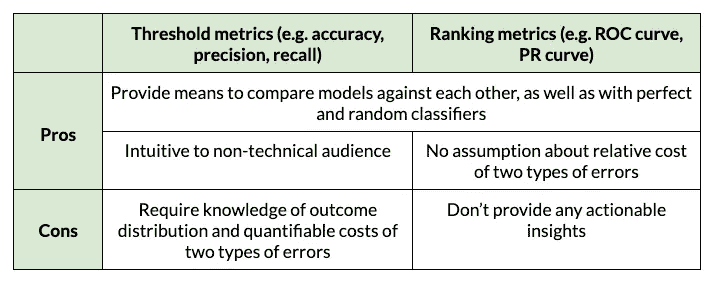
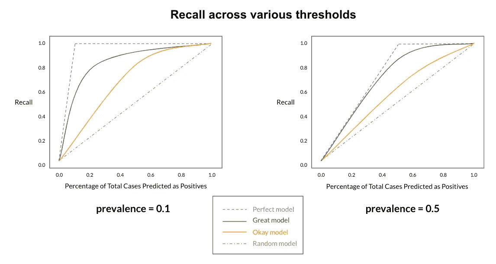
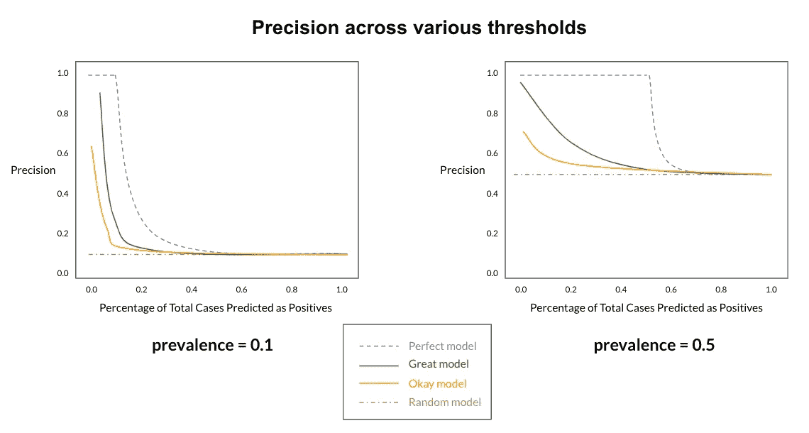
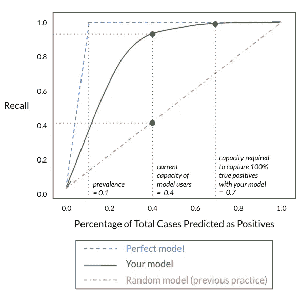
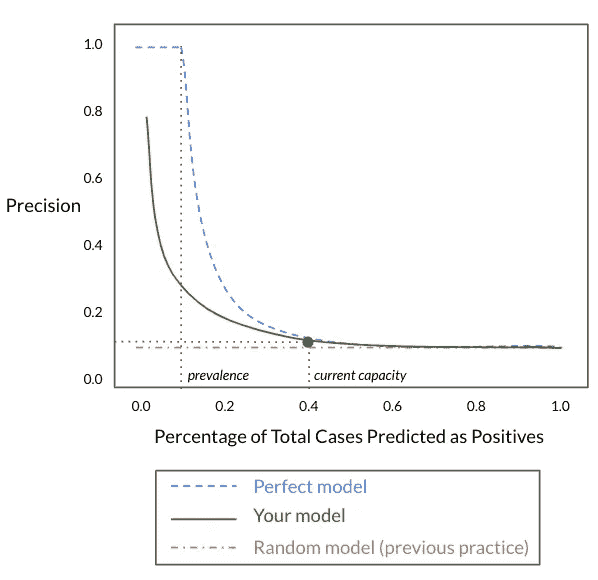

# 性能曲线:比 ROC/PRC 更直观，比阈值指标更少假设

> 原文：<https://towardsdatascience.com/performance-curve-more-intuitive-than-roc-prc-and-less-assumptive-than-threshold-metrics-391e777da566>

## 一种结合两者优点的二元分类器评价方法

杰森·古德曼在 [Unsplash](https://unsplash.com?utm_source=medium&utm_medium=referral) 上的照片

在二元分类的上下文中，有两个最常见的评估度量族:

*   阈值指标(例如:准确度、精确度、召回率、F 值)
*   排名指标(例如，接收机工作特性(ROC)曲线、精确度-召回率(PR)曲线)

# 阈值指标的问题

尽管阈值度量很直观，并且易于向非技术受众解释，但它们需要特定的阈值界限来区分积极类和消极类。为了确定这个截止值，我们需要知道:

(1)结果的等级分布(又称患病率):

很多时候，0.5 被用作默认的截止值，但是在结果发生率不正好为 50%的情况下，这是不合理的。

(2)两种错误分类的相对成本(也称为第一类和第二类错误)

*   第一类错误，即假阳性，发生在模型预测结果为阳性而实际结果为阴性的时候。例如:一名患者被诊断患有癌症，但他们并没有患病。
*   第二类错误，或假阴性，发生在模型预测结果为阴性而实际上为阳性的时候。银行交易被认为是正常的，但实际上是欺诈性的。

在这两种类型的误差之间总是有一个折衷。当第一类错误的危害大于第二类错误的危害时(例如，从招聘雇主的角度来看，一个糟糕的招聘的成本比没有招聘到合适的员工的成本更高)，我们希望提高截止阈值，以便在正面结果预测中非常精确。另一方面，当第二类错误的危害大于第一类错误时(例如，错过欺诈性交易的成本比审查虚假警报的额外时间更昂贵)，我们希望降低截止阈值，以扩大正面案例的范围。

为了选择正确的阈值，我们需要能够量化这两种类型的风险。

> 尽管我们可能对在特定用例中哪种错误类型比另一种更昂贵有一个大致的概念，但是这些危害在实践中很少是可以量化的。依靠单一的临界值，我们错误地传达了这两种风险可以并且已经被量化的信息。

# 排名指标的问题

与阈值度量不同，现有的排序度量(如 ROC 和 PR 曲线)没有对错误分类错误之间的相对成本做出任何假设。它们在可变阈值上评估分类器。但是，对于非技术受众来说，它们不够直观，并且不能提供任何可操作的见解。达到 90% AUROC 的预测模型的预期效用是什么？不清楚。

尽管阈值和排名指标各有利弊，但它们都有一个吸引人的特性:它们提供了简单的方法来比较多个模型，以及随机和完美的分类器。

图片作者。阈值和排名指标的利弊。

# 一种改进的二元分类器性能比较方法

有没有一种评估方法代表了两个世界的最佳，即不假设错误分类成本的知识，并提供可操作的见解？答案是肯定的！

> 主要思想是为预测为阳性的所有案例的不同百分比绘制感兴趣的任何阈值度量的值。

从本文开始，我们将把这种图表称为**性能曲线**。

## 如何阅读/绘制性能曲线？

对于每条性能曲线，X 轴在每个点显示预测为阳性的案例总数的百分比，假设所有案例都按照我们的模型预测得分的降序排序。这个百分比与区分阳性和阴性类别的截止阈值直接相关。具体来说，较低的阈值意味着预测为阳性的百分比较大，而较高的阈值意味着预测为阳性的百分比较小。虽然得出一个准确和适当的阈值是一项具有挑战性和非直观性的任务，但预测为阳性(即 X 轴上的一个点)的病例的最佳百分比应该被选择来比较模型，这可以由模型用户的操作能力来确定。这个想法在业务用例部分有进一步的解释。

另一方面，Y 轴代表您感兴趣的任何阈值度量。它可以是精确度、召回率、准确度、F1 分数或用户自定义的指标，取决于案例的排序，而不是实际的预测值(因此不需要阈值截止)。在本文中，我们使用精度和召回来演示这个概念，因为这是两个最常用的阈值指标。

## 随机模型和完美模型的性能曲线是什么样的？

召回:

*   一个完美的模型会给所有的真阳性案例分配最高分。因此，当模型评估前 x%的病例时，它找到所有阳性病例的 100%(即，达到回忆点= 1 ),其中 x%是阳性类别的发生率。
*   当随机模型完成对所有案例的评估时，它会达到 100%的标记(即 recall = 1)。

图片作者。回忆不同流行情况下的绩效曲线。

为了精确:

*   一个完美的模型将所有的真阳性放在排序列表的顶部，给我们 1 的精度，直到我们用完所有的阳性案例。
*   随机模型的精度保持在与样本人群中阳性类的流行率相似的水平。

图片作者。不同流行情况下的精确性能曲线。

## 让我们看一个业务用例！

一家保险公司一直在定期开展调查工作，以发现欺诈性保单。到目前为止，他们观察到的欺诈率大约为 0.1%。他们的调查员每周从 25 个新案例中随机抽取 10 个案例进行审计。然而，该公司很快意识到这种做法是次优的，没有效率。他们要求您建立一个 ML 模型来协助他们的调查团队。

***问题 1:*** 假设调查员因工作能力所限，每周最多只能审核 10 个案件。之前，他们随机挑选了 10 个案例。现在，他们根据你的模型选出排名前 10 的案例。您如何确定您的模型是否比他们以前的实践表现得更好，如果更好，又好了多少？

***问题 2:*** 假设公司更关心的是尽快抓住所有的欺诈案件。您如何证明您的模型能够以比以前的实践更有效的方式实现这一点，并量化改进？

这两个问题都非常实用，很容易被许多 ML 模型用户问到。然而，它们不能由 ROC 图或 PRC 图或者甚至任何单独的阈值度量来回答。但是:可以用性能曲线来回答！我们以下面两个情节为例。

图片作者。回忆代表示例用例的性能曲线。

图片作者。代表示例用例的精确性能曲线。

**对 Q1 的回答:**给定每周 40% (=10/25)的当前容量，在您的模型的帮助下，调查团队可以捕获约 95%的真实阳性病例(即召回率)，而之前为约 41%。此外，您的模型能够在不牺牲太多精度的情况下实现这一点。事实上，在工作容量为 40%的情况下，您的模型实现了约 12%的准确率，而随机实践产生的准确率为 10%。

**对 Q2 的回答:**为了每周捕获 100%的真阳性病例，调查团队只需审核 70%按我们的模型排名的顶级病例。按照以前的做法，他们必须对 100%的案件进行审计，才能达到同样的比率。这意味着你的模型为他们节省了 30%的工作。

假设前面的实践没有随机分类器那么幼稚，只要您可以构建一个模型来反映所说的实践，您应该能够进行与上面相同的分析，其中您使用性能曲线将您的模型与基准实践进行比较。

## 摘要

到目前为止，我们已经展示了性能曲线可以满足的以下关键特性:

*   是一种直观的辅助工具，它概述了模型在考虑不同预测百分比的情况下可以实现的一系列性能。模型性能可以用传统的阈值度量(如精度、召回率、F-1 分数等)来衡量，也可以用任何取决于案例排序的用户自定义度量来衡量。
*   提供了在单个数据集上在一系列操作条件下对模型进行相互比较以及与随机和完美分类器进行比较的方法
*   为业务利益相关者提供可行的见解

性能曲线还提供了其他一些好处:

*   当精度和召回性能曲线与传统的精度-召回(PR)曲线一起被检查时，我们可以确定预测性能的增加(或减少)是由精度、召回还是两者共同贡献的。

例如，在多次尝试改进我们的模型之后，我们注意到最近的迭代增加了模型的 AUPRC。然后，我们检查所有迭代的召回和精确性能曲线。尽管在迭代过程中召回性能曲线看起来相对相似，但是最近一次运行的精度性能曲线看起来明显比以前好(即，更接近完美曲线，而更远离随机曲线)。因此，我们知道 AUPRC 的增加主要是由精度造成的。

**如果您喜欢这篇文章，您可能也会喜欢:**

</precision-recall-curve-is-more-informative-than-roc-in-imbalanced-data-4c95250242f6>  </the-wrong-and-right-way-to-approximate-area-under-precision-recall-curve-auprc-8fd9ca409064> 