# 使用 Polars 库对航班延误数据集进行数据分析

> 原文：<https://towardsdatascience.com/performing-data-analytics-on-the-flights-delay-dataset-using-the-polars-library-284f385cc497>

## 了解如何使用 Polars 对 2015 年航班延误数据集进行各种数据分析


照片由 [CHUTTERSNAP](https://unsplash.com/@chuttersnap?utm_source=medium&utm_medium=referral) 在 [Unsplash](https://unsplash.com?utm_source=medium&utm_medium=referral) 上拍摄

2015 航班延误数据集是数据分析学习者使用的经典数据集。该报告由美国交通部运输统计局发布。该数据集跟踪美国大型航空公司运营的国内航班的准点表现，并包含关于准点、延误、取消和改道航班数量的汇总信息。

在本文中，我将利用这个数据集来展示如何使用 Polars dataframe 库执行数据分析。

# 下载数据集

你可以从[https://www.kaggle.com/datasets/usdot/flight-delays](https://www.kaggle.com/datasets/usdot/flight-delays)下载数据集。

<https://www.kaggle.com/datasets/usdot/flight-delays>  

> 许可: [CC0:公共领域](https://creativecommons.org/publicdomain/zero/1.0/)

数据集包含三个 CSV 文件:

*   **airlines.csv**
*   **airports.csv**
*   **flights.csv**

每个 CSV 文件中的列如下所示:

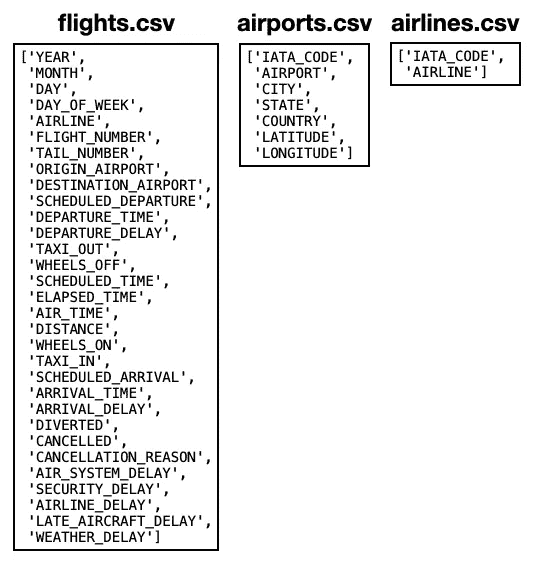

作者图片

具体来说， **flights.csv** 文件包含超过 580 万行。这使得它成为展示 Polars 库效率的理想数据集。

# 加载数据集

首先，使用`scan_csv()`方法加载 **flights.csv** 文件，该方法从 csv 文件中缓慢读取:

```
import polars as plq = (
    pl.scan_csv('flights.csv')
)
q.collect()
```

数据集的快照如下所示:

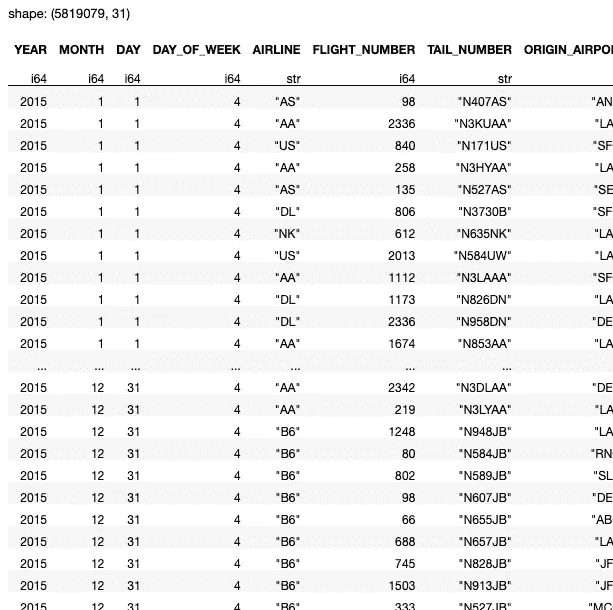

作者图片

加载的数据帧包含超过 580 万行和 31 列。

# 查找所有被取消的航班

接下来，让我们找出所有被取消的航班。您可以通过检查**取消的**栏来完成。在**取消的**栏中只有两个可能的值:

```
q = (
    pl.scan_csv('flights.csv')
 **.select(pl.col('CANCELLED').unique())**
)
q.collect()
```

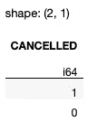

作者图片

取消的航班用值 **1** 表示。因此，您可以使用`filter()`方法来获取所有值为 1 的行，用于**取消的**列:

```
q = (
    pl.scan_csv('flights.csv')
 **.filter((pl.col('CANCELLED') > 0))**
)
q.collect()
```

结果的快照如下所示:

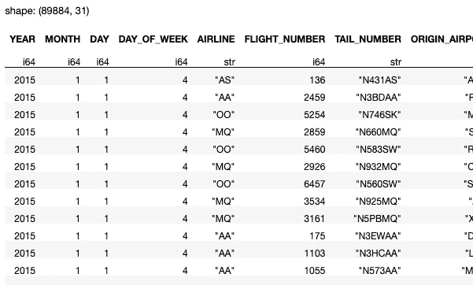

作者图片

# 查找每个航空公司取消的航班总数

看看哪个航空公司取消的航班最多会很有意思。您可以这样做，首先使用`groupby()`方法按航空公司对行进行分组，然后使用`agg()`方法对所有被取消的航班进行汇总:

```
q = (
    pl.scan_csv('flights.csv')
 **.groupby('AIRLINE')
    .agg(pl.col('CANCELLED').sum())**
)
q.collect()
```

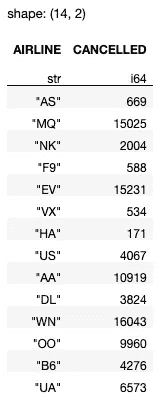

作者图片

那么取消航班最多的航空公司是哪家呢？分类吧！

```
q = (
    pl.scan_csv('flights.csv')
    .groupby('AIRLINE')
    .agg(pl.col('CANCELLED').sum())
 **   .sort(by='CANCELLED',reverse=True)**
)
q.collect()
```

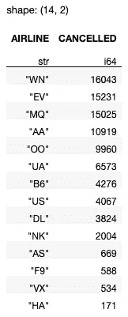

作者图片

每个航空公司代码代表什么？让我们加载另一个包含航空公司代码和名称的 CSV 文件:

```
pl.read_csv('airlines.csv')
```

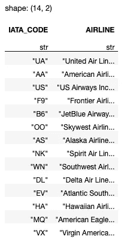

作者图片

让我们用上面的数据框架来加入我们先前的结果:

```
q = (
    pl.scan_csv('flights.csv')
    .groupby('AIRLINE')
    .agg(pl.col('CANCELLED').sum())
    .sort(by='CANCELLED',reverse=True)
)**q = (
    pl.scan_csv('airlines.csv')
    .join(q, 'IATA_CODE', 'AIRLINE')
)**q.collect()
```

你现在知道哪个航空公司取消的航班最多了。😀

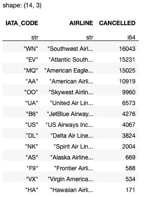

作者图片

# 将年、月和日列合并成一列

在 **flights.csv** 文件中，每个航班的日期使用三个不同的列来表示，即**年**、**月**和**日**。对于执行数据分析，如果可以将三列合并成一个日期列，可能会更容易。为此，您可以使用`pl.date()`函数，然后使用`alias()`函数来重命名新创建的列:

```
q = (
    pl.scan_csv('flights.csv')
 **.with_columns(
        pl.date('YEAR','MONTH','DAY')
        .alias("SCHEDULED_DEPARTURE_DATE")
    )** )
q.collect()
```

结果现在包含一个新添加的名为**SCHEDULED _ department _ DATE**的列:

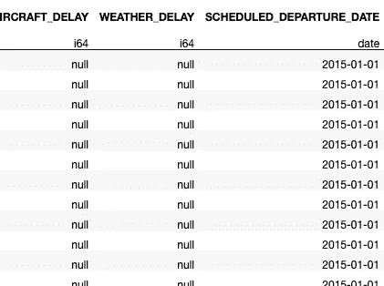

作者图片

`with_columns()`函数添加或覆盖数据帧中的列。

# 组合日期和时间列

除了计划出发日期存储在三个单独的列中，您还会注意到有一个名为**SCHEDULED _ department**的列。此列是一个整数列，存储数字，如 5，10，直到 2359。这些值代表的实际上是 HHMM 格式的出发时间。所以 5 实际上代表 00:05，而 2359 实际上代表 23:59。如果您要对这个列执行分析，您肯定需要进一步处理这个列。

这里我要做的是将四列合并成一个`datetime`列:

*   **年份**
*   **月**
*   **日**
*   **预定 _ 出发**

正如我们在上一节中所看到的，将前三者结合起来是很容易的。第四列需要一些处理:

*   您需要将出发时间格式化为一个字符串，然后提取前两个数字来表示小时(HH)
*   然后提取代表分钟(MM)的最后两位数字

上述操作可以写成如下形式:

```
q = (
    pl.scan_csv('flights.csv')
 **.with_columns(
        pl.col('SCHEDULED_DEPARTURE').apply(
          lambda x: ("{0:04d}".format(int(x)))[:2])
        .alias('HH')
    )
    .with_columns(
      pl.col('SCHEDULED_DEPARTURE').apply(
          lambda x: ("{0:04d}".format(int(x)))[2:])
        .alias('MM')
    )   
    .with_columns(
        pl.datetime('YEAR','MONTH','DAY','HH','MM')
        .alias("SCHEDULED_DEPARTURE_DATETIME")
    )** )
q.collect()
```

最终结果包含一个新添加的名为**SCHEDULED _ department _ DATETIME**的列:

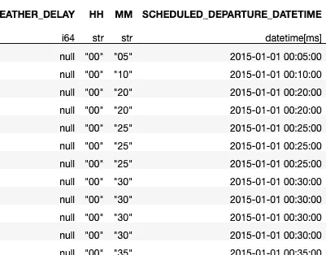

作者图片

注意，结果还包含两个中间列 **HH** 和 **MM** 。最好使用`drop()`功能将它们放下:

```
q = (
    pl.scan_csv('flights.csv')
    .with_columns(
        pl.col('SCHEDULED_DEPARTURE').apply(
          lambda x: ("{0:04d}".format(int(x)))[:2])
        .alias('HH')
    )
    .with_columns(
        pl.col('SCHEDULED_DEPARTURE').apply(
          lambda x: ("{0:04d}".format(int(x)))[2:])
        .alias('MM')
    )   
    .with_columns(
        pl.datetime('YEAR','MONTH','DAY','HH','MM')
        .alias("SCHEDULED_DEPARTURE_DATETIME")
    )  
 **.drop(['HH','MM'])**
)
q.collect()
```

结果中不再有 **HH** 和 **MM** 列:

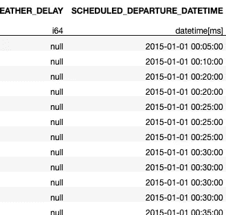

作者图片

# **显示目的地机场名称、城市和州**

假设您想要查找从 **CVG** 出发的所有航班，并显示目的地的机场名称、城市和州。为此，您需要在两个数据帧之间执行一个连接— **airports.csv** 和 **flights.csv** 。您可以使用以下代码片段完成上述任务:

```
df_airports = pl.scan_csv('airports.csv') 
(
    pl.scan_csv('flights.csv')
    .filter(
        pl.col('ORIGIN_AIRPORT') == 'CVG'    
    )        
    .join(df_airports, 
          left_on='DESTINATION_AIRPORT',
          right_on='IATA_CODE',
          how='left')
    .select(pl.col(['FLIGHT_NUMBER', 'ORIGIN_AIRPORT', 
                    'DESTINATION_AIRPORT', 'AIRPORT', 
                    'CITY', 'STATE']))
).collect()
```

*   首先将 **airports.csv** 文件加载到 dataframe 中，然后是 **flights.csv** 文件。
*   使用包含航班详细信息的数据框架，对从 CVG 始发的航班执行过滤。
*   然后，使用机场数据框在所有来自 CVG 的航班上执行左连接
*   最后，您只希望结果包含六列— **航班号**、**出发地机场**、**目的地机场**、**机场**、**城市**和**州**

结果如下:

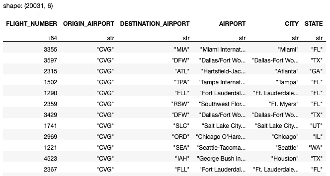

作者图片

# 统计每个州的机场数量

由于 **airports.csv** 文件包含每个州的机场列表，我们可以统计每个州的机场总数:

```
(
    pl.scan_csv('airports.csv')
    .groupby('STATE')
    .agg(
        pl.col('AIRPORT').count()
    )
).collect()
```

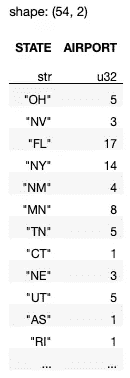

作者图片

如果您想查看每个州的机场名称列表，请移除`count()`功能:

```
(
    pl.scan_csv(‘airports.csv’)
    .groupby(‘STATE’)
    .agg(
        pl.col(‘AIRPORT’)
    )
).collect()
```

您将看到以下输出:

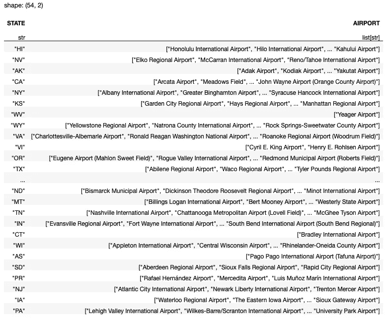

作者图片

# 找到每个航空公司的最大和最小延迟

**flights.csv** 文件中的 **ARRIVAL_DELAY** 列表示每个航班的延迟时间(分钟)。 **ARRIVAL_DELAY** 的正值表示航班晚点，负值表示航班提前到达。查看每个航空公司的最大和最小延误时间会很有趣:

```
(
    pl.scan_csv('flights.csv')
    .groupby('AIRLINE')
    .agg(
        [
            pl.col('ARRIVAL_DELAY').max().alias('MAX_DELAY'),
            pl.col('ARRIVAL_DELAY').min().alias('MIN_DELAY')
        ]
    )
).collect()
```

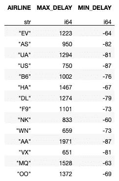

作者图片

从结果中可以看到 **AA** (美国航空公司)的最大延迟为 1971 分钟，而 **US** (美国航空公司)和 **AA** 的最小延迟为-87 分钟。

然而，显示最大和最小延迟并不能反映全部情况。我们可以计算到达延迟的平均值和标准偏差:

```
(
    pl.scan_csv('flights.csv')
    .groupby('AIRLINE')
    .agg(
        [
            pl.col('ARRIVAL_DELAY').max().alias('MAX_DELAY'),
            pl.col('ARRIVAL_DELAY').min().alias('MIN_DELAY'),
 **pl.col('ARRIVAL_DELAY').mean().alias('AVG_DELAY'),
            pl.col('ARRIVAL_DELAY').std().alias('STD_DELAY'),**        ]
    )
).collect()
```

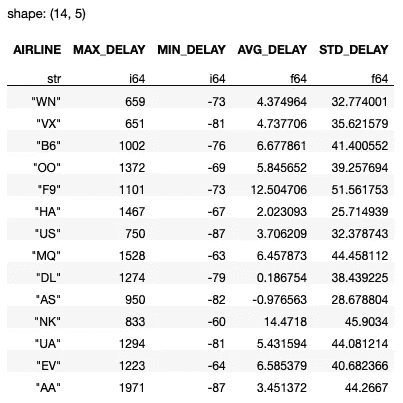

作者图片

在这里，您将看到**与**(阿拉斯加航空公司)的平均到达延迟最低(-0.976563)。

一个更好的主意是绘制直方图来显示每家航空公司的延误情况:

```
import plotly.express as pxdef histogram(airline):    
    df = (
        pl.scan_csv('flights.csv')
        .filter(
            pl.col('AIRLINE') == airline
        )
    ).collect()

    # plot a histogram showing the arrival delay for the specific 
    # airline
    fig = px.histogram(df.to_pandas(),
                       x = 'ARRIVAL_DELAY',
                       title=f'Flight delays for {airline}')
    fig.show()airlines = (
    pl.scan_csv('airlines.csv')
).collect()for airline in airlines['IATA_CODE'].to_list():
    histogram(airline)
```

下图显示了 **UA** (联合航空公司)的延迟频率:

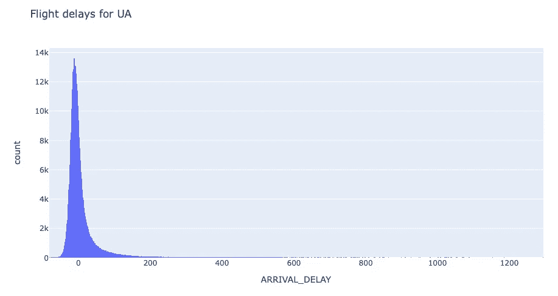

作者图片

# 查找每个航空公司的航班号

您可以使用`unique()`功能列出每个航空公司的唯一航班号:

```
(
    pl.scan_csv('flights.csv')
    .groupby('AIRLINE')
    .agg(pl.col('FLIGHT_NUMBER').unique())    
).collect()
```

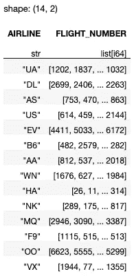

作者图片

您还可以使用`n_unique()`功能查找每家航空公司的独特航班数量:

```
(
    pl.scan_csv('flights.csv')
    .groupby('AIRLINE')
 **.agg(pl.col('FLIGHT_NUMBER').n_unique())** 
    # this also works
    # .agg(pl.col('FLIGHT_NUMBER').unique().count())
).collect()
```

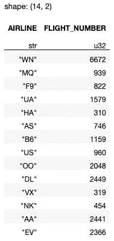

作者图片

> 注意，您也可以在`unique()`功能后使用`count()`功能。

<https://weimenglee.medium.com/membership>  

# 摘要

在本文中，我们快速浏览了一些可以在航班延误数据集上执行的数据分析。就我个人而言，在我的电脑上使用这个数据集通常会导致很多问题，因为数据集很大，并且通常需要很多时间，尤其是当你连接列或数据帧时。但是有了 Polars，事情变得更加高效，代码也更加直观。让我知道你的航班延误数据集的经验！