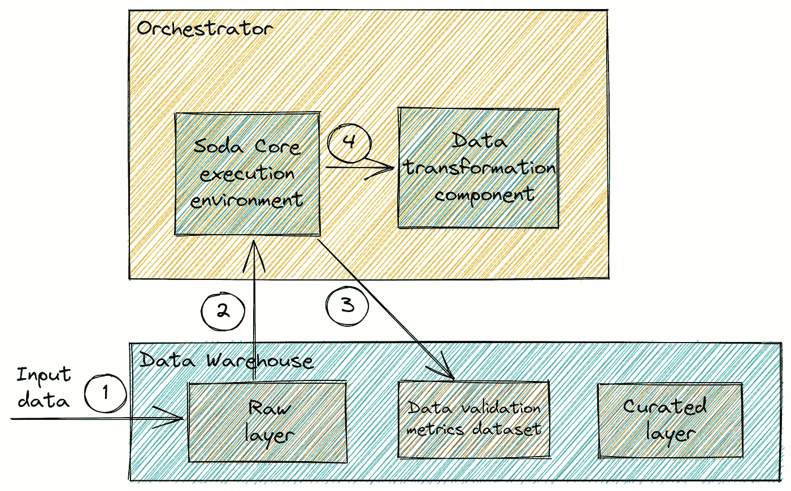

# 使用 Soda Core 进行大规模数据验证

> 原文：<https://towardsdatascience.com/performing-data-validation-at-scale-with-soda-core-825267bb4714>

## 深入了解数据验证的过去和现在，以及如何利用当今的工具来确保大规模数据质量

照片由 [Alex wong](https://unsplash.com/@killerfvith?utm_source=medium&utm_medium=referral) 在 [Unsplash](https://unsplash.com?utm_source=medium&utm_medium=referral) 上拍摄

随着人们对现代数据堆栈(MDS)及其不断增长的数据技术和 SaaS 产品生态系统的兴趣不断增加，数据团队正在大力押注于它，以打开创新和能力的新大门。但更重要的是，MDS 生态系统有望为不久前做出的昂贵决策提供高效的替代方案。

毕竟，当我们将今天的数据堆栈与“*第一波*”BI 平台或“*第二波*”Hadoop 环境进行比较时，很明显，今天我们可以用更少的资源获得更多(特性、功能和价值创造)，无论是在工程工作、时间还是基础架构成本方面。这是一个非常合适的时间来增强我们的数据平台，或者更好的是，更新和微调他们现有的组件。

在本文中，我们将详细介绍如何利用这一波新的数据工具，在数据验证领域用更少的资源做更多的事情。

# 等等，我们对数据验证有明确的定义吗？

数据验证的广义理论定义是静态的:它是一组允许我们确保我们的数据可信并符合预定义的数据质量标准的过程——通常使用 [6 个关键维度](https://www.collibra.com/us/en/blog/the-6-dimensions-of-data-quality)(准确性、完整性、一致性、及时性、有效性和唯一性)。另一方面，像数据工程中的大多数其他领域一样，我们应用理论定义的技术方法正在快速发展，并朝着不同的方向发展——这使得概念本身相当不稳定。尽管如此，最终目标仍然是一样的: ***确保我们可以信任我们正在消费的数据*** 。

既然我们已经——在某种程度上——明确了定义，让我们看看几年前我们是如何处理(有时避免)数据验证的。

# 数据验证的黑暗过去

多年来(想想 2010 年到 2016 年)，数据工程师在没有软件工程最佳实践的情况下构建管道——目标是尽可能快地交付尽可能多的数据，然后决定我们想要用这些数据做什么。这在当时没有造成任何直接的问题，因为“*大数据*”仍然是大多数公司决策的次要因素，因此完全跳过数据验证是可以容忍的。

在那些年，想要确保数据质量的数据工程团队的选择非常有限:

*   如果使用分布式计算引擎(通常在像 HDFS 这样的分布式文件系统之上)处理数据，那么团队将需要编写专门的任务/作业来清理数据并运行数据质量检查。(例如，如果团队维护进行处理的 Spark 作业，数据验证也将通过专用作业或作为处理作业的一个步骤使用 Spark 进行。)
*   另一方面，如果数据存在于分布式数据仓库中(比如 Apache Hive)，那么团队将需要编写和维护多个 SQL 查询，这些查询在不同的输入表上运行，以执行必要的检查。

在这两种情况下，难以扩展的强力方法是唯一可用的选择。不同的公司致力于构建内部框架和抽象来简化流程，但在数据社区中没有“啊哈”的时刻——数据验证需要大量的工作，因为每个人都是从头开始，所以大多数公司只是把它推到一边。

但是现在，事情发生了变化:数据在任何地方都是一等公民，指标被广泛的用户/团队使用。现在，我们经常发现自己试图理解为什么两个仪表板为同一指标提供不同的值，或者一个管道中的故障会如何影响我们的最终用户。现在，我们正在偿还建设数据管道的逾期债务，却没有考虑数据质量——那么，我们如何用开源的"*第三波*"工具来解决数据质量问题呢？我们如何利用这些工具来自动化现有流程，并降低大规模实现数据验证组件的成本(无论是在工程工作、时间还是预算方面)？

# 数据验证的现状

让我们首先从谈论数据验证在过去几年中取得的巨大进步开始我们的回答。无论是通过像 Great Expectations 和 Soda Core(以前的 SodaSQL)这样的开源项目，还是像 MonteCarlo 和 Sifflet 这样专注于更大空间的数据可观察性的 SaaS 平台，数据验证都有了很大的发展。

当我们今天谈论数据验证时，我们谈论的只是包含数据可观察性和数据操作的更广泛且快速成熟的空间中的一个组件，这个空间使我们更容易找到信心说*“是的，数据没问题”*。因此，即使我们专注于开源数据验证工具，我们正在构建的设计也可以扩展到一个详尽的数据可观察性层——但这超出了本文的范围。

然而，在范围内的是 2022 年开源数据质量的状态——所以让我们来看一下土地的布局。

## 巨大的期望

[Great Expectations](https://github.com/great-expectations/great_expectations) 可以说是定义了对数据验证工具期望的当前标准的工具:您定义您的检查(或期望)以及您希望如何/何时运行它们，然后您的数据验证组件会处理剩下的事情。相当整洁。

在过去的四年中，该工具在各个方面都得到了扩展:越来越长的集成列表、数据分析功能和内置的数据文档。最重要的是，巨大的期望是一个 Python 库，而你的期望只是 Python 函数。

但是还有什么比维护 Python 函数更简单的呢？YAML 和 SQL。

## 苏打核心(以前为 SodaSQL)

[Soda Core](https://github.com/sodadata/soda-core) 是另一个开源工具，它提供了确保数据验证的必要功能。尽管该工具本身也是用 Python 编写的(类似于 Great Expectations)，但它以不同的方式处理数据验证:作为一名开发人员，您只需要提供一组 YAML 配置文件，告诉 Soda 如何连接到您的数据仓库，以及您希望在不同的表上运行哪些检查。

当管理拥有不同所有者和维护者的数百个表时，这种方法非常方便。最初，Soda 要求每个表有一个 YAML 文件，但是现在随着 [SodaCL](https://docs.soda.io/soda-cl/soda-cl-overview.html) 的发布，你可以在 YAML 配置中利用[循环](https://docs.soda.io/soda-cl/for-each.html)和定制 Soda 语法来优化你如何定义度量/检查。

Soda 主要优先考虑 CLI 交互来运行检查(使用广泛的命令和选项)，但它也提供了丰富的 Python 库，这为自定义使用和直接在 Python 应用程序中利用其检查的输出打开了大门。

# 具体示例:使用 Soda Core 确保大规模数据质量

为了展示现在设置可伸缩数据验证组件的简单性，让我们来看看将 Soda Core 添加到现有数据平台的不同步骤。

您可能会在各种用例中遇到这种情况，例如需要提高数据质量和增强对数据的信任，或者数据协调项目(确保您从新源使用的数据与您从您想要废弃的旧源使用的数据相匹配)。在这种情况下，添加数据验证组件已经被简化为只提供三个问题的答案。

## 步骤 1:我们在验证什么？

首先，我们需要从定义我们实际想要测试/验证的资产开始，以及我们想要在这些资产上运行的检查。Soda 使得这个过程非常高效，因为我们不需要编写许多冗余的 SQL 查询，我们只需要挑选我们想要利用的指标(从[一长串预定义指标](https://docs.soda.io/soda/metrics.html)中)和我们想要执行的检查。

然后，我们需要通过 YAML 向苏打水传达我们的选择。我们可以使用循环、列表，甚至自定义的基于 SQL 的指标/检查，确保我们可以在定义检查时实现所有可能的场景，而没有任何冗余。

样品苏打核心检查 YAML 文件。

Soda 进行了大量优化，以最小化添加和维护数据检查所需的成本和工作，在上面的示例中，我们只触及了可用功能的表面(其他值得注意的功能包括内置的[新鲜度检查](https://docs.soda.io/soda-cl/freshness.html)和[检查配置](https://docs.soda.io/soda-cl/optional-config.html))。

使用这种方法，我们可以通过源代码控制来管理我们的数据验证检查(确保版本控制和集中化)。此外，YAML 的使用意味着无论与数据交互的用户背景如何(无论他们是数据科学家、数据工程师、ML 工程师，甚至是项目经理)，他们不仅能够理解给定表的现有检查，还能够提出修改建议。不管是好是坏，YAML 设法将自己定位为技术世界的通用配置语言，所以我们不妨充分利用它。

既然我们已经定义了想要运行的检查，那么让我们来讨论一下应该在哪里运行它们。

## 步骤 2:我们在哪里验证？

考虑到我们正在谈论一个现代数据平台，假设我们正在应用 ELT 设计并在基于云的分布式数据仓库上运行我们的转换。

Soda 提供了到所有“主流”数据仓库的连接器，并对其查询进行了内置优化(如利用缓存)，以确保在数据仓库上运行的数据验证查询的最佳性能和最低成本。记住这一点，我们只需要提供一个描述连接和我们想要使用的数据仓库的`configuration.yml`文件——然后 Soda 将抽象其余的。

Postgres 仓库的示例配置。

同样值得注意的是，有可能将 Soda 用于基于 Spark 的架构，这要感谢功能丰富的 Soda Spark 扩展[。](https://docs.soda.io/soda-spark/install-and-use.html)

既然 Soda 可以连接到我们的数据仓库并在其上运行查询，那么让我们决定我们实际上想要如何以及何时运行这些查询。

## 步骤 3:我们如何(以及何时)进行验证？

既然我们有一个现有的数据平台，我们可以假设我们也有一个*编排器*，它触发我们管道内的不同任务，并确保调度和——不出所料——编排(例子包括 Airflow 和 Dagster)。理想情况下，我们希望在我们的[Dag](https://airflow.apache.org/docs/apache-airflow/stable/concepts/dags.html#:~:text=A%20DAG%20(Directed%20Acyclic%20Graph,say%20how%20they%20should%20run.)内尽快执行数据验证—因此，让我们看看如何通过我们的 orchestrator 实现这一点。

Soda 提供与开箱即用的[气流](https://docs.soda.io/soda-sql/orchestrate_scans.html#apache-airflow-using-pythonvirtualenvoperator)和[完美](https://docs.soda.io/soda-sql/orchestrate_scans.html#prefect-using-a-custom-task)的集成，建议将 Soda 检查作为我们 Dag 内的专门任务来运行。如果我们以 Airflow 为例，这可以通过不同的方式完成，比如利用[python virtualenv 操作符](https://docs.soda.io/soda-sql/orchestrate_scans.html#apache-airflow-using-pythonvirtualenvoperator)，甚至直接通过 [Airflow 的 Bash 操作符](https://docs.soda.io/soda-sql/orchestrate_scans.html#apache-airflow-using-bashoperator)运行`soda scan` CLI 命令。

但是，即使我们使用不与 Soda 集成的 orchestrator(不允许我们运行 Python 包)，理想的模式可能如下:

1.  从外部源或通过 EL 组件(例如 Airbyte)接收原始数据。这些数据将被接收到我们的原始层(无论是在数据仓库还是在湖边小屋)，接收的完成将反过来触发验证任务。
2.  在我们的 orchestrator 中使用专门的数据验证任务/步骤，触发执行环境来运行 Soda Core。像 AWS 上的 Lambda 函数这样的无服务器服务(或其他云提供商上的替代服务)非常适合这种情况，因为它消除了在 orchestrator 本身中直接运行 Soda 的需要。无服务器功能将通过 HTTP 请求触发，然后任务的结果将依赖于无服务器功能的响应来确定执行是成功还是失败(这甚至可以仅仅依赖于无服务器功能的响应代码)。
3.  将数据验证任务生成的指标推送到我们的数据仓库，以便进一步监控或在其上构建专用仪表板。为了检索指标，我们可以使用`scan_result`对象，它是 [Soda 扫描输出](https://docs.soda.io/soda/scan.html#programmatically-use-scan-output)的一部分。
4.  依靠 Soda 检查的输出来确定如何继续执行我们的 DAG。这完全依赖于特定的用例来确定当检查失败时应该发生什么动作。(例如根据检查类型和问题的严重性发出警告或错误，发送警报等。)如果没有阻塞故障，那么我们将转移到管道的数据转换部分，因为我们知道可以信任数据。

Soda 核心任务的数据管道示例。(图片由作者提供)

通过这种设计，我们利用了 Soda 是一个轻量级包的事实，并在一个专用的无服务器环境中运行它，这将潜在问题的风险降至最低。

# 总结事情

在整篇文章中，我们看到了数据验证在过去几年中是如何发展的，以及今天实现一个专用的数据质量组件仅仅包括通过 YAML 配置回答三个问题。

这种进步极大地降低了确保大规模数据质量的成本，无论是增强现有的数据管道和提高对数据的信任，还是实现像数据协调场景中那样的特定用例。

在数据堆栈的其他部分也可以看到类似的模式，不久前的资源密集型问题变成了可以用最少的资源实现的抽象特性。这让我们回到了文章的第一点: ***在期望 MDS 引入新功能或用例之前，为什么不利用其生态系统来改进我们数据堆栈中的现有组件呢？***