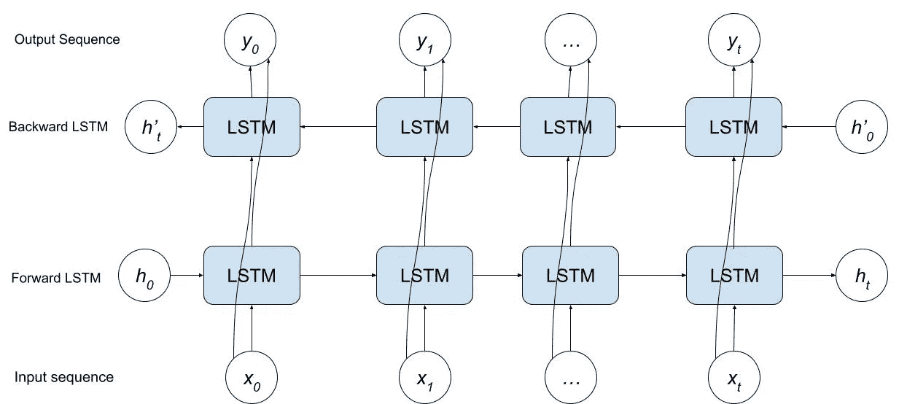

# 置换语言建模，解释

> 原文：<https://towardsdatascience.com/permutative-language-modeling-explained-9a7743d979b4>

## 流行的变压器 XLNet 背后的核心功能解释如下


卢克·斯塔克波尔在 [Unsplash](https://unsplash.com?utm_source=medium&utm_medium=referral) 上拍摄的照片

在本文中，我将解释您需要了解的关于置换语言建模(PLM)的一切，以及它是如何与整个 XLNet 架构联系在一起的。

在 NLP 中，像 BERT 这样功能强大的通用转换器是最先进的/标准的转换器，许多人将其用于流行的任务，如情感分析、问题回答、语言建模，甚至用于 BERT 必须微调的特殊任务。虽然 BERT 对于某些任务/设置非常好，但是一个强大的、不太为人所知的转换器是 XLNet。XLNet 是最强大的变压器之一，在 20 个不同的任务中超过 BERT。

## 以前的方法

在最近几年的研究领域中，预训练语言模型因其在下游 NLP 任务中表现出色的能力而广受欢迎。基本上，它们真的很擅长针对非常具体的 NLP 任务进行微调。我说的语言模型是什么意思？在 NLP 中，语言模型是在给定序列中所有前面/其他单词的情况下，预测序列中的下一个单词的模型。通常，像 BERT 这样的现代语言模型是预先训练的，因为它们首先在普通英语语言(在维基百科这样的公共网站上)上进行训练，然后在更具体的下游任务上进行微调，如情感分析、问题回答等。这些语言模型通过为序列中的每个单词生成丰富的单词嵌入来工作，然后它们将这些用于其他特定的任务。

到 XLNet 为止，在语言建模中有两种主要的竞争方法。

## **自回归**

自回归方法使用先前时间步长的观测值来预测序列中下一个时间步长的值。本质上，想想 LSTM/双 LSTM 人做语言建模的方式。它使用序列中已经预测的单词来预测序列中的下一个单词。虽然这种方法是第一种最先进的语言建模方法，但是它有一些局限性。

首先，当预测序列中的下一个单词时，自回归方法依赖于左边的单词或右边的单词。例如，当使用自回归语言模型预测句子中的第 5 个单词时，该模型仅使用信息/依赖于第 5 个单词左边的单词，或者第 5 个单词右边的单词(如果以向后的方式预测)。即使是双 LSTM 也没有真正以上下文相关的方式进行语言建模。双 LSTM 运行常规的从左到右的 LSTM，然后是从右到左的 LSTM，并使用一些线性图层将来自两个 lstm 的信息聚合在一起。它们独立地进行从左到右和从右到左的过程，而不是同时进行。这意味着在双 LSTM 中组合前向和后向信息真正发生在网络的末端，而不是网络内部。下面是一个双 LSTM 的架构。



作者图片

此外，自回归方法的另一个限制是，由于其固有的结构，序列中正确预测的下一个单词完全依赖于正确预测序列中前面单词的模型。举个例子，

```
P(w1w2w3) = P(w1) * P(w2|w1) * P(w3|w1w2) ... 
```

正确预测一行中三个单词(w1、w2 和 w3)的概率等于上面的公式。正如您所看到的，正确预测一行中的三个单词有许多依赖关系，每次将一个单词添加到序列中，它被正确预测的概率就会越来越低。我们的目标是最大化这个概率 P(w1w2w3)，复合效应使得 LSTMs 的训练速度非常慢，因为每次训练它们时，它们的权重/精度都只有边际上的提高。

## 自动编码

自动编码方法旨在解决自回归方法中存在的一些限制。使用自动编码方法的最著名的模型是像 BERT 这样的变形金刚。这种方法基于原始的 transformer，旨在通过捕获双方的依赖关系来捕获双向上下文。

使用两种方法的组合对 BERT 进行预训练以学习语言/文本:掩蔽语言建模和下一句预测。虽然对于 BERT 来说，这是一种理解文本和接受英语语言预训练的非常有效的方法，但是自动编码方法的主要局限性在于预训练中使用屏蔽语言建模。如果你不知道什么是屏蔽语言建模，它本质上是一个填空任务，BERT 随机屏蔽输入中的一些标记，并训练自己使用屏蔽标记周围的上下文信息来预测屏蔽标记实际上是什么。这种方法的优势在于，它允许 BERT 使用来自输入中任何地方的信息进行组合，以生成更高级/更丰富的单词嵌入。这种方法的一个限制是，当预测一个屏蔽的标记时，输入中有其他屏蔽的标记，如果两个或更多屏蔽的标记相互依赖，会发生什么？BERT 将无法捕获/学习这两个标记之间的上下文信息，从而使它为这些标记生成的编码/嵌入不够标准。BERT 的另一个限制是它只能接受固定长度的序列:BERT 最多只能接受 512 个令牌作为输入。另一方面，XLNet 没有输入约束。

## XLNet

XLNet 是一个自回归模型，旨在解决 BERT 和 LSTMs 带来的限制，它在许多任务上优于 BERT。

就像 BERT 一样，XLNet 这样的语言模型必须能够生成单词嵌入矩阵。如果一个句子被输入到模型中，模型应该能够为每个单词输出一个固定长度的向量嵌入。为了创建这些丰富的、上下文化的嵌入，XLNet 使用置换语言建模。

给定一个序列***【x】***，自回归模型(如 LSTM 或 XLNet)是一种计算概率的模型，该概率为***P(Xi | x<I)***(|代表给定，因此这实质上意味着该模型在给定序列中所有 0…i 个单词出现的概率的情况下预测序列中第 I 个单词出现的概率)。这类模型(像 LSTM 的)是不对称的，并且没有从语料库中的所有标记关系中学习。LSTMs 仅仅是序列的一种可能排列上的自回归模型:从左到右的记号顺序。

诸如 ELMo 之类的其他类型的自回归模型允许模型学习令牌的上下文表示。在 ELMo 的具体情况下，它可以允许模型以相反的顺序学习 ***P(xi | x > i)*** 或上下文信息。与 LSTM 的模型相似，ELMo 模型在序列的两种可能排列上是自回归的，向前和向后。除了 ELMo 之外，还有许多其他可能的组合来查看模型可以在哪里学习一些标记之间的有趣关系。例如， ***P(xi | xi-1，xi+1)*** ，可以允许一些有趣的嵌入。本质上，记号的任何组合都可以让自回归模型学习有趣的关系，这是置换语言建模背后的基本基础。

XLNet 本质上做了我上面描述的事情，但是针对一个序列的所有不同排列。考虑一个有 N=4 个标记的序列[狗，毕竟是哺乳动物]。看看 4 个都有的那套！排列 *Z =* [[1，2，3，4]，[1，3，2，4] … [4，3，2，1]]。XLNet 是一个对所有这些排列都是自回归的模型。它预测一个记号*的概率，给定所有先前的记号 ***x < i*** 并且它可以计算序列的任何排列的概率。*

*例如，给定前面的元素，它可以计算第 3 个元素的概率，并且它对任何排列都这样做，以便它可以看到前面的元素的哪个组合最有可能(最高概率)产生正确的第 3 个元素，即单词 *all* 。考虑到所有 4 个！置换，XLNet 考虑了令牌之间所有可能的依赖关系。*

*虽然置换语言建模是 XLNet 的主要贡献，但它不是 XLNet 的唯一组件。XLNet 还包含像注意力屏蔽这样的东西——这有助于它理解词序——和两个自我注意力流。你可以在这篇由 Borealis AI 撰写的文章中读到更多关于这些概念的内容。*

## *XLNet 的缺点*

*虽然置换语言建模是[论文](https://arxiv.org/abs/1906.08237)的主要贡献，并且它确实成功地克服了屏蔽语言建模问题，但是它有一些缺点。首先，也是最明显的，与 BERT 相比，XLNet 通常计算量更大，训练时间更长。特别是在当前的研究环境中，许多关于变形金刚/语言模型的论文被训练得更快、资源更少。这方面的一个例子是像 DistilBERT 这样的模型。XLNet 的另一个弱点是它在较小/较短的输入句子上表现不佳。在 XLNet 的预训练中，它主要是对长输入序列进行预训练，置换语言建模旨在捕捉长期依赖关系，因此 XLNet 不擅长短输入。*

*我希望您觉得这些内容很容易理解。如果你认为我需要进一步阐述或澄清什么，请在下面留言。*

## *参考*

*XLNet:用于语言理解的广义自回归预训练:【https://arxiv.org/abs/1906.08237 *

*北极光 AI:了解 XLNet:【https://www.borealisai.com/en/blog/understanding-xlnet/】T4*