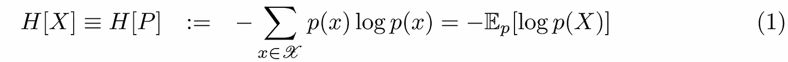
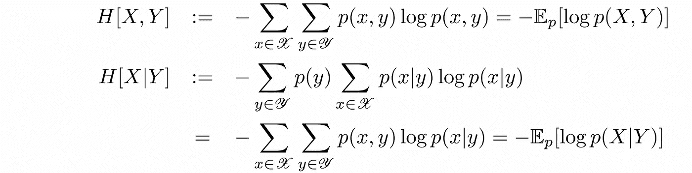
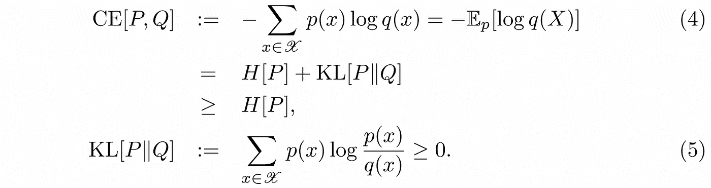
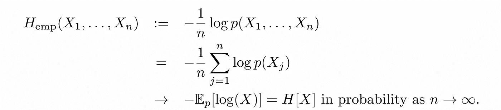
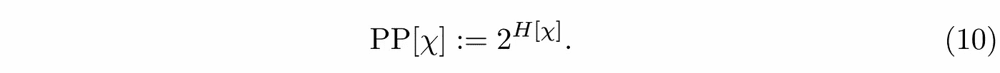
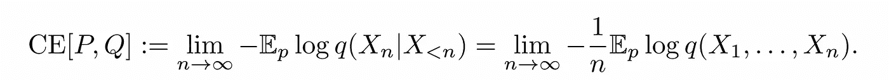
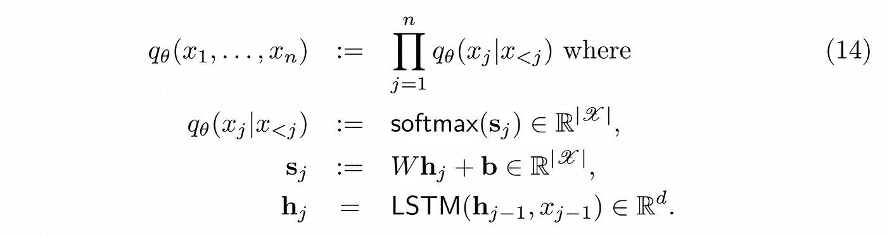

# 语言模型的困惑再探

> 原文：<https://towardsdatascience.com/perplexity-of-language-models-revisited-6b9b4cf46792>

## 从基础信息论到实用计算

来源:[作者](https://medium.com/@pirminlemberger/perplexity-of-language-models-revisited-6b9b4cf46792)

## 又一个关于语言模型困惑的帖子？

**语言模型** (LM)目前处于 NLP 研究的前沿。基于 Transformer 架构[1]的预训练模型，如 GPT-3 [2]、伯特[3]及其众多变体 XLNET[4]、罗伯塔[5]…通常用作解决各种下游任务的基础，从机器翻译到文档摘要或开放域问题回答。他们的零射击能力似乎很有前途，该领域最大胆的人将它们视为更普遍的认知技能的第一瞥，而不是迄今为止监督学习的狭义概括能力[6]。

从一个更平凡的角度来看，LM 是一个简单的概率分布模型， *p* ( *x* ₁， *x* ₂，…)在一系列标记( *x* ₁， *x* ₂，…)上，这些标记组成了给定语言中的可理解文本，希望是你正在阅读的语言。

在过去的几年中，NLP 社区已经设计了一些度量和基准来评估这种 LM 的质量。一种选择是测量**下游**任务的性能，比如分类精度，任务范围内的性能，这就是 GLUE 基准测试所做的[7]。对于语言生成的更微妙和难以量化的方面，如生成文本的连贯性或可接受性，人们也可以求助于主观人类评价[8]。另一方面，我们发现**内在的**，独立于用例，像交叉熵(CE)、每字符位数(BPC)或基于信息理论概念的困惑(PP)这样的度量。在这篇短文中，我们将关注**困惑**。

简而言之，当一个语言模型生成一个新的标记时，它的困惑度量了一个 LM 的不确定性程度，这个不确定性是在很长的序列上平均的。因此，PP 越低，LM 越好。显然，PP 将依赖于模型所使用的特定的**标记化**，因此比较两个 LM 只有在两个模型使用相同的标记化的情况下才有意义。

有很多论文、博客文章和评论试图解释这一指标的直觉和信息理论来源。但是我敢说，除了少数例外[9，10]，我发现这种过多的资源相当令人困惑，至少对于像我这样的数学头脑来说是如此。因此，本**教学笔记**的目标是建立困惑的定义，并以简化的方式解释它，从基本信息和理论概念开始，摒弃任何类型的术语。只是很好的旧数学。关于证明，例如参见[11]。

**免责声明**:这个笔记不会帮助你成为一个 Kaggle 专家。

## 单个随机变量的熵和困惑

先说简单的事情。让我们回顾一下如何在有限的𝒳.集合中测量单个随机变量(r.v.) *X* 的随机性您可能会将 *X* 视为文本信息的来源，将值 *x* 视为由此来源生成的标记或单词，将𝒳视为某种标记化过程产生的词汇表。在继续之前，让我们修正一些不言自明的符号:

源 *X* 的**熵**定义为(对数的底数为 2，因此 *H* [ *X* ]以位为单位测量):

正如经典的**信息论**【11】告诉我们的那样，这既是对 r.v. *X* 随机性程度的一个很好的度量，也是对信源 *X* 产生信息的速率的一个度量。事实上，如果*l*(*x*):= |*c*(*x*)|表示前缀码 *C* (粗略地说，这是一种可以被动态解码的码)的编码 *C* ( *x* )在𝒳中的长度比 ***香农的长***

此外，对于最佳代码 *C* *，长度验证达到一位[11]:

这证实了我们的直觉，即频繁出现的令牌应该分配较短的代码。熵是一个深刻而多面的概念，因此我们不会在这篇短文中穷尽它的全部含义，但是这些事实仍然应该说服最怀疑定义(1)的相关性的读者。当 *X* 为常数时，熵 *H* [ *X* 为零，当 *X* 在𝒳:上均匀分布时，熵取最大值

因此,( 2)中的上限促使将单个随机变量的**困惑度**定义为:

因为对于一辆统一的房车来说，它只是减少了|𝒳|可供选择的箱子数量。对于一个非均匀的 r.v. *X* 我们可以把 PP[ *X* ]解释为我们面对的一个有效的不确定性，我们应该猜测它的值 *x* 。我们还需要两个 r.v. *X* 和 *Y* 的**关节**和**条件** **熵**的定义:

上面的第一个定义很容易暗示熵是两个独立随机变量的可加量。

第二个将条件熵定义为条件分布的熵，在条件 *y* 上平均。让我们假设对于一个源，我们有一个**未知分布** *P* 和一个**模型** *Q* 来近似它。然后我们将源 *P* 相对于模型 *Q* 的**交叉熵** CE[ *P* ， *Q* ]定义为:

KL 是众所周知的 **Kullback-Leibler 散度**，它是概率分布之间的近似性的几种可能定义之一。CE[P，Q]和 KL[*P*∨*Q*]在码长方面都有很好的解释。CE 是当令牌 *x* 由源 *P* 产生，但是它们的编码被选择为对于 *Q* 最优时，编码长度 *l* ( *x* 的期望值。情商。(8)由此可见，KL[*P*∩*Q*]就是这么说的我们在使用错误编码时必须付出的代价。

## 平稳遍历过程的熵和困惑

一个**随机过程** (SP)是一个 r.v .的索引集。为了我们的目的，这个索引将是一个整数，你可以把它解释为一个记号在一个随机记号序列中的位置:( *X* ₁， *X* ₂，…)。最简单的 SP 是一组从同一分布 *P* 中提取的 **i.i.d.** r.v。假设我们有一个样本 *x* ₁， *x* ₂，……从这样一个 SP 中抽取，我们可以将它的**经验熵**定义为:

弱的**大数定律**随即意味着相应的估计量趋向于 *P* 的熵 *H* [ *X* :

也许用更直观的术语来说，这意味着对于足够大的样本，我们有一个近似值:

或者等同地

从这个基本观察开始，通过定义所谓的典型**序列**的集合为那些经验熵不太远离真实熵的序列，信息论的基本结果可以被证明[11](其中 SNCT 在上面)，但是我们在这里不会被这些问题困扰。

在 NLP 中，我们感兴趣的是**的随机来源。r.v. ( *X* ₁，*x*₂……)的序列，因为有意义的文本中出现的单词肯定不是独立的。我们将把𝜒称为这样一个物种。那么，对于一个长句子来说，概率 *p* ( *x* ₁， *x* ₂，…)的近似值(6)是什么呢？实际上，我们必须在这里对 SP 𝜒:=( *X* ₁，*x*₂……)做一个简化的假设，假设它是**静止的**，我们的意思是**

对于令牌的所有序列( *x* ₁， *x* ₂，…)以及所有**时移** *t* 。严格地说，对于文本文档来说，这当然不是正确的，因为单词在文本的开头和结尾的分布是不同的。但这是我们前进时必须做出的一个近似值。对于这样的平稳随机过程，我们可以考虑以至少两种方式定义**熵率**(即每个令牌的熵)。这里有一个将熵率定义为非常长的序列的每个令牌的平均熵:

这是另一个定义，它是基于前一个记号的最后一个记号的**平均熵，同样对于非常长的序列:**

将我们的注意力限制在定态粒子上的全部意义在于，可以证明[11]这两个极限是一致的，从而为我们提供了定态粒子𝜒.的熵率*h*[𝜒]的一个很好的定义

最后，我们可以类似于(3)将静态 SP 的困惑度定义为:

这种解释很简单，也是我们从一开始就试图抓住的。它是稳定的 SP 𝜒.的每个令牌的**不确定性有没有一种近似法可以把方程(7)推广到稳态速度？可惜，一般的*没有*！我们必须对 SP 𝜒.做一个额外的技术假设也就是说，我们必须假设 SP 𝜒是**遍历的**。对遍历性的详细解释会把我们引入歧途，但感兴趣的读者可以参见[11]中的第 16 章。非常粗略地说，遍历性条件确保了任何单个 r.v. *X* ₁在过程𝜒的分布 *P* 上的期望𝔼[ *X* ₁可以用从𝜒 ( ***比尔科夫遍历定理*** )中抽取的单个很长序列( *x* ₁，*x*₂……)的时间平均值来代替:**

对于遍历过程，斯朗大数定律成立。

因此，如果我们假设我们的源𝜒确实是稳定的和遍历的(这在实践中对于文本可能仅是近似正确的)，那么(7)的以下概括成立( ***香农，麦克米兰，布雷曼定理*** (SMB) [11]):

因此我们看到，要计算一个遍历过程𝜒的熵率*h*【𝜒】(或困惑 PP[𝜒】)，我们只需要**画一个很长的序列**，计算它的负对数概率，我们就完成了！不需要执行大量的求和。所以让我们欢呼吧！(11)背后的直觉是，在某种程度上，一个无限长的序列实际上包含了它们全部。

## 界定未知过程的困惑

如果我们知道相应的概率分布 *p* ( *x* ₁， *x* ₂，…)，所有这些对于计算像英语这样的语言的熵(或困惑)将是完美的。但不幸的是我们没有，因此我们必须求助于语言模型 *q* ( *x* ₁，*x*₂……)作为近似。幸运的是，我们将能够为 *p* 构建熵率的上限。这个上限将会是模型 *Q* (语言模型)相对于源 *P* (实际语言)的**交叉熵**。它的定义与 SP 的熵率(8，9)和两个普通分布的交叉熵(4)直接相似:

因此，当面对由源 *P* 产生的令牌时，它是模型 *Q* 的每个令牌的不确定性。第二个等式是一个类似于为熵率建立等式(8)和(9)的定理。语言的未知熵的承诺界限是简单的[9]:

最后，对于被视为未知源 SP *P* 的语言，模型 *Q* 的**困惑度被定义为:**

换句话说:当由语言 *P* 生成时，模型 *Q* 不确定接下来会出现哪个标记，就好像它必须在 PP[ *P* ， *Q* 选项中进行猜测一样。为了计算 PP[ *P* ， *Q* ]或 CE[ *P* ， *Q* ，我们可以使用 SMB 定理[9]的扩展:

## 最后:语言模型的困惑

为了具体起见，假设我们有一个语言模型，它的概率 *q* ( *x* ₁， *x* ₂，…)由一个类似 LSTM 的 RNN 定义:

SMB 结果(13)然后告诉我们，我们可以通过采样任何足够长的令牌序列并计算其对数概率来估计 CE[ *P* ， *Q* 。将 RNN 分布(14)的显式表达式代入(13)以获得(12)中 CE[ *P* ， *Q* ]的近似值，我们最终获得语言模型 *Q* 相对于语言源 *P* 的困惑度的显式**公式:**

作为 **a 数值**的一个例子，GPT-2 在维基百科数据集上实现了每个字符 1 比特(=令牌)，因此具有**字符困惑度** 2 =2。英语单词的平均长度等于 5，这就相当于单词困惑度等于 2⁵=32.

## 困惑的实用计算

我们在实践中可以使用(15)来计算困惑度的序列的长度 *n* 受到由 LM 定义的序列的最大长度的限制。例如，GPT-2 的最大长度等于 1024 个令牌。为了获得困惑的可靠近似值，最好的办法似乎是使用**滑动窗口**，正如这里的[所示](https://huggingface.co/datasets/huggingface/documentation-images/resolve/main/ppl_sliding.gif)【10】。为了提高性能，也可以使用大于 1 的步幅。拥抱脸文档[10]有更多的细节。

瞧啊！

## 参考

[1] Ashish Vaswani，Noam Shazeer，Niki Parmar，Jakob Uszkoreit，Llion Jones，Aidan N. Gomez，ukasz Kaiser，Illia Polosukhin，*注意力是你所需要的一切*，神经信息处理系统的进展 30 (NIPS 2017)。

[2] Tom Brown 等人*语言模型是很少出手的学习者*，神经信息处理系统进展 33 (NeurIPS 2020)。

[3] Jacob Devlin，Ming-Wei Chang，Kenton Lee，Kristina Toutanova， *BERT:用于语言理解的深度双向转换器的预训练*，计算语言学协会北美分会 2019 年会议录:人类语言技术，第 1 卷(长和短论文)。

[4]杨，戴子航，，Jaime Carbonell，Russ R. Salakhutdinov，Quoc V. Le，XLNet: *用于语言理解的广义自回归预训练*，神经信息处理系统进展 32 (NeurIPS 2019)。

[5]刘，迈勒奥特，纳曼戈亚尔，杜，曼达尔乔希，陈，奥梅尔列维，，卢克泽特勒莫耶，韦塞林斯托扬诺夫，*罗伯塔:一种稳健优化的伯特预训练方法，* [，](https://arxiv.org/abs/1907.11692) (2019)。

[6] Takeshi，Shane Gu，Machel Reid，Yutaka Matsuo，Yusuke Iwasawa，*大型语言模型是零射击推理器*，[论文代码](https://paperswithcode.com/paper/large-language-models-are-zero-shot-reasoners)(2022 年 5 月)

[7]王敬实，阿曼普里特·辛格，朱利安·迈克尔，菲利克斯·希尔，奥梅尔·利维，塞缪尔·r·鲍曼， *GLUE:一个多任务的自然语言理解基准和分析平台*， [arXiv:1804.07461](https://arxiv.org/abs/1804.07461) 。

[8]欧阳龙等*用人类反馈训练语言模型遵循指令*，(2022 年 3 月)

[9] Peter F. Brown，Vincent J. Della Pietra，Robert L. Mercer，Stephen A. Della Pietra，Jennifer C. Lai，*英语熵的一个上界估计，*计算语言学，第 18 卷，第 1 期，1992 年 3 月。

【10】抱脸文档， [*定长模特的困惑*](https://huggingface.co/docs/transformers/perplexity#perplexity-of-fixedlength-models) 。

[11]托马斯·m·盖，乔伊·a·托马斯，*信息论要素，第 2 版*，威利 2006。