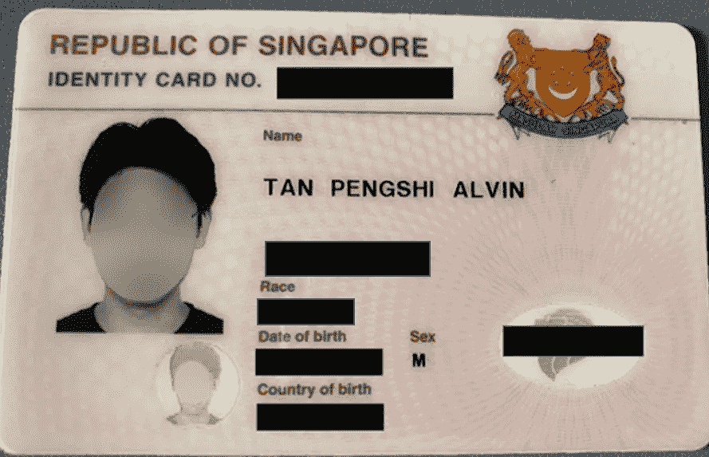

# 图像、视频和实时流中的面部遮罩

> 原文：<https://towardsdatascience.com/personal-identity-masking-in-images-videos-and-live-stream-28892f9db46f>

## 一个简短的教程，教你如何有效地模糊人脸以去除个人身份

图片由[布鲁诺·山崎](https://unsplash.com/@mryamazukino)在 [Unsplash](https://unsplash.com/) 上拍摄

个人身份屏蔽技术已经在计算机视觉和自然语言处理中得到应用。在这里，在计算机视觉中，当这些媒体中的其他信息优先于所涉及的个人身份时，面部掩蔽或*个人去识别*通常被部署在图像、视频和直播流中。

例如，如果受访者不希望在新闻采访中被认出，他或她的选择可以通过在视频会议期间模糊她的脸来尊重。在其他应用中，例如由外部方捕获身份证中的某些非个人信息，也可以编写脚本来迭代地自动掩盖每个卡中的人脸。

在本教程中，我们将看到如何在 Python 中实现这些。我们开始吧！

# 1.简介—面部遮盖的步骤

建立人脸掩蔽模型的第一步是选择人脸检测模型。面部检测模型必须能够以合理的推理速度和接近 100%的准确度在图像或视频帧中挑选出多个面部，以便易于部署。关于人脸检测的话题在我之前的教程中已经详尽地讨论过了，在这里你可以探索各种人脸检测模型，以及它们的优缺点:

<https://medium.com/artificialis/real-time-face-detection-with-dual-shot-face-detector-dsfd-c37e19e5af3d>  

选择合适的人脸检测模型后，在以下步骤中:

1.  给定由人脸检测模型提取的坐标，将每个人脸提取为感兴趣区域(ROI)框。
2.  **高斯模糊**整个面部 ROI。在某种程度上，我们可以满足于简单的面膜。但是模糊外盒对于媒体呈现来说在美学上可能是不有用的。
3.  创建一个遮罩:创建一个与 ROI 尺寸相似的黑色方框，并在方框边缘画一个白色椭圆。
4.  在将遮罩应用于 ROI 和高斯模糊的 ROI 之后，我们然后在原始 ROI 上实现了模糊的椭圆。
5.  用更改后的 ROI 替换图像或视频帧中的 ROI。

注意，当我们应用 OpenCV 高斯模糊模块时，我们必须为它的操作指定一个内核大小。如果 ROI 的分辨率增加(因为人脸可能变得更近或更大)，较小的核维数可能无法实现类似程度的掩蔽。因此，我们添加了代码，根据 ROI 的大小在算法上增加了内核的维数。

最后，让我们演示代码和最终输出。

# 2.演示:视频和实时流中的面部遮罩

应用 DNN 人脸检测模型的实时人脸掩蔽。

代码应用 DNN 与面部掩蔽的网络摄像头。按“q”结束视频会话。

# 3.演示:图像中的面部遮罩

DSFD 人脸检测身份证图像人脸掩蔽。其他敏感文本信息被手动屏蔽。图片作者。

用于在终端上应用具有面部掩蔽的 DSFD 的代码。

# 4.最后的想法

我希望你和我一样喜欢这个简短的教程，并希望介绍的技术在不久的将来对你的探索是有用和有趣的。代码和 *requirements.txt* (包含必要的 Python 包)文件都在我的 [GitHub](https://github.com/tanpengshi/Personal_Identity_Masking_Images) 中。请在评论区告诉我你的想法，以及我们如何进一步改进面部掩蔽算法！

因为我会定期撰写文章，所以我也希望您能跟随我一起踏上学习数据科学的旅程。如果你愿意，可以看看这里教你如何有效地学习数据科学或任何其他学科的文章:

</a-brief-guide-to-effective-learning-in-data-science-637de316da0e>  

再见，祝你学习愉快。干杯！_/\_

> *感谢阅读！如果您喜欢这些内容，请在* [*媒体*](https://tanpengshi.medium.com/) *上阅读我的其他文章，并在*[*LinkedIn*](https://www.linkedin.com/in/tanpengshi/)*上关注我。*
> 
> ***支持我！***——如果你*没有*订阅 Medium，并且喜欢我的内容，请考虑通过我的[推荐链接](https://tanpengshi.medium.com/membership)加入 Medium 来支持我。

<https://tanpengshi.medium.com/membership> 