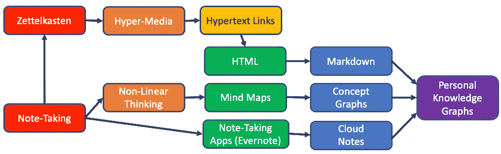
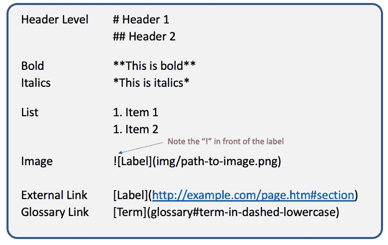
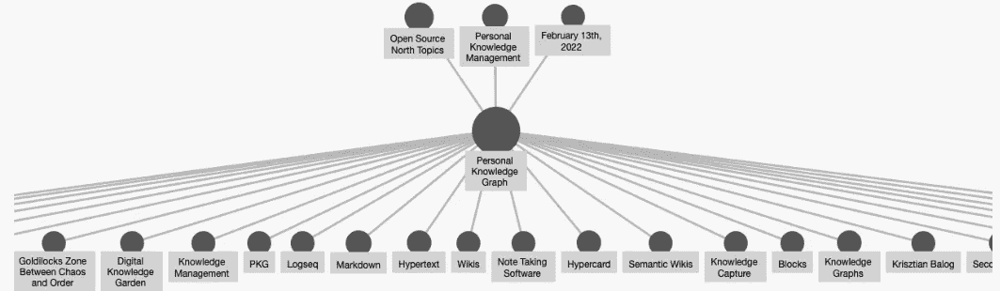

# 个人知识图表

> 原文：<https://towardsdatascience.com/personal-knowledge-graphs-9a23a0b099af>

## 新一代笔记工具帮助我们快速地将想法组织成知识图表

个人知识图的演变。图片由作者提供。

去年，我的老朋友阿伦·巴特丘向我介绍了新一代创建个人知识图表的软件(PKG)。虽然 PKG 的概念可以追溯到 [2019](https://krisztianbalog.com/files/ictir2019-pkg.pdf) ，但这个术语最近变得流行起来，因为新一代的笔记软件使用了知识图表表示。

这篇博客将向您介绍 pkg，然后讨论 pkg 可能如何影响您的整体企业知识管理战略，以及它们最终可能如何与 [**企业**知识图](https://dmccreary.medium.com/a-definition-of-enterprise-in-ekgs-561283d37deb)协同工作。

剧透预警:我上钩了！

## 什么是个人知识图谱？

PKG 是一种新的软件，它允许你以灵活的非线性知识图表的形式有效地做笔记。pkg 是从旧的线性笔记和概述软件发展而来的。pkg 很快在学生、研究人员、软件开发人员、博客作者和创造性内容作者中流行起来。

## 使用链接便笺记笔记的简史

早在 16 世纪，德国的研究人员开发了一种叫做 [Zettelkasten](https://en.wikipedia.org/wiki/Zettelkasten) 的知识获取系统。它本质上是一种将想法放在索引卡上的方式，显示想法或概念如何与其他概念相关联。Zettlekasten 提出的“一卡一概念”和“概念链接”的概念在 20 世纪 60 年代通过“超媒体”的概念转变为电子形式，其中文档的任何部分都可以链接到该文档或任何其他文档的任何其他部分。超媒体演变成超文本，成为超文本标记语言(HTML)的基础。2001 年，万维网(蒂姆·伯纳斯·李)的作者们也试图给这些链接添加关系类型，这成为了语义网的基础。语义网试图使在网页上存储分散但仍然相连的信息变得更容易。

在概念链接发展的同时，我们看到了个人[笔记](https://en.wikipedia.org/wiki/Note-taking)软件行业的增长。这些电子工具，如概述工具、思维导图工具和跨平台工具，如 [Evernote](https://en.wikipedia.org/wiki/Evernote) ，允许个人在许多不同的设备上创建和保留他们的笔记，如手机和平板电脑。这些不同的设备都被绑定到一个云连接存储系统，这样你所有设备上的所有笔记都可以保持同步。

## 知识获取和知识交换降价的兴起

示例备忘单显示了常见的降价语法—图片由作者提供。

尽管这些笔记工具很方便，但它们缺乏一种简单的方法来捕捉和交换系统之间的关联知识。像 HTML 这样的标记语法是可移植的，但是大多数用户不想用超文本来记录他们的笔记，因为格式化像到其他概念的链接这样的东西需要太多的工作。我们需要的是一个更容易输入的“轻量级”HTML 版本。

2004 年，[减价](https://en.wikipedia.org/wiki/Markdown)模式就是为了这个目的而创立的。一种用户快速输入知识的轻量级方式，不需要他们创建高度结构化的标记。任何文本编辑器(比如记事本)都可以用来创建标记，将 Markdown 转换成 HTML 只需要几百行 Python 代码。**自 2004 年以来，Markdown 已经稳步发展成为软件工程师和数据科学家创建代码文档的首选方式。**现在，这是在 [GitHub](https://docs.github.com/en/get-started/writing-on-github/getting-started-with-writing-and-formatting-on-github/basic-writing-and-formatting-syntax) 上用 [Jupyter Notebooks](https://jupyter-notebook.readthedocs.io/en/stable/examples/Notebook/Working%20With%20Markdown%20Cells.html) 在数据科学中捕获文档，以及用 [Microsites](https://dmccreary.medium.com/auto-generating-ekg-documents-2c85f1e45f44) 创建项目文档的默认方式。甚至传统产品如谷歌文档也在增加降价功能。

将“智能自动完成”添加到像 VisualStudio 这样的 ide 中，可以更容易地创建和编辑标记。想指出你的回购中的一个图像吗？只需输入一个"！空间。它始于创新项目，如漫游研究和开源产品 T2 黑曜石。

## 为什么个人知识图这么受欢迎？第二大脑理论。

“第二个大脑”经常在 PKG 社区出现。随着时间的推移保留这些知识的想法是一个流行的卖点。图片来自黑曜石文档网站。作者截屏。

几乎任何研究领域的新信息量都呈指数增长。对一个主题进行简单的谷歌搜索就像用消防水管喝水一样——很难在源源不断的信息中找出什么是必要的。这里有一些人们告诉我他们喜欢他们的 pkg 的常见原因。

## 优势一:快速整理思路

pkg 允许你快速组织来自这些信息流的信息，找出什么是重要的，在现有主题之间建立新的联系，并创造你的洞察力。您可以导入任何文本，只需突出显示一个单词或短语并键入“[[”，它就会神奇地变成概念图中的一个顶点！当你输入的时候,“自动完成”可以告诉你你的 PKG 中是否已经有了它，这样你就可以快速地将条目链接在一起。

## 优势 2:降低你的认知负荷

在使用 pkg 之前，我经常会在连续不断的会议日程中感到紧张。我很少有时间在会议间隙写下我的想法，并在我学到新内容时尝试重新安排任务的优先顺序。现在，我既可以在会议中做笔记，也可以将笔记链接到我现有的知识库。我的压力水平已经下降了！

问题是我们大脑的短期记忆只能容纳固定数量的东西。如果我们不能让他们致力于文件，他们就会消失。我记得几天或几周后，我忘记写下这些新想法。

其中许多都与“卸载”记忆概念及其与另一个系统的关系的任务有关。这些通常被称为关于 pkg 为什么有用的“第二大脑”论点。你的 PKG 成为了你真实大脑的“持久影子”——它以一种非线性结构——一种图表——存储了关键概念及其关系，类似于我们大脑的工作方式。

## 优势 3:促进非线性思维

我经常看到的第三件事是，pkg 帮助我们脱离“线性思维的暴政”。遍历的顺序通常是固定的。这与使用包含固定顺序的项目列表的文档的传统笔记形成对比。文档顺序要求我们有一系列的小节。

但是你在记笔记时遇到信息的固有顺序可能**而不是**是你洞察世界的真正方式。大纲工具可以让你重新安排主题的顺序，并弹出和向下弹出章节的顺序。尽管如此，它远不如将每个主题连接到现有的知识图那样灵活和强大！

## 优势四:长期坚持

似乎公司每隔几个月就会改变存储知识的方式。这一年可能是存储在文件夹中的 MS Word，第二年可能是 wiki，然后可能是 Microsoft Sharepoint，现在我们看到 GitHub 上的微型网站的转移。每当一个组织改变它的工具，知识就会丢失。因为它们是围绕像 easy edit Markdown 这样的标准构建的，所以我们现在希望这些数据可以长期存在。虽然像概念链接、标签和别名这样的东西还没有跨平台标准化，但我们希望轻量级 PKI 不可操作性标准不需要实现完整的 [DocBook](https://en.wikipedia.org/wiki/DocBook) 兼容性清单。

## 优势五:打破写作障碍

我的目标之一是尝试每隔一周写一篇博客。有时候我有个想法，写第一段，就被堵死了。我想不出如何组织我的思想，让我的读者感到有些连贯。如果我为想法准备了很多小图表，我可以看到它们随着时间的推移而增长。比喻就是种植你的“数字创意花园”，让它们自然生长。当我在一个子图中有十几个好主意时，可能是时候把它变成一个真正的博客了。

这些优点是我个人对如何使用 pkg 的看法。如果你在谷歌上搜索，你会发现学生、研究人员、创意作家和博客作者都在以不同的方式使用 pkg。

# PKG 工具的挑战

个人知识图表博客的早期图表的屏幕图像。请注意，这个渲染是“平面”的，没有显示底部的概念是如何相互关联的——图片由作者提供。

尽管 PKG 的工具如[漫游研究](https://roamresearch.com/)和[黑曜石](https://obsidian.md/)相对较新，但它们正在迅速增加新功能(免费和收费)。我最大的挑战是试图与他人分享我的 PKG 的子部分，并在微型网站上发布子图布局。现在，我们需要进行原油进出口操作，将我们的知识图表整合到一个可以合作的地方。然而，我怀疑这些新功能会很快出现。

我对当前这一代工具的最大挑战是我生成子图可视化的方式有限。就像使用强大的 [GraphViz](https://graphviz.org/docs/layouts/) 库一样，我希望能够尝试多种受约束的布局算法，并使用自上而下和从左至右的布局。我想用一种类似于[点](https://graphviz.org/doc/info/lang.html)的语言来指定这些布局规则。我想“固定”布局中各种节点的排列，这样它们就不会在我添加新项目时随机改变。我相信所有这些功能都会随着时间的推移而出现。现在，我们可以编写 Python 脚本，将 Markdown 转换成[美人鱼](https://squidfunk.github.io/mkdocs-material/reference/diagrams/#usage)结构，用于我们发布的微型网站的自动布局。

这些工具也不允许我向我的关系添加类型或属性。这也可能出现在未来的版本中。请记住，一点点的语义大有帮助！

# 对企业知识图市场的影响

顶点级基于角色的访问控制(RBAC)是 TigerGraph 或 Smartlogic 的本体编辑工具等企业级知识共享系统的标志。

现在，这些 PKG 系统都是云支持的桌面工具或网站。他们没有基于角色的细粒度访问控制规则，因此我可以授予我的团队对我的 PKG 子集的读或写访问权限。

然而，我不相信快速增长的 PKG 市场会找不到想要结合笔记自由流动的本质和正式策划和批准的知识图表系统的客户。随着 API 的发展，我可以很容易地看到一些功能，比如“将这个子图发布到公司的本体服务器进行审查。”

# 法律问题:谁拥有你的 PKG？

我不禁想到，人们构建他们的超高质量 pkg 的复杂性将如何与对组织的知识产权的关注重叠。20 世纪 80 年代，当我在美国电话电报公司·贝尔实验室工作时，我们所有的书面工程笔记都需要用标准化的美国电话电报公司·贝尔实验室蓝线笔记本完成，并标上单独的页码。我们被要求记录每一个条目的日期，这样我们就可以使用这些正式的笔记系统来保护我们的知识产权和专利。我们被告知，添加一个日期、几行文本和简单的图表可以为公司节省数百万美元。然而“个人”这个词意味着你拥有自己的第二个大脑。这将与公司法律人员保护其知识产权的担忧背道而驰。

# 入门指南

我最后的评论是，你可能需要一段时间来适应这些新工具。它们有点粗糙，还没有更成熟的笔记工具那样的表达方式和灵活性。我的建议是要有耐心，给自己几天/几周的时间来调整工具，以符合自己做笔记和发布的风格。尝试不同的组织概念的方法，看看你是否能找到一种有效的模式。

尽情享受吧！