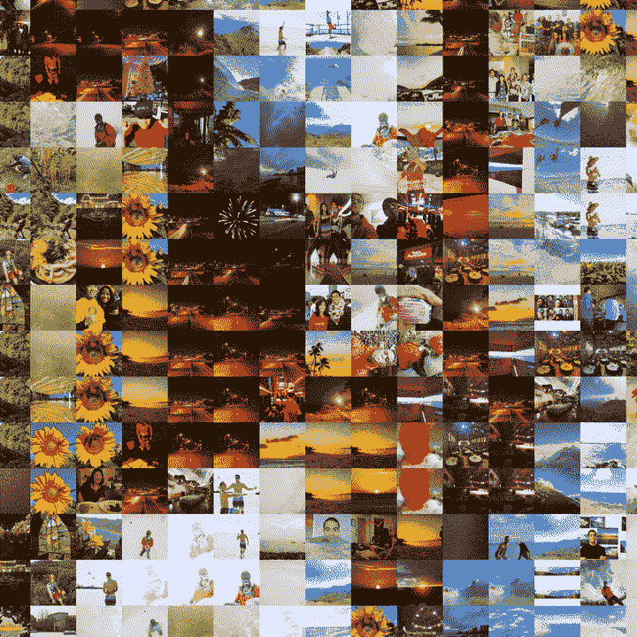
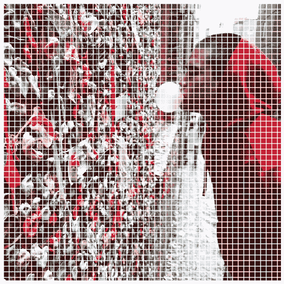
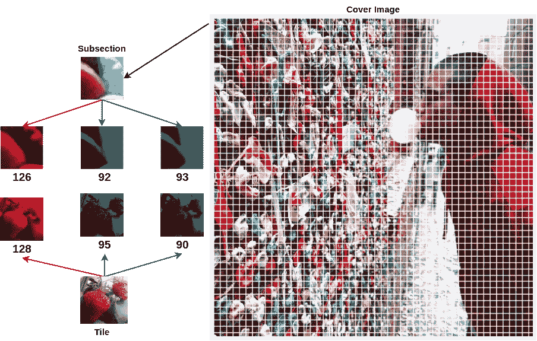
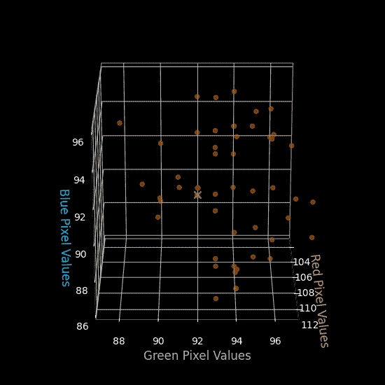

# 最近邻的照片镶嵌:数字艺术的机器学习

> 原文：<https://towardsdatascience.com/photo-mosaics-with-nearest-neighbors-machine-learning-for-digital-art-79ec51c55fe1>

## 数字艺术的机器学习

## k-最近邻帮助我们高效地在多维色彩空间中搜索合适的图像，以重新调整旧图像的用途并生成美丽的马赛克。

照片马赛克(图片由作者提供)

# TLDR

*   机器学习可以艺术地用于创建照片马赛克
*   当不可能总是精确匹配时，用 K-最近邻建模提供了一种健壮的搜索方法。
*   [查看照片拼接动画的完整目录](https://www.youtube.com/watch?v=tq-sQ0m1R40&list=PLvaAMsy5gV_UMmFxdwHYm00U6OrG-JLvp)
*   [在这里获得你自己的马赛克！](https://www.fiverr.com/share/DKqb9a)

# **什么是照片马赛克**

下面举个例子！

放大动画，推荐全屏观看。(作者视频)

技术创新正在快速增长，并使数字存储变得极其廉价和容易获取。此外，现在大多数人都有带摄像头的手机，可以拍摄高质量的图像。大多数拍摄的图像被浏览几次，然后被发送到硬盘或一些云存储服务上。这导致人们积累了大量的图片库。我也不例外，因为我在新冠肺炎封锁期间有一些额外的时间，我想出了一些软件来给人们图书馆里的照片第二次生命。这个软件创建照片马赛克。

照片马赛克是通过将许多较小的图像拼接在一起而创建的图像或照片。在上面的 gif 和视频中，很容易看到有多少小的图像方块被用来创建一个更大的图片。创建这些马赛克有几种方法；例如，可以基于颜色或图像结构选择较小的图像方块或图像块并将其放置在较大的图像中。在这篇文章中，我们将重点讨论颜色匹配策略，这是数据科学或机器学习受众特别感兴趣的，因为它利用了 K-最近邻(KNN)建模方法。

# 框定问题

与往常一样，解构问题并围绕完成目标所需的各种组件构建功能是一种很好的做法。首先，我们需要将较大的或封面图像分割成较小的子部分(见图 1[)。下面](https://www.lambertleong.com/projects/photo-mosaic#img-subsection))。一旦我们有了更小的子部分，我们就可以找到匹配每个子部分的图像块。我们使用颜色匹配方法来构建马赛克，因此我们可以将问题形式化如下:对于每个封面图像子部分，找到与颜色最匹配的图块图像。

**图 1:** 在这里，我们将封面图像分成由白线表示的正方形子部分。(图片由作者提供)

# 彩色图像的结构

数字彩色图像由不同的像素颜色通道组成，这些通道组合在一起会生成彩色图像。常见的格式是红绿蓝或 RGB 图像格式，其中彩色图像由红色、绿色和蓝色通道组成。图像通常以 8 位存储，这意味着每个颜色通道的像素值范围在 0 到 255 (2⁸-1).)之间

**图 2:** 这里，我们捕获了子部分(顶部)和图块(底部)的平均 RGB 值。库中没有与该子部分完全匹配的内容，但已经很接近了。(图片由作者提供)

如果我们取每幅图像的平均红色、绿色和蓝色像素值，我们可以用三个数字来描述每幅图像的总体颜色。因此，为了找到适合每个子部分的图块，我们需要找到具有相同平均 RGB 像素值的图块。我们可以首先为封面图像中的每个子部分创建一个平均 RGB 像素值列表。然后，我们可以从我们的图块照片库中制作一个平均 RGB 像素值列表。一旦创建了这两个列表，我们可以迭代子部分列表并搜索图块列表库以找到匹配的平均 RGB 像素值。

通过巧妙的动态编程和高效的数据结构，这种搜索可以相对较快地执行。然而，这种方法有一个需要解决的主要缺陷。可能的情况是，您的图块图像库不完整，并且没有代表每个平均 RGB 像素值。因此，搜索具有精确平均 RGB 值的图块将一无所获，[见图 2](https://www.lambertleong.com/projects/photo-mosaic#img-color_matching) 。解决方案是找到具有最接近匹配平均 RGB 值的下一个图像块。广泛的研究已经开始确定颜色的“接近度”。例如，众所周知，黑色和白色一点也不接近。然而，我们的解决方案很简单，它利用了机器学习。

# K 近邻的最接近颜色

每个子部分和单幅图块由三个数字表示，分别代表红色、绿色和蓝色的平均值。我们可以将这三种颜色值视为一个单独的维度，因此，我们可以创建一个 3D 绘图，其中每种颜色都是一个维度或轴。如果我们绘制子部分的值，我们正在为其寻找匹配的图块，在我们的库中有可能的图块，我们可以看到哪些图块具有最接近的颜色值。

**图 3:** 分段的平均 RGB 值以红色绘制。RGB 值相近的图块以橙色绘制。使用 KNN，我们可以找到用黄色“X”表示的最接近的匹配。(图片由作者提供)

KNN 算法可以评估库中的所有图块，并对平均像素值进行建模。然后，当搜索每个子部分的匹配分块时，模型将返回颜色值最匹配的最近邻居或分块。这个搜索如图 3 所示。使用 KNN 比强力搜索精确值更可靠，因为有些情况下精确值可能不存在。在引擎盖下，可以使用树状结构构建 KNN 模型，这使得搜索或遍历它相对高效。因此，性能也可与我们提到的其他解决方案相媲美。一旦为每个子部分颜色找到了所有的拼贴块，就可以使用简单的阵列/矩阵索引来将所有的拼贴块图像缝合在一起，以创建封面照片的最终马赛克。

# 关闭

[如果你想要自己的照片拼图，或者需要帮助制作，请随时联系我们。](http://lamberttleong@gmail.com)我们可以改变硬盘上积满灰尘的旧图片的用途，给它们第二次机会去创造美好的事物。嘿，也许他们甚至可以成为 NFT！

让我们来看另一个使用不同动画的照片镶嵌示例。所有的动画都是通过编程制作的，将在下面的帖子中详细介绍。

分散动画，推荐全屏观看。(作者视频)

*原载于 2022 年 7 月 3 日 https://www.lambertleong.com***。**