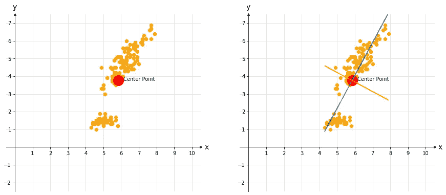
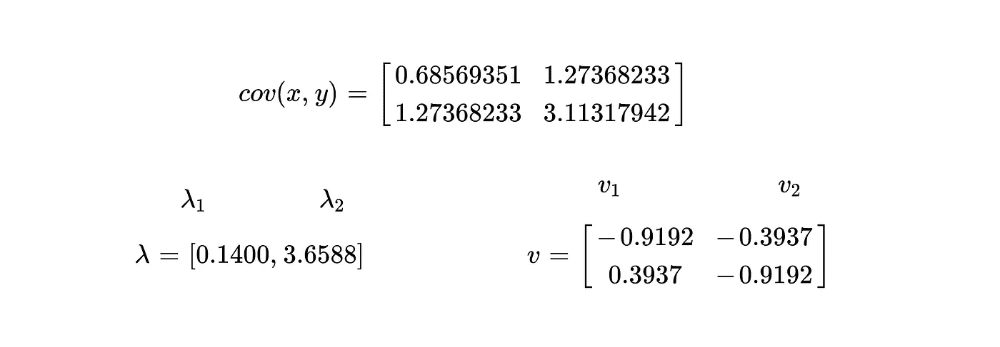
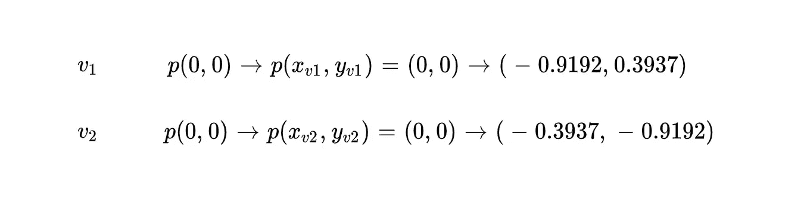
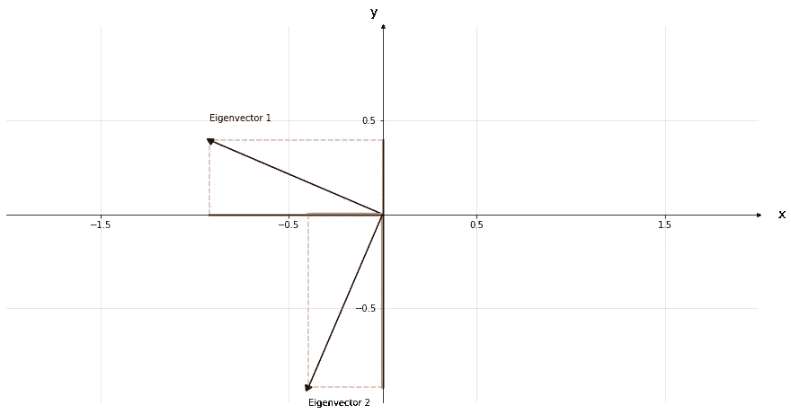
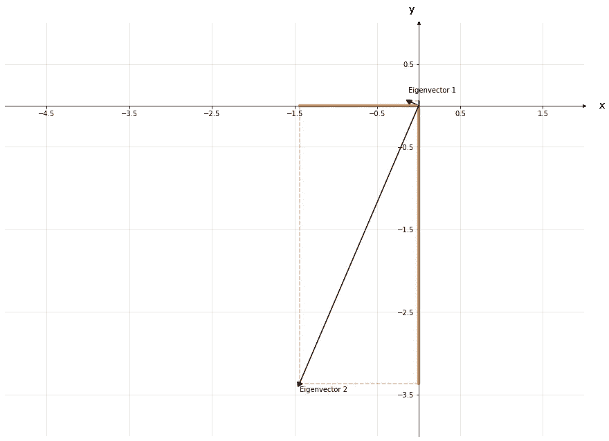
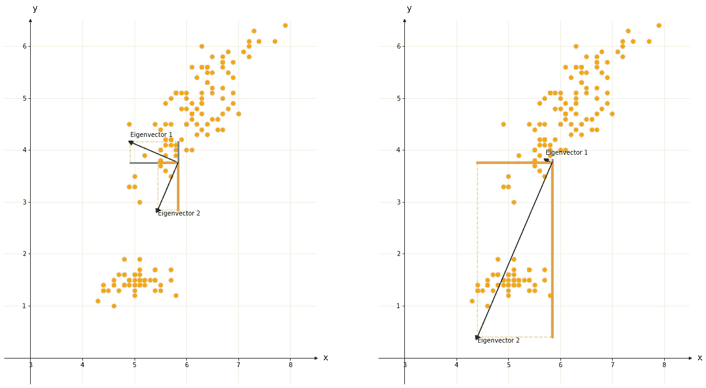

# 协方差矩阵的物理意义

> 原文：<https://towardsdatascience.com/physical-significance-of-covariance-matrix-e83110dddf27>

## 特征向量的几何意义

绘图是查看数据本质的最佳方式之一。变量之间的变化不用任何数学计算就可以很容易地看出来。尽管如此，您可能希望深入细节，从数学上解释这些变化，并决定使用协方差矩阵。虽然协方差矩阵看起来只是一个显示变量间方差的矩阵，但它包含了解释数据趋势的基本信息。通过协方差矩阵的特征向量，可以找到变化的方向、斜率和幅度等属性。然而，解释特征向量的值比解释散点图更难。所以，知道特征向量在几何上是什么意思很重要。它有助于理解协方差矩阵的物理意义。在本文中，我将解释基于特征值和特征向量的协方差矩阵的物理意义。在本文中，我们将讨论:

*   寻找变化的方向、斜率和幅度等属性
*   解释变化的方向、斜率和幅度
*   用特征向量在散点图上创建方向、斜率和大小的可视化表达。


由[夏嫣·胡伊津加](https://unsplash.com/@iam_anih?utm_source=unsplash&utm_medium=referral&utm_content=creditCopyText)在 [Unsplash](https://unsplash.com/s/photos/woman-perspective?utm_source=unsplash&utm_medium=referral&utm_content=creditCopyText) 上拍摄的照片

## 用协方差解释散点图

在我们进入协方差矩阵的细节之前，让我们试着理解我们可以从变异散点图中猜测出什么。图 1 中的散点图显示了 x 和 y 变量的数据点。基于协方差矩阵，我们至少可以解释三个物理属性。

*   最大变化的幅度
*   向量的斜率取决于最大变化。
*   垂直于最大变化方向上的变化幅度

这些属性在图 1 的右侧用蓝色和橙色线条表示。这些线是在没有任何计算的情况下，通过猜测可能的最小和最大变化而画出的。蓝线表示数据点最易受变化影响的位置，橙线表示垂直于蓝线的数据点不易受变化影响的位置。



图 1 —两个变量的散点图(图片由作者提供)

然而，变量“x”和“y”之间存在正的变化/关系。尽管如此，我们并不确切知道蓝线和橙线大小的差别，正如我们不知道它们的斜率和位置一样。了解这些性质将使我们能够从数学上定义正负变化，并理解一个变量的值如何根据另一个变量的变化而变化。

# 特征向量的几何意义

公式 1 显示了 x 和 y 变量的协方差矩阵的特征向量和特征值。如果你是解释特征值和特征向量的新手，这些值应该不会在你的脑海中响起。但是，当你看到散点图上这些数字是如何转化为物理向量的，你就会清楚地明白它们的含义了。在我们进入几何之前，让我们看看公式 1 中显示的矩阵。

λ代表特征值，v 代表特征向量。列 v1 是第一特征向量，列 v2 是第二特征向量。这些特征向量是归一化的(单位)向量。当它们乘以相应的λ值时，我们将得到它们相对于数据点的实际大小。因此，特征向量代表归一化向量，而特征值代表特征向量的大小。然而，表示特征向量的矩阵的对角线值具有相同的大小，但是符号相反，正的和负的。这给了我们关于这两个向量是否相互垂直的线索，如图 1 所示。这也意味着 EV1 和 EV2 是分别代表负变化和正变化的向量。



公式 1—协方差矩阵、特征值和特征向量

那么，这些值在几何上意味着什么呢？特征向量的值分别代表坐标系上的点`x`和`y`。从公式 2 可以看出，特征向量的第一个和第二个元素表示从中心((0，0)或变量的平均值)到点`(-0.9192, 0.3937)`的向量。同样，从中心到点`(-0.3937, -0.9192)`的线表示第二个特征向量。



公式 2 —特征向量的坐标

让我们在 2D 坐标系上显示这些向量。



图 2-在 2D 坐标系上显示单位特征向量

由于特征向量 1 (EV1)和特征向量 2 (EV2)是归一化的单位向量，因此它们看起来大小相同，但彼此垂直。这意味着这些特征向量的斜率解释了不同方向的变化。第一个结论是 EV1 在“x”轴上比在“y”轴上覆盖更多的空间。因此，EV1 的单位变化将使“x”值的变化大于“y”值的变化，反之亦然。当 EV1 向量增加一个单位时,“y”和“x”值会以相反的方向变化。然而，当 EV2 向量增加一个单位时,“y”和“x”的值以相同的方向变化。既增又减。

## 特征向量的斜率

使用特征向量的“x”和“y”点可以找到特征向量的斜率。由于斜率定义为“y”的变化除以“x”的变化，因此我们可以用以下公式计算 EV1 的斜率。

```
Slope EV1: Δy/Δx= (-0.9192 - 0) / (0.3937 - 0) = -2.334
```

和 EV2

```
Slope EV2: Δy/Δx= (-0.9192 - 0) / (-0.3937 - 0) = 2.334
```

EV1 的斜率为负，而 EV2 的斜率为正。这再次表明，EV1 是表示负变化的向量，EV2 是正变化的向量。

## 特征向量的大小

向量的大小证明了两个变量之间的变化在正方向还是负方向上占主导地位。将这些特征值乘以对应的特征向量，有助于我们比较 EV1 和 EV2，找到占优势的变化方向。下图 3 显示了实际的向量大小。



图 3 —乘以相应特征值后的 EV1 和 EV2

将每个向量与相应的特征值相乘后，可以在图 3 中看到特征向量之间的差异。这个结果使我们想到向量 EV2 代表较高的变化，这是一个正的变化。为了清楚地理解它，可以通过将中心点从(0，0)更改为“x”和“y”的平均值，将这些向量投影到散点图上，如图 4 所示。



图 4 —将特征向量投影到散点图上

EV2 大约是向量 EV1 的 25 倍。意味着“x”和“y”之间存在高度正相关关系。

# 结论

协方差值本身代表了太多的信息。正/负和协方差值的大小分别代表变化的方向和强度。在本文中，我们深入研究了协方差矩阵，并提取了一些基本属性，从中我们可以看出这些数字在物理/几何上代表了什么。了解如何提取和解释这些属性将有助于您理解数据的特征。

## 参考

**【1】**特征向量概述:【https://wiki.pathmind.com/eigenvector】
**【2】**求向量的斜率:[https://www . ck12 . org/book/CK-12-三角学-概念/section/5.18/](https://www.ck12.org/book/ck-12-trigonometry-concepts/section/5.18/)
**【3】**散点图完全指南:[https://chartio.com/learn/charts/what-is-a-scatter-plot/](https://chartio.com/learn/charts/what-is-a-scatter-plot/)