# 物理学和人工智能:物理学通知神经网络导论

> 原文：<https://towardsdatascience.com/physics-and-artificial-intelligence-introduction-to-physics-informed-neural-networks-24548438f2d5>

## 这里是什么是物理学通知神经网络，为什么他们是有益的

马克·柯尼希在 [Unsplash](https://unsplash.com/s/photos/physics?utm_source=unsplash&utm_medium=referral&utm_content=creditCopyText) 上的照片

> 注:这篇文章从物理学的角度探讨了物理学通知神经网络，并引导读者**从物理学到人工智能。**真正好的论文是那种反其道而行之的(**从 AI 到物理**)是下面的[一个](/solving-differential-equations-with-neural-networks-afdcf7b8bcc4)。对这篇惊人的文章大声喊出来！:)

让我们从这个开始:

> 我们通过物理学了解世界是如何运作的

使用科学的方法，我们就某一现象如何起作用提出我们的假设，建立一个受控的实验室实验，并用数据证实/否定我们的假设。

更具体地说，物理学与自然过程的**进化有关。我记得在我以前的大学里，一位教授以如下方式开始了一场会议:**

> 赫拉克利特说“万物流动”。我也相信。但是**如何？**

这就是物理学试图回答的问题:

> “万物流动”到底是怎么回事？

万物流动的方式由一些特殊类型的方程描述，称为**微分方程。**让我们试着理解它们是什么:)

# 1.物理学和微分方程

单词“**微分**”暗示着与“减法”有关的东西，这是真的。我们再深入一点。

## 1.1 导数的概念

函数的**导数**在物理学中有特定的作用。例如，**速度**只不过是空间对时间的导数。让我们考虑下面的实验，其中我们有一个沿着 1D 棒移动的物质点

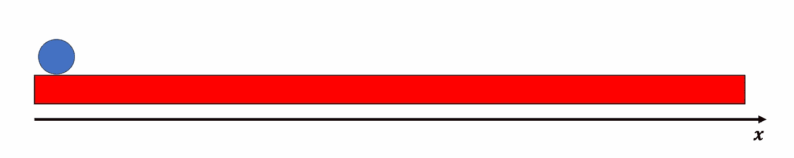

作者图片

所以让我们把注意力放在沿着 x 轴移动的蓝色球上。特别的，假设起点是我们的 0。当球移动时，它的**位置**会随着**时间而改变。**具体来说，假设位置与时间的关系曲线如下:

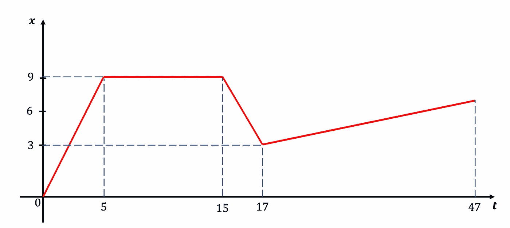

作者图片

所以让我们更仔细地描述一下:

A.**从时间 0 到时间 5** 位置从 0 到 9 变化:球向前移动
B. **从时间 5 到时间 15** 位置完全不变:球静止不动。
C. **从时间 15 到时间 17** 位置从 9 到 3 变化:球向后移动。
D. **从时间 17 到时间 47** 位置从 3 变为 6:球再次向前移动。

现在，如果有一个量告诉你球何时以及如何改变它的位置，不是很好吗？知道**位置变化有多大**不是很好吗？这个信息就是**速度**，它有如下表达式:

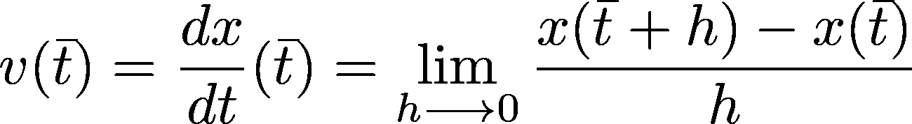

方程式(1)

我知道这听起来令人困惑，但请听我说完。
速度只不过是两个非常接近的时间内位置的**差**(这就是为什么这个方程被称为**微分**方程)除以这个非常接近的差(也就是为什么我们有**h 的极限，它趋向于 0** )。换句话说，它是由时间距离归一化的位置的即时变化。

> 如果在某个时刻(t1)，你有一个非常重要的位置增加，这意味着导数非常大，而且是正的。如果在那一瞬间位置不变，导数为零。如果变化是负的(数量减少),导数是负的。

在我们的例子中，位置按部分线性变化**，这意味着从 0 到 5、从 5 到 15、从 15 到 17 以及从 17 到 47，变化的实体是相同的。**

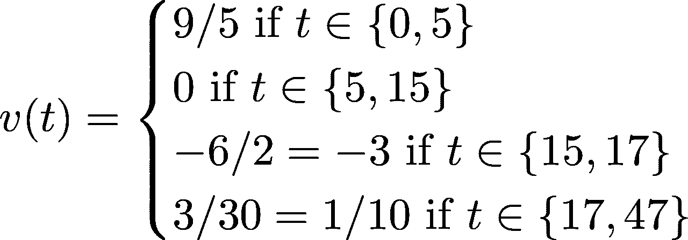

这是因为 t 在 0 和 5 之间的瞬时变化与 t = 0 到 t =5 的变化相同，是 9/5，同样的推理适用于上述函数中描述的所有其他时间。

## 1.2 数值解

现在，我们的情况非常简单。让我们考虑下面的过程:

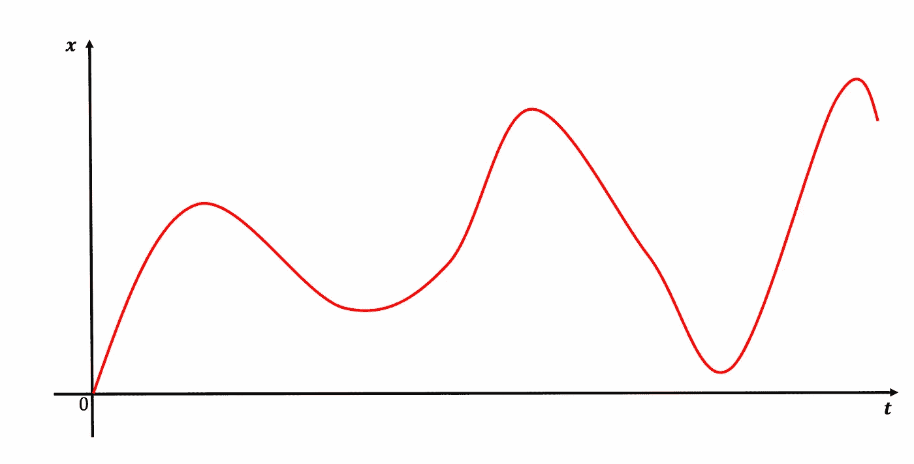

作者图片

现在，这个轨迹更加难以建模，因为没有办法解析地计算导数**:**你可以用数字**代替**。这意味着您只需将等式(1)中给出的导数定义应用于时域中的所有点。顺便说一句，我想你终于准备好面对残酷的事实了:

> 所有真实世界的微分方程都用数值软件求解

问题是**数值解**可能需要进行成千上万次迭代。此外，它们需要一种智能的方法来求解微分方程(一种非常众所周知的方法被称为 [**龙格-库塔**](https://en.wikipedia.org/wiki/Runge%E2%80%93Kutta_methods) )，这种方法通常被集成到更复杂的软件中(例如 **POGO** 用于**有限元方法**)。这些软件:

1.  计算成本**高吗**
2.  钱贵吗:)
3.  需要**领域知识**
4.  通常需要**长时间运行**(变化很大，但对于 FEM 示例，每次模拟从几分钟到几小时不等)

## 1.3 不适定问题

这还不是最糟糕的。一些问题被认为是不适定的。让我告诉你这是什么意思。

假设问题是“求 x 和 y”。

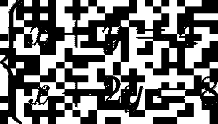

嗯，这很简单，对吧？

*   x+y=4，所以 x+2y=x+y+y=8
*   4+y=8，所以 y=4
*   x=0

解是(x，y) = (0，4)。现在这个问题是**而不是**不适定了。对于那组条件，只有一个解决方案(我们找到的)可以满足这个问题。

现在，让我们来看看这个问题:

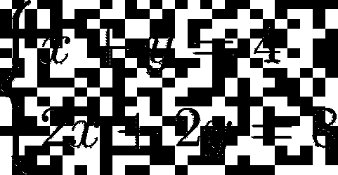

第一个和第二个方程基本相同！所以(x，y) = (0，4)仍然是一个解，但是(1，3)也是一个解，实际上有**个无限解**。这意味着这个问题是不适定的。对于一个单一定义的问题有不止一个解(实际上有无限个！).

如果我给你下列问题:

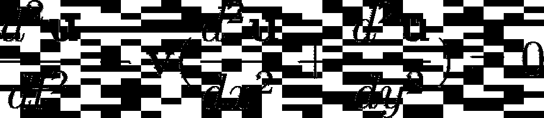

方程式(2)

所谓的**反演**问题把你从位移带到速度图。该逆问题用于使用超声波测量来表征材料中的腐蚀缺陷(例如，阅读 HARBUT 算法[此处为](https://id.elsevier.com/as/LhvqI/resume/as/authorization.ping?acwCookieCreated=true&client_id=SDFE-v3&state=retryCounter%3D0%26csrfToken%3Dcf55df08-e1ae-43e3-9281-29c6a0cb6e29%26idpPolicy%3Durn%253Acom%253Aelsevier%253Aidp%253Apolicy%253Aproduct%253Ainst_assoc%26returnUrl%3D%252Fscience%252Farticle%252Fabs%252Fpii%252FS0165212513000759%26prompt%3Dnone%26cid%3Darp-0dcabc17-0ec3-4c50-834e-347c63e4485d))。现在已经证明，即使有一个完美的实验装置(无限数量的传感器),这个问题仍然是不适定的。这意味着这些信息仍然不足以给你一个独特而稳定的速度图( **v** )。

# 2.人工智能和神经网络

再说说 AI。介绍人工智能最简单的方法是这样说:

> 人工智能算法在没有明确编程的情况下执行某项任务。

自动驾驶汽车没有经过数学和明确的训练，当世界上所有的人都走到它面前时，它会停下来，但它确实会停下来。它确实会停下来，因为它以前见过数百万人，它被“**训练成**在看到有人在它面前走过时停下来。

特别是，所有的人工智能算法都依赖于一个损失函数。
这意味着它们被**优化**以计算某个函数的最小值，该最小值是算法的**目标**(期望输出)和**输出**之间的**差**。

想象一下，给定一栋房子的某些特征，你想预测它的**成本**(顺便说一下，这是[非常著名的房屋数据集问题](https://www.kaggle.com/c/house-prices-advanced-regression-techniques))。这是一个**回归**任务(从输入空间到连续空间)。

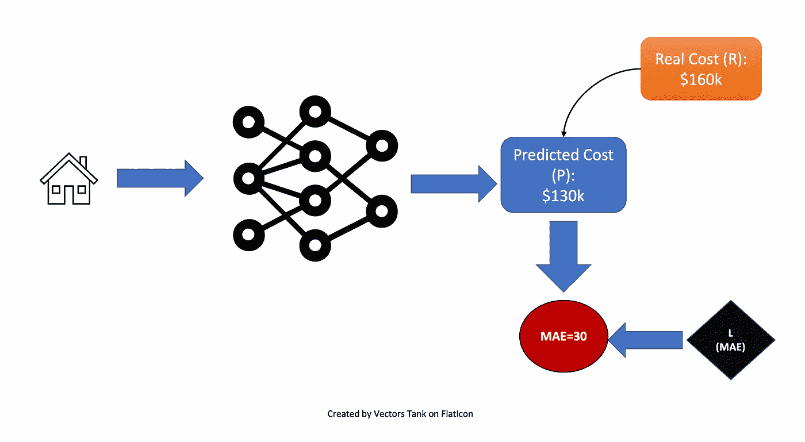

作者图片

如果您预测成本为 130，而实际成本为 160，则平均绝对误差(MAE)定义为:

是 30。

在我们的例子中我们的模型是一个**神经网络**，即 **F** ，处理输入，即 **x** ，并输出一个预测值 y= **F(x)** 。在这个例子中，y=130k，而目标值 t=160k。

更一般地说，我们会有一吨房子 x_1，x_2，…，x_N，并且会有 t_1，t_2，…，t_N 组值要预测。这意味着全局损失函数将是这样的:

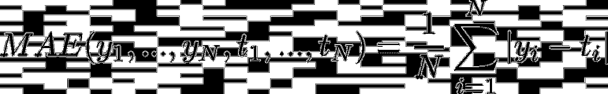

这个**损失函数**取决于你的模型的参数 **W** 的设置。当然，**最低的**是损失函数，最好的**是**。
由于这个原因，损失函数经过了**优化**，也就是说，损失函数必须尽可能低。因此，参数**被迭代改变**，以给出尽可能最小的损失函数(即，落入损失函数的局部最小值)。

# 3.AI +物理学=物理学通知神经网络

现在，如果你读了所有这些:

1.  你值得一片掌声:)
2.  你可能会问，像人工智能(神经网络)和微分方程(物理)这两种不同的东西是如何相互交流的。

为了回答这个问题，我们需要添加另一个概念，即**正则化。**

**3.1 规范一个问题**

在第二章中，我们已经看到，每一个机器学习算法最终都是一个**优化问题。**这意味着您想要找到一组最佳参数 **W_opt** ，即最小化损失函数的参数。

问题是你可能会收敛到一个在你的训练集中最优的解，但是这个解不够一般化，并且在测试集上表现很差(**过拟合**)。换句话说，你的最优值可能是一个局部最优值。

让我更好地解释一下:

假设你的宝宝模型是由两个参数(w1 和 w2)构成的。您正在探索以下空间来寻找解决方案:

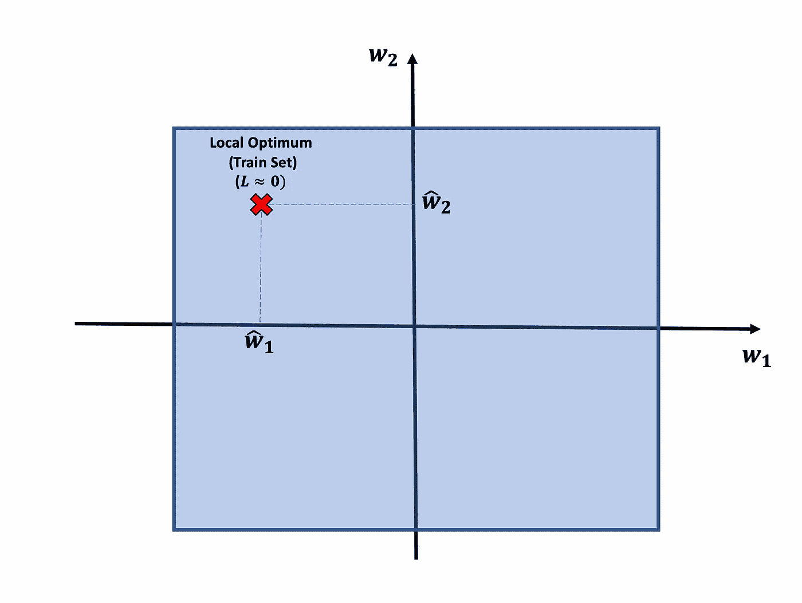

作者图片

使用训练集上的损失函数**可以得到接近于 0 的损失值。**

想象一下，在测试集(新数据集)上采用这种参数组合，损失函数会变得非常大。这意味着损失函数没有针对您的问题进行很好的定义，对于给定的模型，解决它的实际最佳方法是这样的:

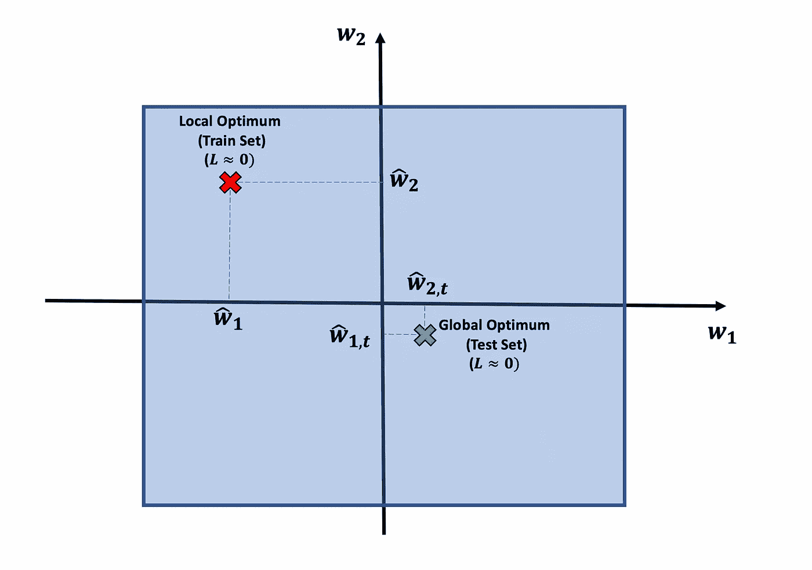

作者图片

现在，怎样才能落在**绿点**而不是落在**红点？**通过限制算法的搜索区域。大概是这样的:

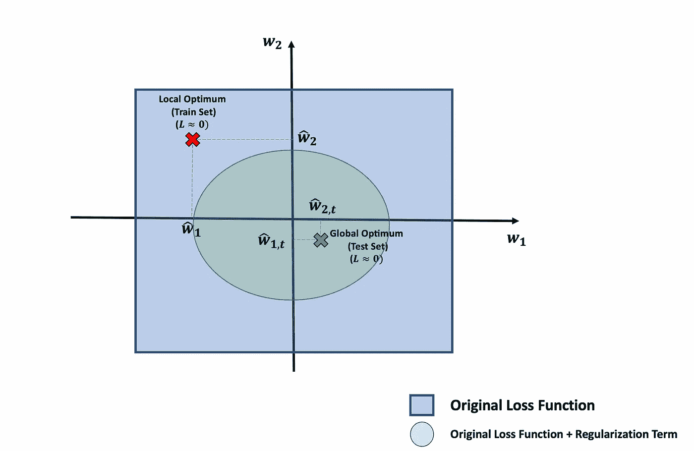

作者图片

现在，如果算法只能“看”到绿色的圆圈，就不可能会陷入红色的局部最优:)

这就是**正则化的概念:**操纵损失函数，使得解的空间受到限制，你更容易陷入全局最优而不是局部最优。

**3.2 物理学通知神经网络=正则化！**

你还记得等式(2)的反演问题吗？
嗯，[这些家伙](https://arxiv.org/pdf/2005.03596.pdf)试图解决:)

基本上，他们有某个特定位置的位移( **u** )，他们想通过在算法不知道的所有位置内插 **u** 来知道 **v** 。换句话说，给定一个新的 t，y 和 x，他们想找到新的位移，然后是新的速度图。

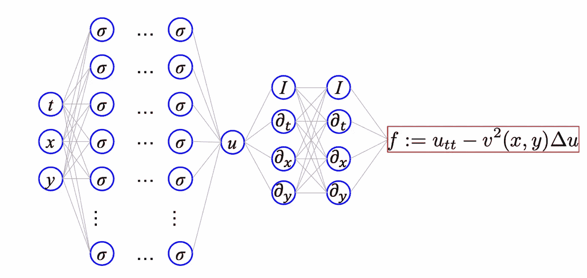

图片取自本研究[论文](https://arxiv.org/pdf/2005.03596.pdf)

现在，关于解决方案有很多争议，因为正如我们之前所说，问题是**不适定的(**或不适定的)。这意味着即使我们找到了解决方案，我们也不知道它是否是唯一的。此外，还有一些物理限制无法解决(更多关于这个[这里](https://aip.scitation.org/doi/full/10.1063/1.2717086))。让我们忽略所有这些，直奔主题。

他们想要产生位移，位移**必须满足波动方程(方程 2)** 。他们将这些信息纳入损失函数:

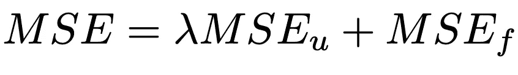

其中:

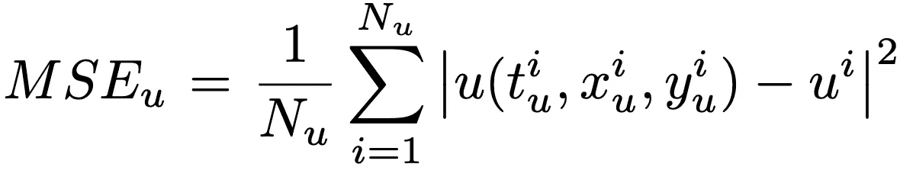

并且:

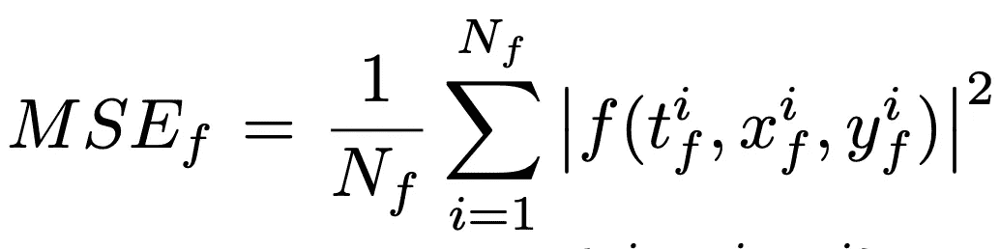

现在:

A.MSE_u 就是预测位移和目标位移的均方误差
B，MSE_f 是一个必须尽可能接近 0 的量。

简而言之，他们在做什么？无非就是一个**正规化**:

> 他们通过限制空间(惩罚不遵守微分方程的解)来帮助算法找到更好的解

为什么说神经网络是“物理学通”？因为正则化位是一个**微分方程**。:)

# 4.结论

在这篇文章的最后，我希望有一件事是清楚的:

> **物理学通知的神经网络只不过是一种神经网络，其具有作为损失函数中的正则化项的微分方程**

如果你花了 9 分钟阅读这篇文章(恭喜你，谢谢你❤),你应该知道:

A.什么是损失函数(第 2 章)

B.什么是正则化术语(第 3.1 章)

C.什么是微分方程(第一章。)

D.为什么它是物理学知识(第 3.2 章)

如果你喜欢这篇文章，你想知道更多关于机器学习的知识，或者你只是想问我一些你可以问的问题:

A.关注我在 Linkedin 上的**，在那里我发布我所有的故事
B .订阅我的 [**简讯**](https://piero-paialunga.medium.com/subscribe) 。这会让你了解新的故事，并给你机会发短信给我，让我收到你所有的更正或疑问。
C .成为 [**推荐会员**](https://piero-paialunga.medium.com/membership) ，这样你就不会有任何“本月最大数量的故事”，你可以阅读我(以及成千上万其他机器学习和数据科学顶级作家)写的任何关于现有最新技术的文章。**