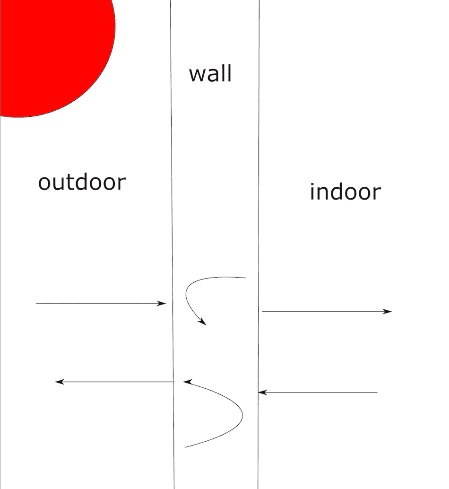
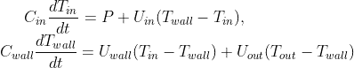
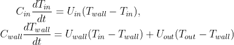
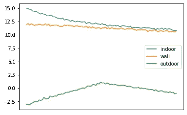
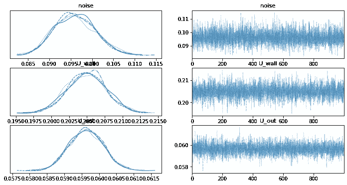

# 用于不确定性预测的物理学指导的机器学习模型

> 原文：<https://towardsdatascience.com/physics-guided-machine-learning-model-for-uncertainty-prediction-1e3b733fd798>

## 室内温度模型化选择最佳供热功率的应用实例

# 物理学指导的机器学习

虽然机器学习在许多科学领域取得了巨大成功，但遵循基本物理定律仍然是一个巨大的挑战。多个例子表明，仅仅是数据驱动的解决方案不符合物理定律。与此同时，科学中一些发达甚至成熟的理论将有助于指导 AI 收敛到更好的物理上有意义的解决方案。

与此同时，大多数物理模型不提供任何不确定性的框架，而机器学习中的不确定性量化方法有助于将不确定性引入现有的物理定律，这可能有助于我们理解数据中隐藏的相关性甚至因果关系以及简化的物理/数学模型不能完全捕捉的复杂动力学。

本文旨在证明，将物理约束纳入数据驱动的预测和不确定性量化估计模型是一种提高模型性能的有前途的方法。

下一篇文章中的示例侧重于由物理指导的机器学习模型建模的室内温度的不确定性预测。

# 室内温度的物理模型

在旧的加热器坏了之后，我需要为我的房子买一个新的加热器。我需要的力量是什么？太大，浪费力量；太小，不够热。在全球能源危机和气候变化持续的背景下，无论从保护环境还是省钱的目的，这个问题都值得一问。

在回答这个问题之前，我们需要了解温度的动态变化。让我们假设热量在室内空气和能储存大量能量的墙壁之间传递。同时，热量也在墙体和室外空气之间传递。见下图的插图。

作者图片:一栋建筑的热传递图

室内温度以及壁温和室外温度可以由牛顿冷却定律给出的以下常微分方程(ODE)来描述:

带加热功率的温度模型

其中 T_{in}，T_{wall}，T_{out}是室内、墙壁、室外温度，C_{in}，C_{wall}是室内空气和墙壁的热容量(KJ/K ), U _ { wall }，U_{out}是墙壁和室外空气的传热系数(KW/K)。这里，P 是加热系统的功率。当然，当室内暖气关闭时，等式变成:

无加热电源的温度模型

上面的等式很容易理解:温度变化的速率与温度差成正比，并由热传递和系统中不同物体的热容量决定。

如果我们想评估 P 的最小值，也就是房子应该拥有的供热功率，我们必须知道热容量和传热系数的值。

# 室内温度的贝叶斯建模

请注意，当我们测量不同人体的温度时，不确定性是不可避免的，我们将建立一个室内温度动态网络以及贝叶斯推理来学习有关参数的后验。我们想建立一个模型如下:

1.  用经典的[龙格-库塔](https://en.wikipedia.org/wiki/Runge%E2%80%93Kutta_methods)积分来描述常微分方程，这是一种数值方法，涉及以 dy/dx=f(x，y)形式求解常微分方程的逐次逼近法。
2.  给定参数的先验，用 [**马尔可夫链蒙特卡罗**](https://en.wikipedia.org/wiki/Markov_chain_Monte_Carlo) ( **MCMC** )学习后验概率。这个步骤可以通过封装 [pymc 来实现。](https://www.pymc.io/projects/docs/en/stable/learn.html)

该模型将在一个数据集上进行训练，该数据集是在我的房间里 24 小时内每 5 分钟测量一次的温度，我整天都在发抖，因为暖气是关着的:(室内和室外温度每 5 分钟测量一次。每小时的室外温度从 [MeteoFrance](https://meteofrance.com/previsions-meteo-france/paris/75000) 获得，并被插值为每 5 分钟一次的时间粒度。

作者图片:我房间的室内、墙壁和室外温度

# Python 实现

本帖执行情况可以在[笔记本](https://colab.research.google.com/drive/1EqZaubcfuGp2VxZWsWpeCcIVF1l8M4NM#scrollTo=9PElufmifIYQ)中找到。让我们快速看一下实现的关键部分:

温度模型的 Pymc 实现

该代码包含三个部分:

1.  第 6-12 行定义了参数的先验:热容量、传热系数和温度噪声。请注意，我重新调整了正确数量级的值。
2.  第 14- 35 行使用 Runge-kutta 方法来更新向量 y_mean 的值，稍后会用到它。
3.  第 37 行定义了一个正态分布，其平均值是 y_mean。该正态分布将用于采样以学习所有参数。

现在让 pymc 做它的工作，从后面抽取样本。这是我们想要学习的 U_{wall}、U_{out}和噪声的轨迹图。

作者图片:模型参数的后验概率

我需要什么样的加热功率这个问题现在很容易回答:想象一下，在最糟糕的情况下，我的房子比墙的温度低 10 摄氏度，在 95%的置信度下，我需要大约 2.1 千瓦的最小加热功率。

# 结论

在这篇文章中，我们使用了一个简单的室内温度来演示物理定律如何指导数据驱动的机器学习模型在不确定性预测中获得良好的性能。作者认为，这种方法提供了一种有前途的方法，将现有的发展理论纳入人工智能，并将引入跨领域的合作，以提高许多估计模型的性能。

我期待你的反馈和更深入的讨论。