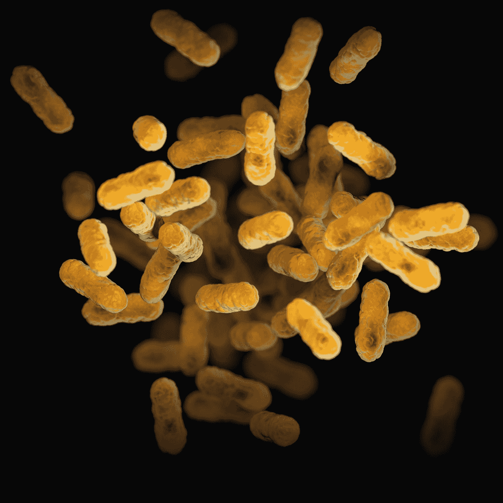
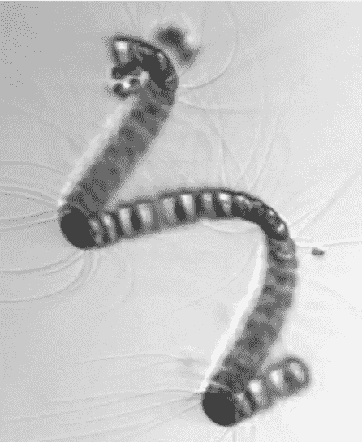

# 基于神经网络的浮游植物种类图像分类

> 原文：<https://towardsdatascience.com/phytoplankton-species-image-classification-using-neural-networks-c80481a8c82a>

## 在微观海洋图像中识别浮游植物物种以了解水下生态系统

[疾控中心](https://unsplash.com/@cdc?utm_source=medium&utm_medium=referral)在 [Unsplash](https://unsplash.com?utm_source=medium&utm_medium=referral) 拍摄的照片

地球上的海洋是环境中最有趣和生物最活跃的部分。不幸的是，这些地区的极端压力和温度等条件使得收集这些生态系统的信息变得困难。这一挫折使得分析数据和得出关于海洋生物和水生生物的发现变得具有挑战性。

然而，最近的研究表明，水中细菌的存在，特别是单细胞生物浮游植物的存在，可以帮助我们了解海洋活动和海洋部分地区的生态系统。由于浮游生物处于水生食物链的底部，这些细菌的不同物种可以对水下系统产生深远的影响，并可能使我们能够调查人类无法到达的海洋区域。

来自数据集的角毛藻细菌的图像

这个项目中使用的数据是伍兹霍尔海洋研究所收集的 100 多种不同种类的浮游植物的图像。这些数据与玛莎葡萄园岛海岸天文台收集的实时图像一起公开发布。据报道，总共有 350 万张原始图像可供数据分析，最新的分类数据来自 2014 年。在该模型中，数据集“[***”2014 年标注的 IFCB 图像***](https://darchive.mblwhoilibrary.org/handle/1912/7350) ”用于分类。在麻省理工学院的许可下，这些数据可用于商业用途，您可以在此处 找到更多详细信息 [***。***](https://github.com/hsosik/WHOI-Plankton/blob/master/LICENSE)

首先，我们使用 Open-CV 和 OS 命令来分析所有数据的图像像素数据，允许我们以 CNN 模型可以理解的格式对所有图像进行编码。我们可以通过操作 Open-CV 库功能来改变边界或裁剪图像，并使用灰度图像格式来获得单个数值，以表示数据中 28x28 图像的每个像素的光照水平。

在导出图像的实际细菌分类和像素数据值的 NumPy 数组后，我们可以使用 Keras 开发一个顺序 CNN 模型，该模型可以基于每个图像的灰度值生成一个模型。CNN 模型的工作原理是将 28×28 像素的图像分块成更小的部分，例如 16 个更小的 7×7 像素的图像，并使用可变的权重和偏差来评估分块图像代表每个细菌群的程度。然后，模型的结构对图像的不同区域进行加权，并重复分块每个图像并评估结果的过程，直到原始图像可以与单个细菌物种相关联。

通过这一过程，该模型可以评估给定图像与一种细菌的相似程度。这种模型的创建可以帮助我们了解海洋中无法到达的部分，自动对浮游植物进行分类。通过找到海洋食物链基础的物种，我们可以推断细菌所具有的特性和不同的生物特征，从而发现其他水生生物如何在深海中行为和进化。

探索广袤的地球及其奇观有助于我们了解和研究自然现象，并让我们通过科学研究推动社会进步。海洋和其他水体是自然界的一个重要话题，了解其中的事件和生态系统可以带来新的发现，为日常生活的创新和改善开辟空间。这个项目中开发的模型可以帮助我们通过对生态系统食物链中发现的细菌进行分类来探索海洋，这可能使我们有可能探索海洋的更多部分。

Yannis Papanastasopoulos 在 [Unsplash](https://unsplash.com?utm_source=medium&utm_medium=referral) 拍摄的照片

该程序允许通过神经网络建模对细菌种类进行分类。该项目的代码可以在我的 GitHub 个人资料中找到，链接如下:

***[mg 343/浮游植物-探测(github.com)](https://github.com/mg343/Phytoplankton-Detection)***