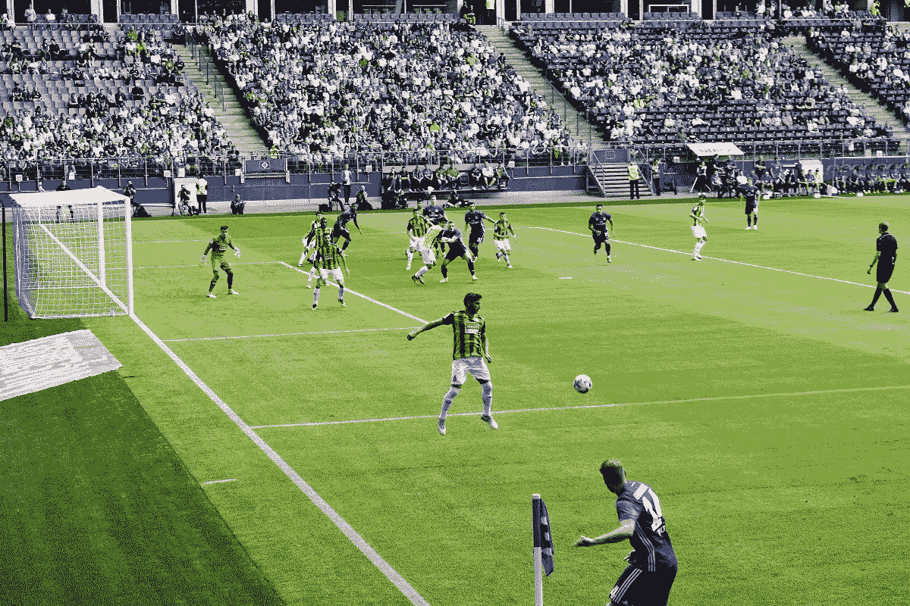
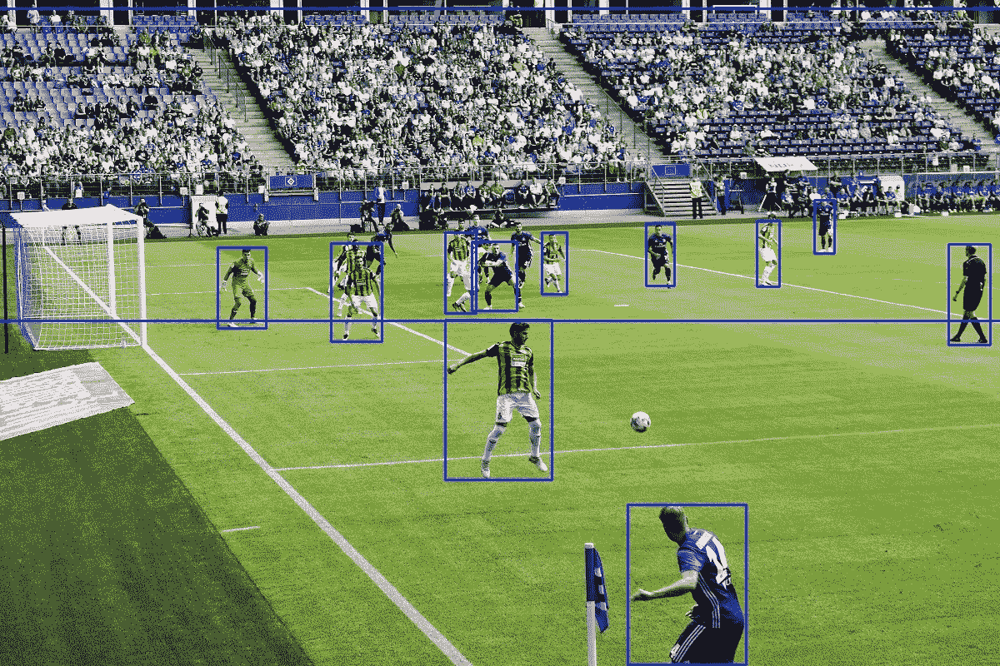
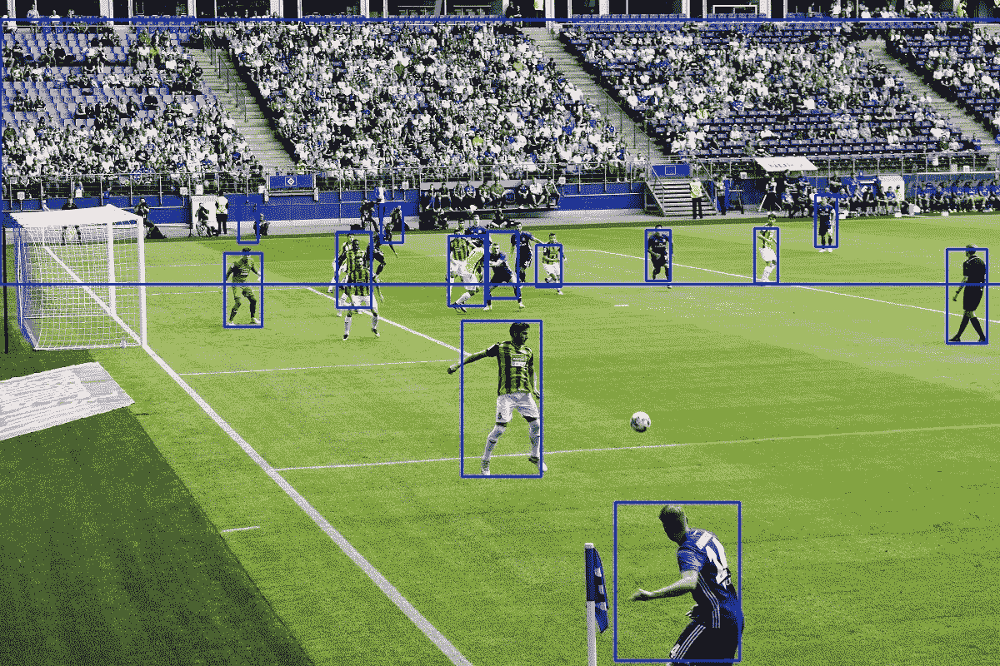
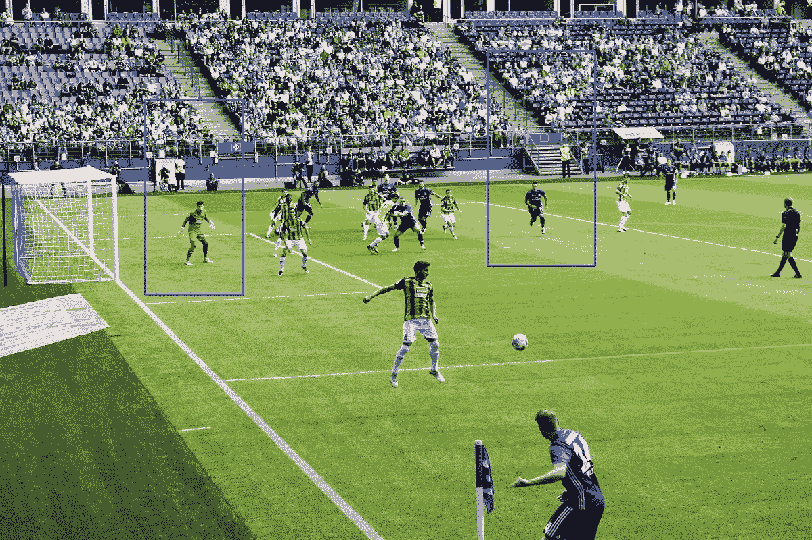

# 2021 年在 CPU 上使用 OpenCV 的快速人物检测器

> 原文：<https://towardsdatascience.com/picking-fast-people-detector-working-with-opencv-on-cpu-in-2021-ff8d752088af>

最近，我需要为一个新的宠物项目探测人。我有一段时间没有这样做了，决定看看现在什么是最好的选择。

因此，我通读了一些论文，并进行了基本测试来衡量准确性和性能。

我有要求——物体足够大，但环境可能非常不同，探测器应该尽可能快地工作。因此，我需要一个具有合理权衡的快速检测器。

此外，我在普通云上运行我的项目，大多数云单元只提供 CPU 硬件。最后，我使用 OpenCV-DNN 框架来处理神经网络。

我发现[有一篇文章](https://viso.ai/deep-learning/object-detection/)对探测器的发展进行了回顾。简而言之，有三个大时代:

*   传统的计算机视觉方法——2001 年的 Viola-Jones(又名 Haar's cascade)和 2006 年的梯度方向直方图(HOG)。
*   基于卷积神经网络的早期解决方案，其中 YOLO 和 MobileSSD 取得了最佳结果(2014–2017)
*   YOLO 及其后裔统治世界(自 2018 年起)

他们的结论是 YOLOv4 最快(还有第二种意见——yolov 5 最快)。

我发现了一个很好的关于旧时代的系列:

*   [老派方法](https://medium.com/@madhawavidanapathirana/https-medium-com-madhawavidanapathirana-real-time-human-detection-in-computer-vision-part-1-2acb851f4e55)速度快，可靠性低
*   [第一个神经网络](https://medium.com/@madhawavidanapathirana/real-time-human-detection-in-computer-vision-part-2-c7eda27115c6)(到 2018 年)，其中最快的是 MobileSSD

然后让我们比较一下 OpenCV 中提到的方法。

不幸的是，YOLOv5 仍然不能与 OpenCV 一起工作——看起来这是一个很长的故事，并且对它们的兼容性进行了一些修复，但目前最新的 YOLOv5-ONNX 模型没有加载到当前的 OpenCV 实现中。

另一方面，OpenCV 包含 Viola-Jones 和 HOG 实现，因此它们将被添加到竞赛中。

作为一个例子，我在股票上发现了一个吸引人的图片:



[https://unsplash.com/photos/PhhtSyCeN0I](https://unsplash.com/photos/PhhtSyCeN0I)

## 环境

*   python 3 64 位
*   OpenCV python
*   MobileSSD(最新一个和 OpenCV 合作的是 SSD _ mobilenet _ v1 _ coco _ 2017 _ 11 _ 17)
*   YOLOv4(普通和微型版本)

## 试验

基准测试运行之后，我得到了意想不到的结果:

```
**yolo** found *12* persons in **1.97** seconds avg**tiny_yolo** found *8* persons in **0.22** seconds avg**ssd** found *14* persons in **0.1** seconds avg**hog** found *2* persons in **0.18** seconds avg**haar** found *0* persons in **0.07** seconds avg
```

## YOLOv4

Yolo 展示了检测方面的最佳结果，但执行速度非常慢——每张图像 2 秒。他们宣称高端 GPU 上 100 FPS，但弱 CPU 不是他们的领域。



YOLOv4

## 小小的 YOLO

TinyYolo 漏掉了一些小物件却原来是很多(差不多 10 次！)更快。这一结果与[其他来源](https://medium.com/analytics-vidhya/yolov4-vs-yolov4-tiny-97932b6ec8ec)一致:

> YOLOv4-tiny 的 FPS(每秒帧数)大约是 YOLOv4 的八倍。然而，在 MS COCO 数据集上测试时，YOLOv4-tiny 的精度是 YOLOv4 的 2/3。


小尤洛

## 移动固态硬盘

相当老的 MobileSSD 检测器比 TinyYOLO 快两倍。这是意料之外的。我能有的唯一解释是，当 YOLO(即使是一个微小的版本)是为 GPU 设计的时候，MobileSSD 被优化为在 CPU 上工作。



## 猪

HOG 比 MobileSSD 慢，比 TinyYolo 略快，但检测结果令人失望。



## 维奥拉-琼斯

快速工作，但一无所获。

# 结论

明显的赢家是 MobileSSD。这是一个相当出乎意料的结果。虽然所有测试的神经网络在检测方面都很好，但 MobileSSD 远远优于 YOLO 实现。

老派的方法根本不起作用。

# 链接

*   [2021 年探测器](https://viso.ai/deep-learning/object-detection/)
*   [传统计算机视觉探测器](https://medium.com/@madhawavidanapathirana/https-medium-com-madhawavidanapathirana-real-time-human-detection-in-computer-vision-part-1-2acb851f4e55)
*   [第一个基于 CNN 的探测器](https://medium.com/@madhawavidanapathirana/real-time-human-detection-in-computer-vision-part-2-c7eda27115c6)
*   [YOLOv4](https://github.com/AlexeyAB/darknet)
*   [OpenCV DNN](https://docs.opencv.org/4.x/d2/d58/tutorial_table_of_content_dnn.html)
*   [OpenCV 猪](https://docs.opencv.org/4.x/d5/d33/structcv_1_1HOGDescriptor.html)
*   [OpenCV Viola-Jones](https://docs.opencv.org/4.x/db/d28/tutorial_cascade_classifier.html)
*   [在 Github 上测试源代码](https://github.com/tprlab/detectppl)