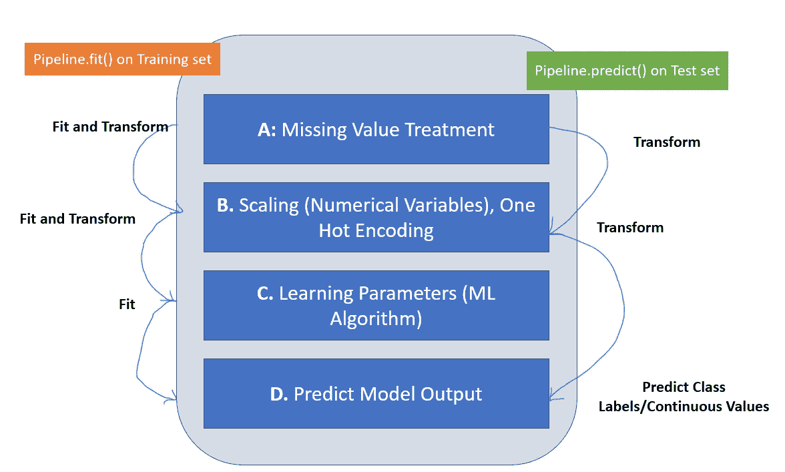
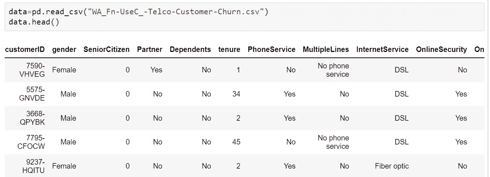
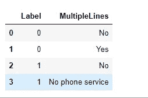
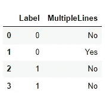

# 管道和定制转换器，并附有 Python 实践案例研究

> 原文：<https://towardsdatascience.com/pipeline-and-custom-transformer-with-a-hands-on-case-study-in-python-c416731e6158>

## 使用定制和 scikit-learn 管道

机器学习中的管道涉及将端到端的工作流转换为一组代码，以自动化整个数据处理和模型开发过程。我们可以使用管道依次应用一系列转换来准备数据，并在最后安装一个估计器。管道有助于简化将一系列操作组合在一起的过程。仅当转换和模型及其超参数被预先识别时，才使用管道。



图一。说明了转换器和估算器如何为管道工作的流程图。作者使用 PowerPoint 制作的图片

# 管道是如何工作的？

管道由一系列拟合和转换操作组成，这些操作因训练数据和测试数据而异。通常，在训练集上使用拟合和变换或者拟合函数；在测试集上只使用变换。拟合和转换操作首先识别关于数据分布的重要信息，然后根据这些信息转换数据。fit()通过研究数据分布来获取相应属性的中值，而 transform()则用从数据中获取的中值替换缺失值。举例来说，我们使用一个 SimpleImputer()，一个用于缺失值处理的 python 包，用中间值替换缺失值。

另一方面，测试数据只使用转换操作。这主要是为了避免在构建模型时出现任何数据泄漏。其思想是基于从训练集中学习到的信息对测试数据执行预处理，而不是将整个数据作为一个整体进行清理。传入数据流中任何缺失的信息都需要在输入预测模型之前进行处理。这一点很重要，尤其是当您将模型投入生产时。

# 工作示例

我们的想法是建立一个客户流失模型，使我们能够预测对预测客户流失有影响的驱动因素。我们不会专注于数据探索或建立一个高精度的模型；相反，我们将检查数据组件，并确定如何使用管道开发整个过程。用于此分析的数据集取自 [Kaggle](https://www.kaggle.com/blastchar/telco-customer-churn) ，并对任何人开放(公开)使用(Kaggle，2018)。数据字典和业务上下文可以在上面的链接中找到。

```
# To help with reading and manipulating data
import pandas as pd
import numpy as np# To help with data visualization
%matplotlib inline
import matplotlib.pyplot as plt
import seaborn as sns# To be used for missing value imputation
from sklearn.impute import SimpleImputer# To help with model building
from sklearn.linear_model import LogisticRegression
from sklearn.tree import DecisionTreeClassifier
from sklearn.ensemble import (
 AdaBoostClassifier,
 GradientBoostingClassifier,
 RandomForestClassifier,
 BaggingClassifier,
)
from xgboost import XGBClassifier# To get different metric scores, and split data
from sklearn import metrics
from sklearn.model_selection import train_test_split, StratifiedKFold, cross_val_score
from sklearn.metrics import (
 f1_score,
 accuracy_score,
 recall_score,
 precision_score,
 confusion_matrix,
 roc_auc_score,
 plot_confusion_matrix,
)# To be used for data scaling and one hot encoding
# from sklearn.preprocessing import StandardScaler, MinMaxScaler, OneHotEncoder# To be used for tuning the model
from sklearn.model_selection import GridSearchCV, RandomizedSearchCV# To be used for creating pipelines and personalizing them
from sklearn.pipeline import Pipeline
from sklearn.compose import ColumnTransformer# To define maximum number of columns to be displayed in a dataframe
pd.set_option(“display.max_columns”, None)# To supress warnings
import warningswarnings.filterwarnings(“ignore”)
```

我们来读数据。

```
data=pd.read_csv(“WA_Fn-UseC_-Telco-Customer-Churn.csv”)
data.head()
```



图二。展示了数据的前五行。快照取自 Jupyter 笔记本。

```
data[‘MultipleLines’].value_counts()
```

我们期望属性“MultipleLines”是二进制的；然而，这里有三个不同的值。

1.  是~3.5K 记录
2.  不~ 3K 唱片
3.  没有电话服务~0.5K 记录

当使用 Jupyter Notebook 时，我们总是可以将“无电话服务”转换为“无”，然而，当建立管道时，这些转换需要在管道本身内发生。因此，我们需要定义一个自定义转换器，可以将“无电话服务”转换为“无”。下面是一个自定义转换器的示例。

```
#Custom Transformer that extracts columns passed as argument to its constructorclass NPSTF():

    #Class Constructor 

    def __init__( self, feature_names):
        self._feature_names = feature_names 

    #Return self nothing else to do here    

    def fit( self, X, y = None ):
        return self

    #Method that describes what we need this transformer to do

    def transform(self, X, y = None ):

        def map_values(val):

            if val in ["No phone service"]:return 'No'
            else:
                return val

        X_=X.copy()

        X_[self._feature_names] = X_[self._feature_names].apply(map_values)

        return  X_
```

让我们试着验证一下定制转换器是否能处理虚拟数据。

```
data1=[(0, “No”),(0, “Yes”), (1, “No”), (1,”No phone service”)]df = pd.DataFrame(data1, columns=[‘Label’, ‘MultipleLines’])df.head()
```



```
pipeline=Pipeline(steps=[(“CT”, NPSTF(“MultipleLines”))])pipeline.fit_transform(df)
```



现在，我们将开发一个端到端的流程来使用管道。请注意，我们对数据做了以下假设。

1.  因为我们正在构建非参数模型，所以我们不会检查数据分布。
2.  所有分类列都需要进行一次性编码，数字列中缺失的条目需要进行估算。
3.  我们将实现一个 XGBoost()模型和管道。理想情况下，我们需要找出最佳模型，然后才能沿着管道实现它。

```
cat_columns=list(data.select_dtypes(include=["object"]).columns)
print(cat_columns)numeric_columns=list(data.select_dtypes(include=["int64", "float64"]).columns)
print(numeric_columns)
```

建立管道。

```
from imblearn.pipeline import Pipelinefrom sklearn.preprocessing import OneHotEncoder# To oversample and undersample data
from imblearn.under_sampling import NearMiss
from imblearn.under_sampling import RandomUnderSampler# creating a list of numerical variables
numerical_features = numeric_columns# creating a transformer for numerical variables, which will apply simple imputer on the numerical variables
numeric_transformer = Pipeline(steps=[("imputer", SimpleImputer(strategy="median"))])# creating a list of categorical variables
categorical_features = cat_columns.remove('Churn')# creating a transformer for categorical variables, which will first apply simple imputer and 
#then do one hot encoding for categorical variables
categorical_transformer = Pipeline(
    steps=[
        ("imputer", SimpleImputer(strategy="most_frequent")),
        ("onehot", OneHotEncoder(handle_unknown="ignore")),
    ]
)# handle_unknown = "ignore", allows model to handle any unknown category in the test data# combining categorical transformer and numerical transformer using a column transformerpreprocessor = ColumnTransformer(
    transformers=[
        ("num", numeric_transformer, numerical_features),
        ("cat", categorical_transformer, categorical_features),
    ],
    remainder="passthrough",
)# remainder = "passthrough" has been used, it will allow variables that are present in original data 
# but not in "numerical_columns" and "categorical_columns" to pass through the column transformer without any changesmodel = Pipeline(
    steps=[
        ("CT", NPSTF("MultipleLines")),
        ("pre", preprocessor),
        ("class balance", NearMiss(version=1)),
        (
            "XGB",
            XGBClassifier(random_state=1,subsample= 0.9, reg_lambda= 5, n_estimators= 50, \
                          learning_rate= 0.1, gamma= 1, eval_metric='logloss'),
        )
    ]
)
```

我们正在实施数据管道。

```
# Separating target variable and other variables## Encoding Existing and Attrited customers to 0 and 1 respectively, for analysis.
data["Churn"].replace("No", 0, inplace=True)
data["Churn"].replace("Yes", 1, inplace=True)X = data.drop(columns="Churn")
Y = data["Churn"]# Splitting the data into train and test sets
X_train, X_test, y_train, y_test = train_test_split(
    X, Y, test_size=0.20, random_state=1, stratify=Y
)
print(X_train.shape, X_test.shape)# Fit the model on training data
model.fit(X_train, y_train)
```

一旦我们在训练数据上拟合了管道，我们就可以在验证数据上测试它。这个想法是，一旦数据清理过程得到处理，并且确定了最适合的模型，就实现管道。管道应该处理原始数据本身；因此，上面的示例是在考虑部署场景的情况下构建的。

# 参考

1.  Github。(2021 年 11 月 29 日)。使用 Cloud Pak 上的 Watson 机器学习和 Jupyter 笔记本预测客户流失数据。检索于 2022 年 1 月 14 日，来自 GitHub 网站:[https://GitHub . com/IBM/Telco-Customer-churn-on-ICP 4d/blob/master/data/Telco-Customer-churn . CSV](https://github.com/IBM/telco-customer-churn-on-icp4d/blob/master/data/Telco-Customer-Churn.csv)
2.  卡格尔。(2018).电信客户流失。从 kaggle.com 网站检索到:【https://www.kaggle.com/blastchar/telco-customer-churn 

*关于作者:高级分析专家和管理顾问，帮助公司通过商业、技术和组织数据的数学组合找到各种问题的解决方案。一个数据科学爱好者，在这里分享、学习、贡献；可以和我在* [*上联系*](https://www.linkedin.com/in/angel-das-9532bb12a/) *和* [*推特*](https://twitter.com/dasangel07_andy)*；*