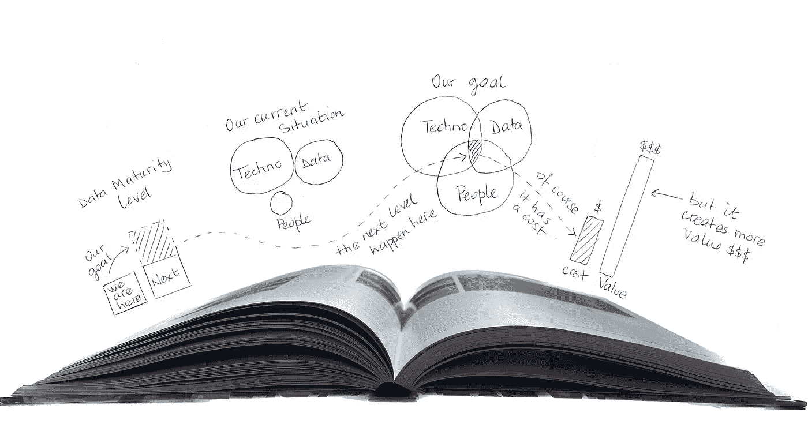
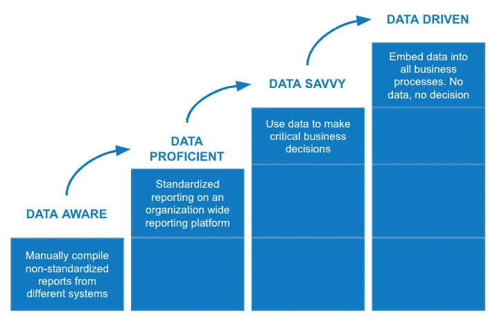
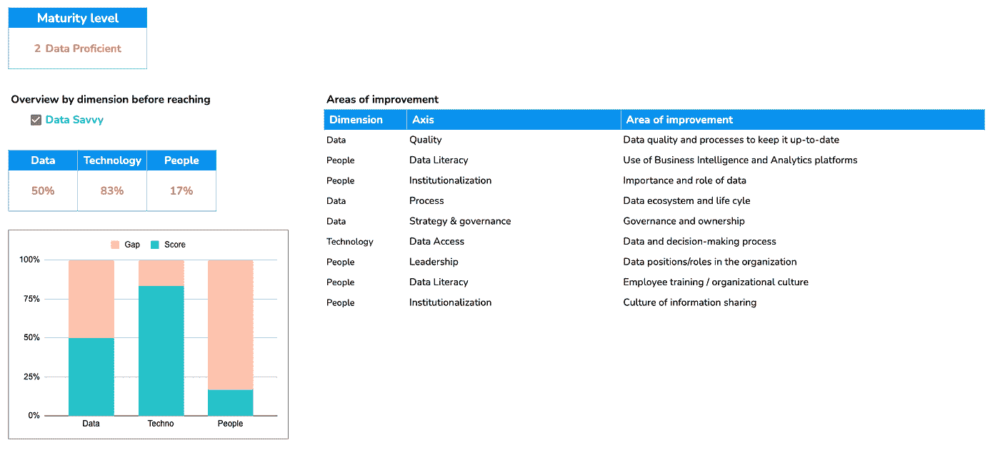
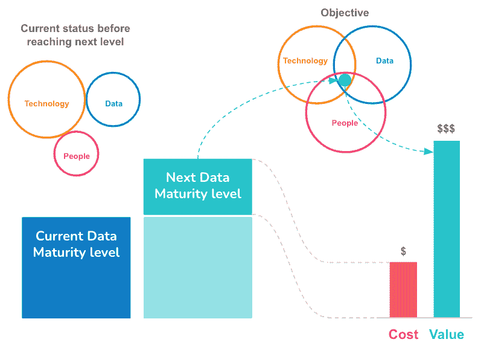

# 推销你的数据策略:为管理层和用户翻译技术对话

> 原文：<https://towardsdatascience.com/pitching-your-data-strategy-translating-tech-talk-for-management-and-users-bbd044872ee4>

## 三维简单性:数据、技术和人员…以及一个在整个过程中提供帮助的工具

图片作者:Alexandre Allouin

在之前的[文章](/data-driven-initiatives-unpacked-bringing-managers-to-the-table-2c3e8f8f0b0)中，我倡导了一种与高管或非技术人员沟通的简单方式，通过阐述任何数据计划——从将您的组织转变为数据驱动的实体到开发新的数据项目——仅用三个维度:数据、技术和人员(“ [3D 数据故事](/data-driven-initiatives-unpacked-bringing-managers-to-the-table-2c3e8f8f0b0)”)，因为归根结底，这就是它的全部！

> *“生活真的很简单，但我们坚持要把它变得复杂。”—孔子*

在最近一个关于这三个维度的专业社交媒体的讨论中，一些人建议增加更多内容，以更好地反映业务需求。我们所有的数据人员都喜欢设计复杂的模型，开发精细的策略或复杂的架构，但我们有失去受众的风险。三维的主要思想是保持我们的信息简单；管理层和最终用户都容易记住的信息:数据、技术和人员。轻松点。这种简单性是大多数员工/用户能够拥有它来培育组织文化的关键。许多文章和研究表明，我们的短期记忆实际上只能存储三到五个项目。许多故事或口号都是基于这个三法则。有趣的是，这个方法非常有效，以至于亚历山大·仲马把他的书命名为三个火枪手，而他们实际上只有四个(好吧，这最后一个例子可以被看作是“确认偏差”)😉).

根据上一篇文章，我想通过提出一个 [3D 数据成熟度评估工具](https://dinae.fr/index.php/en/resources/3d-data-maturity-assessment-tool/)来使这篇文章更加具体。该工具允许您确定您的组织的当前状况，以及要达到下一个级别需要做哪些工作。该评估仅基于 18 个问题。如果我看到有人对这个工具感兴趣——我将使用中间页面来跟踪它的活动——我将通过开发更多的问题并添加一组建议来使它更强大，以达到特定于您当前情况的下一个级别——一种简单的路线图。

简化您与管理层的沟通方式很重要，但它显然需要与您组织的战略目标保持一致。如果是数据项目，这正是数据策略或业务案例的目的。我不会在这里详述，因为它已经在[介质](https://medium.com/search?q=data+strategy)上有很好的记录。相反，我将把重点放在电梯推销上(但不是那种能在 30 秒内到达 500 米的现代电梯！换句话说，你的项目还没有被批准，你想提出你的理由。

# 3D 数据成熟度

无论是为了您的数据策略还是为了您的业务案例，您都必须以您想要达到的数据成熟度级别为目标。理想情况下，为了保持简单的交流，您希望从数据、技术和人员方面定义您的成熟度期望。你可以将你的 [3D 维恩图](/data-driven-initiatives-unpacked-bringing-managers-to-the-table-2c3e8f8f0b0)与你对你的组织现在所处位置的评估结合起来，然后找出实现目标所缺少的东西。让我们从数据成熟度级别开始。有很多款，最好的是你最舒服的那款。我发现[戴尔数据成熟度模型](https://www.cio.com/article/238210/the-four-stages-of-the-data-maturity-model.html)简单而实用，所以我将在本文的其余部分以及工具中使用它。

戴尔数据成熟度模型|作者的图片灵感来自[首席信息官](https://www.cio.com/article/238210/the-four-stages-of-the-data-maturity-model.html)

模型的每一层都建立在前一层的基础上。你不可能一夜之间成为数据驱动型企业；这是一个需要投入和精力的迭代过程！下面是每个级别含义的高级概述。

# 1.数据感知

**数据**

*   由个人或团队管理的孤立数据
*   来自多个系统的多个数据源
*   没有单一的真理来源

**技术**

*   多个 BI 系统(通常基于 MS Excel)
*   手动编制的非标准化报告
*   没有一致和结构化的数据存储方法
*   没有应用程序/系统集成

**人**

*   不信任数据质量和他们自己的报告
*   临时报告
*   在筒仓中工作

# 2.精通数据

**数据**

*   数据孤立，但数据库设计/标准化部分实施
*   使用/操作非结构化数据的挑战

**技术**

*   数据仓库存在，但不完整
*   组织级别可用的 BI 系统
*   可接受的报告标准化水平

**人**

*   员工质疑数据质量
*   跟踪第一个组织 KPI
*   准备试点数据计划
*   缺乏管理层的支持
*   关键人员/角色了解数据对决策的价值

# 3.数据悟性

**数据**

*   打破组织和数据孤岛
*   建立数据战略
*   建立了单一的真相来源
*   作为产品的数据:统计模型/预测分析

**科技**

*   关注新技术和数据集成
*   按需数据
*   开发数据仓库/数据湖(非结构化数据)

**人**

*   用于为关键计划做出关键业务决策的数据
*   管理层的支持已经到位
*   支持和实施战略的数据团队
*   合作伙伴 IT 和业务部门
*   组织文化/对数据重要性的理解
*   提供员工培训

# 4.数据驱动

**数据**

*   扩展数据战略，同时降低成本
*   所有数据源的集成

**技术**

*   高级分析平台(从描述性和预测性分析转向规定性分析—机器学习)
*   不同功能角色的面向用例的架构

**人**

*   没有数据意味着没有决策
*   IT 和业务团队作为一个整体运作
*   嵌入业务流程的分析
*   数据技能作为员工课程/评估的一部分:数据素养证书

数据扫盲证书(CDL)是对模型的补充，因为人的因素往往被忽略。因此，在一个完全由数据驱动的组织中，我认为数据素养应该是每个员工课程的一部分。因此，我鼓励组织实施强制性 CDL，这将大大有助于发展企业文化。

正如本文前面提到的，为了帮助您评估您组织的成熟度水平，这里有一个简单的 Google 电子表格工具[您可以直接使用——但是如果您复制它会更好，因为它不支持多重访问——或者修改它并使其适应您的需求。这里的目的不是重新发明轮子，而是按照 3D 方法构建数据成熟度模型，以支持您与高管或其他利益相关者的故事。](https://dinae.fr/index.php/en/resources/3d-data-maturity-assessment-tool/)

3D 数据成熟度评估工具|图片由 Alexandre Allouin 提供

确定你的成熟度等级需要一个诚实的自我评估，以对你当前的状态产生一个现实的看法。这将告诉您为了达到下一个数据成熟度级别，或者您的数据项目的目标，需要实现的步骤。人的因素，即人的方面，往往落后了。改变文化比技术转变需要更多的精力。

> *“购买和使用分析工具并不难，改变行为才难。”**

*** [德勤洞察|分析和人工智能驱动的企业在时代中茁壮成长(2019)](https://www2.deloitte.com/content/dam/Deloitte/ec/Documents/technology-media-telecommunications/DI_Becoming-an-Insight-Driven-organization%20(2).pdf)

一个好的方法是同时进行员工/用户调查。一方面，它会让你对他们的看法有所了解，并可以用来调整人的维度。另一方面，它将作为您最终评估项目的参考，从而衡量其影响。

在这个阶段，你将能够建立一个计划草案，最重要的是，它的相关费用。现在最棘手的部分是估计组织将从实施项目中获得的利益。它们可以采取不同的形式:降低成本、提高绩效、优化流程、提高敏捷性或创新等。如果你不能清楚地确立收益并量化它，你就得质疑自己。即使项目从数据的角度来看是有意义的，如果业务价值不能被估计，并且以后不能使用双方同意的度量标准来度量，那么您的项目就有风险。

# 完成你的故事

现在，你可以用一些更具体和可测量的元素来完成你的[初始故事](/data-driven-initiatives-unpacked-bringing-managers-to-the-table-2c3e8f8f0b0)。

1.  首先，你需要专注于远景——大图——这将激励决策者:为什么你的提议是相关的？它如何与战略目标保持一致？
2.  然后，你必须将这个愿景转化为更具体的东西，一个他们可以快速掌握的高级计划:3D 维恩图。概括地说，我们应该把精力放在哪里才能使这个项目成功？这应该会引发关于提案成本的讨论。
3.  最后，随着困难的部分被覆盖，你可以看到快乐的结局:增加到项目中的价值。会有什么好处及其投资回报？

你的故事几乎可以放入三张幻灯片，最后一张可以总结如下:

图片作者:Alexandre Allouin

# 参考文献和致谢

*   [孔子](https://en.wikipedia.org/wiki/Confucius)；-)
*   [戴尔数据成熟度模型](https://www.cio.com/article/238210/the-four-stages-of-the-data-maturity-model.html)
*   [Hesa 工具包](https://www.hesa.ac.uk/support/tools/data-capability/full/assess-maturity)
*   [富士通数据成熟度自我评估](https://marketing.global.fujitsu.com/DDTS-Assessment-Tool-Page.html)
*   感谢[维杰·亚达夫](https://medium.com/@thevijyadav)为[起了个名字](https://www.linkedin.com/feed/update/urn:li:activity:6983084552399241216/)(3D……)
*   感谢[莎伦](https://www.linkedin.com/in/sharonroffey/)一直以来的支持