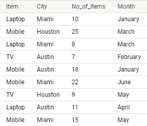
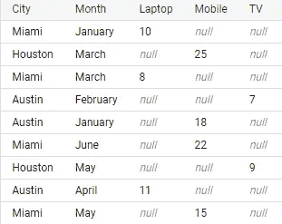
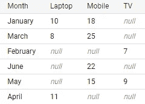
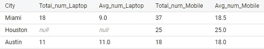
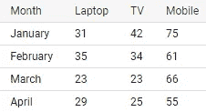
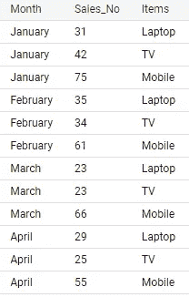
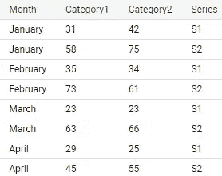

# BigQuery 中的 Pivot 和 Unpivot 函数用于更好的数据操作

> 原文：<https://towardsdatascience.com/pivot-and-unpivot-functions-in-bigquery-for-better-data-manipulation-f0230295bd5e>


马龙·玛雅在 [Unsplash](https://unsplash.com?utm_source=medium&utm_medium=referral) 上的照片

## 详细的教程

Pivot 是 BigQuery 中一个非常简单的函数，当您需要将行旋转成列时，它会非常有用。它对行使用聚合函数，并将行中的类别转换为列。有一个 unpivot 函数做完全相反的操作。如果你是 Google 云平台的大查询用户，还没有用过 Pivot 和 Unpivot 函数，那么很值得学习。

本文将重点用例子解释 Pivot 和 Unpivot 函数。为此，我们将创建一个虚拟表，如下所示:

```
WITH Produce AS (SELECT 'Kale' as product, 51 as sales, 'Q1' as quarter, 2020 as year UNION ALLSELECT 'Kale', 23, 'Q2', 2020 UNION ALLSELECT 'Kale', 45, 'Q3', 2020 UNION ALLWITH sale AS (Select 'Laptop' as Item, 'Miami' as City, 10 as No_of_Items, 'January' as Month UNION ALLSELECT 'Mobile', 'Houston', 25, 'March' UNION ALLSELECT 'Laptop', 'Miami', 8, 'March' UNION ALLSELECT 'TV', 'Austin', 7, 'February' UNION ALLSELECT 'Mobile', 'Austin', 18, 'January' UNION ALLSELECT 'Mobile', 'Miami', 22, 'June' UNION ALLSELECT 'TV', 'Houston', 9, 'May' UNION ALLSELECT 'Laptop', 'Austin', 11, 'April' UNION ALLSELECT 'Mobile', 'Miami', 15, 'May')SELECT * from sale;
```



请随意将其保存为视图，以便在下面的示例中使用该表。否则，您需要在我们稍后使用的每个查询中使用这个“WITH”子句。

在这里，我们将项目作为行。每行代表关于笔记本电脑、手机或电视的信息。如果您希望这些项目作为列，pivot 函数会有所帮助。

在第一个练习中，我们将使用“SUM”汇总每个项目的项目数，并将项目作为列:

```
SELECT * FROM sale pivot(sum(No_of_Items) for Item in ('Laptop', 'Mobile', 'TV'));
```



在这里，我们的透视表列是 No_of_Items 和 Items。pivot 函数中没有提到另外两列(城市和月份)。因此，默认情况下，透视函数使用城市和月份列进行分组。

还可以使用另一个 select 语句来指定要透视的列和要分组的列。

```
select * from (select Item, No_of_Items, Month from sale)pivot(sum(No_of_Items) for Item in ('Laptop', 'Mobile', 'TV'));
```



在这个查询中，我们使用 select 语句选择三列:Item、No_of_Items 和 Month。No_of_Items 和 Items 用作 pivot 函数中的 pivot 列，而 Month 列仅用于分组，我们使用 sum 作为聚合函数。

我们在项目栏中有三个项目:笔记本电脑、手机和电视。在前面的所有查询中，这三项都被转换为列。如有必要，您也可以排除某个项目。例如，您可以使用:

```
select * from (select Item, No_of_Items, Month from sale)pivot(sum(No_of_Items) for Item in ('Laptop', 'Mobile'));
```

pivot 函数中也可以使用多个聚合函数:

```
select * from (select No_of_Items, Item, City from sale)pivot(sum(No_of_Items) Total_num, AVG(No_of_Items) Avg_numfor Item in ('Laptop', 'Mobile'))
```



这里我们使用“sum”和“average”作为聚合函数。注意我们在这里使用了一个别名。当您想要使用多个聚合函数时，pivot 函数会要求别名。

## 让我们拆开

在大型查询环境中，还有一个 unpivot 函数，它的作用正好相反。现在让我们以另一种方式制作数据集:

```
WITH sale AS (Select 'January' as Month, 31 as Laptop, 42 as TV, 75 as Mobile UNION ALLselect 'February', 35, 34, 61 UNION ALLselect 'March', 23, 23, 66 UNION ALLselect 'April', 29, 25, 55)select * from sale;
```



这次我们使用笔记本电脑、电视和手机的数量作为列。让我们把它们排成行:

```
select * from saleunpivot(Sales_No for Items in (Laptop, TV, Mobile))
```



注意，它是如何重新排列的。你可以更进一步。我将用另外一张表重新创建该表:

```
WITH sale AS (Select 'January' as Month, 31 as Laptop, 42 as TV,75 as Mobile, 58 as Tablet UNION ALLselect 'February', 35, 34, 61, 73 UNION ALLselect 'March', 23, 23, 66, 63 UNION ALLselect 'April', 29, 25, 55, 45)select * from saleunpivot((Category1, Category2)for Seriesin ((Laptop, TV) as 'S1', (Tablet, Mobile) as 'S2'))
```



现在我们有四样东西:笔记本电脑、手机、电视和平板电脑。我想把它们分成两类。类别 1 和类别 2 成为两列。同时，我们将它们分为两个系列，并以行的形式显示。我不得不再添加一项，因为当我们将它们分为两类时，我们需要每个类别中相同数量的列。

## 结论

不使用 Pivot 和 Unpivot 函数也可以达到同样的效果。但那将是一段漫长的路。这两个函数可以在必要时使您的查询更简短、更优雅。

## 更多阅读:

[](/precision-recall-and-f1-score-of-multiclass-classification-learn-in-depth-6c194b217629)  [](/complete-explanation-on-sql-joins-and-unions-with-examples-in-postgresql-cbd868fe9e95)  [](https://pub.towardsai.net/an-overview-of-the-major-sql-query-clauses-and-most-commonly-used-functions-60720e2a20d7)  [](/regression-in-tensorflow-using-both-sequential-and-function-apis-314e74b537ca)  [](https://pub.towardsai.net/data-analysis-91a38207c92b) 