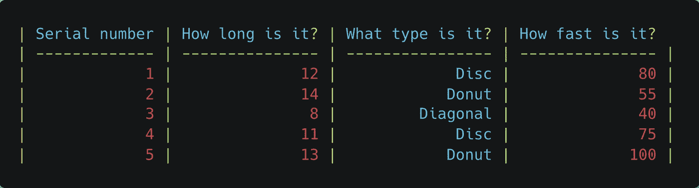
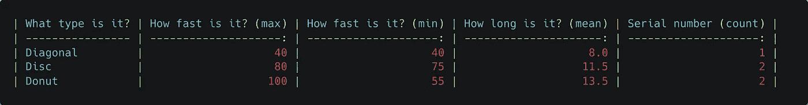
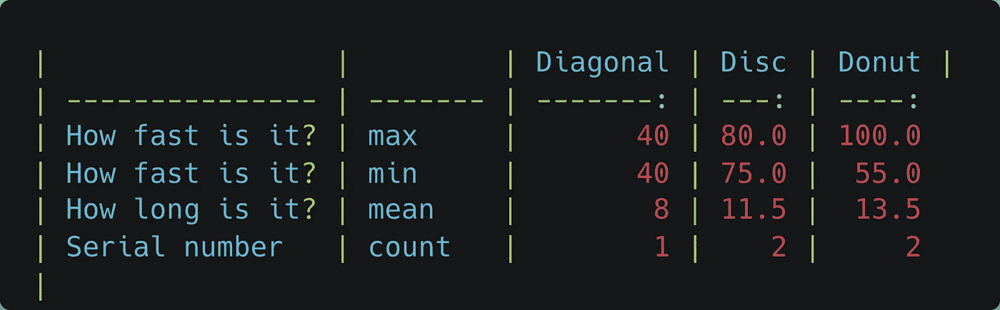
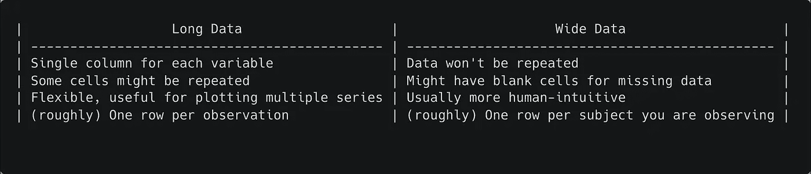
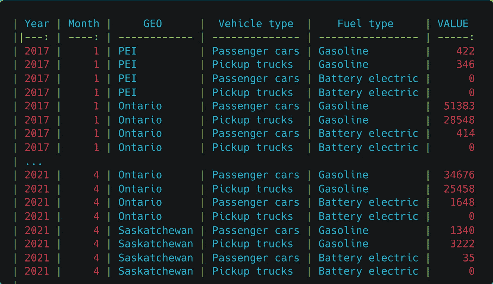
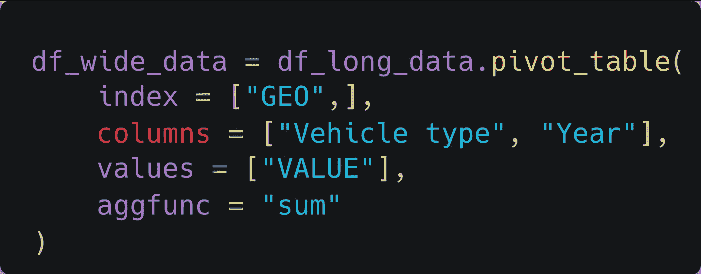
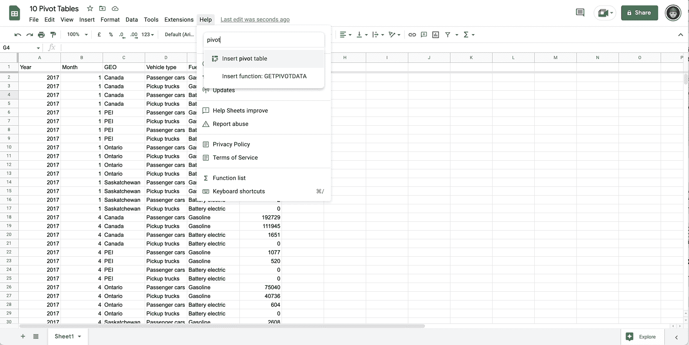
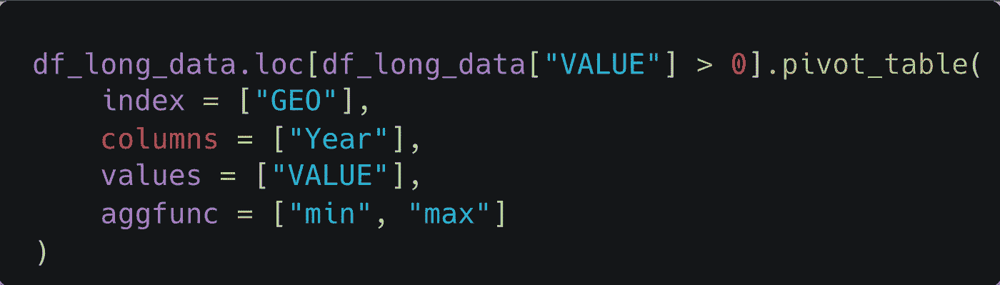
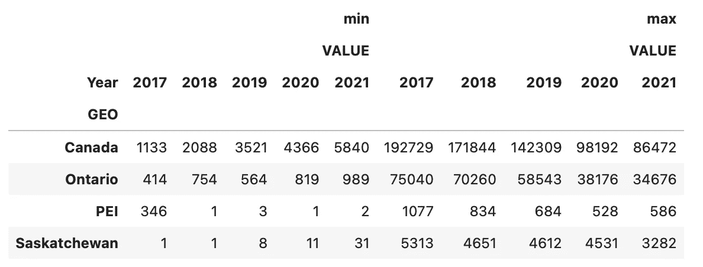

# 数据透视表概念

> 原文：<https://towardsdatascience.com/pivot-table-concepts-report-analyze-story-tell-e3c2e2d36036>

## 报道、分析、讲述故事

阿德里安·特林考斯在 [Unsplash](https://unsplash.com?utm_source=medium&utm_medium=referral) 上拍摄的照片

# 介绍

给定数据集，**数据透视表**是分析、回答问题和讲述故事的强大工具。透视并不局限于 Excel 中的分析，而是一种转换数据的通用技术，通常转换成更易理解的格式。

## 章节参考

1.  为什么是 pivot？
2.  宽数据与长数据
3.  例如:Google Sheets、Python 和 PostgresSQL
4.  聚合函数
5.  缺失数据
6.  外卖食品

# 为什么是 Pivot？

如果我们正在制造某样东西(任何东西),每次其中一件东西从装配线上下来时，我们都会记录关于这件东西的一些基本信息:

原始“数据集”

我们可以用数据透视表来回答这个问题

*   我们每样东西做了多少种？
*   每种东西的平均长度是多少？
*   每种事物的最快和最慢速度是多少？

使用数据透视表总结每种类型的属性(下面包含代码示例)

最重要的是，我们可以根据目标受众的偏好，以多种形式给出这些问题的答案。我们可以做一个小小的调整，每次测量显示一行，并在输入数据集中为每种类型创建一列，而不是每种类型一行。

完全相同的信息以不同的方式呈现。只需要改变一个关键词。

# 宽数据与长数据

旋转是将“长数据”转换为“宽数据”的行为。宽数据格式和长数据格式有不同的用途。首先考虑如何收集数据通常会有所帮助。

在单个二维表中表示潜在的多维数据可能需要一些折衷。有些数据会重复(长数据格式)，或者数据集可能需要空白单元格(宽数据)。

> 我们经常需要将长的**数据**(一个观察列表)转化为**信息**(一个摘要，通常是广泛的数据)以供人们解读。这就是**旋转**数据的用处。

**长数据。**观察多年来不同省份的月汽车销量。每个**年、月、地域、车辆类型、燃料类型**组一个**行**。这在软件中解析起来很简单，但对于人工比较来说并不理想。该表用作本文示例的“原始”数据(来源[https://www . stat can . GC . ca](https://www.statcan.gc.ca/en/start)

我们可以获取上面的长数据，然后*将它转换成一种更容易被人使用的宽格式。*

现在我们来看看如何用 3 种不同的方式来做到这一点:Python(带熊猫)、Google Sheets 和 PostgreSQL

**带熊猫的蟒蛇皮旋转**

从加载到`df_long_data`的原始数据集开始

请注意这里的关键论点。

1.  **Index** 决定了结果最左边一列的唯一性。
2.  **列**为输入表的“车辆类型”和“年份”列中的每个唯一值创建一列。
3.  **值**定义在输出表的单元格中放置什么。
4.  **aggfunc** 定义*如何*组合值(通常为 sum，但也使用其他聚合函数:min、max、mean、95%百分点、mode)。您还可以定义自己的聚合函数并传入该函数。

上面 Python 代码的输出。

**在谷歌工作表中旋转**

Google sheets 中的旋转和我们上面的 python 代码做着完全一样的事情，但是是以图形化的方式。我们没有为`pivot_table`函数指定参数，而是从下拉列表中选择。但是要记住的重要一点是，pivoting 并不“属于”任何特定的软件，它是一种处理数据的通用方法。

在谷歌工作表中旋转。请注意列的顺序是多么重要。在 Python 示例中，“车辆类型”在“年份”之前，这改变了分组。

**PostgreSQL 中的分组**

许多关系数据库没有内置的 pivot 函数。我们可以编写一个接近预期结果的查询，但是它需要一些人工干预来定义可能的组。

## 聚合函数

Sum 通常用于合并数据透视表中的数据，但数据透视表比简单的求和灵活得多。不同的工具会提供自己选择的**聚合函数。**例如，熊猫提供:`min, max, first, last, unique, std (standard deviation), var (variance), count, unique, quantile`等等。我们还可以定义自己的聚合函数，并将多个不同的聚合函数传递给同一透视表中的同一列或不同列。

例如，这个调用将*`min`和`max`聚合函数都映射到我们的数据，提供两组列来显示每年给定月份的最小和最大汽车销售量。*

**

*对数据透视表中的同一列使用多个聚合*

**

*输出*

# *缺失数据*

*与任何聚合一样，必须处理缺失数据。在这里使用的示例数据中，有许多月份都有`0`销售额。最可能的解释是没有收集那几个月的数据，而不是实际上没有销售。还有一种情况是数据完全丢失,“单元格”为空或者包含一个`null`值。无论什么程序，你都需要接受(并意识到)这些情况下的默认行为，或者指定要做什么。*

*`(5, 7) = 6`的平均值，而是`(5, 0, 0, 7) = 3`的平均值和`(5,null, 7) = ?`的平均值。缺失的数据有时会以微妙的方式影响你的结果。*

# *外卖食品*

*数据透视表是一个强大的概念，可以帮助汇总、探索和组织原始数据到信息中。它们可以用来弄清楚数据集中发生了什么，或者浓缩信息与他人分享。*

*   *当你需要用数据做一份报告或回答一个问题时，从考虑现有数据的形状开始。*
*   *你的变量是列名还是行名？*
*   *你是按*观察*(大致，长)一排还是按*主题*(大致，宽)一排？*
*   *您的*主题*(索引)是否在不止一行中重复。*
*   *汇总您的数据(最小值、平均值、最大值、分位数、计数、唯一值)能否回答您的问题？*
*   *你能添加一个变量作为列，然后让你旋转来回答你的问题吗？*
*   *长而宽的数据不是绝对的。*
*   *您可以用同一索引一次聚合多个值。或者具有多个聚合函数的相同值。*