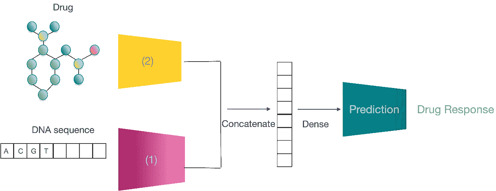
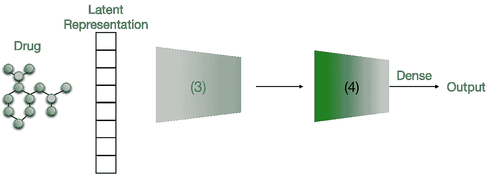
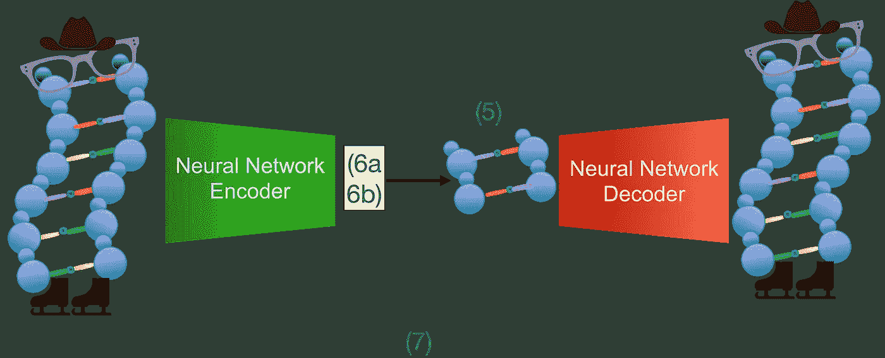
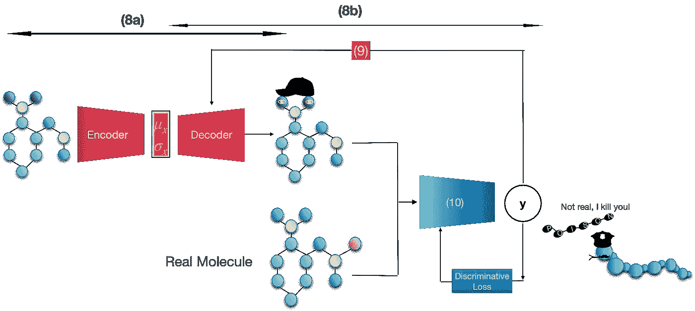
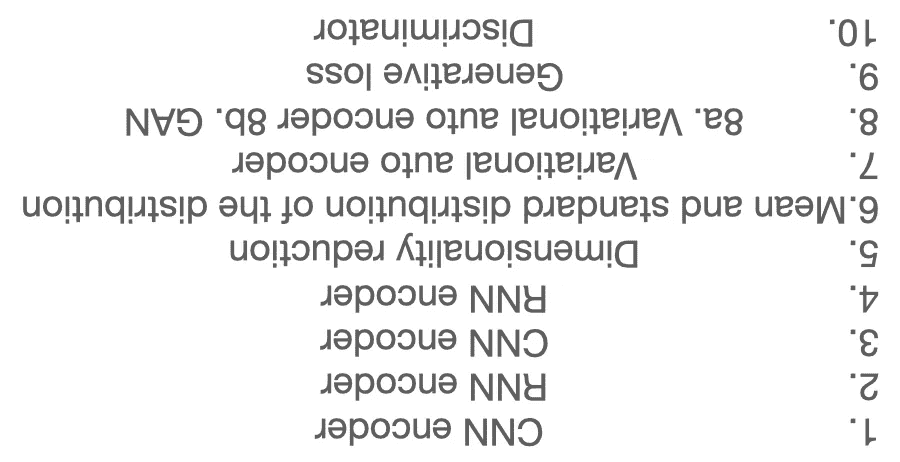

# 人工智能(游戏)模型—测验你自己

> 原文：<https://towardsdatascience.com/pl-ai-play-models-quiz-yourself-9ca35acd5192>

## 摆弄分子和 DNA 的人工智能模型

[去飞溅](https://medium.com/u/c5555b4adb6a?source=post_page-----9ca35acd5192--------------------------------)

这一次，我想我们可以从人工智能分子和 DNA 模型中获得一些乐趣。我为你做了一个简短的自我评估测验来测试你的理解能力。下面是四幅图，对应四个问题，描述了人工智能架构中的生物信息学应用。每个插图都有一些编号为 1 到 10 的缺失组件。你能为每个插图填上缺少的部分吗？答案和解释如下。

# 问题:

**问题 1/4:多模态神经网络。**该架构预测药物反应。给定一个分子结构(药物)和基因表达(DNA 序列)，什么类型的编码器(编号 1，2)将代表这些输入结构？

问题 1:哪种编码器产生药物和细胞系的嵌入，然后输入预测器以估计药物反应？

**问题 2/4:级联模型。**给定一个药物分子，将哪个编码器(编号为 3、4)级联输入预测器以对药物分子进行分类？

问题 2

**问题 3/4:** 给定一个穿着溜冰鞋、戴着帽子和眼镜的站立的 DNA 双螺旋(“输入字符”)。哪个模型(编号 7)重建了精确的“输入字符”？检测到哪个表示(编号 5)，编码器提取的数据是什么(编号 6)？

问题 3

**问题 4/4:** 这个网络识别出一个假分子(戴着帽子)，返回一个毒分子。该模型中包含哪些子模型(编号为 8a、8b)？输出返回哪些数据(编号为 9)？哪个型号的编号是 10？

问题 4

# 答案:

请注意，问题 1-4 的答案是多样的，而问题 5-10 是非常标准的。

# 解释:

**问题 1:多维度**

通过连接两个模态:基因表达和一个分子(下图)。 *(2) RNN* 代表一个分子 *(1) CNN* 一个基因图谱。通过连接这些模型的输出，生成了包含顺序数据和卷积数据的组合表示。

**问题二:** **级联模型**

*CNN (3)* 的输出是 *RNN (4)* 的输入。这个级联模型就像一个描述符，它在全局(全局特征发现的 RNN 影响)和局部(局部特征选择的 CNN 影响)定义药物。这里，我们假设局部特征代表原子和官能团的类型，而全局特征是原子排列。

**问题 3: *变分自动编码器 VAE (7，8a)***

自动编码器(AE)的主要目标是构建压缩表示的*低维潜在空间(5)* ，使得每个输入可以被重构为原始输入。将高维的原始输入数据映射到低维表示的模块称为编码器，而实现映射并从低维表示重构原始输入的模块称为解码器。编码器和解码器通常是具有 RNN 和 CNN 架构的神经网络。随着分子表示的计算，利用 AE 对分子生成的典型数据处理过程从将输入编码到低维潜在空间开始。在潜在空间内，来自输入的变量(6) 的*轴可以被编码。*

**问题 4:对抗性自动编码器(AAE)**

在生成化学中， *GAN (8b)* 使用*潜在随机输入(6)* ，根据分子表示的选择，生成字符串、分子图或指纹。所产生的分子与真实化合物的样品混合以供给*鉴别器(10)* 。计算鉴别损失是为了评估鉴别者是否能够从生成的化合物中区分真实的化合物，而计算*生成损失(9)* 是为了评估生成器是否能够通过生成不可区分的分子来欺骗鉴别者。这两个损失函数表明，即使是公认的鉴别者也可能被误导，将生成的分子分类为真实分子，因为生成器已经学习并积累了真实的数据模式来创建新的化合物。为了对抗鉴别器并最小化生成损失，生成器只能探索由真实化合物定义的有限化学空间。因此，由产生的分子覆盖的受限化学空间可能是一种限制。

[对抗自动编码器](/what-the-heck-are-vae-gans-17b86023588a) AAE 的架构与 [*变分自动编码器*](/understanding-variational-autoencoders-vaes-f70510919f73)*【8a】*非常相似，除了附加的*鉴别器网络(10)* 。AAE 训练三个模块:一个编码器，一个解码器，和一个*鉴别器(10)* 。编码器学习输入数据，并根据分布将分子映射到潜在空间。解码器通过从*遵循概率解码分布(6)的潜在空间采样来重建分子。*鉴别器区分潜在空间的分布和先验分布。编码器在训练迭代期间被一致地修改，以通过遵循特定的分布来最小化鉴别器的成本。一个简单的先验，如高斯分布，是假定在 VAE，而替代先验可以存在于现实世界的做法。

**注:**

1.  如果你喜欢这篇文章，并想了解更多关于药物发现的知识，我推荐你阅读我的博客[你应该问基于人工智能的药物发现公司的问题](/questions-you-should-ask-ai-based-drug-discovery-companies-78c5a011c915)。
2.  我在博客上投入了很多心血。请给我写一封电子邮件(miritrope@gmail)并通过 [LinkedIn](https://www.linkedin.com/in/miri-trope-916a194a/) 联系，告诉我你喜欢我的作品。
3.  作者画的所有图。