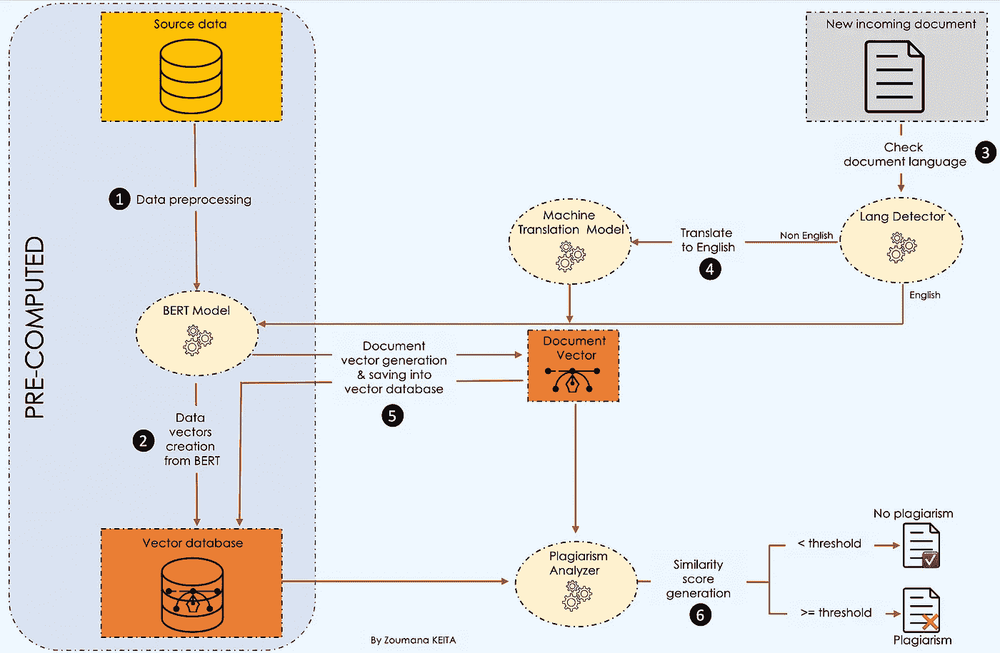
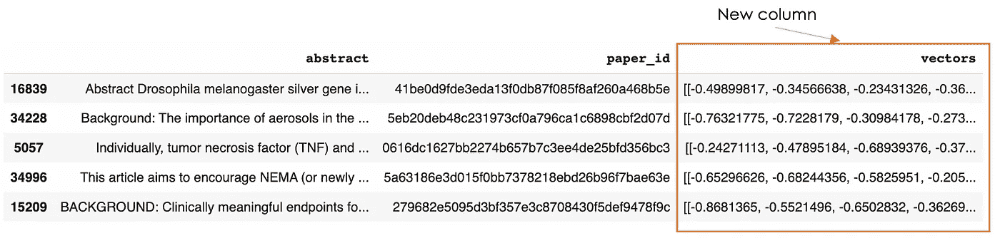
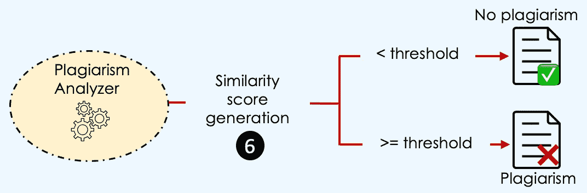
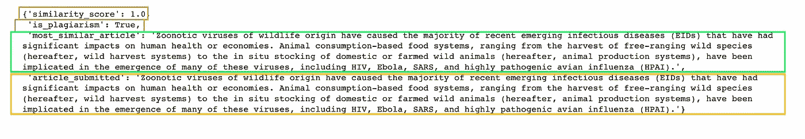
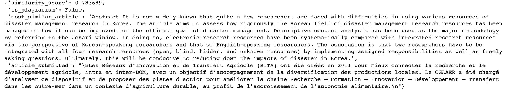
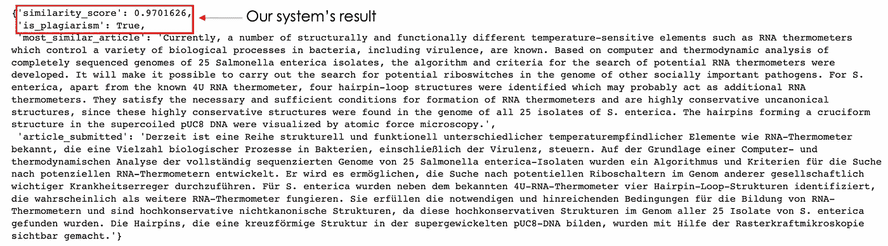

# 使用变形金刚检测剽窃

> 原文：<https://towardsdatascience.com/plagiarism-detection-using-transformers-b9e7ed5c2a1f>

## 使用基于 transformer 的模型构建更强大的剽窃检测器的完整指南。

# 动机

抄袭是许多行业最大的问题之一，尤其是在学术界。随着互联网和开放信息的兴起，这种现象变得更加严重，任何人都可以通过点击某个特定主题来获取任何信息。

基于这一观察，研究人员一直试图用不同的文本分析方法来解决这个问题。在这篇概念性的文章中，我们将尝试解决剽窃检测工具的两个主要局限性:(1) *内容改写剽窃*，以及(2) *内容翻译剽窃*。

***(1)传统工具很难捕捉到重组的内容*** ，因为它们没有考虑到整体上下文的同义词和反义词。

***【2】******用不同于原始语言的语言编写的内容*** 也是即使最先进的基于机器学习的工具面临的大问题，因为上下文被完全转移到另一种语言。

在这个概念博客中，我们将解释如何使用基于 transformer 的模型以创新的方式解决这两个挑战。首先，我们将向您介绍描述整个工作流程的分析方法，从数据收集到性能分析。然后，在展示最终结果之前，我们将深入研究该解决方案的科学/技术实现。

# 问题陈述

假设您对构建一个学术内容管理平台感兴趣。您可能希望只接受尚未在您的平台上共享的文章。在这种情况下，您的目标将是拒绝所有与现有文章相似的新文章。

为了说明这个场景，我们将使用[cord-19 数据集](https://www.kaggle.com/datasets/allen-institute-for-ai/CORD-19-research-challenge)，这是一个开放的研究挑战数据，由[艾伦人工智能研究所](https://allenai.org/)在 Kaggle 上免费提供。

# 分析方法

在进一步分析之前，让我们从下面的问题中弄清楚我们想要达到的目的:

> 问题:我们能在数据库中找到一个或多个与新提交的文档相似的文档吗？

以下工作流程强调了更好地回答这个问题所需的所有主要步骤。



抄袭检测系统工作流程(图片由作者提供)

> 让我们理解这里发生了什么💡。

在收集了源数据之后，我们首先对内容进行预处理，然后从 BERT 创建一个向量数据库。

然后，每当我们有新的文档时，我们检查语言并执行剽窃检测。更多细节将在本文后面给出。

# 科学实施

这一部分集中于分析方法中每个部分的技术实现。

## 数据预处理

我们只对源数据的 ***摘要*** 列感兴趣，而且，为了简单起见，我们将只使用 100 个观察值来加速预处理。

[source _ data _ processing . py](https://gist.github.com/keitazoumana/4404b4ec2f251ffde3477d797e159239#file-source_data_processing-py)

下面是来自源数据集的五个随机观察。


来自源数据的五个随机观察(图片由作者提供)

## 文档矢量器


关注 BERT 和机器翻译模型(图片由作者提供)

简介中观察到的挑战导致分别选择以下两种基于变压器的模型:

***(1)BERT 模型*** :解决第一个限制，因为它提供了文本信息的更好的上下文表示。为此，我们将:

*   `create_vector_from_text`:用于生成单个文档的矢量表示。
*   `create_vector_database`:负责为每个文档创建一个包含相应向量的数据库。

[bert_model_vectors.py](https://gist.github.com/keitazoumana/4c2bafe324481af4fd83af945912024e#file-bert_model_vectors-py)

第 94 行显示了来自向量数据库的五个随机观察值，带有新的向量列。



来自向量数据库的五篇随机文章(图片由作者提供)

***(2)机器翻译*** 转换器模型用于将输入文档的语言翻译成英语，因为在我们的例子中，源文档是英语的。只有当文档的语言是以下五种语言之一时，才会执行翻译:*德语、法语、日语、希腊语和俄语*。下面是使用`MarianMT`模型实现这个逻辑的助手函数。

[document _ translation . py](https://gist.github.com/keitazoumana/9cec62b176fe9aae8e2a448fa6de141c#file-document_translation-py)

## 抄袭分析器

当传入文档的向量在某个阈值水平上与数据库向量之一相似时，就存在剽窃。



聚焦抄袭分析器(图片由作者提供)

> 但是，什么时候两个向量是相似的？
> →当它们大小相同、方向相同时。

这个定义要求我们的向量具有相同的大小，这可能是一个问题，因为文档向量的维数取决于文档的长度。幸运的是，我们有多种相似性度量方法可以用来克服这个问题，其中之一是*余弦相似性*，它将在我们的案例中使用。

如果你对其他方法感兴趣，可以参考詹姆斯·布里格斯的[这篇惊人的内容。他解释了每种方法的工作原理及其优点，并指导您实现它们。](https://www.pinecone.io/learn/semantic-search/)

使用`run_plagiarism_analysis`函数执行抄袭分析。我们首先使用`check_incoming_document`函数检查文档语言，以便在需要时执行正确的翻译。

最终结果是一个包含四个主要值的字典:

*   `similarity_score`:新文章与数据库中最相似的现有文章之间的得分。
*   `is_plagiarism`:无论相似度得分是否等于或超过阈值，该值都为真。否则就是假的。
*   `most_similar_article`:最相似文章的文本信息。
*   `article_submitted`:提交审批的文章。

[抄袭 _ 分析. py](https://gist.github.com/keitazoumana/7617793309b3fdce824d307c14e3f9b8#file-plagiarism_analysis-py)

# 系统实验

我们已经覆盖并实现了工作流的所有组件。现在，是时候使用我们系统接受的三种语言来测试我们的系统了:*德语、法语、日语、希腊语和俄语*。

## 候选文章及其提交评估

这些是我们要检查作者是否抄袭的文章的摘要文本。

**英文文章**

这篇文章实际上是一个来自源数据的例子。

```
**english_article_to_check** = "The need for multidisciplinary research to address today's complex health and environmental challenges has never been greater. The One Health (OH) approach to research ensures that human, animal, and environmental health questions are evaluated in an integrated and holistic manner to provide a more comprehensive understanding of the problem and potential solutions than would be possible with siloed approaches. However, the OH approach is complex, and there is limited guidance available for investigators regarding the practical design and implementation of OH research. In this paper we provide a framework to guide researchers through conceptualizing and planning an OH study. We discuss key steps in designing an OH study, including conceptualization of hypotheses and study aims, identification of collaborators for a multi-disciplinary research team, study design options, data sources and collection methods, and analytical methods. We illustrate these concepts through the presentation of a case study of health impacts associated with land application of biosolids. Finally, we discuss opportunities for applying an OH approach to identify solutions to current global health issues, and the need for cross-disciplinary funding sources to foster an OH approach to research."
```

[100 _ percent _ similarity . py](https://gist.github.com/keitazoumana/a2aa7d2e908cab0dc5298d09fac0a15f#file-100_percent_similarity-py)



抄袭粘贴文章的抄袭检测结果(图片由作者提供)

运行该系统后，我们得到的相似性得分为 1，与现有文章 100%匹配。这是显而易见的，因为我们从数据库中提取了完全相同的文章。

**法文文章**

这篇文章可以从[法国农业网站](https://agriculture.gouv.fr/quel-avenir-pour-les-reseaux-dinnovation-et-de-transfert-agricoles-et-les-systemes-recherche)免费获得。

```
**french_article_to_check = """**Les Réseaux d’Innovation et de Transfert Agricole (RITA) ont été créés en 2011 pour mieux connecter la recherche et le développement agricole, intra et inter-DOM, avec un objectif d’accompagnement de la diversification des productions locales. Le CGAAER a été chargé d'analyser ce dispositif et de proposer des pistes d'action pour améliorer la chaine Recherche – Formation – Innovation – Développement – Transfert dans les outre-mer dans un contexte d'agriculture durable, au profit de l'accroissement de l'autonomie alimentaire."""
```

[抄袭 _ 分析 _ 法语 _ 文章. py](https://gist.github.com/keitazoumana/aa87230a78959872bb09f4fb24f086ee#file-plagiarism_analysis_french_article-py)



法语文章抄袭检测结果(图片由作者提供)

这种情况下不存在抄袭，因为相似度得分小于阈值。

**德文篇**

让我们想象一下，有些人非常喜欢数据库中的第五篇文章，并决定将其翻译成德语。现在来看看系统会如何评判那篇文章。

```
**german_article_to_check** = """Derzeit ist eine Reihe strukturell und funktionell unterschiedlicher temperaturempfindlicher Elemente wie RNA-Thermometer bekannt, die eine Vielzahl biologischer Prozesse in Bakterien, einschließlich der Virulenz, steuern. Auf der Grundlage einer Computer- und thermodynamischen Analyse der vollständig sequenzierten Genome von 25 Salmonella enterica-Isolaten wurden ein Algorithmus und Kriterien für die Suche nach potenziellen RNA-Thermometern entwickelt. Er wird es ermöglichen, die Suche nach potentiellen Riboschaltern im Genom anderer gesellschaftlich wichtiger Krankheitserreger durchzuführen. Für S. enterica wurden neben dem bekannten 4U-RNA-Thermometer vier Hairpin-Loop-Strukturen identifiziert, die wahrscheinlich als weitere RNA-Thermometer fungieren. Sie erfüllen die notwendigen und hinreichenden Bedingungen für die Bildung von RNA-Thermometern und sind hochkonservative nichtkanonische Strukturen, da diese hochkonservativen Strukturen im Genom aller 25 Isolate von S. enterica gefunden wurden. Die Hairpins, die eine kreuzförmige Struktur in der supergewickelten pUC8-DNA bilden, wurden mit Hilfe der Rasterkraftmikroskopie sichtbar gemacht."""
```

[抄袭 _ 分析 _ 德语 _ 文章. py](https://gist.github.com/keitazoumana/bb6bca464466087e03e906a9cd1b6499#file-plagiarism_analysis_german_article-py)



德国文章抄袭检测结果(图片由作者提供)

97%的相似度——这就是模型所捕捉到的！结果相当可观。这篇文章绝对是个败笔。

# 结论

恭喜你，现在你有了所有的工具来构建一个更健壮的抄袭检测系统，使用 BERT 和机器翻译模型结合余弦相似度。

如果你喜欢阅读我的故事，并希望支持我的写作，考虑[成为一个媒体成员](https://zoumanakeita.medium.com/membership)。每月支付 5 美元，你就可以无限制地阅读媒体上的故事。

欢迎在 [YouTube](https://www.youtube.com/channel/UC9xKdy8cz6ZuJU5FTNtM_pQ) 、 [Medium](https://zoumanakeita.medium.com/) 、 [Twitter](https://twitter.com/zoumana_keita_) 上关注我，或者在 [LinkedIn](https://www.linkedin.com/in/zoumana-keita/) 上问好。讨论人工智能、人工智能、数据科学、自然语言处理和人工智能是一种乐趣！

# 额外资源

[来自拥抱脸的 MarianMT 模型](https://huggingface.co/docs/transformers/model_doc/marian)

[文章的源代码](https://github.com/keitazoumana/Medium-Articles-Notebooks/blob/main/Plagiarism_detection.ipynb)

[艾伦人工智能研究所](https://allenai.org/)