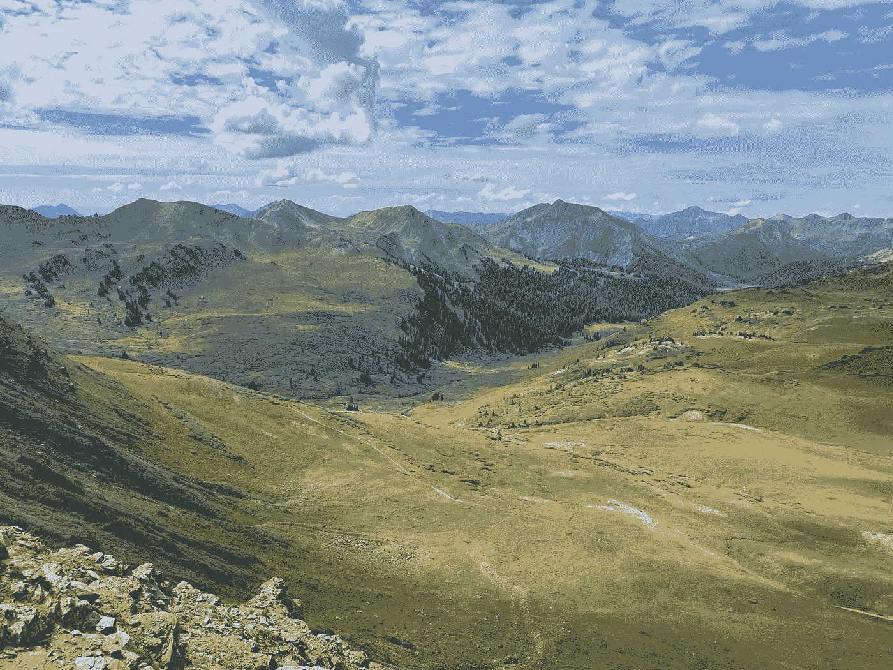
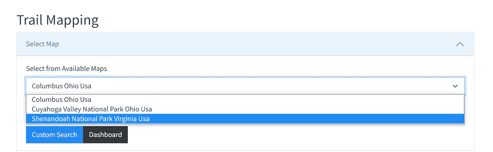
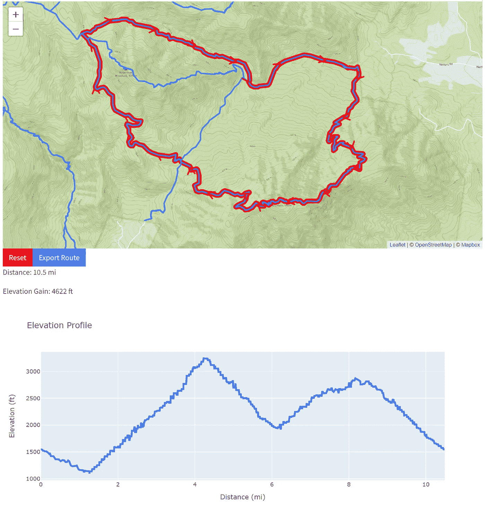
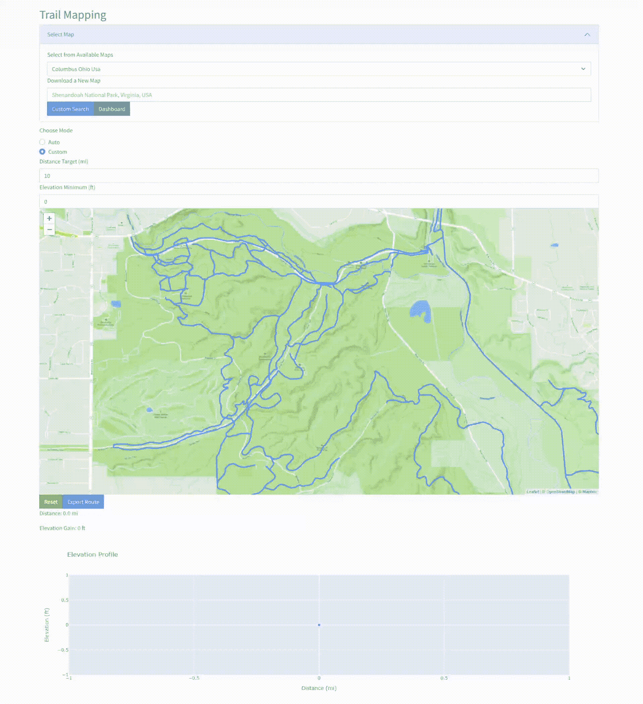
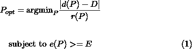
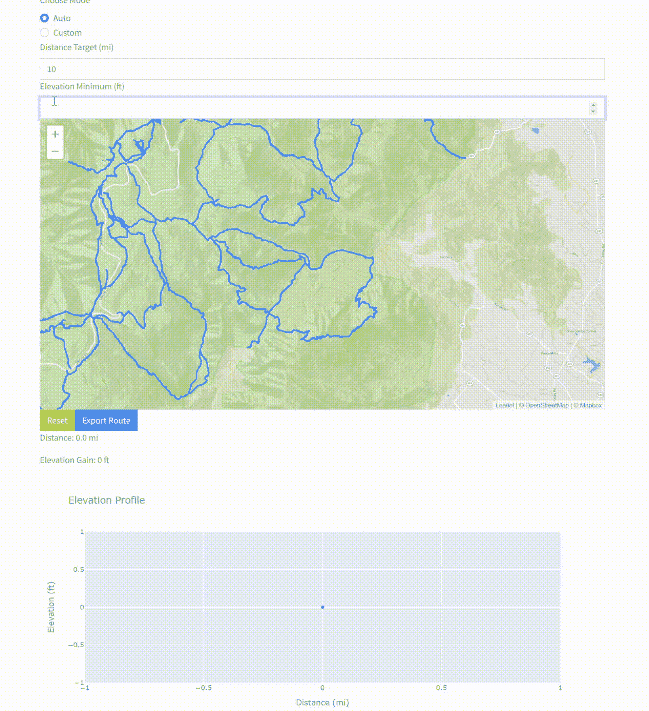
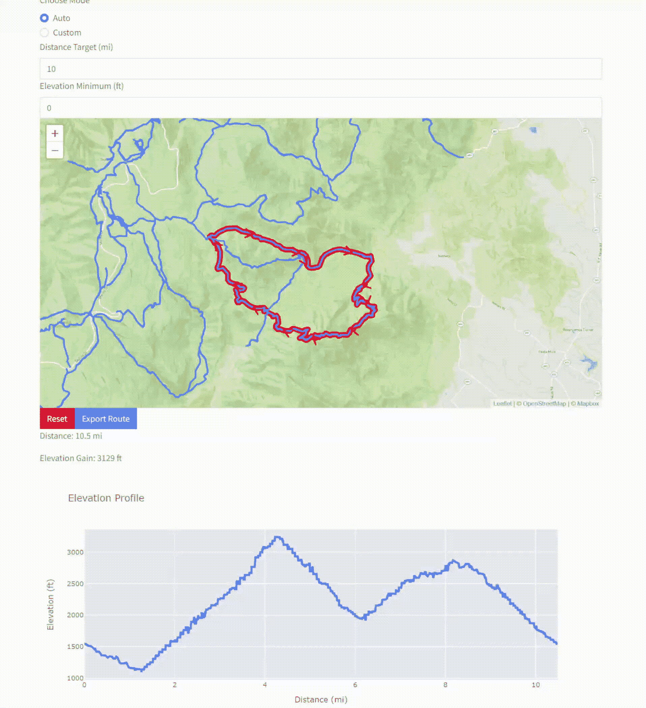
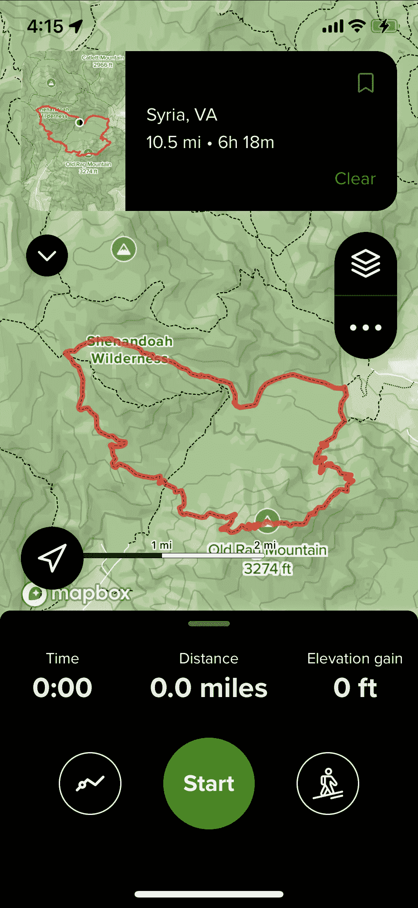

# 使用 NetworkX 和 OpenStreetMap 规划完美的徒步旅行

> 原文：<https://towardsdatascience.com/planning-the-perfect-hike-with-networkx-and-openstreetmap-2fbeaded3cc6>

从美国科罗拉多州斯诺马斯荒野的 Trail Rider Pass 观看(图片由作者提供)。

## 如何建立一个开源的徒步旅行计划应用程序和路线优化引擎

任何一个狂热的徒步旅行者都会告诉你，在旅途中获得良好体验的关键是充分的准备。我应该带雨具吗？我需要在水源之间走多长时间？什么是适合地形和季节的最佳避难所？

最重要的问题也是最简单的——我要去哪里？

导游手册提供了关于某个特定公园或地区的主要景点的有用信息，但细节可能会过时或难以适应您的喜好。像 [AllTrails](https://www.alltrails.com/) 这样的应用通过众包热门路线、照片和评论彻底改变了徒步旅行计划。然而，他们的许多“高级”功能，如打印地图或下载地图供离线使用的能力，需要付费订阅。此外，通过将一个复杂的步道系统提炼为几个策划好的徒步旅行，我经常感觉受到 AllTrails 搜索结果中列出的选项的限制。

因此，我开始构建自己的开源徒步规划应用和路线优化引擎，以补充专有网站的功能。在本文中，我将介绍(双关语)系统的独立组件，并展示它们如何在演示中组合在一起。只是想看看代码？点击这里查看仓库[。](https://github.com/evandiewald/trail-mapping)

## 数据源

说到路线规划的免费数据集， [OpenStreetMap](https://www.openstreetmap.org/) 是明确的选择。事实上，即使是 [AllTrails](https://support.alltrails.com/hc/en-us/articles/360019246411-OSM-Derivative-Database-Derivation-Methodology) 也从 OSM 的[天桥 API](https://wiki.openstreetmap.org/wiki/Overpass_API) 中改编了他们的全球步道数据库，只过滤可步行的路段。

使用地理空间数据的一个难点是，它有很多种文件格式，每种格式都有自己的优点和缺点。在这个项目中，我使用不同的数据结构来存储、可视化和分析踪迹地图。

对于路线规划任务，基于图的表示是有意义的；步道和道路一样，由节点(交叉点)和边(路径段)组成。这使我们能够在路线优化功能中利用像 [Djikstra 算法](https://en.wikipedia.org/wiki/Dijkstra%27s_algorithm)这样的图形算法。

我对这个应用程序的特定组件的策略并不新鲜，因为已经有一个广泛的生态系统，其中有专门用于基于图形的路径规划的[教程和库](https://shakasom.medium.com/routing-street-networks-find-your-way-with-python-9ba498147342)。像 [OSMnx](https://osmnx.readthedocs.io/en/stable/) 这样的工具提供了一个高级接口，通过地理编码(例如“美国弗吉尼亚州谢南多厄国家公园”)查询 OSM 数据集，并将响应转换成 [NetworkX](https://networkx.org/) 图形。下面是我用来下载轨迹数据并将几何信息保存为 graph(为了高效计算)和 GeoJSON(可视化)格式的`load_map` 函数。

然而，规划徒步旅行路线的一个独特方面是，除了纬度和经度之外，*海拔*是设计空间的第三个重要维度。像任何好的轨迹地图一样，我们的工具应该敏锐地意识到地形特征。

我的自定义高度 API 使用了奋进号航天飞机在 2000 年收集的高分辨率雷达数据。对于大约 18GB 的硬盘空间， [SRTM GL3](https://portal.opentopography.org/raster?opentopoID=OTSRTM.042013.4326.1) 数据集覆盖了近 1.2 亿平方公里的地球陆地，增量为 90m。使用 [rasterio](https://rasterio.readthedocs.io/en/latest/index.html) 库，我们可以从路径段中提取高程剖面，而无需将整个地图加载到内存中:

不错吧？有趣的是，[谷歌目前对他们的 Elevation API](https://developers.google.com/maps/documentation/elevation/usage-and-billing) 的每 1000 个请求收取 5 美元，但多亏了 NASA 和几行代码，我们可以免费获得同样高质量的结果。

## 应用和用户界面

[Dash](https://dash.plotly.com/introduction) 是我用 Python 构建交互式仪表盘的首选框架。通过将前端抽象为可定制的组件，它允许数据科学家专注于其用例的功能，而不是设计。由于已经有几十个优秀的 Dash 教程和例子，我将把重点放在我的具体应用程序的布局和逻辑上。

如你所料，用户界面聚焦在地图上，它利用了 Mapbox 的[地形](https://www.mapbox.com/maps/outdoors) tileset。下拉菜单允许您从缓存的路径系统中进行选择，或者您可以通过地理编码下载新的路径系统。

一旦选择了一个区域，就可以使用 [dash-leaflet](https://dash-leaflet.herokuapp.com/) 库来可视化 OSM 踪迹网络。当您计划的路线在二维地图上具体化时(下一节将详细介绍)，相应的高程剖面将实时绘制。

查看围绕旧 Rag 山的所有 3 个维度的循环。在谢南多厄国家公园(图片由作者提供)。

## 路线规划引擎

我的应用程序允许用户使用两种“模式”中的一种来计划他们的徒步旅行。在“自定义”模式下，你只需点击地图上的十字路口，就能看到你的路线栩栩如生，一次一段。在幕后，我们尝试使用最短路径算法智能地连接各个点。在下面的动画中，我们看到一条用户定义的路线在凯霍加国家公园成形。

点击凯霍加国际公园的一条路线(图片由作者提供)。

自动模式更有趣一点。我的目标是创建一个约束优化函数，它考虑了我在规划循环时要寻找的主要因素:

*   仰角增益
*   距离
*   穿越尽可能多的独特路线(例如，在徒步旅行中的多个地点，最大限度地减少原路返回的次数)

数学上，最佳回路将满足以下条件:

其中 *P* 是路径， *d(P)* 是路径距离， *D* 是目标距离， *r(P)* 是唯一的遍历节点的分数(例如，一次往返的 r 值为 0.5)， *e(P)* 是路径的仰角增益， *E* 是目标仰角增益。

遍历循环图来寻找可用的循环也是一项重要的任务。最后，我选择了一种结合了[最短路径](https://networkx.org/documentation/stable/reference/algorithms/generated/networkx.algorithms.shortest_paths.generic.shortest_path.html#networkx.algorithms.shortest_paths.generic.shortest_path)和[简单循环](https://networkx.org/documentation/stable/reference/algorithms/generated/networkx.algorithms.cycles.simple_cycles.html#networkx.algorithms.cycles.simple_cycles)的方法，这些路径不包含任何重复节点。

点击轨迹交叉点附近的地图定义了`find_best_loop`功能的根节点，即循环的终点。这使得用户能够自动生成在关键位置开始和结束的徒步旅行，比如停车场或小路。下面，该算法建议在谢南多厄国家公园的旧拉格山进行一次严格的跋涉，以满足所提供的约束。

使用路线优化引擎和用户定义的约束来自动生成完美的循环(图片由作者提供)。

关于计算累积仰角增益的一个有趣的旁白——令人惊讶的是，没有明确的数学定义。你可以想象，如果你包括每一段正斜率，即使相对平坦，但崎岖不平的道路可能会导致显着的海拔变化。关键是通过添加一个[滚动阈值](https://github.com/evandiewald/trail-mapping/blob/c0255e3c7766e211b099a399735dcc812af72702/mapping_utils.py#L101)(一个用户定义的超参数)来平滑曲线，如这篇[文章](https://www.gpsvisualizer.com/tutorials/elevation_gain.html)中所述。

## 将路径导出到导航工具

一旦你计划了一次完美的徒步旅行，你会想把它导出为一种定向运动友好的格式。对于硬拷贝版本，可以直接从用户界面打印地图和高程剖面图。

然而，用户也可以将他们的路线导出为 GPX 文件(另一种地理空间格式)，并上传到 AllTrails、Gaia、谷歌地图和其他 GPS 跟踪应用程序。

将路线导出为 GPX 文件并上传到 AllTrails(图片由作者提供)。

现在，你可以通过手机导航你的定制路线，就像任何其他策划的 AllTrails 远足一样！

利用 AllTrails 的移动应用程序来跟踪我的定制徒步旅行(图片由作者提供)。

## 包扎

在这个演示中，我们利用来自 OSM 和 NASA 的开源地理数据集构建了一个实用的徒步旅行计划应用程序。使用图论、数值分析和领域专业知识的组合，我们提出了一个数学上合理的路线优化引擎，以自动找到满足各个目标的完整回路。

我期待着不断改进 UI 和底层算法。如果你想自己运行代码，可以在 [Github](https://github.com/evandiewald/trail-mapping) 上查看完整的库。

## 参考

王高·a·哈格伯格、丹尼尔·a·舒尔特和彼得·j·斯沃特，[“使用 NetworkX 探索网络结构、动力学和功能”](http://conference.scipy.org/proceedings/SciPy2008/paper_2/)，载于[第七届 Python 科学大会会议论文集(SciPy2008)](http://conference.scipy.org/proceedings/SciPy2008/index.html) ，格尔·瓦洛夸、特拉维斯·沃特和贾罗德·米尔曼(编辑)，(美国加利福尼亚州帕萨迪纳)，第 11–15 页，2008 年 8 月

地图数据版权归 OpenStreetMap 贡献者所有，可从[https://www.openstreetmap.org](https://www.openstreetmap.org/)获得

美国航天局航天飞机雷达地形学任务(SRTM)(2013 年)。航天飞机雷达地形学任务(SRTM)全球。由 OpenTopography 分发。https://doi.org/10.5069/G9445JDF.访问时间:2022–08–30