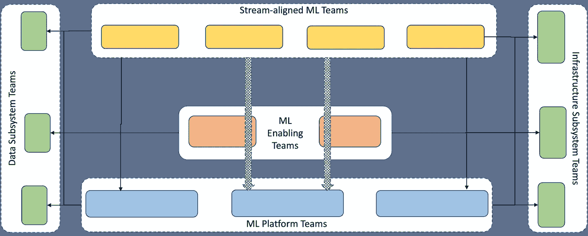

# 机器学习的平台产品

> 原文：<https://towardsdatascience.com/platform-products-for-machine-learning-3d3749443d2>

## 如何让采用机器学习的组织中的价值交付团队更容易使用平台产品进行部署，从而为他们提供最佳机会？

使用(代码)忍者开发和操作机器学习应用程序是不可扩展的。将精心策划的、灵活的平台开发成产品，并使它们易于为 ML 团队所用，是更加务实的。来自 [Pexels](https://www.pexels.com/photo/man-people-laptop-notebook-9553909/?utm_content=attributionCopyText&utm_medium=referral&utm_source=pexels) 的 Mikhail Fesenko 的照片。

在最近发表的一篇文章[机器学习的团队拓扑](/team-topology-for-machine-learning-45bddba626e3)中，我建议组织在他们的机器学习(ML)之旅中应该采用由四种类型的团队组成的团队拓扑，如图 1 所示。团队类型包括流程一致的 ML、ML 支持、数据/基础设施子系统和 ML 平台团队。要了解这些团队的概况，请查看这篇文章。在这篇文章中，我们深入探讨了 ML 平台团队。特别是，我们更详细地解释以下几点。

*   为什么需要 ML 平台团队？
*   这些团队应该开发/维护什么样的产品？
*   我们如何开始使用这些产品/团队？

图 1:交付机器学习解决方案的组织的团队拓扑。有四种类型的团队，如四个彩色框所示:流程一致的 ML、ML 支持、数据/基础设施子系统和 ML 平台团队。每个彩色的盒子代表一个单独的团队。每个圆形虚线框代表一个特定团队类型的分组。每组的队伍数量不是用彩色方框的数量来体现的；它可以变化。细黑箭头表示团队之间没有太多交互的直接服务使用。较粗的箭头表示团队之间参与度更高，协作性更强。作者创造的形象。

# 为什么选择 ML 平台团队？

每个 ML 团队都需要一个或多个 ML 平台来开发、维护和交付 ML 解决方案。通常，团队的目标是将团队交互的平台数量保持在较低水平。然而，由于我们倡导 DevOps 文化，团队很难接受这种文化。问题是团队是购买还是建立自己的平台。答案是两者都不是。使用认知负荷来解释推理更容易，认知负荷是我们处理信息能力的极限，正如[乔治·a·米勒在 1956 年提出的](https://12devsofxmas.co.uk/2015/12/day-3-managing-cognitive-load-for-team-learning/#:~:text=to%20process%20information.-,His%20seminal%20paper,-gave%20rise%20to)。对于一个 ML 团队，可以有三种类型的认知负荷，改编自[管理团队学习的认知负荷](https://12devsofxmas.co.uk/2015/12/day-3-managing-cognitive-load-for-team-learning/)。

1.  *内在:*与基础数据/ML 任务相关，例如，如何编写 Spark 转换、制定 ML 管道等。
2.  *密切相关:*与需要特别关注的复杂数据/ML 任务相关，例如，如何为特定的操作使用准备特性，如何在使用之前/期间/之后解释模型性能？
3.  *无关*:与执行数据/ML 任务的环境有关。例如，在哪里执行代码质量分析，如何在那个环境中执行基本代码质量分析，在哪里管理建模活动，以及如何在那个环境中执行常见的模型管理任务？

内在认知与流程一致的 ML 团队中的基本技能有关，应该通过招聘、培训、结对/mob 编程、黑客马拉松等来处理。此类负载的减少工作应该由工程/数据科学/分析经理来推动。密切相关的认知负荷与流对齐团队中的高级任务有关，可以通过足够的机会解决此类问题和审查专家的支持来减少。然而，额外的认知负荷与日常多余的 MLOps 任务有关，这些任务对保持工作记忆没有什么价值。其中大部分与平台管理有关。如果流对齐的 ML 团队可以将这个问题卸载到另一个团队，那么团队就可以获得额外的能力来处理相关的认知负载，从而驱动关键的增值任务。

简而言之，当我们为流对齐的 ML 团队采用认知负荷的概念时，我们需要保持团队的 ML 系统的规模，包括应用程序和平台，基于团队的认知能力。团队需要考虑的平台管理越少，团队就越能承担增值的认知负荷。确保这一点的唯一方法是组建团队，开发和管理一套精心策划、更新、发展并最终被抛弃的平台。

# 有哪些 ML 平台产品？

常见的 ML 平台活动如下:

1.  数据/ML 探索:探索数据访问/争论，ML 方法，可视化，…
2.  代码管理:源代码编辑，版本控制，持续代码质量评估，持续代码发布，…
3.  数据/功能管理:数据管道编排、数据快照、功能等
4.  模型管理:ML 管道编排，跟踪实验，处理模型生命周期，模型服务，…
5.  报告:仪表板、错误记录、监控……

很难找到涵盖上述所有任务的平台。更实际的做法是购买/开发平台组件，这些组件通过显式 API 调用以可组合的方式相互协作。我们推荐以下类型的平台来支持上述任务:

1.  像 [JupyterHub](https://docs.jupyter.org/en/latest/) 这样的笔记本环境支持

*   使用流行的数据/ML 语言进行编程，比如 Python、Spark 和 R
*   访问不同类型的数据源和格式
*   使用可视化和验证来发现数据中的洞察力
*   使用最先进的框架和库组合解决方案组件

2.一个源代码管理平台，如 [GitHub](https://github.com/) ，支持

*   与流行的本地集成开发环境集成
*   实施标准的 DevOps 风格的代码管理策略，如 Gitflow、持续集成和部署等。，适合分布式开发人员
*   提醒开发人员代码管理行为的状态，例如持续集成阶段的失败、合并拒绝等。

3.大数据管理平台，如 [Databricks](https://databricks.com/product/data-lakehouse) ，支持

*   在一个或多个 blob/file/… store 系统中读取/写入大规模数据
*   以编程方式组成数据管道
*   通过 API 和预定触发器触发数据管道作业
*   当作业阶段失败或整体作业成功时发出警报
*   将弹性集群附加到数据管道作业
*   执行数据验证、快照等。，以编程方式

4.一个 ML 平台，如[顶点 AI](https://cloud.google.com/vertex-ai) ，支持

*   在如上所述的数据管理平台中执行任务，但是适用于 ML 管道而不是数据管道
*   存储关于 ML 培训工作的元信息，以便于理解运行状态
*   保存模型并更改其生命周期，例如，试运行、生产、归档等。
*   在允许预测作业以无缝、高效的方式使用模型或其推理结果的环境中服务模型

5.一套脱节的([Azure](https://docs.microsoft.com/en-us/azure/?product=popular)/[GCP](https://cloud.google.com/docs)/[AWS](https://docs.aws.amazon.com/))云原生平台工具，支持

*   将运行结果/分析作为仪表板发布，供风险承担者研究
*   记录/观察每次运行的详细中间状态，以便在事情没有按预期进行时进行根本原因分析
*   监控模型、应用程序、代码、系统性能随时间的变化

显然，我们可以使用相互集成的开源解决方案来开发所有这些平台。我们还可以使用/购买托管平台，这些平台隐藏了许多平台内部问题，只暴露与价值交付相关的功能。我建议在这两个极端之间找到一个平衡点来构建平台堆栈。我建议使用平台团队的认知能力和快速流动能力作为指导机制。如果您选择购买，请选择那些众所周知的平台，这些平台能够很好地支持一些任务的关键方面，同时为其他功能提供良好的 API 集成。

我个人比较喜欢[团队拓扑](https://teamtopologies.com/book)这本书里提倡的平台定义。调整他们对平台作为产品的定义，我们建议 ML 团队应该消费来自自助服务平台的服务。这些平台不应该臃肿，以保持它们易于开发、更新和丢弃。这些平台应该被开发成*最薄的可行平台*，它包含最少的 API、工具、培训、文档和支持系统。

# 如何组建平台产品团队？

组建平台团队与其说是科学，不如说是一门艺术，但是我们可以使用科学的方法结合我们的经验来完善我们组织的艺术。在这种特殊情况下，从组织的经验中提取数据将是正确的科学方法。以下是一些可用于组建平台团队的技术:

1.  从符合组织的 IT/云治理策略的平台开始。如果为某个组织推荐的云是 Azure，目标是购买一个平台，首先尝试从 Azure 中选择。当你用尽所有其他选项时，转到其他选项。多云集成是混乱的。为了实现数据驱动，我们应该为组织制定一个高级的*技术雷达*，包括当前使用的、废弃的和未来的平台。标出有不合规风险的平台。
2.  尝试选择一个在组织中已经有用户群的平台。这样的选择使得平台产品的开发和采用变得容易。同样的规则也适用于内部组件。在这种特殊情况下，群体的智慧通常会战胜个人的偏好。为了确保数据驱动，我们应该在前面提到的技术雷达中包括广泛使用的平台。这些平台的受欢迎程度应该反映在科技雷达上。此外，平台的高级用法应该被*编目*，并在推荐和反模式实践中突出显示。
3.  创建针对团队角色的平台。如果组织的路线图包括创建许多新的 ML 解决方案，从而产生许多新的与流程一致的 ML 团队，那么最好将重点放在对代码、数据和模型管理有一些最小支持的探索平台上。这将允许团队在他们的探索工作中是有效的，并且以轻量级的方式转移到生产阶段。另一方面，如果路线图包括使现有的 ML 团队走向成熟，以进行大规模或更复杂的部署，那么优先考虑适合大容量工件/信息处理的编排、服务和报告机制是务实的。此外，如果有很多团队工程能力低下，那么最好优先考虑支持低代码实践的平台。为了以数据为导向，形成一个*组织图*，列出所有过去、现在和未来的利益相关者，根据他们在 ML 旅程中所处的阶段以及团队成员的构成，按照他们的角色进行分类。
4.  避免创建非常大的平台团队或太多的平台团队。两者都使得流程对齐团队和平台团队之间的沟通模式变得复杂，并最终导致平台臃肿。我个人喜欢有 4-6 名工程师的团队。要做到数据驱动，基于软件通信模式绘制通信模式。在绘制这种模式时，从圈的复杂性中获得灵感。如果这样的模式为流程对齐的团队总结了复杂的依赖关系，这通常是平台团队边界对于流程对齐的团队来说太复杂的迹象，并且将无法实现快速流程。
5.  每个平台团队都应该有自己的使命、目标、时间表和免责声明，并得到利益相关方的确认。没有利益相关者的平台团队是不应该存在的，即使是在早期。由于缺乏利益相关者，许多组织很难将他们的 ML PoCs 转化为产品。虽然认为 ML 团队无论如何都需要平台，并且一旦平台建立起来，团队就会使用它们是很方便的，但是每个人都应该知道最终所有的软件产品都是可选的。不尽早让利益相关者参与进来肯定会让平台不受欢迎。
6.  每个平台都应该交付成果而不是产出。确保团队采用最大化易于衡量的结果的指标。比如关闭的票数是一个输出的衡量标准，它可能或者可能预示着一个平台的成功。然而，与流程一致的团队的生产力的增加，例如在生产中交付的模型的数量，清楚地表明一个平台可能已经使团队成功地实现了他们的目标。一旦选择了指标，就要对能够最大化指标的平台特性进行优先级排序。在付诸实施之前，确保与利益相关者一起验证指标和特性。为了实现数据驱动，与可能成为客户的流程一致的团队一起执行旅程规划，并定义取得成功的里程碑，并从中得出 KPI。在运营时，建立 KPI 的基线，并跟踪 KPI 随时间的变化。

**备注**

您是否正在经历类似的旅程:加入/组建 ML 平台团队？你同意/不同意以上观点吗？我确信我可能有盲点，这可以通过公开的建设性对话来解决。请通过评论或分享你偶然发现的文章来分享你的观点。