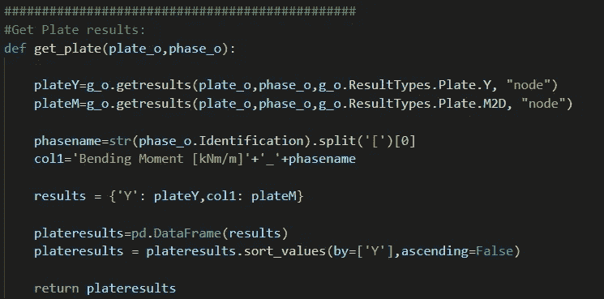
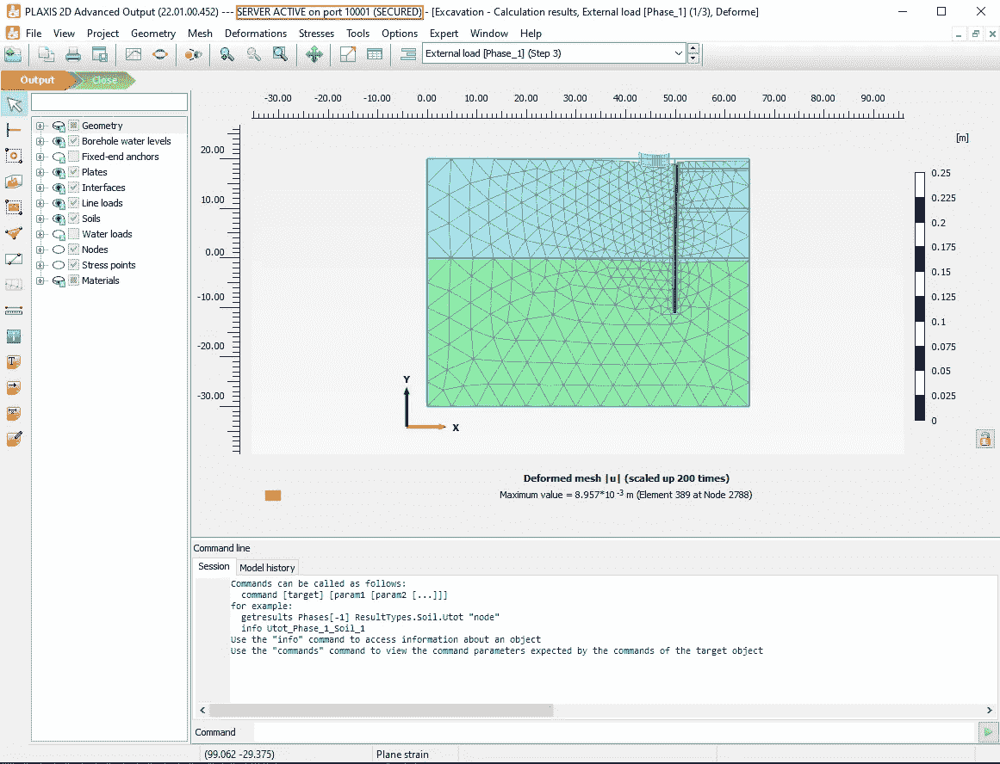
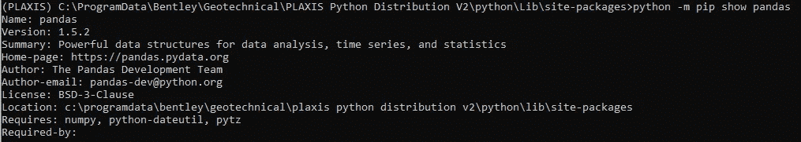
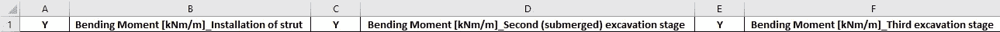
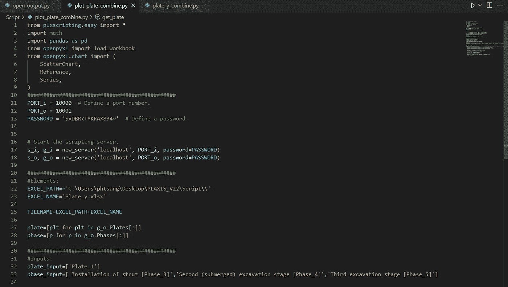
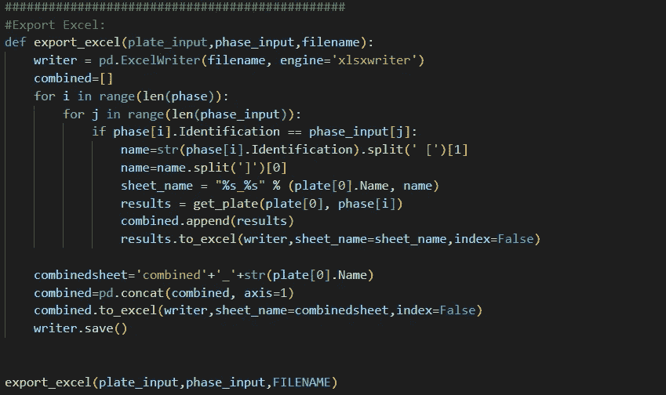
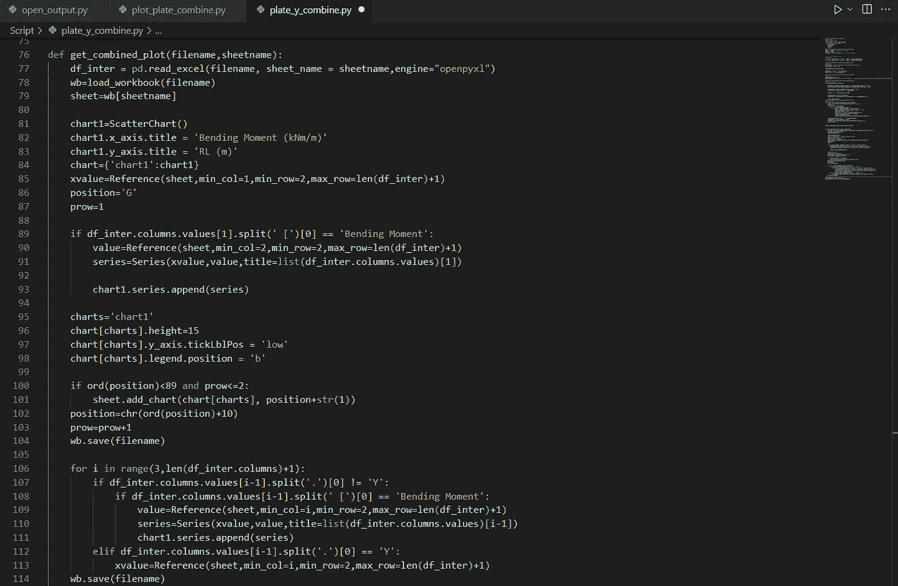
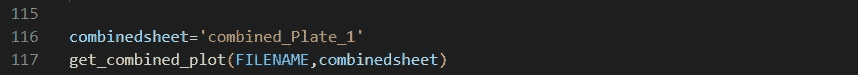
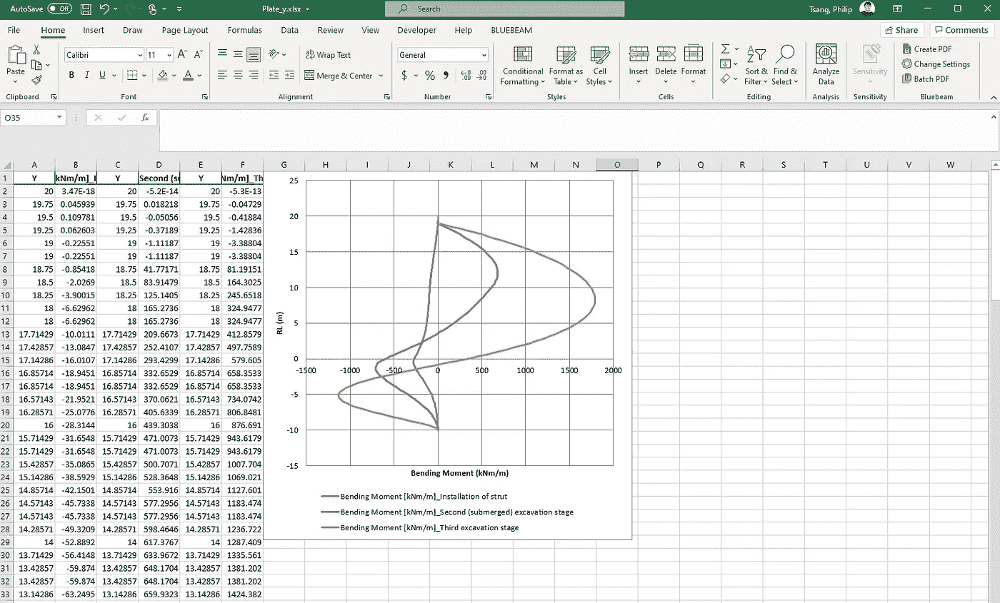

# 使用 Python 实现 PLAXIS 输出可视化

> 原文：<https://towardsdatascience.com/plaxis-output-visualisation-using-python-a144d2367094>

## PLAXIS 自动化系列

## 逐步走向自动化的指南


卢克·切瑟在 [Unsplash](https://unsplash.com/s/photos/excel?utm_source=unsplash&utm_medium=referral&utm_content=creditCopyText) 上的照片

PLAXIS 输出应用程序提供了使用内置绘图工具比较不同阶段输出的可能性。虽然它提供了一些基本的绘图功能，允许用户可视化结果，但人们经常使用 Excel，因为它允许在绘图格式、数据操作和结果共享方面的灵活性。

毫无疑问，Excel 是一个强大而著名的数据可视化软件。但是，PLAXIS 没有提供与 Excel 的完全集成，这使得提取和可视化过程非常耗时。在数据可视化方面，有三个可能的改进领域:

1.  将所有数据合并到一个工作表中进行绘图
2.  创建绘图时，在 Excel 中自动选择数据系列
3.  使用定制的系列名称和轴标题创建绘图

本教程旨在扩展从**第二教程**中学到的教训。我们将提取多个阶段的输出，并使用图来比较结果。这可以通过以下三个步骤来完成:

1.  将外部模块安装到 PLAXIS 环境中
2.  提取多个阶段的结果
3.  使用 Excel 中的图表比较不同阶段的结果
4.  用 Openpyxl 格式化

和以前一样，本教程要求读者已经安装了 VS 代码和 PLAXIS 环境。如果您不熟悉这个页面，请按照下面文章中的说明进行操作。我们开始吧！

[](https://medium.com/@philip.studio11/start-using-python-to-automate-plaxis-35a5297321e7)  

# PLAXIS 示例模型

我们将使用第二节课中相同的 PLAXIS 2D 模型。如果您还没有这样做，请按照下面的说明来设置和计算模型。

[](https://medium.com/@philip.studio11/goodbye-boring-plaxis-output-with-python-fc5c8b26cdb2)  

与上一个教程类似，我们将使用“open_output.py”打开 PLAXIS 文件，这样就可以启用 API 服务器。

概括一下，我们使用下面的代码来打开文件:



作者截图自 VS 代码

运行上面的代码后，PLAXIS 2D 输入和输出应用程序应该会自动打开。从输出应用程序中，您应该看到“服务器在端口 10001 上活动”。



作者截图自 PLAXIS

# 步骤 1:将外部模块安装到 PLAXIS 环境中

我们的目标是从 PLAXIS 中提取结果，并在 excel 中创建比较图。为此，我们需要三个外部模块:

*   熊猫
*   Xlsxwriter
*   Openpyxl

通过 PLAXIS 命令提示符安装外部模块的过程已经在第二篇教程中详细描述了。在继续以下步骤之前，请确保您已经完成了该流程。

从上一个教程来看，熊猫和 xlsxwriter 都应该安装。请注意，Python 模块是版本敏感的，这是因为一些模块与其他模块有连接，因此版本更新可能会导致故障。这对于在 PLAXIS 环境中保持一致的模块依赖关系至关重要。

我在本教程中使用的模块版本如下:

```
pandas == 1.5.2
xlsxwriter == 3.0.3
openpyxl == 3.0.9
defusedxml == 0.7.1
```

要检查模块的当前版本，我们可以在 PLAXIS 命令提示符下使用以下命令:

```
python -m pip show pandas
```



作者截图自 PLAXIS

如果版本不一致，我们可以使用以下命令来升级/降级版本:

```
python -m pip install --upgrade pandas==1.5.2
```

安装其余模块:

```
python -m pip install xlsxwriter==3.0.3
python -m pip install openpyxl==3.0.9
python -m pip install defusedxml==0.7.1
```

在某些情况下，您可能会在安装 *defusedxml* 时遇到错误

```
ERROR: Could not install packages due to an OSError: [WinError 5] Access is denied
```

如果是这种情况，请尝试以下代码:

```
python -m pip install --upgrade defusedxml==0.7.1 --user
```

现在我们已经安装了所有需要的模块。我们现在可以使用 Python 脚本从 PLAXIS 的不同阶段提取结果了。

# 步骤 2:提取多个阶段的结果

步骤 2 的主要目标是从“挖掘”模型的三个阶段中提取结果(弯矩)。然后，我们会将结果导出到 Excel 中一个名为“combined_Plate_1”的工作表中，该工作表包含以下各列:



作者截图自 excel

首先，我们创建一个空的 python 文件，并将其命名为“plot_plate_combine.py”。

## 导入模块并启动服务器

```
from plxscripting.easy import *
import math
import pandas as pd
from openpyxl import load_workbook
from openpyxl.chart import (
    ScatterChart,
    Reference,
    Series,
)
###############################################
PORT_i = 10000  # Define a port number.
PORT_o = 10001
PASSWORD = 'SxDBR<TYKRAX834~'  # Define a password.

# Start the scripting server.
s_i, g_i = new_server('localhost', PORT_i, password=PASSWORD)
s_o, g_o = new_server('localhost', PORT_o, password=PASSWORD)
```

## 定义文件名

文件位置:C:\ Users \ phtsang \ Desktop \ PLAXIS _ v 22 \ Script

文件名:可以是您想要的任何名称

```
EXCEL_PATH=r'C:\Users\phtsang\Desktop\PLAXIS_V22\Script\\'
EXCEL_NAME='Plate_y.xlsx'

FILENAME=EXCEL_PATH+EXCEL_NAME
```

## 输入定义

在这种情况下，我们将从以下阶段中提取‘Plate _ 1’的弯矩:

*   安装支柱[阶段 3]'
*   第二(水下)开挖阶段[第 4 阶段]'
*   '第三挖掘阶段[第五阶段]'

```
###############################################
#Inputs:
plate_input=['Plate_1']
phase_input=['Installation of strut [Phase_3]','Second (submerged) excavation stage [Phase_4]','Third excavation stage [Phase_5]']
```

您的脚本应该是这样的:



作者截图自 VS 代码

## 结果提取

在预处理之后，我们将定义一个函数来提取弯矩(上一个教程的简化版)，并将其命名为“get_plate()”。

```
def get_plate(plate_o,phase_o):

    plateY=g_o.getresults(plate_o,phase_o,g_o.ResultTypes.Plate.Y, "node")
    plateM=g_o.getresults(plate_o,phase_o,g_o.ResultTypes.Plate.M2D, "node")

    phasename=str(phase_o.Identification).split('[')[0]
    col1='Bending Moment [kNm/m]'+'_'+phasename

    results = {'Y': plateY,col1: plateM}

    plateresults=pd.DataFrame(results)
    plateresults = plateresults.sort_values(by=['Y'],ascending=False)

    return plateresults
```


作者截图自 VS 代码

## 导出到 Excel

与上一个教程不同，我们想要从多个阶段而不是单个阶段提取结果。因此，需要修改“export_excel()”函数。涉及三个动作:

1.  遍历当前模型中现有阶段的名称
2.  与用户输入的阶段(即阶段 3、4 和 5)进行交叉检查。
3.  如果匹配，则提取结果并导出到单个工作表(例如 Plate_1_Phase_3)
4.  将结果合并到新的数据框架中，并导出到工作表(' combined_Plate_1 ')

这些操作可以用下面的代码来完成。我们来分解一下！

```
def export_excel(plate_input,phase_input,filename):
    writer = pd.ExcelWriter(filename, engine='xlsxwriter')
    combined=[]
    for i in range(len(phase)):
        for j in range(len(phase_input)):
            if phase[i].Identification == phase_input[j]:
                name=str(phase[i].Identification).split(' [')[1]
                name=name.split(']')[0]
                sheet_name = "%s_%s" % (plate[0].Name, name)
                results = get_plate(plate[0], phase[i])
                combined.append(results)
                results.to_excel(writer,sheet_name=sheet_name,index=False)

    combinedsheet='combined'+'_'+str(plate[0].Name)
    combined=pd.concat(combined, axis=1)
    combined.to_excel(writer,sheet_name=combinedsheet,index=False)
    writer.save()

export_excel(plate_input,phase_input,FILENAME)
```

*   我们需要首先定义一个空列表“combined=[ ]”。这允许我们将每个阶段提取的结果附加到一个列表中，这样我们可以在最后一步将它们连接起来。
*   下一步是遍历模型的现有阶段，看看哪个阶段与我们的输入相匹配。这是使用 PLAXIS 命令“阶段[i]”完成的。“标识”,给出每个阶段的全名。

```
for i in range(len(phase)):
        for j in range(len(phase_input)):
            if phase[i].Identification == phase_input[j]:
```

*   以下代码用于命名目的。例如，“相位[0]”。“识别”将给出“支柱安装[阶段 3]”。我想得到位于方括号[ ]之间的“Phase_3”。然后，我将“Plate_1”和“Phase_3”组合起来，形成工作表名称。

```
name=str(phase[i].Identification).split(' [')[1]
name=name.split(']')[0]
sheet_name = "%s_%s" % (plate[0].Name, name)
```

*   使用“get_plate()”函数提取 PLate_1 在每个阶段的弯矩，并将其存储为结果。然后通过“combined.append(results)”方法将结果追加到“组合”列表中。最后，使用“results.to_excel(writer，sheet_name=sheet_name，index=False)”将每个阶段的结果导出到单个工作表中。

```
results = get_plate(plate[0], phase[i])
combined.append(results)
results.to_excel(writer,sheet_name=sheet_name,index=False)
```

*   最后四行旨在合并“合并”列表中的结果，并导出到“合并 _ 板 _1”工作表。这是通过 pandas 的方法' concat()'完成的。输入“axis=1”作为参数是很重要的，因为它告诉 pandas 水平组合结果(按行)。默认情况下，“轴=0”垂直组合结果(按列)。

```
combinedsheet='combined'+'_'+str(plate[0].Name
combined=pd.concat(combined, axis=1)
combined.to_excel(writer,sheet_name=combinedsheet,index=False)
writer.save())
```

您的最终脚本应该是这样的:



作者截图自 VS 代码

既然我们已经从所有阶段提取了结果，那么我们可以继续使用 Python 在 Excel 中创建图。

# 步骤 3:使用 Excel 中的绘图和 Openpyxl 比较不同阶段的结果

最后，我们将学习 Openpyxl，它是一个允许我们创建 Excel 绘图的模块。

我们创建一个函数，称它为“get_combined_plot()”。

*   df_inter 存储从“combined_Plate_1”获得的数据帧。工作表是我指定工作表' combined_Plate_1 '的地方，这样我可以在那里创建绘图。

```
def get_combined_plot(filename,sheetname):
    df_inter = pd.read_excel(filename, sheet_name = sheetname,engine="openpyxl")
    wb=load_workbook(filename)
    sheet=wb[sheetname]
```

*   然后，创建一个名为“chart1”的图表对象，这是一个散点图。之后，我们使用 openpyxl 方法(x_axis.title 和 y_axis.title)分配轴标题。
*   *yvalue* 使用方法“Reference()”存储结果的 Y 坐标。
*   *位置* & *船头*是我指定剧情的位置。

```
 chart1=ScatterChart()
    chart1.x_axis.title = 'Bending Moment (kNm/m)'
    chart1.y_axis.title = 'RL (m)'
    chart={'chart1':chart1} 
    yvalue=Reference(sheet,min_col=1,min_row=2,max_row=len(df_inter)+1)
    position='G'
    prow=1
```

*   然后，从第二列中提取弯矩值，并将其存储在*值*中。
*   一旦我们有了 x 轴和 y 轴的数据，我们使用' Series()'创建一个系列，并使用' chart1.series.append(series)'将它分配给' chart1 '。

```
 if df_inter.columns.values[1].split(' [')[0] == 'Bending Moment'
        value=Reference(sheet,min_col=2,min_row=2,max_row=len(df_inter)+1)
        series=Series(yvalue,value,title=list(df_inter.columns.values)[1])

        chart1.series.append(series):
```

*   以下代码主要用于设置绘图样式的格式，如高度、刻度框和图例位置等(类似于典型的 excel 绘图设置)。官方文档中概述了更多的格式细节:

  

```
 charts='chart1'
    chart[charts].height=15
    chart[charts].y_axis.tickLblPos = 'low'
    chart[charts].legend.position = 'b'

    if ord(position)<89 and prow<=2:
        sheet.add_chart(chart[charts], position+str(1))
    position=chr(ord(position)+10)
    prow=prow+1
    wb.save(filename)
```

*   上述步骤使用前两列(即“Y”和“弯矩[kNm/m]_ 支柱安装”)创建了绘图
*   最后一步是遍历其余的列，并将它们作为两个额外的系列添加到现有的绘图中。
*   为了识别柱中是否包含 Y 坐标或弯矩，我们需要使用 if-else 语句。
*   如果列标题是' Y '，它将把列值存储到 y *值*(即 Y 轴)。如果列标题包含“弯矩”，它会将列值存储到*值*(即 x 轴)。

```
 for i in range(3,len(df_inter.columns)+1):
        if df_inter.columns.values[i-1].split('.')[0] != 'Y':
            if df_inter.columns.values[i-1].split(' [')[0] == 'Bending Moment':
                value=Reference(sheet,min_col=i,min_row=2,max_row=len(df_inter)+1)
                series=Series(yvalue,value,title=list(df_inter.columns.values)[i-1])
                chart1.series.append(series)
        elif df_inter.columns.values[i-1].split('.')[0] == 'Y':
            yvalue=Reference(sheet,min_col=i,min_row=2,max_row=len(df_inter)+1)      
    wb.save(filename)
```

最终的脚本如下所示:

```
def get_combined_plot(filename,sheetname):
    df_inter = pd.read_excel(filename, sheet_name = sheetname,engine="openpyxl")
    wb=load_workbook(filename)
    sheet=wb[sheetname]

    chart1=ScatterChart()
    chart1.x_axis.title = 'Bending Moment (kNm/m)'
    chart1.y_axis.title = 'RL (m)'
    chart={'chart1':chart1} 
    xvalue=Reference(sheet,min_col=1,min_row=2,max_row=len(df_inter)+1)
    position='G'
    prow=1

    if df_inter.columns.values[1].split(' [')[0] == 'Bending Moment':
        value=Reference(sheet,min_col=2,min_row=2,max_row=len(df_inter)+1)
        series=Series(xvalue,value,title=list(df_inter.columns.values)[1])

        chart1.series.append(series)

    charts='chart1'
    chart[charts].height=15
    chart[charts].y_axis.tickLblPos = 'low'
    chart[charts].legend.position = 'b'

    if ord(position)<89 and prow<=2:
        sheet.add_chart(chart[charts], position+str(1))
    position=chr(ord(position)+10)
    prow=prow+1
    wb.save(filename)

    for i in range(3,len(df_inter.columns)+1):
        if df_inter.columns.values[i-1].split('.')[0] != 'Y':
            if df_inter.columns.values[i-1].split(' [')[0] == 'Bending Moment':
                value=Reference(sheet,min_col=i,min_row=2,max_row=len(df_inter)+1)
                series=Series(xvalue,value,title=list(df_inter.columns.values)[i-1])
                chart1.series.append(series)
        elif df_inter.columns.values[i-1].split('.')[0] == 'Y':
            xvalue=Reference(sheet,min_col=i,min_row=2,max_row=len(df_inter)+1)      
    wb.save(filename)                    

combinedsheet='combined_Plate_1'
get_combined_plot(FILENAME,combinedsheet)
```



作者截图自 VS 代码



作者截图自 VS 代码

使用以下命令运行脚本。

```
(PLAXIS) C:\Users\phtsang\Desktop\PLAXIS_V22\Script>python plot_plate_combine.py
```

现在，如果您在之前指定的位置打开 excel 电子表格，并转到“combined_Plate_1”工作表。你可以看到我们已经提取了所有三个相位的 Y 坐标和弯矩。更重要的是，我们有一个包含所有结果的图，可以让我们比较不同阶段的弯矩！



作者截图自 excel

太棒了。您已经成功地从 PLAXIS 中提取了结果，并使用它们通过 Python 在 Excel 中创建了一个图。

# 结论

以上是关于使用 Python 实现 PLAXIS 输出可视化的第三篇教程。到目前为止，您应该能够提取多个阶段的结果，并在 excel 中创建图表以进行结果比较。这可以进一步扩展到包括不同阶段的多个结构元素，这意味着整个输出提取过程可以自动化。我将在以后的教程中进一步讨论这一点。

如果你喜欢阅读这类内容，请随时关注我的页面。我将继续发布这一系列关于用 Python 自动化 PLAXIS 的教程。除此之外，我还热衷于分享关于如何使用 Python 来自动化工程中的工作流的知识。