# 用离线强化学习下棋

> 原文：<https://towardsdatascience.com/playing-chess-with-offline-reinforcement-learning-411edc5efd5f>

## 为我们的广义人工智能添加离线强化学习

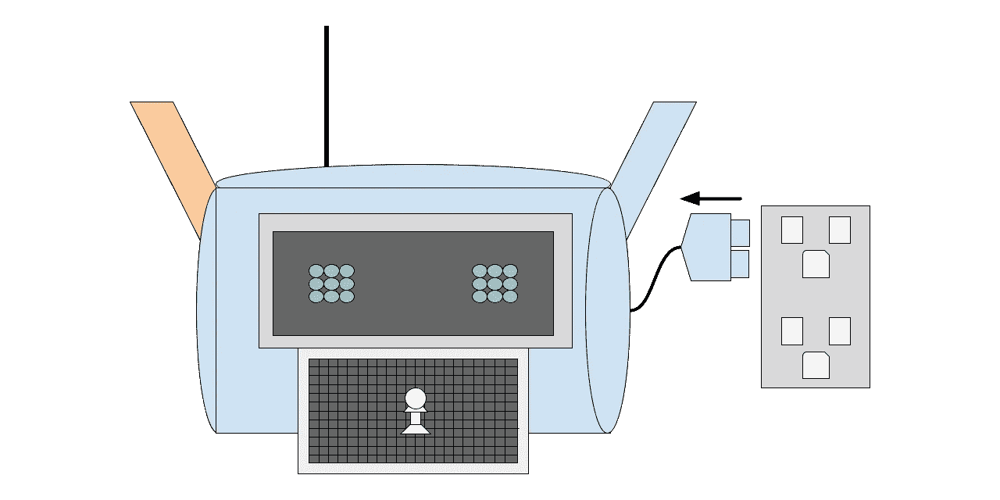

作者图片

大家好，今天，我们将改进我们在我的博客文章[中创建的广义人工智能，与广义人工智能](/playing-chess-with-a-generalized-ai-b83d64ac71fe)下棋。为此，我们将对我们的培训流程进行两项重大升级。首先，我们将利用离线强化学习(RL)。其次，我们将对训练主干层时使用的数据做一个小小的改动。

在我们的人工智能的最初实现中，我们使用了一种叫做在线学习的训练方法。在线学习是一种学习形式，我们通过与环境的直接交互来收集训练数据，并且在训练期间只处理一次。

在线强化学习|作者图片

# 以前的培训设置

在我们最初的实现中，每次动作后，我们都将所有游戏状态保存到缓存中。然后在游戏结束时，我们用那个缓存训练所有的模型层。

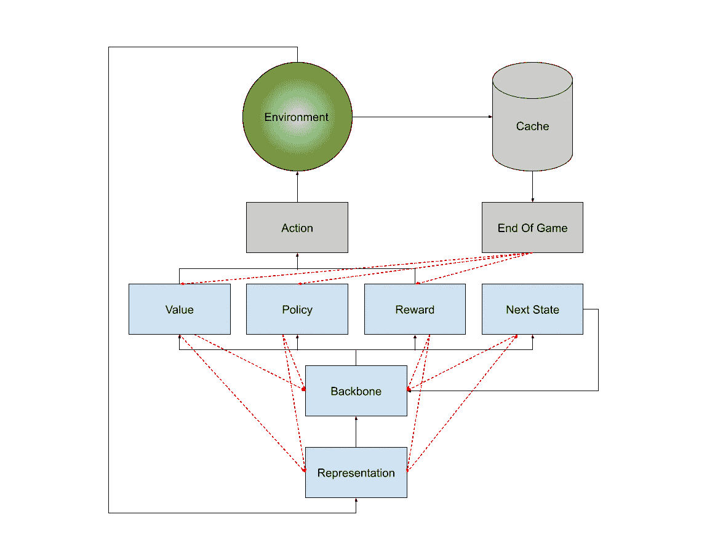

初始训练图|图片由作者提供

我们在游戏结束时更新模型，而不是在每个动作之后，以确保模型可以学习零和游戏(国际象棋、围棋、跳棋)。零和游戏没有直接的回报，这使得它们在每次行动后都很难训练。这源于这样一个事实，即直到游戏结束，你才知道代理人选择的行动是好是坏。这就是为什么我们将所有的行动存储在缓存中，因为在游戏结束时，我们可以假设赢家的所有行动都对获胜产生了积极的影响，而输家的所有行动都损害了我们获胜的机会。

# 当前问题

当在训练期间分析损失值时，我注意到许多层之间的不稳定。

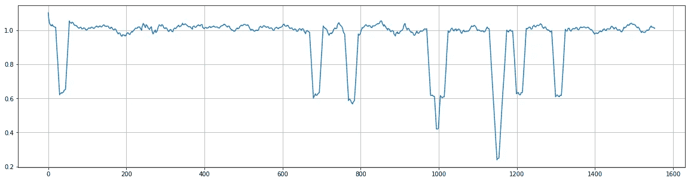

制图表达图层损失值|按作者分类的图像

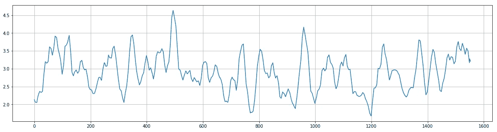

主干层损失值|作者图片

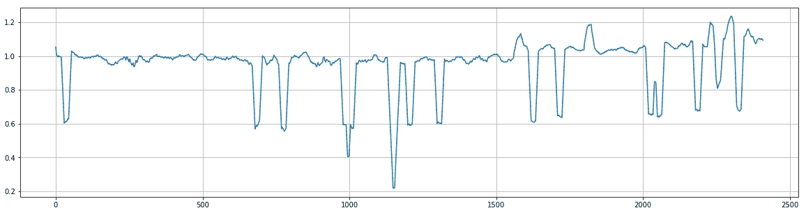

价值头部损失价值|作者图片

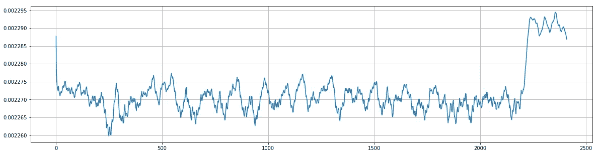

保单头损值|作者图片

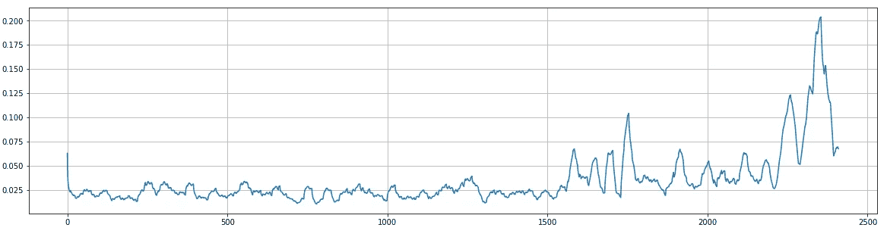

奖励人头损失值|图片作者

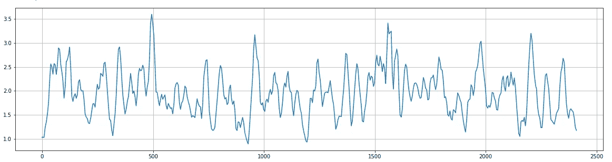

下一个国家元首损失值|作者图片

在 RL 中，不稳定是一件有些熟悉的事情，由于我们的模型使用了[穆泽罗](https://arxiv.org/abs/1911.08265)的论文作为参考，我们可以推断这种不稳定会在某个点上收敛，允许模型像原始论文一样有效地学习掌握游戏。为了支持这一推论，我们可以看到明确的证据，即模型正在学习，因为最新的模型持续优于先前的模型。然而，通过解决这个不稳定的问题，我相信我们可以提高这种趋同的速度。

很难说不稳定的确切原因是什么。但是，我认为这部分是由于使用在线 RL 重新训练整个模型造成的。更具体地说，在每场比赛后使用在线 RL 训练代表层和骨干层。这种想法的逻辑是，我们没有给模型足够的数据来学习有效的编码，在每场比赛后重新训练表现层和主干层。上面的主干损耗图支持了这一观点。该图显示主干层在创建一致的游戏编码时遇到了困难。从该图中损失值的可变性可以明显看出这一点。无效的游戏编码对整体模型健康是有害的，因为它会迫使模型的头部产生不准确的预测，因为它不能推断出适当的信息。因此，我们的主要焦点将是改进表示层和主干层。通过这样做，我相信我们的完整模型将会获得显著的收益。

# 改进的培训设置

如简介中所述，我们将实现的第一个改进是使用[离线 RL](https://arxiv.org/abs/2201.13425) 。离线 RL 是一种使用在探索期间发现的记录数据来训练 RL 代理的方法。

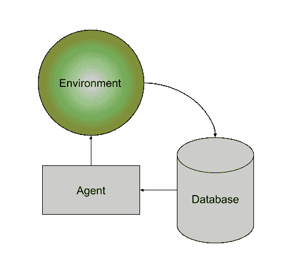

离线强化学习图|图片作者

对于我们的情况，这将是积极的，因为我们可以在训练期间向主干层提供更多的数据，因为我们不再需要扔掉所有以前的游戏。

我们的新方法将不会独立地使用离线 RL，而是离线和在线 RL 的混合方法。首先，我们将在每场游戏后使用在线 RL 微调模型的头部，同时也记录游戏以供将来分析。通过在每场比赛后微调模型的头部，我们让模型尝试新学到的动作，从而帮助改进我们的数据探索。

在玩了 x 次(我在测试中用了 20 次)游戏后，使用所有记录的游戏数据通过离线学习更新了完整的模型。我们在玩完第 x 个游戏后重新训练所有层，而不是每一个游戏，因为训练所有记录的游戏数据是非常计算密集型的。因为计算需要钱，我们认为最好是在最少的时间内训练模型，而不是最少的游戏。我们选择在这个阶段离线重新训练完整的模型，而不是继续在线训练，因为我们相信，考虑到大数据集，这有助于模型不要把太多的重量放在它的最后一个游戏上，并给它更多的例子来创建更好的游戏编码。

为了减少偏向某些游戏状态的机会，所有重复的游戏状态都将被丢弃，保留最近出现的游戏状态。保持游戏状态的最新实例也应该有助于通过提供模型认为在探索时什么是更好的选择的例子来防止模型倒退。

这些修改将使我们的新方法如下图所示。

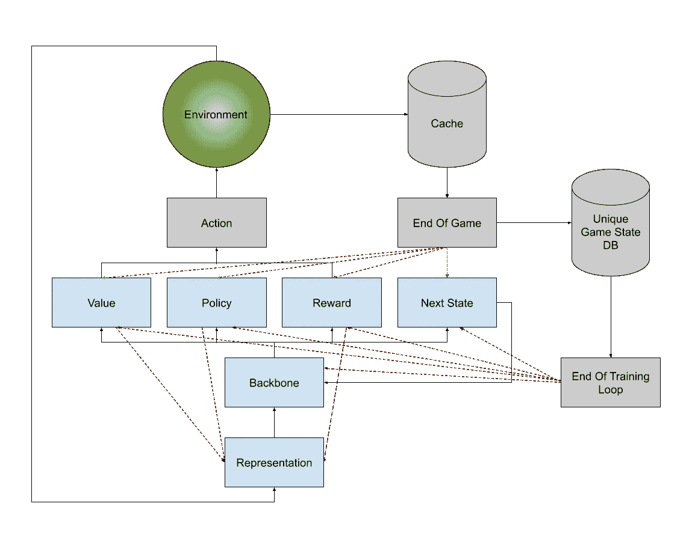

新训练图|作者图片

我们要做的第二个改进是训练主干层时使用的实际数据。之前，为了训练模型，我们使用了来自模型的不同头部的损失函数的组合。

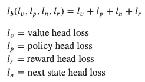

老骨干流失功能|图片作者

这个损失函数并不是完全无效的，所以并不清楚它是否需要改变。尽管在思考了这一层的目的之后，我意识到我没有尽可能有效地训练它。

主干层的目的是创建游戏状态编码，这意味着它需要为所有游戏状态产生一致的编码。这意味着游戏状态和没有动作必须具有与前一个游戏状态相同的编码，并且相应的动作会导致该游戏状态。

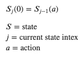

游戏状态编码定义|作者图片

上面的等式代表了我们一致的编码逻辑的思想。利用上面的等式，我们可以利用自我监督学习来更有效地训练主干层，使得我们的新主干层损失函数看起来像这样。

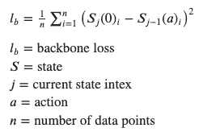

新的主干损失函数|图片由作者提供

有了这两个新的升级，这里是我们新的损失价值已经成为。

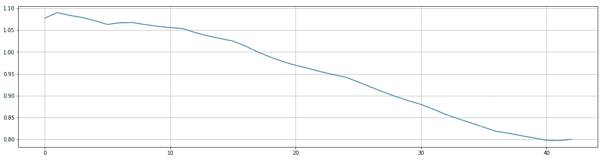

新的制图表达图层损失值|作者提供的图像

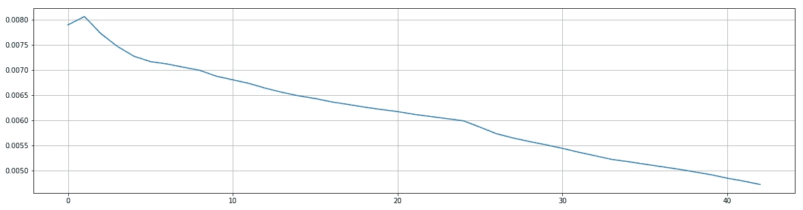

新主干层损失值|作者图片

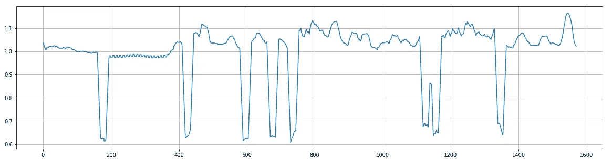

价值头部损失价值|作者图片

保单头损值|作者图片

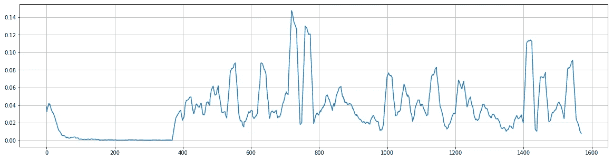

奖励人头损失值|图片作者

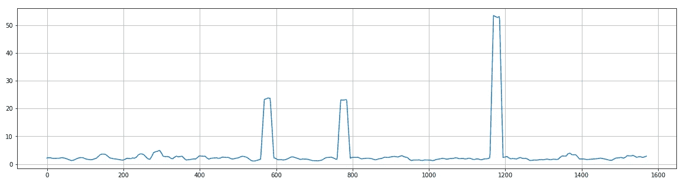

下一状态损失值|作者图片

正如你在上面的图表中看到的，我们看到我们的损失值更加稳定。特别是在表示层和主干层，我们认为这是问题的根源。

随着模型的更新，我们也看到了培训时间的改进。为了验证这一说法，我对三个不同的模型进行了一场小型比赛，这些模型具有相同数量的参数，但都使用不同的方法进行了训练。使用旧的训练方法和旧的骨干损失函数对第一个模型(旧的)进行更长时间的训练。使用新的训练方法和新的骨干损失函数，在更短的时间内创建了第二个模型(新的)。最后用更少的时间创建了第三个模型(全离线)，用最新的骨干丢失功能在每场比赛后使用离线 RL。

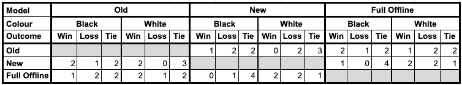

锦标赛结果|作者图片

基于上表中的结果，我们可以肯定地说，新模型在训练时间更短的情况下表现更好，从而验证了新的训练方法。然而，从这个实验中一个有趣的观察结果是，我的完全离线模型在训练时间更少的情况下也表现得与旧方法相似。很难确切知道是哪种变化导致了这种情况。因为这可能意味着离线方法优于完全在线方法，新的主干损失函数优于旧的损失函数，或者完全离线和最新损失函数的组合有所帮助。

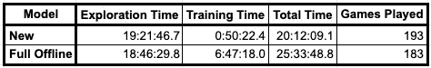

模型训练时间对比|作者图片

上面我展示了另一组训练统计数据，以帮助说明新的和完全离线训练方法之间的差异，从而更好地理解为什么新方法在更短的时间内表现更好。上表显示，新方法强调探索，因为它比完全离线模型具有更长的探索时间，同时保持较低的总训练时间。新模式进一步显示了对探索的重视，比完全离线模式玩了更多的游戏。我相信这种对探索的强调赋予了新方法力量。此外，这种对探索的强调允许在更短的时间内获得更大的数据集，这将使所有模型层受益。

我相信 DeepMind 的新[龙猫](https://arxiv.org/abs/2203.15556)论文有助于支持更多数据非常重要的想法，因为它深入探索了基于[变压器](https://arxiv.org/abs/1706.03762)的模型的概念。我在这里不打算深入讨论 Chinchilla 的论文，但一个快速的总结是，我们的比例定律是错误的，应该根据模型中的参数数量提供更多的数据。

# 谢谢

现在你知道了，我们已经成功地升级了我们的通用人工智能，让它可以更有效地训练。你可以在我的 GitHub [这里](https://github.com/bellerb/chappie.ai)查看完整版本的代码。请自行下载并试用。

感谢阅读。如果你喜欢这样，可以考虑订阅我的账户，以便在我最近发帖时得到通知。

# 参考

*   [https://towards data science . com/playing-chess-with-a-generalized-ai-b 83d 64 AC 71 Fe](/playing-chess-with-a-generalized-ai-b83d64ac71fe)
*   [https://arxiv.org/abs/2201.13425](https://arxiv.org/abs/2201.13425)
*   [https://arxiv.org/abs/1911.08265](https://arxiv.org/abs/1911.08265)
*   [https://arxiv.org/abs/2203.15556](https://arxiv.org/abs/2203.15556)
*   https://arxiv.org/abs/1706.03762