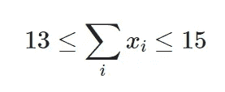
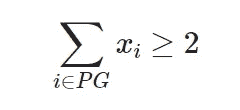
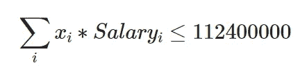
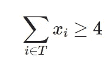
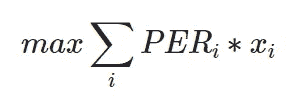
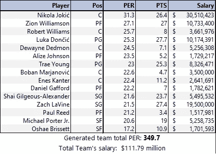
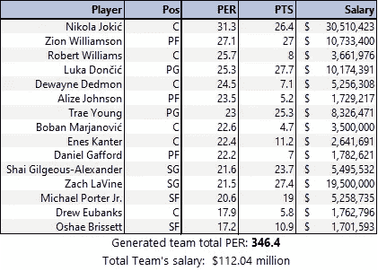

# 玩钱球:用线性规划创建一个高效的 NBA 团队

> 原文：<https://towardsdatascience.com/playing-moneyball-creating-an-efficient-nba-team-with-linear-programming-ef14f6383861>


鸣谢: [Unsplash](https://unsplash.com/photos/XmYSlYrupL8) 上的 [JC Gellidon](https://unsplash.com/@jcgellidon) (照片在 Unsplash 许可下免费使用)

# **玩钱球:用线性规划打造一支高效的 NBA 球队**

对于任何热衷于分析的体育迷来说，班尼特·米勒执导的 2011 年美国体育剧《T2》是一部必看的电影。根据 [IMDB](https://www.imdb.com/title/tt1210166/) 中的描述，在这里我们可以看到“奥克兰运动家队总经理比利·比恩通过使用计算机生成的分析来获得新球员，成功地尝试以精简的预算组建一支棒球队”的故事。即使没有在专业运动队担任数据科学家的工作(肯定是我梦想的工作之一)，我们也可以用这部电影来学习线性编程。

[大英百科全书](https://www.britannica.com/science/linear-programming-mathematics)将线性规划定义为“一种数学建模技术，其中一个线性函数在受到各种约束时被最大化或最小化”。因此，我们将尝试优化一个线性函数(我们称之为目标函数)。但是，我们的解决方案必须有一定的条件，称为约束(重要的是要提到，这些约束也将是线性函数)。考虑到这一点，我们可以说线性规划是在**规定分析**中使用的一种方法，因为它明确地告诉我们哪一个是我们可以优化特定指标的最佳解决方案。由于目标函数和约束都将由决策变量组成(每个变量代表一个要做出的单独决策)，为了解决我们的问题，我们将有三个步骤:变量定义、约束创建和目标函数定义。

## **问题和变量定义**

我们将尝试使用从 basketball-reference.com 检索的[标准统计数据](https://www.basketball-reference.com/leagues/NBA_2021_per_game.html)、[高级统计数据](https://www.basketball-reference.com/leagues/NBA_2021_advanced.html)和[工资信息](https://www.basketball-reference.com/contracts/players.html)，并使用谷歌开发的开源优化库 OR Tools，来建立一支高效的 NBA 球队，而不是建立一支棒球队。然而，在开始定义我们的相关变量之前，我们做了一些数据预处理，创建了一个字典，其中包含每个球员的重要信息，包括他的姓名、位置、三分球命中率、工资、每场比赛的得分和 per(根据维基百科，这是“霍林格的全能篮球评级，试图将球员的所有贡献归结为一个数字”)，以及一个包含每个位置上的球员信息的字典。

```
*# We import the libraries we will use*
**import** os 
**from** ortools.linear_solver **import** pywraplp
**import** pandas **as** pd
**import** numpy **as** np*# We will use three DFs: one containing "advanced" NBA stats, one that will have "standard" stats and* 
*# one that has salaries information*
cwd **=** os**.**getcwd()
cwd **=** cwd**.**replace("code", "data")

df_advanced **=** pd**.**read_csv(f"{cwd}/nba_2021_advanced_stats.csv", sep**=**";")
df_standard **=** pd**.**read_csv(f"{cwd}/nba_2021_standard_stats.csv", sep**=**";")
df_salaries **=** pd**.**read_csv(f"{cwd}/nba_2022_salaries.csv", sep**=**";")*# We filter relevant columns*
df_advanced **=** df_advanced[["Player", "Code", "Pos", "PER"]]
df_standard **=** df_standard[["Player", "Code", "G", "MP", "3P%", "PTS"]]
df_salaries **=** df_salaries[["Player", "Code", "2021-22"]]**.**rename(columns**=**{"2021-22": "Salary"})*# We merge all dataframes*
df **=** pd**.**merge(df_advanced, df_standard, how**=**"inner", on**=**["Player", "Code"])
df **=** pd**.**merge(df, df_salaries, how**=**"inner", on**=**["Player", "Code"])
df **=** df**.**drop_duplicates()**.**reset_index(drop**=True**)*# We filter rows, keeping players that played at least ten matches, and played at least 5 minutes per game*
df **=** df[(df["G"] **>=** 10) **&** (df["MP"] **>=** 5)]*# We create an index column and filter Pos column*
df["idx"] **=** df**.**index
df["Pos"] **=** df["Pos"]**.**str**.**slice(stop**=**2)
df["Pos"] **=** df["Pos"]**.**str**.**replace('-','')*# We create a dictionary that has information about the players, with a key indicating the index in df*
*# Also, we create a dictionary that has information on each player's position*
players_dict **=** {}
positions_dict **=** {}

*# We fill information on players and positions*
**for** index, row **in** df**.**iterrows():
    players_dict[row["idx"]] **=** {
        "name": row["Player"],
        "Pos": row["Pos"],
        "PER": row["PER"],
        "3P%": row["3P%"],
        "PTS": row["PTS"],
        "Salary": row["Salary"]
    }
    pos **=** row["Pos"]
    **if** pos **not** **in** positions_dict**.**keys():
        positions_dict[pos] **=** [row["idx"]]
    **else**:
        positions_dict[pos]**.**append(row["idx"])
```

为了建立我们的团队，我们将决定哪些球员包括在内。因此，**我们的决策变量，称为 *xi* ，将是布尔型的，并且如果玩家 *i* 被选入我们的团队**的话，将等于 1。既然我们已经定义了它，我们可以创建我们的求解器并创建一个字典，我们将在其中保存我们的布尔决策变量:

```
*# We create our variables and add it to a dictionary*
**def** create_solver_and_player_assignment_variable(df):
    *# We create the solver*
    solver **=** pywraplp**.**Solver('simple_mip_program',
                             pywraplp**.**Solver**.**CBC_MIXED_INTEGER_PROGRAMMING)
    *# We create the variables*
    x_var_dict **=** {}
    **for** index, row **in** df**.**iterrows():
        x_var_dict[row['idx']] **=** solver**.**BoolVar(str('x_'**+**str(row['idx'])))
    **return** x_var_dict, solver
```

## **约束创建**

现在我们已经创建了线性规划问题和与之相关的变量，我们将定义我们的解决方案必须满足的条件或约束。记住这些**约束必须是线性的**，所以变量只能乘以一个常数，而不能平方，等等。

首先，我们必须拥有所需的总玩家数量，在 13 到 15 人之间。在数学上，这可以用下面的等式来表示:



在这个方程中，我们可以确定方程的三个不同的“部分”:一个下限(13)，一个上限(15)，以及决策变量的线性组合。当我们使用 OR 工具创建约束时，我们分两步完成:首先，我们定义约束，选择边界，并可选地选择约束的名称，然后我们“填充”决策变量的线性组合，选择变量和相关系数(这里，由于每个变量都是直接添加的，因此该系数等于 1)。这可以在下面的代码中看到:

```
**def** total_players_constraint(solver, x_var_dict):
    ct **=** solver**.**Constraint(13, 15, 'TotalPlayers')
    **for** x **in** x_var_dict**.**keys():
        ct**.**SetCoefficient(x_var_dict[x], 1)
    **return** solver
```

即使我们拥有所需数量的球员，我们也必须为所有位置配备球员。假设对于每个位置，我们必须至少有两个球员。因此，我们可以用数学方法来表达这一点，例如，对于在控卫位置上打球的一组球员 *PG、*:



注意，这里我们没有像前一个例子那样的上限。但是，由于我们的玩家不能超过 15 人，我们将使用该数字作为上限:

```
**def** players_per_position(solver, x_var_dict, positions_dict):
    **for** position **in** positions_dict**.**keys():
        ct **=** solver**.**Constraint(2, 15, f'Players_Pos_{position}')
        **for** x **in** positions_dict[position]:
            ct**.**SetCoefficient(x_var_dict[x], 1)
    **return** solver
```

现在，我们在总数和每个位置上都有了所需的球员数量。然而，由于 NBA 有工资帽，球员工资总额不能超过 1.124 亿美元。由于这是我们团队必须满足的一个条件，我们将把它包含在我们的模型中，并以数学方式表示如下:



请注意，当我们创建此约束时，与每个决策变量相关联的系数并不像前面的情况那样是 1，而是每个玩家的薪金，如下面的代码所示:

```
**def** total_salary(solver, x_var_dict, players_dict):
    ct **=** solver**.**Constraint(0, 112400000, 'TotalSalary')
    **for** x **in** x_var_dict**.**keys():
        ct**.**SetCoefficient(x_var_dict[x], players_dict[x]["Salary"])
    **return** solver
```

我们现在有了所有的约束，让我们建立一个有效的团队。然而，线性规划的一个积极的方面是，由于它是一个实际问题的数学抽象，它非常灵活，如果我们想的话，它允许我们轻松地包含新的和定制的约束。例如，考虑到近年来，三分球在联盟中变得越来越重要，让我们假设我们希望我们的球队中至少有 4 名优秀的三分球射手(假设优秀的三分球射手是投篮命中率大于 40%的人)。如果这个三分射手在 set *T* 中，我们可以用数学方法来表示:



该约束将按如下方式实现:

```
**def** three_points_shooters(solver, x_var_dict, players_dict):
    ct **=** solver**.**Constraint(4, 15, 'ThreePointsShooters')
    **for** x **in** x_var_dict**.**keys():
        **if** players_dict[x]["3P%"] **>** 0.4:
            ct**.**SetCoefficient(x_var_dict[x], 1)
    **return** solver
```

## **建立我们的目标函数**

既然我们已经具备了解决方案必须满足的条件(三个必须具备，一个可选)，那么我们就可以定义我们的目标了。请记住，我们正努力打造一支尽可能高效的团队。回想一下，每个玩家都有一个与其相关联的 PER，这是一个总结其表现的单一指标。考虑到更大的 PER 会导致更高的预期效率，我们应该尝试拥有一个 PER 尽可能高的团队。这可以用以下方式进行数学表达:



要使用或工具实现这一点，过程将类似于我们在定义约束时执行的过程，只是做了一些修改。首先，我们将定义目标函数，并用决策变量和相关系数(这里是每个玩家的 PER)填充它。最后，我们将定义我们正在尝试做的事情，即最大化目标函数(在其他一些情况下，例如，当我们在目标函数中表示成本时，我们将尝试最小化它)。这可以在下面的代码中看到:

```
**def** set_obj_function(solver, x_var_dict, players_dict):
    objective **=** solver**.**Objective()
    **for** x **in** x_var_dict**.**keys():
        objective**.**SetCoefficient(x_var_dict[x], players_dict[x]["PER"])
    objective**.**SetMaximization()
    solver**.**Solve()
    **return** solver, x_var_dict, objective
```

## **分析我们的解决方案和结束语**

现在我们已经定义了一切，我们可以解决我们的模型，并获得我们的完美团队！为了让事情变得更有趣，我们将运行模型的两个版本:一个不包含需要 4 个三分射手的约束，另一个包含。首先，让我们来看看这支不要求三分射手最低数量的球队:



考虑到 NBA 的最高工资约为 4500 万美元，我们可以看到我们的团队由两个主要群体组成:年轻的明星球员，他们的工资通常低于其他全明星球员(如锡安·威廉森、卢卡·东契奇和特雷·扬)，以及固定角色球员(如德维恩·戴德蒙和伊内斯·坎特)。唯一的“异数”是尼古拉·约基奇，他的薪水最高(也是最高的 PER 值)。

然而，当我们“激活”我们的三分射手限制时，我们的团队发生了一点变化:



在我们的新团队中，Paul Reed 被 Drew Eubanks 取代，因此总 PER 从 349.7 和 346.4 降低。这是一个重要的见解:当我们在创建我们团队的约束时要求更高(我们不仅仅想要一个有效的团队，我们还想要一个至少有三分射手的团队)，合乎逻辑的是我们的解决方案的客观价值恶化。

总之，我们已经了解了线性编程问题的基础，并用 python 和 OR 工具构建了一个与体育相关的实现。我们还学习了这种方法的灵活性，并分析了带有和不带有定制约束的解决方案。最后，我留给您一个存储库，您可以在其中找到我用来构建它的代码和数据:

<https://github.com/nicogarciaara/nba_moneyball> 