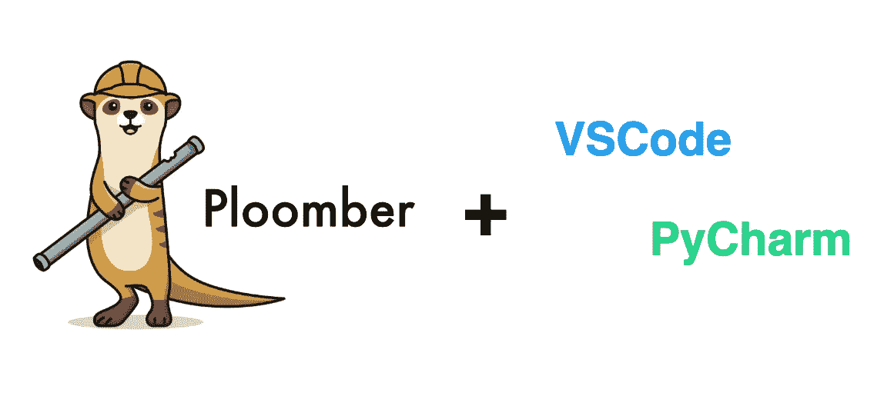
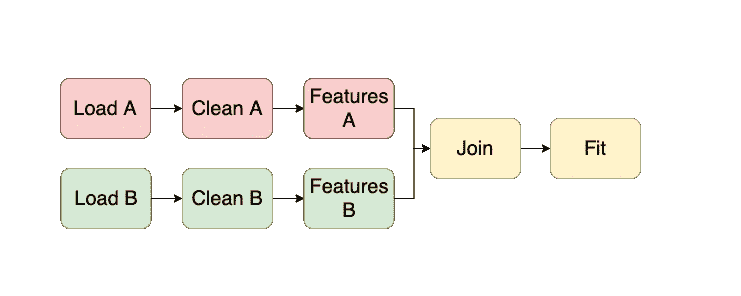
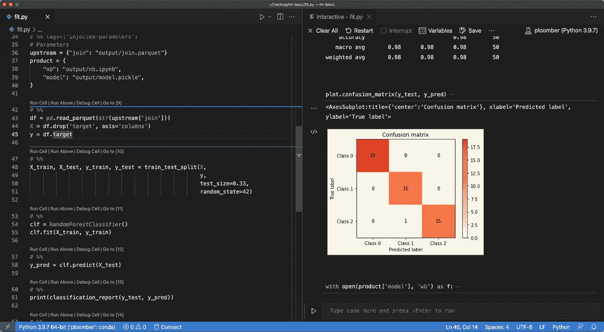

# ploomber:vs code 和 PyCharm 中的模块化、生产就绪的数据管道

> 原文：<https://towardsdatascience.com/ploomber-modular-production-ready-data-pipelines-in-vscode-and-pycharm-2b5cd4091aeb>

## 数据科学软件工程

## 使用您最喜欢的编辑器开发模块化管道变得容易多了

使用 Ploomber 和您最喜欢的编辑器来开发模块化管道。图片作者。

在 [Ploomber](https://github.com/ploomber/ploomber) `0.14`中，我们引入了一个新特性，允许 VSCode 和 PyCharm 等编辑器的用户使用`.py`脚本开发模块化和可维护的管道。这篇博文总结了这种集成是如何工作的。

# 互动。百分比格式的 py 文件

Jupyter 是开发数据科学项目最流行的工具；它提供了一个交互式环境来编写操作数据的有文化的程序。此外，其他编辑器和 ide 也接受了这个想法，只是做了一些修改。

例如， [Spyder](https://www.spyder-ide.org/) 引入了百分比格式，允许用户通过使用特殊的`# %%`语法拆分单元格来表示`.py`文件中的*【笔记本】*，以表示每个单元格:

像 VSCode 和 PyCharm 这样的 IDE 工具已经采用了 percent 格式，因为它在常规的非交互式`.py`脚本和`.ipynb`笔记本之间提供了一种平衡的体验。

# 我们的集成是如何工作的

Ploomber 帮助用户开发模块化和可维护的管道，其中每个工作单元都可以是一个脚本、笔记本或函数。例如，使用两个输入数据集的管道可能如下所示:

管道允许你模块化你的工作。图片作者。

除了加载数据的任务之外，所有任务都依赖于上游任务；例如，`Clean A`使用`Load A`的输出作为输入。因此，当从命令行执行管道时，我们的框架会自动注入一个新的单元。因此，`Clean A`任务知道它的输入位置(即`Load A`的输出)。例如，`Clean A`脚本在运行时可能是这样的:

然而，当交互开发时，人们仍然希望得到注入的细胞。由于我们的 Jupyter 集成，当用户打开一个文件时，细胞注入过程自动发生，我们现在将该功能引入其他编辑器。有了我们新的集成，用户可以通过运行一个命令在他们所有的脚本中注入单元:

之后，您可以交互式地以 percent 格式运行您的`.py`,因为它现在包含了相应输入的路径——不需要硬编码！下面是注入单元格并以百分比格式运行`.py`后的 VSCode 截图:

运行 Ploomber 管道的 VSCode。代码在左边，结果在右边。图片作者。

如果您想了解更多信息，请查看[用户指南](https://docs.ploomber.io/en/latest/user-guide/editors.html)。

# 开始

从几个简单的步骤开始:

现在打开`fit.py`，开始交互式运行它！

# 结束语

百分比格式是交互进行数据分析的好方法，并且保留了使用`.py`文件的好处(比如运行`git diff`)。此外，通过在您的工作流中采用 Ploomber，您现在可以将您的分析逻辑分解成多个步骤，以产生可维护的工作并增加您的团队的协作！

通过这种新的集成，我们希望支持来自其他编辑器和 ide 的用户，因此每个团队成员都可以使用他们最喜欢的任何工具，并顺利协作；如果您有任何问题或建议，请[加入我们的社区](https://ploomber.io/community/)！

*最初发布于*[*ploomber . io*](https://ploomber.io/blog/vscode-pycharm/)