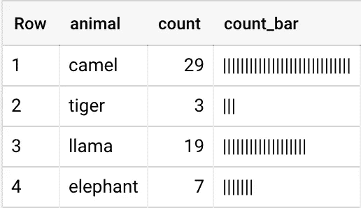
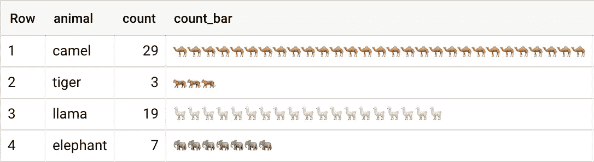

# 使用 SQL 用户定义函数在 BigQuery 中绘制条形图(UDF)

> 原文：<https://towardsdatascience.com/plotting-bar-charts-in-bigquery-using-a-sql-user-defined-function-udf-ca6056aac680>

## 最大限度地减少上下文切换，加快工作流程


在 [Unsplash](https://unsplash.com?utm_source=medium&utm_medium=referral) 上由 [Chase Clark](https://unsplash.com/@chaseelliottclark?utm_source=medium&utm_medium=referral) 拍摄的照片

有许多令人敬畏的新工具旨在为 SQL 工作流带来更多的交互性、可视化、协作和共享: [HEX](https://hex.tech/) 、 [Count](https://count.co/) 和 [Hyperquery](https://www.hyperquery.ai/) 是三个很好的例子。

但有时你只想专注于在一个基本的控制台上工作，用一些额外的功能来帮助加快你的洞察力和工作流程。我喜欢将 BigQuery 查询编辑器想象成类似于命令行记事本——您可以使用数据定义语言( [DDL](https://cloud.google.com/bigquery/docs/reference/standard-sql/data-definition-language) )使用类似命令行的功能，但是比命令行更加灵活。

本文将解释如何使用纯 SQL 构建一个条形图，然后将它打包成一个简单的函数，您可以在数据探索中使用它。我们将通过将函数构建为简单的脚本查询来开始这个过程，并一步一步地添加到查询中，直到我们有一个工作的、有用的函数。

# 输入

我们要做的第一件事是考虑我们想要传递给函数的输入，因为这决定了它将如何工作。SQL 中的脚本和函数开发可能有点不直观，所以最好的方法是从最简单的版本开始，然后根据需要变得更复杂。

为此，我希望我的函数接受一个数值，并返回字符串中的确切字符数。我不想限制太多，所以我将接受整数*或*浮点数，在这个简单的例子中，我想将它们限制为正数，这样我就不需要处理移动轴或其他复杂的东西。

因此，我将这些输入声明为变量，需要在任何 BigQuery 脚本的开头声明。

```
DECLARE input_value FLOAT64;
DECLARE character STRING;
```

事实上，因为我在测试这个函数，所以我要用一些测试值来初始化它们。这意味着对于我的函数的输出，我想要一个包含 100 个竖线的字符串。

```
DECLARE input_value FLOAT64 DEFAULT 100;
DECLARE character STRING DEFAULT "|";
```

现在，从哪里开始？

# 方法

首先，我想强调几件事:

*   您可以在用户定义的函数(UDF)中编写 SQL，只要它返回标量值(即它不能返回许多行和列，它需要是单个值)。实际上，您可以通过使用结构和数组聚合来解决这个问题，但是在这种情况下，我们并不要求这样做。
*   您应该使用公共表表达式(cte)来编写 SQL，因为它使您的代码更具可读性，更易于理解、调试和扩展。好的代码应该清晰地传达逻辑，不要让读者感到困惑。
*   您可以在 SQL 脚本中使用可以在查询中引用的变量，但是在编写本文时，您不能将其保存为视图。但是，您可以在 UDF 中使用变量，这些变量将作为参数传递给函数。

还要注意，所有代码块都可以在您的控制台中复制和执行。

# 构建查询

我要做的第一件事是使用 [ABS](https://cloud.google.com/bigquery/docs/reference/standard-sql/mathematical_functions#abs) 函数，确保负输入将被转换为正输入，并且不会产生错误。将来我可能想做一些更聪明的事情，但是让我们从简单的开始。我将通过将默认的**输入值**更改为-100 来测试它的工作情况:

```
DECLARE input_value FLOAT64 DEFAULT -100;
DECLARE character STRING DEFAULT "|";WITH 
**convert_input_to_positive AS (
SELECT ABS(input_value)
)**SELECT *
FROM convert_input_to_positive
```

太好了，这个管用。现在我想创建 100 个字符，我最终可以将它们构建成一个字符串。我不能在 UDF 中使用像循环这样的控制结构，但是我可以使用数组，这可能有点难以理解，但是非常强大。为了从输入值生成一个数组，我将使用 [GENERATE_ARRAY](https://cloud.google.com/bigquery/docs/reference/standard-sql/array_functions#generate_array) 函数，在 1 和我的输入值之间，步长为 1:

```
DECLARE input_value FLOAT64 DEFAULT 100;
DECLARE character STRING DEFAULT "|";WITH 
convert_input_to_positive AS (
SELECT ABS(input_value) AS abs_input_value
),**generate_numbers_array AS (
SELECT 
GENERATE_ARRAY(1, abs_input_value, 1) AS numbers_array
FROM convert_input_to_positive
)**SELECT *
FROM generate_numbers_array
```

太棒了，我现在有一个 100 项的数组(包含升序数字)，但是由于我想将每个数组元素转换为一个字符(最终)，我需要访问每个元素，这意味着我需要取消数组嵌套。

UNNEST 有一点奇怪的语法，需要一点时间来适应，但是在处理嵌套结构时，这是一个基本的模式。这些在 Google Analytics 和 Firebase 数据中非常常见，因此值得考虑一下，尤其是在处理这些类型的数据源时。

```
DECLARE input_value FLOAT64 DEFAULT 100;
DECLARE character STRING DEFAULT "|";WITH 
convert_input_to_positive AS (
SELECT ABS(input_value) AS abs_input_value
),generate_numbers_array AS (
SELECT 
GENERATE_ARRAY(1, abs_input_value, 1) AS numbers_array
FROM convert_input_to_positive
),**unnest_numbers_array AS (
SELECT numbers
FROM generate_numbers_array 
CROSS JOIN UNNEST(numbers_array) AS numbers
)**SELECT * 
FROM unnest_numbers_array
```

您还可以用左连接替换交叉连接(如果数据中可能有空值，这是更好的选择)，或者您也可以使用逗号作为隐式交叉连接，但我认为这可能会造成混乱，所以我更喜欢显式连接。

前面的结果在一行中给出了一个数组，但是现在我有 100 行，所以我可以直接访问它们，并把它们转换成我需要的输出格式。可能有一百万种不同的方法可以做到这一点，但是因为我想要做的是将所有的行更改为相同的值，所以我将从使用非常方便的 [LEAST](https://cloud.google.com/bigquery/docs/reference/standard-sql/mathematical_functions#least) 函数开始。这将返回较低的值(人们通常认为 [MIN](https://cloud.google.com/bigquery/docs/reference/standard-sql/aggregate_functions#min) 会这样做，但这并不是这样，因为它是一个聚合函数。这是一种奇特的说法，它跨*行*，而不是列进行操作。

```
DECLARE input_value FLOAT64 DEFAULT 100;
DECLARE character STRING DEFAULT "|";WITH 
convert_input_to_positive AS (
SELECT ABS(input_value) AS abs_input_value
),generate_numbers_array AS (
SELECT 
GENERATE_ARRAY(1, abs_input_value, 1) AS numbers_array
FROM convert_input_to_positive
),unnest_numbers_array AS (
SELECT numbers
FROM generate_numbers_array 
CROSS JOIN UNNEST(numbers_array) AS numbers
),**set_all_numbers_to_ones AS (
SELECT
LEAST(1, numbers) AS ones
FROM unnest_numbers_array
)**SELECT *
FROM set_all_numbers_to_ones
```

下一步是必需的，因为数组由 FLOAT64 数据类型组成，我想在下一步中用字符串替换它们。这意味着我需要[转换](https://cloud.google.com/bigquery/docs/reference/standard-sql/functions-and-operators#cast)值，但是我使用 [SAFE_CAST](https://cloud.google.com/bigquery/docs/reference/standard-sql/functions-and-operators#safe_casting) 是因为这是一个好习惯。如果 CAST 遇到一个无法转换为目标类型的值，查询将失败，但是 SAFE_CAST 将简单地返回 NULL，查询将成功。

在这种情况下不是绝对必要的，但仍然是一个好习惯。该查询的输出将是 100 行，每行包含数字 1 的字符串表示。

```
DECLARE input_value FLOAT64 DEFAULT 100;
DECLARE character STRING DEFAULT "|";WITH 
convert_input_to_positive AS (
SELECT ABS(input_value) AS abs_input_value
),generate_numbers_array AS (
SELECT 
GENERATE_ARRAY(1, abs_input_value, 1) AS numbers_array
FROM convert_input_to_positive
),unnest_numbers_array AS (
SELECT numbers
FROM generate_numbers_array 
CROSS JOIN UNNEST(numbers_array) AS numbers
),set_all_numbers_to_ones AS (
SELECT
LEAST(1, numbers) AS ones
FROM unnest_numbers_array
),**cast_all_numbers_to_strings AS (
SELECT 
SAFE_CAST(ones AS STRING) AS ones_strings
FROM set_all_numbers_to_ones
)**SELECT *
FROM cast_all_numbers_to_strings
```

现在，我可以使用一个简单的 [CASE](https://cloud.google.com/bigquery/docs/reference/standard-sql/conditional_expressions#case) 语句，用我的变量定义的字符替换字符串，我们就快完成了:

```
DECLARE input_value FLOAT64 DEFAULT 100;
DECLARE character STRING DEFAULT "|";WITH 
convert_input_to_positive AS (
SELECT ABS(input_value) AS abs_input_value
),generate_numbers_array AS (
SELECT 
GENERATE_ARRAY(1, abs_input_value, 1) AS numbers_array
FROM convert_input_to_positive
),unnest_numbers_array AS (
SELECT numbers
FROM generate_numbers_array 
CROSS JOIN UNNEST(numbers_array) AS numbers
),set_all_numbers_to_ones AS (
SELECT
LEAST(1, numbers) AS ones
FROM unnest_numbers_array
),cast_all_numbers_to_strings AS (
SELECT 
SAFE_CAST(ones AS STRING) AS ones_strings
FROM set_all_numbers_to_ones
),**replace_ones_with_specified_character AS (
SELECT 
CASE WHEN ones_strings = '1' THEN character END AS characters
FROM cast_all_numbers_to_strings
)**SELECT *
FROM replace_ones_with_specified_character
```

最后一个技巧非常有用，尤其是如果您正在构建从各种[INFORMATION _ SCHEMA](https://cloud.google.com/bigquery/docs/information-schema-intro)big query 选项编写 SQL 的函数。本质上，您要将一个特定列中的所有值聚合到一个数组中，然后从所有数组元素创建一个字符串，但在一个空字符串上分隔。这将具有将一行中的值转换成水平连接的字符串的效果，这正是我们在这里试图实现的。

```
DECLARE input_value FLOAT64 DEFAULT 100;
DECLARE character STRING DEFAULT "|";WITH 
convert_input_to_positive AS (
SELECT ABS(input_value) AS abs_input_value
),generate_numbers_array AS (
SELECT 
GENERATE_ARRAY(1, abs_input_value, 1) AS numbers_array
FROM convert_input_to_positive
),unnest_numbers_array AS (
SELECT numbers
FROM generate_numbers_array 
CROSS JOIN UNNEST(numbers_array) AS numbers
),set_all_numbers_to_ones AS (
SELECT
LEAST(1, numbers) AS ones
FROM unnest_numbers_array
),cast_all_numbers_to_strings AS (
SELECT 
SAFE_CAST(ones AS STRING) AS ones_strings
FROM set_all_numbers_to_ones
),replace_ones_with_specified_character AS (
SELECT 
CASE WHEN ones_strings = '1' THEN character END AS characters
FROM cast_all_numbers_to_strings
),**aggregate_characters_into_array AS (
SELECT ARRAY_AGG(characters) AS characters_array
FROM replace_ones_with_specified_character
),****convert_array_to_string AS (
SELECT ARRAY_TO_STRING(characters_array, "") AS bar
FROM aggregate_characters_into_array
)**SELECT bar
FROM convert_array_to_string
```

这些通常会合并到一个步骤中，但是为了清晰和一致，我将它们分开。执行这段代码，您将看到长度为 100 的单个条被写入控制台中的查询结果。太棒了。

然而，我到底该怎么用它呢？我不想为了绘制一个单行条形图而不得不重新复制这段代码！

再走一步，我们就可以把它简化成一行代码和一个可移植的、可重用的函数。

# 打包成用户定义的函数(UDF)

将查询转换成 UDF 非常简单，因为我们已经定义了参数名称和数据类型，并且查询返回一个标量值。

我们只需要使用 CREATE[或 REPLACE]函数语法，定义输入参数，并确保将 SQL 查询放在双括号中，因为它是一个[标量子查询](https://cloud.google.com/bigquery/docs/reference/standard-sql/subqueries#scalar_subquery_concepts):

```
**CREATE OR REPLACE FUNCTION flowfunctions.plot.bar(
input_value FLOAT64, character STRING
)
AS ((**WITH 
convert_input_to_positive AS (
SELECT ABS(input_value) AS abs_input_value
),generate_numbers_array AS (
SELECT 
GENERATE_ARRAY(1, abs_input_value, 1) AS numbers_array
FROM convert_input_to_positive
),unnest_numbers_array AS (
SELECT numbers
FROM generate_numbers_array 
CROSS JOIN UNNEST(numbers_array) AS numbers
),set_all_numbers_to_ones AS (
SELECT
LEAST(1, numbers) AS ones
FROM unnest_numbers_array
),cast_all_numbers_to_strings AS (
SELECT 
SAFE_CAST(ones AS STRING) AS ones_strings
FROM set_all_numbers_to_ones
),replace_ones_with_specified_character AS (
SELECT 
CASE WHEN ones_strings = '1' THEN character END AS characters
FROM cast_all_numbers_to_strings
),aggregate_characters_into_array AS (
SELECT ARRAY_AGG(characters) AS characters_array
FROM replace_ones_with_specified_character
),convert_array_to_string AS (
SELECT ARRAY_TO_STRING(characters_array, "") AS bar
FROM aggregate_characters_into_array
)SELECT bar
FROM convert_array_to_string
**))**
```

我们结束了。运行此语句将创建函数，可以使用典型的 SELECT 语法调用该函数，并传递之前定义为变量的参数:

```
SELECT flowfunctions.plot.bar(100, "|")
```

并且结果将与上面的完整查询相同！最好的一点是，您可以使用该函数快速直观地查看概要数据，因为将为每一行生成一个条形。请注意，这最适合 100(即百分比)以下的值，否则条形可能会超出屏幕。

试试这件，看看大小

```
SELECT 
animal, count,
flowfunctions.plot.bar(count, '|') As count_bar
FROM `flowfunctions.examples.zoo_animal_counts`
```



一个稍微琐碎的例子，但你得到了要点。

同样，如果你想制作一个由大象(或任何其他[表情符号](https://unicode.org/emoji/charts/full-emoji-list.html))组成的条，你可以简单地将它作为参数传递。我女儿喜欢大象。

```
SELECT animal, count, 
flowfunctions.plot.bar(count, emoji) As count_bar
FROM `flowfunctions.examples.zoo_animal_summary`
```



好的，这很酷。

这个示例数据和函数应该可供美国地区的任何经过身份验证的 BigQuery 用户使用，所以请随意尝试(或者如果您在欧盟，请用 **floweu** 替换 **flowfunctions** )，但是这个库正在积极开发中，因此可能随时发生变化。

要在您自己的项目中复制该函数，只需更新**创建中的引用或将函数**代码替换为您的 **project_id** ，确保数据集绘图存在于正确的区域中。

仅此而已。

如果您觉得这(以及其他相关材料)有用和/或有趣，请跟我来！

如果您还不是会员，请加入 Medium[这个活跃、充满活力和激情的数据人社区，每月只需 5 美元，就能获得无限的故事。也有很多其他人，但是如果你对数据感兴趣，那么这里就是你要去的地方…](https://jim-barlow.medium.com/membership)