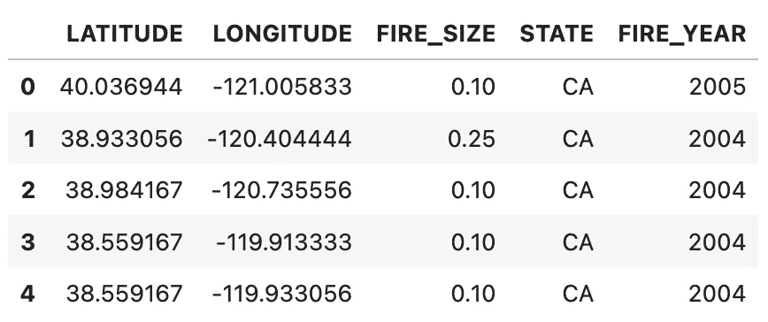
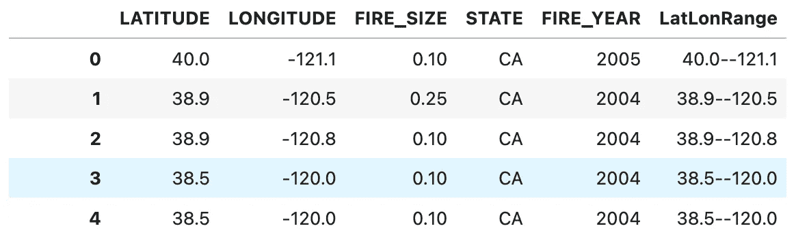
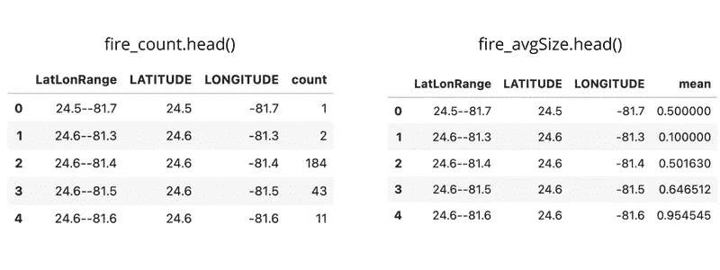
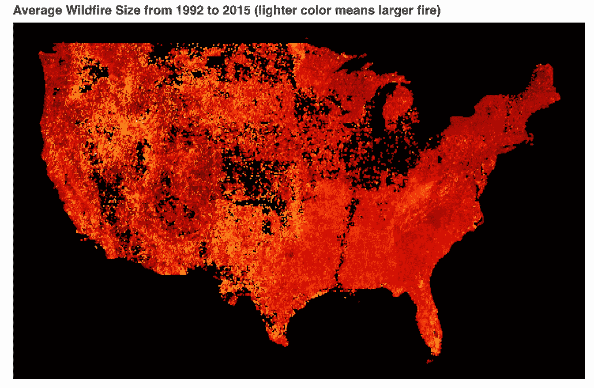
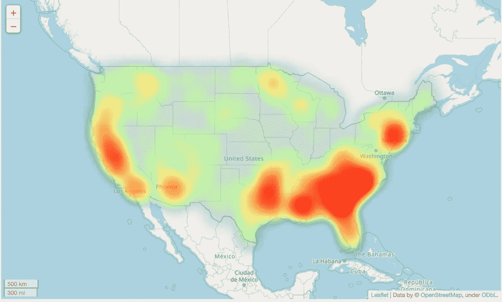
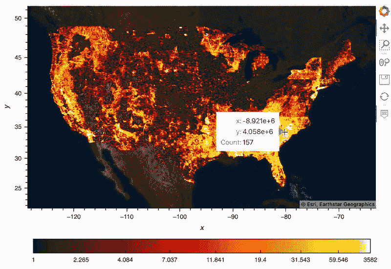

# 使用 Bokeh、Folium 和 hvPlot 在 Python 中绘制热图

> 原文：<https://towardsdatascience.com/plotting-heat-maps-in-python-using-bokeh-folium-and-hvplot-eb7c7f49dbc6>

## 热图是一种有用的可视化工具，Python 有几个很好的工具来制作它们

凯尔西·奈特在 [Unsplash](https://unsplash.com/s/photos/map?utm_source=unsplash&utm_medium=referral&utm_content=creditCopyText) 上的照片

我一直很喜欢地图，但是，为空间数据创建引人注目的可视化效果是一项挑战。对于 Python 程序员来说，一个特别困难的领域是当我们的数据有很多点时创建地图。太多的点会很快变得不方便查看和浏览器渲染。

热图在这种情况下特别有用，因为它们可以快速给出数据的密度和空间分布，而无需离散绘制每个点。这与散点图形成对比，散点图本质上只是叠加在地图顶部的点的散点图。散点图很容易制作，但是当你有很多数据点时，由于过度绘制，它们很难查看。

在本帖中，我们将学习如何使用散景、树叶和 hvPlot 来可视化全美 180 万起野火的发生。我们将讨论每个库的优缺点，并找出在 2022 年使用哪个库最好。

# 我们的数据

我们正在处理的数据记录了从 1992 年到 2015 年发生在美国的超过 180 万起野火。每个火灾记录包含位置、最终火灾规模、发现日期等信息。这是一个有趣的数据集，足够大，可以展示可视化大数据集的一些挑战，而不会太大，让大多数笔记本电脑无法使用。

让我们将 wildfire 数据从 SQLite 数据库快速导入到 Pandas 数据框架中。

由作者创建

## 数据聚合

有许多方法可以聚集数据，以便我们可以更有效地将其可视化；一些图书馆甚至可以为我们处理所有这些。首先，让我们试着将发生在彼此附近的火灾进行分组。

我们可以通过截断纬度和经度值，创建一个合并截断的纬度-经度值的新列，然后按照新列对数据帧进行分组来实现这一点。一旦你看到代码就会明白:

由作者创建

我们现在有 64，250 组火灾，而不是 180 万个单独的火灾。这有助于我们减少要渲染的数据点的数量，现在我们可以聚合信息，如火灾计数或每个组中的平均火灾大小。

由作者创建

这是一种非常简单的将我们的火聚集成组的方法，但我认为它有助于展示使用更大的空间数据集的一些挑战。在保留信息的同时减少视觉混乱(这会使地图难以阅读)是一种平衡。

# 散景

> **注:**互动剧情可以在这个 [**直播笔记本**](https://nbviewer.org/github/wino6687/medium_hvPlot_Intro/blob/master/heatmap_examples.ipynb) 上找到。

Bokeh 是一个很棒的 Python 绘图库，可以很好地制作可以在线共享的绘图。散景的优势之一是它的交互性很强，允许缩放、平移和搜索特定坐标。我们可以使用聚合数据集创建散点图，其功能类似于热图:

由作者创建

这还不算太糟！我让第一个图保持简单，以强调 Colorcet 的冷色图。此外，由于野火已经在美国各地发生，我们不一定需要一张底图来理解我们正在看的东西。

当然，这个图在它实际能够教给我们的方面是非常有限的，而且有更好的方法来制作这种热图，而不是绘制 64，000 个离散的点——即使 64，000 个点少于 1，800，000 个点。我们很可能画得太多了，所以我们失去了细节，因为有这么多的点放在彼此的顶部。它看起来很酷，但我们将在以后看到更多有用的情节。

让我们制作第二个图，因为我们已经准备好了数据:

由作者创建

虽然这个图非常相似，但比较这两个图确实有助于我们理解美国西部的火灾往往更大，尽管它们发生的频率更低。

# 薄层

follow 是优秀的 JavaScript 库 fleet . js 的 Python 包装器。虽然它可能受到包装器库的一些限制——比直接使用 fleet 更少的定制——但 follow 仍然将 fleet . js 的许多优势带入了 Python 生态系统。

让我们展示一个更独特的热图，将我们的数据转换成适合我们的梯度。将离散数据点转换为网格值(图像)的过程称为光栅化。这样，我们可以将离散的火灾数据点聚合成一个数值网格。虽然我们失去了每一场火灾的信息，但我们得到了一张反应更灵敏的地图。

由作者创建

我应该注意到，我们可能会通过调整梯度来彻底改变这个图，这很容易做到。这个图看起来可能有很多代码，但是，这个图非常灵敏，内置的`HeatMap`函数是一个很好的工具，可以轻松地从离散的数据点创建适当的连续可视化。

# hvPlot

叶是一个强大的图书馆，但我再次发现我最喜欢的任务工具来自全息视图。我使用 Holoviews、hvPlot、Colorcet、Datashader 和 Geoviews 在更短的时间内不断获得更好的绘图。

这听起来像是很多库，但是你不必与它们中的大多数进行交互，除非你需要一些特定的东西；否则一切都会在你的引擎盖下发生。让我们使用 Holoviews 中的工具重新创建我们的情节。

由作者创建

这绝对是最好的热图。我需要将弹出窗口中的 x/y 标签调整为 lat/long，但除此之外，hvPlot 为我做了我想要的一切。它甚至给了我一个像样的彩条作为传说，这可能是一个痛苦与其他图书馆。

您会注意到，我确实不得不从几个库中把它放在一起:

*   **全息视图**用于访问底图图块。
*   **Datashader** 用于栅格化，并给了我一个简单的方法将经度和纬度转换成米，这是 hvPlot 的首选。
*   **Colorcet** 为彩色地图。

所有这些的关键部分是`rasterize=True`，它告诉 hvPlot 让 DataShader 栅格化数据，使其更容易处理。Datashader 确实很有意思，但是值得有自己的帖子来深入讨论它是如何工作的；现在，重要的是要知道，它正在处理将我们的许多离散数据点转换成更容易呈现和更容易可视化的网格值。

# 包扎

令人惊讶的是 Python 的空间可视化工具在过去几年中取得了如此大的进步，并且有许多很好的选项可供选择来创建您心目中的情节。

Holoviews 能够提供的特性和易用性给我留下了深刻的印象，而不会因为混乱的堆栈跟踪而导致无尽的错误。制作新的图表和仪表盘很有趣，而且一路上很少遇到问题。

# 资源

*   [互动剧情直播笔记本](https://nbviewer.org/github/wino6687/medium_hvPlot_Intro/blob/master/heatmap_examples.ipynb)
*   [HV plot 简介](/holoviz-is-simplifying-data-visualization-in-python-d51ca89739cf)
*   [全息视图文档](https://holoviews.org/)
*   [叶文件](https://python-visualization.github.io/folium/)
*   [散景文档](https://docs.bokeh.org/en/latest/index.html)

> **注意:**如果你喜欢在 Medium 上阅读我和其他人的内容，考虑使用下面的链接订阅，以支持这样的内容创建，并解锁无限的故事！

 [## 用我的推荐链接加入媒体-威尔·诺里斯

### 阅读威尔·诺里斯(以及媒体上成千上万的其他作家)的每一个故事。您的会员费直接支持…

medium.com](https://medium.com/@willmnorris/membership) 

# 引文

*   [野火数据](https://www.kaggle.com/datasets/rtatman/188-million-us-wildfires?datasetId=2478&searchQuery=wildfire) —公共域(CC0)

短，凯伦 C. 2017。美国 1992–2015 年的空间野火发生数据[FPA *FOD* 20170508]。第四版。柯林斯堡，CO:林务局研究数据档案。【https://doi.org/10.2737/RDS-2013-0009.4 