# 用 Python 绘制两幅海冰浓度图

> 原文：<https://towardsdatascience.com/plotting-sea-ice-concentration-with-2-graphs-using-python-394bf4e8f361>

## 用散点图和热图显示海冰浓度

丹尼尔·巴恩斯在 [Unsplash](https://unsplash.com?utm_source=medium&utm_medium=referral) 上的照片

[气候变化](https://en.wikipedia.org/wiki/Climate_change)，一种全球现象，影响着地球的天气模式。它产生了诸如沙漠扩大和热浪变得更加频繁的后果。北极温度的升高也导致了永久冻土的融化和海冰的减少。

再来说说[海冰](https://en.wikipedia.org/wiki/Sea_ice)。[极地放大](https://en.wikipedia.org/wiki/Polar_amplification#:~:text=Polar%20amplification%20is%20the%20phenomenon,polar%20warming%20to%20tropical%20warming.)是一种现象，其中地球极点附近的温度比地球其他地方的温度增强得更大。这导致了过去几十年海冰的消失。

为了应对这些问题，全世界都在努力减缓气候变化。监控和记录是帮助我们分析变化过程的方法。本文将展示两个图表，一个散点图和一个热图，用 Python 来可视化海冰的浓度。

我们开始吧

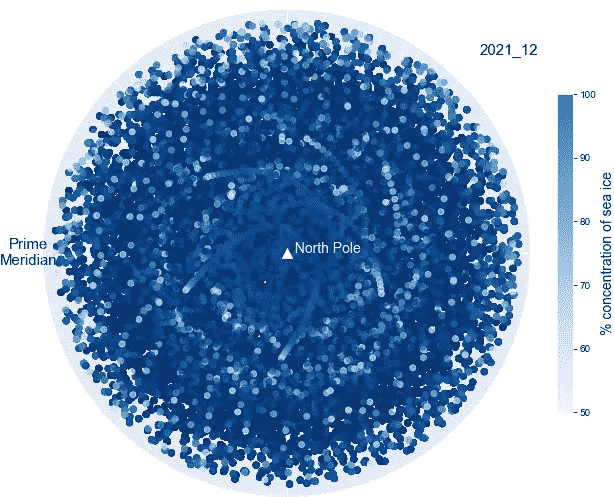

第一张图片:显示 2021 年 12 月北极圈上方海冰平均百分比浓度的散点图。第二张图片:同时显示海冰的热图。作者图片。

# **数据来源**

下载的数据集名为“从 1979 年至今从卫星观测获得的海冰浓度每日网格数据”([链接](https://cds.climate.copernicus.eu/cdsapp#!/dataset/satellite-sea-ice-concentration?tab=overview))版权所有(2022) EUMETSAT。数据集的时间从 2010 年 1 月到 2021 年 12 月，共 12 年，来自[哥白尼](https://cds.climate.copernicus.eu/cdsapp#!/home)网站。

使用的产品是欧洲气象卫星应用组织海洋和海冰卫星应用设施制作的全球海冰密集度气候数据记录。

为了获得数据集，我遵循了这两篇文章中颇有见地的步骤:

*   用 Python ( [link](/read-era5-directly-into-memory-with-python-511a2740bba0) )将 ERA5 直接读入内存
*   天气记录最佳免费 API:era 5！([链接](https://medium.com/analytics-vidhya/best-free-api-for-weather-records-era5-59c0e204829a)

现场视察 SAF 产品的所有知识产权属于欧洲气象卫星应用组织。关于数据集所有权、版权、鸣谢和引用的更多信息可以在这里找到:[链接](https://cds.climate.copernicus.eu/cdsapp/#!/terms/eumetsat-osi-saf-sic)和这里:[链接](https://osi-saf.eumetsat.int/community/faq)。

下载到您的计算机后，我建议将文件保存在一个文件夹中，以便在下一步中轻松导入。

# 输入数据

[netCDF4](https://pypi.org/project/netCDF4/) 库用于读取 [NetCDF](https://en.wikipedia.org/wiki/NetCDF) (网络通用数据格式)格式的下载文件。我们将要处理的总文件大小有点大。因此，需要一些时间来处理。tqdm 库可以向我们展示进度条。

要读取文件，我们需要知道文件名。下面的代码用于获取保存它们的文件夹中的每个文件名。

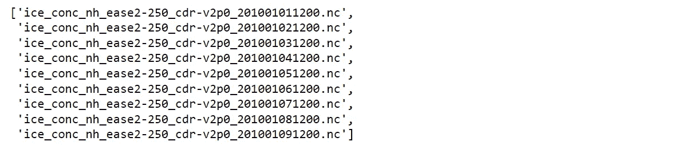

可以注意到，文件名包含日期戳。这可用于为每个数据集分配日期。创建日期列表。

## 浏览数据

在继续之前，让我们探索一下每个文件包含的变量。

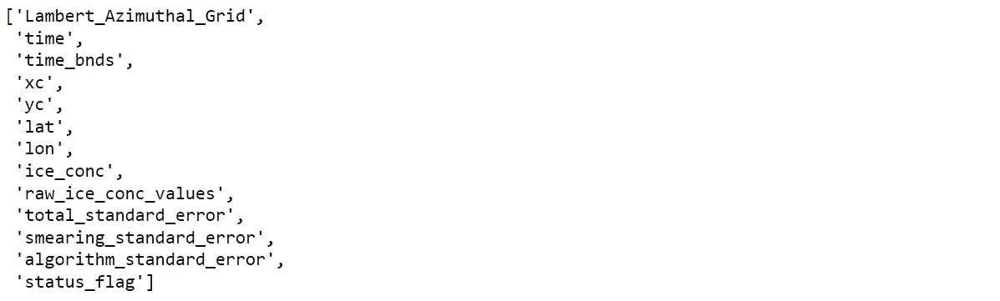

有关更多信息，请使用下面的代码从每个变量中获取更多详细信息。

为了直观显示海冰浓度，将使用三个变量:

*   纬度:纬度
*   经度
*   ice _ conc:filter ssea _ ice _ area _ fraction；使用亮度温度和开放水域的大气修正完全过滤的海冰浓度

## 创建数据框架

我们将读取 NetCDF 文件，并将它们转换成数据帧，以便使用 Python。定义快速创建数据帧的函数。

应用函数。仅选择高于 50 的百分比浓度，以避免过多的数据。对了，数字是可以修改的。

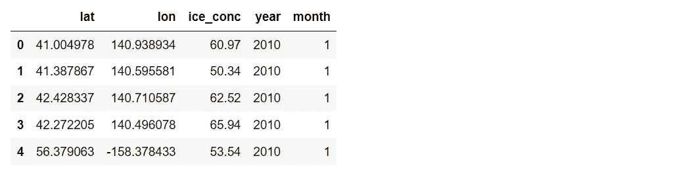

**注意**:如果出现一个关于内存的错误，我建议做一个列表切片。将数据分成两个或三个部分来处理小数据，并用 [DataFrame.to_csv](https://pandas.pydata.org/docs/reference/api/pandas.DataFrame.to_csv.html) 保存输出数据帧。重复这个过程，直到完成列表。之后，读取每个数据帧并用 [pandas.concat](https://pandas.pydata.org/docs/reference/api/pandas.concat.html?highlight=concat#pandas.concat) 连接它们。

# 描述性分析

本文将主要关注大约在北纬 66 度的[北极圈](https://en.wikipedia.org/wiki/Arctic_Circle)上方的冰海。如果对[南极圈](https://en.wikipedia.org/wiki/Antarctic_Circle)下面的冰海感兴趣，可以修改下面代码中的纬度值。按年份和月份过滤数据框和分组。

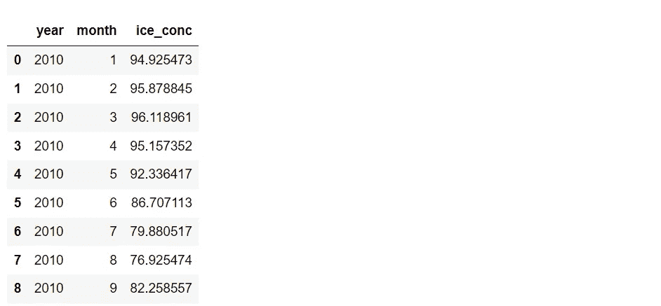

从数据框中画出时间序列图。

时间序列图显示了 2010 年至 2021 年的月平均百分比浓度。图片由作者提供。

时序图中的线条显示，8 月是平均百分比浓度达到最低点的月份。这是有道理的，因为北半球现在是夏天。

# 海冰可视化

本文将介绍如何使用极轴散点图和热图来可视化数据。

在继续之前，所获得的数据帧还没有准备好用于绘图。需要将纬度从[66，90]缩放到[0，1]，以便于数据可视化。此外，经度范围包含从[-180，180]开始的负值，需要将这些值转换为正值范围。让我们定义一个函数来转换这些值。

创建年份和月份列表以过滤数据框架。

下一步是应用该函数并使用年和月的列表进行过滤。

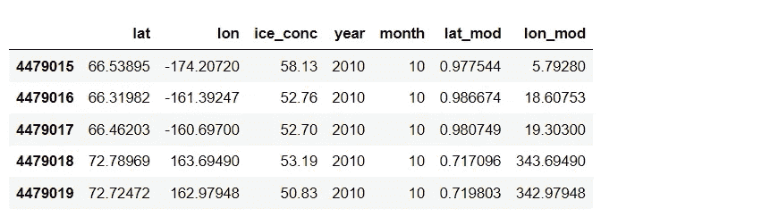

## 极轴散点图

这个想法是从北极上方看。因此，我们将在极轴上绘制散点图来模拟观察点。请注意，结果将保存到您的计算机上，以供以后使用。

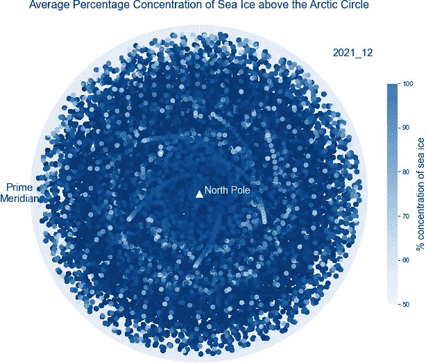

极轴散点图示例显示了 2021 年 12 月北极圈上方海冰的平均百分比浓度。图片由作者提供。

## 创建一个 GIF 文件

制作动画是使情节看起来有趣的另一种方法。因此，让我们把这些图组合起来，并把它们转换成一个 [GIF](https://en.wikipedia.org/wiki/GIF) 文件。例如，我将结合 2020 年和 2021 年每个月的散点图。

瞧啊。！….

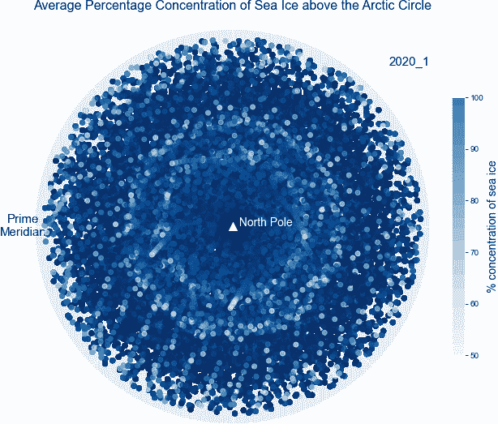

一个 GIF 文件，综合了 2020 年 1 月到 2021 年 12 月极轴上的所有散点图。

从保存的输出中，我们可以创建一个 GIF 文件，只选择同一个月来比较每年的数据。例如，下面的代码显示了如何组合九月的每个情节。

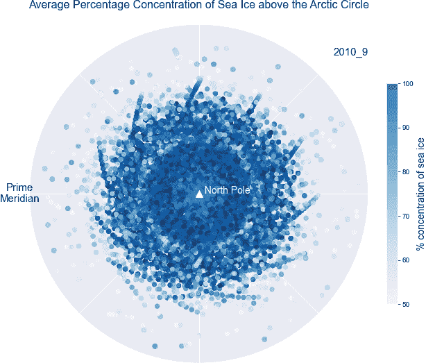

2010 年至 2021 年每年 9 月在极轴上组合所有散点图的 GIF 文件。图片由作者提供。

## 热图

为了在世界地图上创建热图，[follow](https://python-visualization.github.io/folium/)是一个功能强大的 Python 库，用于处理地理空间数据。从导入库开始。

我们需要在用叶子申请前准备好资料。这次选择的是[赤道](https://en.wikipedia.org/wiki/Equator)线以上的全部数据。之后执行 groupby，计算月平均值。然后，选择要绘图的月份。例如，下面的数据集来自 2021 年 12 月。

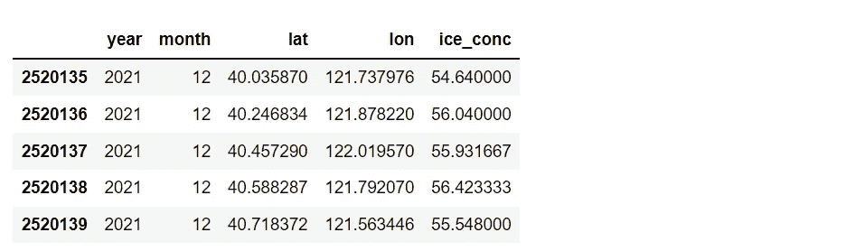

从数据框中，创建一个用于绘图的数据和颜色列表。

用叶库绘制热图。

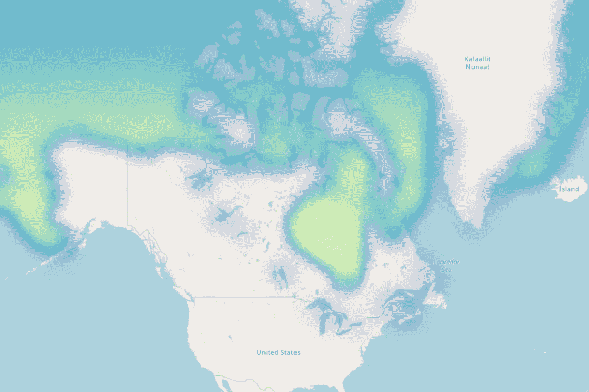

使用[叶子](https://python-visualization.github.io/folium/)显示 2021 年 12 月北极圈上方海冰平均百分比浓度的热图示例。图片由作者提供。

## 随时间变化的热图

Folium 还有一个名为 [HeatMapWithTime](https://github.com/python-visualization/folium/blob/main/examples/HeatMapWithTime.ipynb) 的功能，用于通过组合多个热图来创建动画。我会绘制 2019 年 1 月到 2021 年 12 月的热图，24 个月。

用 HeatMapWithTime 绘制数据。

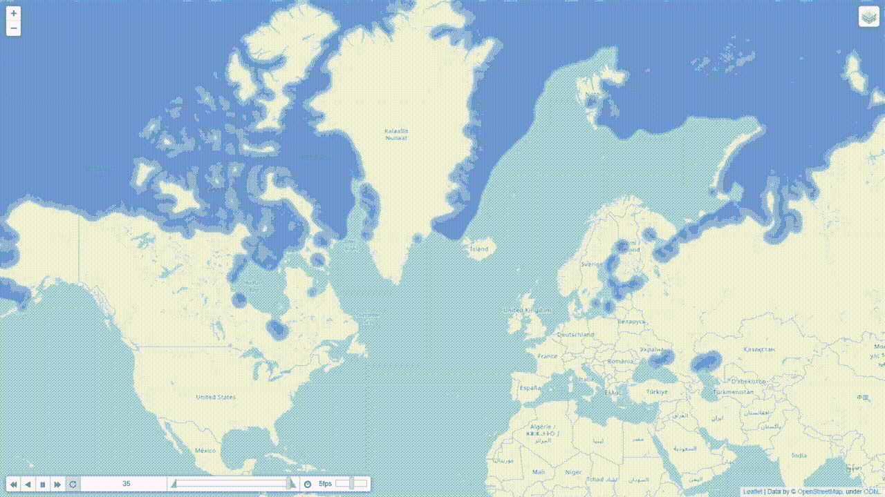

热图的动画显示了从 2019 年 1 月到 2021 年 12 月北极圈上方海冰的平均百分比浓度，使用的是来自 follow 的 HeatMapWithTime。图片由作者提供。

## 摘要

本文展示了海冰数据源以及如何导入和准备数据。用于显示海冰密集度的两个图表是极轴散点图和热图。可以通过创建动画来改进这两个图形，使结果看起来更有趣。

本文主要关注北极圈上空的海冰。顺便说一句，该方法可以应用于南半球的海冰，在[南极圈](https://en.wikipedia.org/wiki/Antarctic_Circle)下方。

如果您有任何建议或问题，请随时评论。

感谢阅读

这些是关于数据可视化的其他文章，您可能会感兴趣。

用 NASA 数据和 Python ( [链接](/visualize-the-invisible-so2-with-nasa-data-and-python-2619f8ed4ea1))可视化看不见的 SO2

8 用 Python 处理多个时序数据的可视化([链接](/8-visualizations-with-python-to-handle-multiple-time-series-data-19b5b2e66dd0))

用 Python 可视化光速([链接](/visualizing-the-speed-of-light-in-the-solar-system-with-python-fa9ead33ac86)

## 参考

*   欧洲气象卫星应用组织海洋和海冰卫星应用设施，1979-2015 年全球海冰密集度气候数据记录(v2.0，2017)，OSI-450，doi: 10.15770/EUM_SAF_OSI_0008，2022-06-01 数据摘自 https://cds.climate.copernicus.eu/cdsapp#
*   欧洲气象卫星应用组织海洋和海冰卫星应用设施，2016 年以来全球海冰密集度气候数据记录(v2.0，2017)，OSI-450，doi: 10.15770/EUM_SAF_OSI_0008，2022 年 6 月 1 日从 https://cds.climate.copernicus.eu/cdsapp#!哥白尼气候变化服务气候数据存储中提取的数据/数据集/卫星-海冰-浓度
*   维基媒体基金会。(2022 年 6 月 7 日)。*气候变化*。维基百科。于 2022 年 6 月 8 日从[https://en.wikipedia.org/wiki/Climate_change](https://en.wikipedia.org/wiki/Climate_change)检索
*   维基媒体基金会。(2022 年 2 月 4 日)。*极坐标放大*。维基百科。2022 年 6 月 8 日检索，来自[https://en . Wikipedia . org/wiki/Polar _ amplification #:~:text = Polar % 20 amplification % 20 is % 20 the % 20 phenomenon，Polar % 20 warming % 20 to % 20 tropical % 20 warming。](https://en.wikipedia.org/wiki/Polar_amplification#:~:text=Polar%20amplification%20is%20the%20phenomenon,polar%20warming%20to%20tropical%20warming.)