# 绘制时间序列箱线图

> 原文：<https://towardsdatascience.com/plotting-time-series-boxplots-5a21f2b76cfe>

## 了解如何使用 matplotlib 和 Seaborn 绘制时间序列箱线图


[阿格巴洛斯](https://unsplash.com/@agebarros?utm_source=medium&utm_medium=referral)在 [Unsplash](https://unsplash.com?utm_source=medium&utm_medium=referral) 上拍摄的照片

时间序列数据集是在一段时间内按时间索引收集的数据集合。使用时间序列，您可以绘制有趣的可视化图形，来说明一段时间内被研究对象的值的变化。一种特殊类型的时间序列图是**时间序列箱线图**。

当您在特定时间间隔内有多个数据点时，时间序列箱线图是一种非常有用的数据集可视化方法。例如，您在一个月的时间内每小时收集一次某个位置的温度。您希望使用箱线图来查看每天的平均温度如何变化，以及每天的温度离差。这就是时间序列箱线图的用处。

因此，在本文中，我将向您介绍绘制时间序列箱线图的一些基础知识——从使用 Pandas Series 和 DataFrame 设置简单数据集，到加载真实数据集，并向您展示如何根据您的要求绘制时间序列箱线图。

# 使用熊猫系列绘制时间系列箱线图

我想说明的第一个简单的例子是如何使用熊猫系列进行绘图。首先，让我们创建一个包含日期范围的`DatetimeIndex`对象:

```
import pandas as pd
import numpy as npdate_range = pd.date_range(start = "2022-01-01", 
                           end   = "2022-02-28 23:59:00",
                           freq  = "H")
```

这里，`date_range`是一个开始日期为`2022–01–01 00:00:00`到`2022–02–28 23:00:00`的`DatetimeIndex`对象。注意每个项目间隔 1 小时(`freq=’H’`):

```
DatetimeIndex(['2022-01-01 00:00:00', '2022-01-01 01:00:00',
               '2022-01-01 02:00:00', '2022-01-01 03:00:00',
               '2022-01-01 04:00:00', '2022-01-01 05:00:00',
               '2022-01-01 06:00:00', '2022-01-01 07:00:00',
               '2022-01-01 08:00:00', '2022-01-01 09:00:00',
               ...
               '2022-02-28 14:00:00', '2022-02-28 15:00:00',
               '2022-02-28 16:00:00', '2022-02-28 17:00:00',
               '2022-02-28 18:00:00', '2022-02-28 19:00:00',
               '2022-02-28 20:00:00', '2022-02-28 21:00:00',
               '2022-02-28 22:00:00', '2022-02-28 23:00:00'],
              dtype='datetime64[ns]', length=1416, freq='H')
```

现在，您可以使用`date_range`变量作为索引来创建熊猫系列。对于该值，我们使用一个随机数生成器:

```
ts = pd.Series(list(np.random.randn(len(date_range))),
               index = date_range)
```

下面是现在`ts`的内容:

```
2022-01-01 00:00:00   -0.869078
2022-01-01 01:00:00    1.742324
2022-01-01 02:00:00    0.937706
2022-01-01 03:00:00    0.366969
2022-01-01 04:00:00    1.841110
                         ...   
2022-02-28 19:00:00    0.061070
2022-02-28 20:00:00    0.354997
2022-02-28 21:00:00    1.102489
2022-02-28 22:00:00   -1.299513
2022-02-28 23:00:00   -0.452864
Freq: H, Length: 1416, dtype: float64
```

现在，您可以使用 **matplotlib** 和 **Seaborn** 绘制时间序列箱线图了:

```
import matplotlib.pyplot as plt
import seabornfig, ax = plt.subplots(figsize=(20,5))
seaborn.boxplot(x = ts.index.dayofyear, 
                y = ts, 
                ax = ax)
```

您将看到下面的时间序列箱线图:

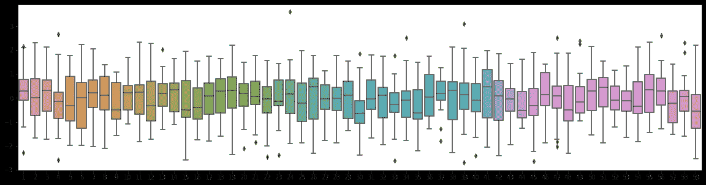

作者图片

# 使用 Pandas 数据框架绘制时间序列箱线图

第二个例子是创建一个 DataFrame，将`date_range`对象设置为索引:

```
import pandas as pd
import numpy as np
import matplotlib.pyplot as plt
import seaborndate_range = pd.date_range(start = "2022-01-01", 
                           end   = "2022-02-28 23:59:00",
                           freq  = "H")
df = pd.DataFrame(
    {
        'temp':np.random.randn(len(date_range))
    }, **index = date_range**)
df
```

数据帧如下所示:

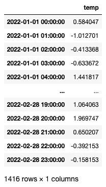

要查看 2 个月中每天的箱线图，请使用`DatetimeIndex`类型的`dayofyear`属性(`df.index`):

```
fig, ax = plt.subplots(figsize=(20,5))
seaborn.boxplot(x = df.index.**dayofyear**, 
                y = df['temp'], 
                ax = ax)
```

您将看到如下图:

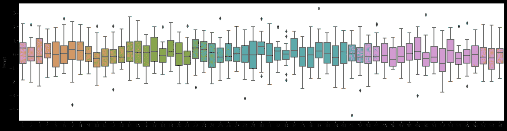

作者图片

# 绘制每个月的时间序列箱线图

对于下面的例子，我将从一个 CSV 文件中加载数据，您可以从以下 URL 获得该文件:【https://data.gov.sg/dataset/wet-bulb-temperature-hourly。

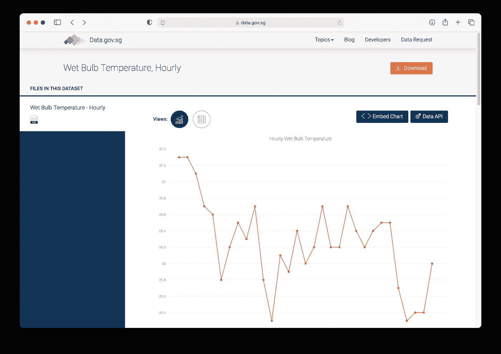

单击下载按钮下载数据集

> 该数据受 [**新加坡开放数据许可证**](https://data.gov.sg/open-data-licence) 的约束，可在[https://data.gov.sg/open-data-licence](https://data.gov.sg/open-data-licence)查阅。

该数据包含樟宜气候站记录的每小时湿球温度。

> 湿球温度是绝热饱和温度。这是暴露在气流中的湿温度计球指示的温度。湿球温度可以用湿平纹细布包裹的温度计测量。来源:[气温—干球/湿球/露点 https://www.weather.gov 朱 dry_wet_bulb_definition](https://www.google.com/url?sa=t&rct=j&q=&esrc=s&source=web&cd=&cad=rja&uact=8&ved=2ahUKEwidgv-swuH2AhWjIbcAHW6RBnAQFnoECAwQAw&url=https%3A%2F%2Fwww.weather.gov%2Fsource%2Fzhu%2FZHU_Training_Page%2Fdefinitions%2Fdry_wet_bulb_definition%2Fdry_wet_bulb.html&usg=AOvVaw0yZnmPdg228C1O07fbpLp7)

让我们将 CSV 文件加载到数据帧中:

```
df = pd.read_csv('wet-bulb-temperature-hourly.csv', 
                 parse_dates = ['wbt_date'], 
                 index_col='wbt_date')
df
```

这是数据帧的样子:

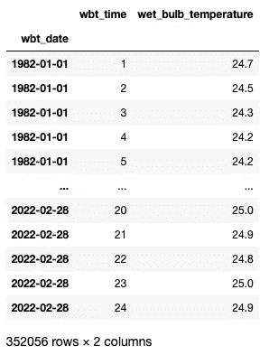

作者图片

数据的日期从 1982 年开始到 2022 年。让我们看看每个*月*的温度是如何变化的。为此，我们将使用`DatetimeIndex`类型的`**month**`属性:

```
fig, ax = plt.subplots(figsize=(12,5))seaborn.boxplot(x = df.index.**month**,
                y = df['wet_bulb_temperature'], 
                ax = ax)
```

剧情如下:

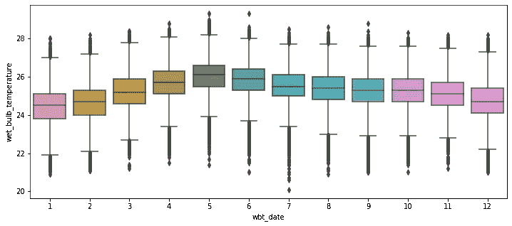

作者图片

正如你所看到的，五月似乎是每年最热的一个月。

# 绘制每年的时间序列箱线图

最热的一年怎么样？为此，我们将使用`DatetimeIndex`类型的`**year**`属性:

```
fig, ax = plt.subplots(figsize=(24,10))
seaborn.boxplot(x = df.index.**year**,
                y = df['wet_bulb_temperature'], 
                ax = ax)
```

你可以看到 1998 年是最热的一年:

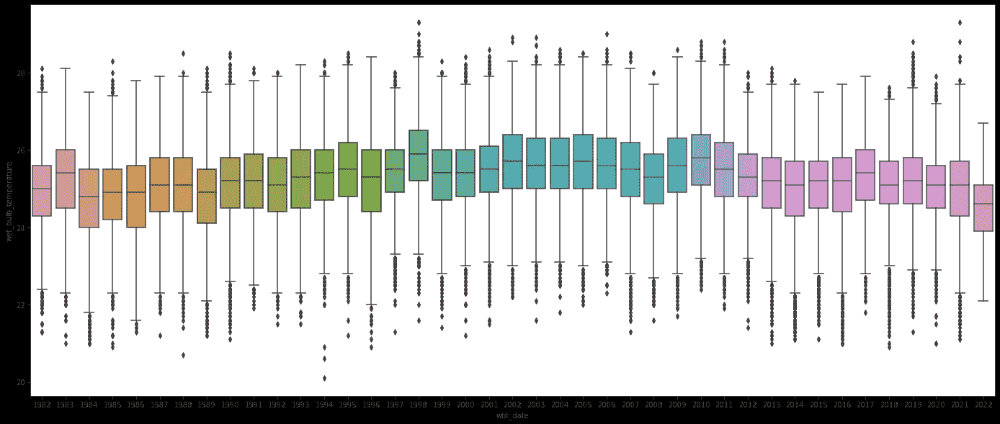

作者图片

注意到 x 记号有点挤。让我们把它旋转 30 度:

```
fig, ax = plt.subplots(figsize=(24,10))
seaborn.boxplot(x = df.index.year,
                y = df['wet_bulb_temperature'], 
                ax = ax)
**_ = ax.set_xticklabels(ax.get_xticklabels(), rotation = 30)**
```

现在，您可以看到 x 刻度更加分散了:

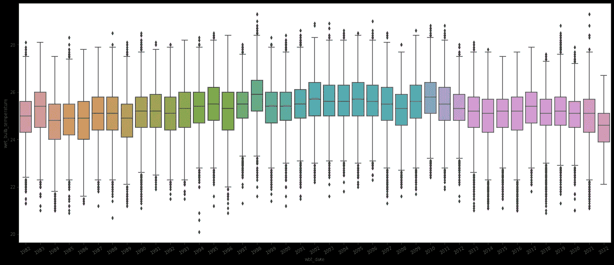

作者图片

# 绘制特定月份中每天的时间序列箱线图

如果你想知道某年某月的温度，比如说 1982 年 1 月，你可以在绘图前先对数据帧进行过滤，如下所示:

```
fig, ax = plt.subplots(figsize=(24,10))
seaborn.boxplot(
    x = df[**'1982-01-01':'1982-01-31'**].index.day,
    y = df[**'1982-01-01':'1982-01-31'**]['wet_bulb_temperature'], 
    ax = ax)
```

看起来 1982 年 1 月 1 日是这个月最热的一天:

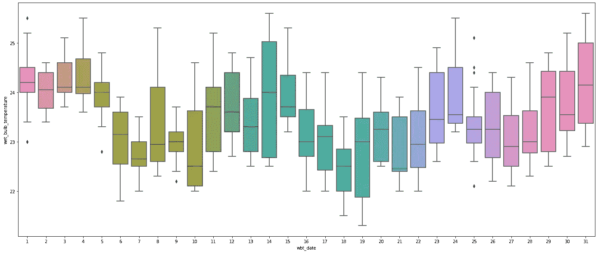

作者图片

# 为一年中的每一天绘制时间序列箱线图

最后，如果您想查看某一年的温度读数，比如说 1982 年的**，您可以使用`DatetimeIndex`类型的`**dayofyear**`属性:**

```
fig, ax = plt.subplots(figsize=(150,10))seaborn.boxplot(
    x = df['**1982-01-01':'1982-12-31**'].index.**dayofyear**,
    y = df['**1982-01-01':'1982-12-31**']['wet_bulb_temperature'], 
    ax = ax)fig.savefig('temp.jpg')
```

**因为图表会很大，我使用了`savefig()`功能将图表保存到文件中。图表看起来像这样:**

**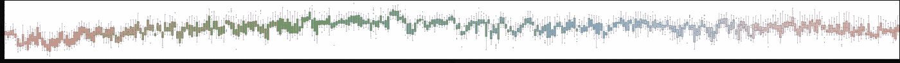**

**如果你放大，你会看到 x 记号只是一些连续的数字:**

**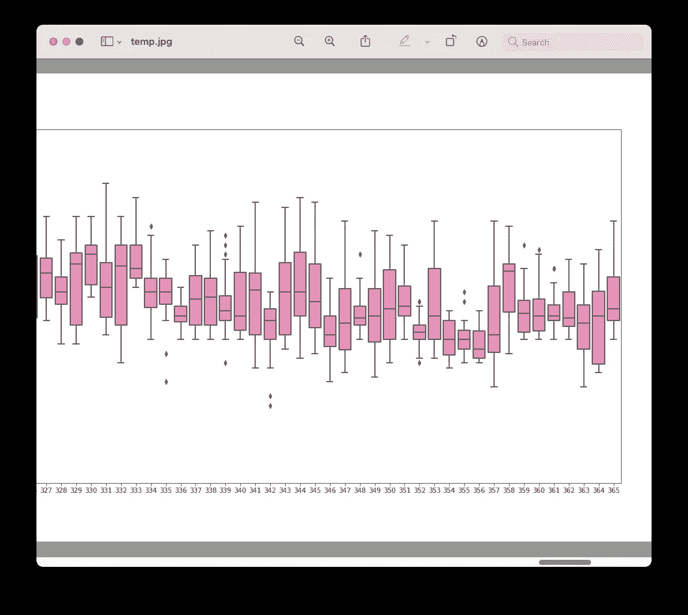**

**作者图片**

**您可以使用`set_xticklabels()`功能格式化 x 刻度:**

```
fig, ax = plt.subplots(figsize=(150,10))seaborn.boxplot(
    x = df['1982-01-01':'1982-12-31'].index.dayofyear,
    y = df['1982-01-01':'1982-12-31']['wet_bulb_temperature'], 
    ax = ax)**ax.set_xticklabels(labels = 
    df['1982-01-01':'1982-12-31'].index.strftime(
        '%Y-%m-%d').sort_values().unique(), 
    rotation=45, ha='right')****f**ig.savefig('temp.jpg')
```

**x 记号现在是实际日期:**

****

**作者图片**

> **如果你想要一些奇特的日期格式，使用`strftime()`功能定制它们。**

# **摘要**

**这是一个如何为时间相关的数据创建时间序列箱线图的快速概述。尝试各种组合来创建您需要的图表！**

**<https://weimenglee.medium.com/membership> **