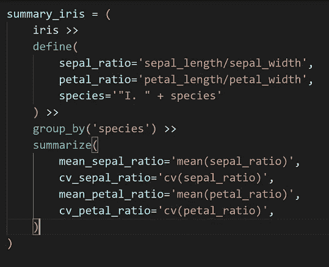

# 熊猫管道

> 原文：<https://towardsdatascience.com/plydata-piping-for-pandas-e7ed4c2d8906>

## 你能为熊猫数据帧使用管道操作符吗？

熊猫的春天来了吗？照片由 [Biegun Wschodni](https://unsplash.com/@biegunwschodni?utm_source=medium&utm_medium=referral) 在 [Unsplash](https://unsplash.com?utm_source=medium&utm_medium=referral) 上拍摄

# 介绍

管道是探索数据框的强大工具。r 公司的`%>%`管道操作员很好地展示了这一点。但是 Python 和`pandas`数据帧呢？为什么它不提供这样的东西呢？

大多数从 R 转到 Python 的人(像我一样)都觉得 Python 缺少一个管道操作符，或者至少缺少一个像 R 的`%>%`一样强大的管道操作符。在 R 中，它被包含在`[tidyverse](https://doi.org/10.21105/joss.01686)` (Wickham，2019)中，这是一组极其强大的数据操作工具——尽管事实是它是在`[magrittr](https://CRAN.R-project.org/package=magrittr)` R 包中引入的。

事实是 Python 确实有类似的东西，尽管(还)没有那么强大。事实上，有几个模块为管道操作员提供了工作。一个有趣的例子是`[Pipe](https://github.com/JulienPalard/Pipe)`包，它旨在提供与函数式编程语言类似的管道，比如 F#或 Haskell。但是，它不是为处理数据框而设计的；因此，由于它在其他一些情况下是有趣和有用的，我们将在其他时间谈论它。然而，今天我们谈论的是数据框架。R 中的`%>%` 操作符——如此强大，如此受人喜爱——是为处理数据帧(以及类似的类型，如`[tibble](https://CRAN.R-project.org/package=tibble)`、Müller 和 Wickham 2021)而设计的，因此它不像函数式语言中的管道操作符那样工作。

事实上，有几种方法可以实现这一点，其中一个非常有趣的方法是`[plydata](https://github.com/has2k1/plydata)`。今天，我们将讨论它的基础知识和它的管道操作符`>>`。在这个基本的介绍之后，你应该准备好决定你是否喜欢这个解决方案。

# **进入** plydata 的第一步

当然，我们的第一步应该是安装带有所需模块的虚拟环境。我将使用`pydataset==0.2.0`(即使是旧的，包仍然提供数据集，所以它应该工作良好)和`plydata==0.4.3`。`plydata`也变得有点旧了，因为上一个版本是 2020 年的，但我看到它的资源库仍然活跃，所以我认为我们应该很快就会有更新。

一旦我们用这些包创建了虚拟环境，我们就可以使用它的 Python 安装了。这是我们需要的:

我将使用`iris`数据集，这个数据集在各个学科都非常流行，包括分类和数据可视化。我在我写的许多关于统计和数据可视化的科学文章中使用过它；我甚至与人合写了一篇关于这个数据集的文章(科萨克和奥托卡，2013)。

`plydata`提供了很多有用的函数，但是在这篇介绍性文章中，我们将只讨论其中的几个。首先，让我们从`pydataset`包中导入数据集:

在数据中，150 个观察结果被分为三个鸢尾物种( *I* )。*云芝*，*我*。*海滨锦葵*和 *I* 。 *setosa* ，每一个都有四个变量。现在，我们第一次使用`plydata`:让我们打印每个物种的前五行*:*

或者，对我来说更有可读性，

这只是开始。稍后我将解释`group_by()`函数，尽管我认为它的名字说明了它的作用。`pandas`用户会立刻知道它讲的是什么；事实上，`pandas`用户通常会很快理解`plydata`函数的作用。

上面，`head()`函数获取前`n`行数据。让我们继续，但我们必须首先重命名列。为此我们当然不需要`plydata`:

当然，我们可以用很多方法来实现，比如用`pandas.DataFrame.rename()`方法。好了，我们差不多准备好了，但是因为我们要计算变异系数，我们首先需要为此定义一个函数:

现在，言归正传。下面的简短代码展示了`plydata`的强大功能和可读性:

在进一步阅读之前，请花一点时间阅读上面的代码，了解它是做什么的；目前，请忽略我注释掉的行，我们稍后将返回到它。

关键在于管道操作符`>>`，它和 R 的管道操作符`magrittr`起的作用是一样的，就是`%>%`。是的，我从`magrittr`开始写，因为这个包引入了`%>%`操作符，所以被`tidyverse`环境大量使用。

一般来说，管道可以帮助您在数据集上按顺序运行函数。你知道这个想法，因为 Pythonistas 可以在类似的链中使用点，比如在`my_string.lower.replace('gz', 'z')`或`pandas`中。我不认为我必须让你相信这样的功能会很方便，尽管它有一个很大的限制，我将在后面讨论。

当您思考完代码后，让我们一行一行地浏览它:

* `iris`表示我们从`iris`数据帧开始(是的，`plydata` 适用于`pandas.DataFrame` s，因此它不适用于发电机)。

*当然，`define()`函数定义了新的变量；这里，`sepal_ratio`和`petal_ratio`。在这里，它还重新定义了`species`，在开头添加了“I .”一词:生物学家就是这样写物种名称的。

*注释行:实际上，我们不需要在这里选择任何变量，但是我想向您展示，如果我们想要删除其中的一些变量，我们可以这样做(就像我们经常做的那样)。取消对这一行的注释不会改变什么，因为在`iris`数据集中没有额外的变量。这里，我们将删除名称中带有`width`或`length`的列。

*现在我们按`species`对数据进行分组。这八个字组合成`group_by()`提供了难以想象的强大力量。它的作用是:在那一行之后要做的所有事情都将按组完成*。因此，如果我们计算一个变量的平均值，我们将得到每个物种的平均值(因为物种组成群体)。*

* `summarize()`旨在，不出所料，总结数据。这里，我们确定平均值(来自统计模块)和变异系数(使用上面定义的函数)。

看看结果:

我不需要`query()`函数，但是既然它如此重要，让我向你展示它是如何工作的。假设我们想找到那些萼片相对较宽的样本；这里，我们将查询至少 75%的长度:

我们可以添加其他条件，使用`and`(当然，您也可以使用`or`)操作符(因为许多行满足这个条件，所以我们只取前三个):

我很难评估这样的`plydata`代码对你来说可读性如何，因为我已经使用 R 的管道很长时间了。因此，我读它就像读一个书面文本，虽然我记得起初我需要习惯这种语法。这些天来，我真的很清楚，至少在这个层次上——因为它可能更难理解(和调试！)与复杂函数结合使用时。

# **限制**

我刚刚提到了管道的最大限制:调试。事实上，调试可能很困难。有时候最好解绑代码；您还可以添加一些`print`，但是使用管道进行交互式调试需要更多的工作。

另外，有时候你可以用`pandas`做更多的事情，尤其是在你对`plydata`的知识还比较贫乏的时候。坦白地说，我经常以代码混淆了`plydata`和`pandas`语法而告终。也许这样的代码不如纯粹的`plydata`代码好，但它仍然比纯粹的`pandas`代码好，也更清晰。

# **结论**

几年前，R 通过引入管道操作符`%>%`改变了数据探索世界。它如此强大，提供了如此多的可能性，以至于很难想象现在的 R 没有`dplyr`和管道 R 命令。在我看来，这甚至是 R 历史上最大的游戏改变者。

为什么 Python 的`pandas`让我们过上了没有管道运营商的生活？当我从 R 迁移到 Python 时，对我来说是一个巨大的惊喜，而且不是一个好的惊喜。尽管如此，由于其他人已经解决了这个问题，我们在这里用`plydata`和它的`>>`操作符来帮助我们操作`pandas`数据帧。

熊猫管道:plydata。来源:作者

我认为通过管道链接命令的强大之处在于使用一个赋值而不是多个。因为在这篇文章中我已经展示了`plydata`的基础，所以我没有包括长链。然而，事实是，即使是很长的链也可以很容易阅读，而不是使用，比如说，十个任务，你只需要一个。此外，命令的垂直组织(除了非常短的命令，它们可以组织在一行中)有助于我们的眼睛一步一步地跟踪正在做的事情，这是一种组织良好且易于阅读的形式。注意(例如，在上图中),这种代码的组织也符合 Python 的缩进规则。

我不得不承认，对我来说，R 用`%>%`操作符链接命令的语法似乎比用`plydata`的`>>`操作符更简单、更好。然而，这可能是我多年来用 r 编程的结果。但是使用管道对数据帧进行操作要容易得多，所以学习这个功能是非常值得的，即使乍一看有点复杂。但是花在`plydata`上的时间迟早有一天会得到回报。

虽然`plydata`在开发中仍然落后于`tidyverse`环境，但是如果与`pandas`一起工作的数据科学家开始大量使用它，我相信它的开发将会迅速加速；然后，谁知道呢，也许在某个时候，管道将成为 Python 中处理数据帧的主要工具，就像它在 r 中一样。这对我们所有的数据科学家都有好处，原因很简单，管道使我们能够用如此可读的语法进行令人难以置信的数据操作。

我向您展示了使用`plydata`和数据帧管道的一些基础知识，我希望我已经让您相信它在探索数据帧的过程中很有帮助。在接下来的文章中，我们将更深入地研究这个包，因为管道操作符构成了本质，但是`plydata`当然提供了更多。它提供了各种功能，使用户能够以各种方式操作数据帧。

# **参考文献**

s . t . bache 和 h . Wickham(2020 年)。magritter:R . R 包版本 2.0.1 的前向管道操作符。[https://CRAN.R-project.org/package=magrittr](https://CRAN.R-project.org/package=magrittr)

m .科萨克和 b .奥托卡(2013 年)。关于著名的虹膜数据我们应该知道什么？当代科学，104(5)，579-580 页。[此处提供](https://tst www . current science . AC . in/Volumes/104/05/0579 . pdf)

米勒和韦克汉(2021 年)。tibble:简单的数据帧。r 包版本 3.1.2。[https://CRAN.R-project.org/package=tibble](https://CRAN.R-project.org/package=tibble)

威克姆等人(2019)。欢迎来到 tidyverse。《开放源码软件杂志》，4 卷 43 期，1686 页，【https://doi.org/10.21105/joss.01686 

 [## 通过我的推荐链接加入媒体——玛茜·科萨克

### 阅读马尔钦·科萨克(以及媒体上成千上万的其他作家)的每一个故事。您的会员费直接支持…

medium.com](https://medium.com/@nyggus/membership)