# 用于语义分割的点网络

> 原文：<https://towardsdatascience.com/point-net-for-semantic-segmentation-3eea48715a62>

## 如何训练点网进行点云分割


格兰特·波特在 [Unsplash](https://unsplash.com?utm_source=medium&utm_medium=referral) 上拍摄的照片

# 介绍

这是点网系列的第四部分:

1.  [点网直观介绍](https://medium.com/@itberrios6/introduction-to-point-net-d23f43aa87d2)
2.  [点网从无到有](https://medium.com/@itberrios6/point-net-from-scratch-78935690e496)
3.  [用于分类的点网](https://medium.com/@itberrios6/point-net-for-classification-968ca64c57a9)
4.  **用于语义分割的点网**

在本教程中，我们将学习如何在斯坦福 3D 室内场景数据集( [S3DIS](https://openaccess.thecvf.com/content_cvpr_2016/papers/Armeni_3D_Semantic_Parsing_CVPR_2016_paper.pdf) )上训练点网进行[语义分割](https://www.cs.toronto.edu/~tingwuwang/semantic_segmentation.pdf)。S3DIS 是一个 3D 数据集，包含多个建筑物的室内空间的点云，覆盖面积超过 6000m [ [1](https://openaccess.thecvf.com/content_cvpr_2016/papers/Armeni_3D_Semantic_Parsing_CVPR_2016_paper.pdf) ]。点网络是一种新颖的架构，它消耗整个点云，并能够进行分类和分割任务[ [2](https://arxiv.org/pdf/1612.00593.pdf) ]。如果你一直在关注点网系列，你已经知道[它如何工作](https://medium.com/@itberrios6/introduction-to-point-net-d23f43aa87d2)和[如何编码](https://medium.com/@itberrios6/point-net-from-scratch-78935690e496)。

在[之前的教程](https://medium.com/@itberrios6/point-net-for-classification-968ca64c57a9)中，我们学习了如何在迷你版的 [shapenet](https://shapenet.org/) 数据集上为[分类](https://en.wikipedia.org/wiki/Statistical_classification)训练点网。在本教程中，我们将使用 S3DIS 数据集训练语义分割的点网络。本教程的代码位于这个[库](https://github.com/itberrios/3D)中，我们将在这个[笔记本](https://github.com/itberrios/3D/blob/main/point_net/pointnet_seg.ipynb)中工作。

**以下是对未来的概述:**

*   数据集概述
*   方法学
*   模特培训
*   模型评估
*   结论
*   参考

# **S3DIS 数据集**

## **概述**

中使用的完整 S3DIS 数据集可通过请求访问[此处](https://docs.google.com/forms/d/e/1FAIpQLScDimvNMCGhy_rmBA2gHfDu3naktRm6A8BPwAWWDv-Uhm6Shw/viewform?c=0&w=1)下载。数据集被分成对应于不同建筑物的六个不同区域，在每个区域内有对应于不同房间(例如办公室或会议室)的不同室内空间。这个数据集有两个版本，原始的和对齐的，我们选择使用对齐的版本。对齐版本与原始版本相同，只是旋转了每个点云，使得 x 轴沿房间的入口对齐，y 轴垂直于入口墙，而 z 轴保持垂直轴。这种排列形成了一个规范的(*即公共的*)坐标系，该坐标系允许我们利用在每个点云中发现的一致结构[ [1](https://openaccess.thecvf.com/content_cvpr_2016/papers/Armeni_3D_Semantic_Parsing_CVPR_2016_paper.pdf) ]。

## 数据整理

数据集在磁盘上将近 30GB(6GB 压缩)，但是我们有一个压缩版本，解压缩后只占用大约 6GB。在数据简化过程中，真实数据点颜色已被移除，所有数据点已被转换为 float32，留给我们的是包含(x，y，z)点的 Nx4 数组和一个类。每个空间都被分割成大约 1x1 米的子空间，并保存为 hdf5 文件。这个过程超出了本教程的范围，但是这里有一个[笔记本](https://github.com/itberrios/3D/blob/main/s3dis_raw_explorer.ipynb)用来生成简化的数据集。

## 数据超参数

当谈到数据时，我们可能不会经常想到[超参数](https://en.wikipedia.org/wiki/Hyperparameter_(machine_learning))，但增强(甚至规范化)的类型实际上是超参数，因为它们在学习过程中起着重要作用[ [3](https://link.springer.com/article/10.1007/s13042-022-01555-1) ]。我们的数据超参数可以分为两类:实际变换本身(*例如图像旋转与图像扭曲*)和控制变换的参数(*例如图像旋转角度*)。模型不能直接学习这些东西，我们通常根据验证性能调整这些东西，就像我们对模型超参数所做的一样(*例如学习率、批量*)。还值得注意的是，数据超参数可以大大提高模型的学习能力，这可以通过经验来验证。

在训练和验证集中，我们添加了具有 0.01 标准偏差的随机高斯噪声[。仅在训练集中，我们以 0.25 的概率围绕垂直轴随机旋转。限制围绕垂直轴的旋转允许基础结构发生变化，而地板、墙壁和天花板(背景)在所有分区中都保持类似的关系。对于所有分割，我们执行](https://en.wikipedia.org/wiki/Gaussian_noise)[最小/最大归一化](https://en.wikipedia.org/wiki/Feature_scaling#Rescaling_(min-max_normalization))，以便每个分区的范围从 0 到 1。与[ [2](https://arxiv.org/pdf/1612.00593.pdf) 类似，在训练和验证期间，我们对每个分区随机抽取 4096 个点。在测试过程中，我们倾向于使用更多的点来获得对模型性能的更好理解，所以我们用 15000 个点进行下采样。

[PyTorch 数据集](https://pytorch.org/tutorials/beginner/data_loading_tutorial.html)脚本位于[这里](https://github.com/itberrios/3D/blob/main/point_net/s3dis_dataset.py)，请跟随[笔记本](https://github.com/itberrios/3D/blob/main/point_net/pointnet_seg.ipynb)来看看如何生成数据集。对于我们的划分，我们使用区域 1-4 进行培训，区域 5 进行验证，区域 6 进行测试。

## 数据探索

图 1 显示了一个完整空间的示例。而图 2 中示出了规则 VS 旋转分区的示例。

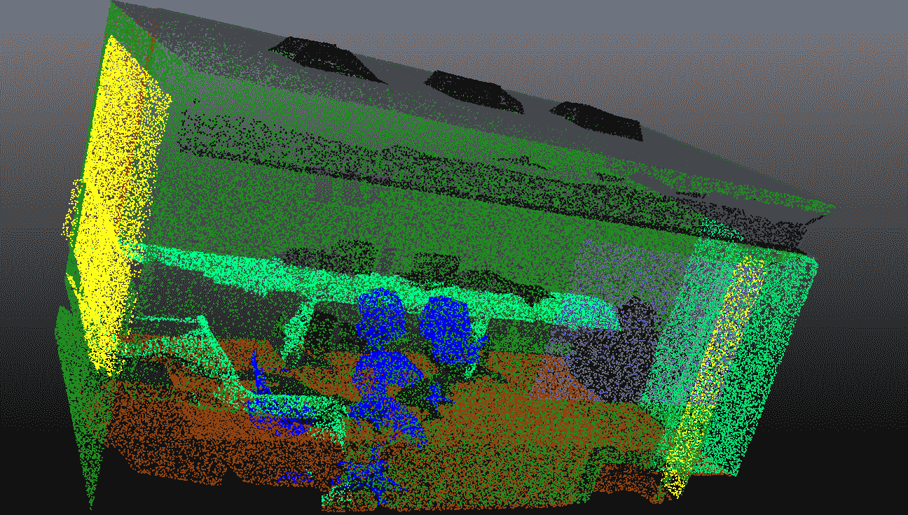

图一。用颜色表示不同等级的完整空间。来源:作者。

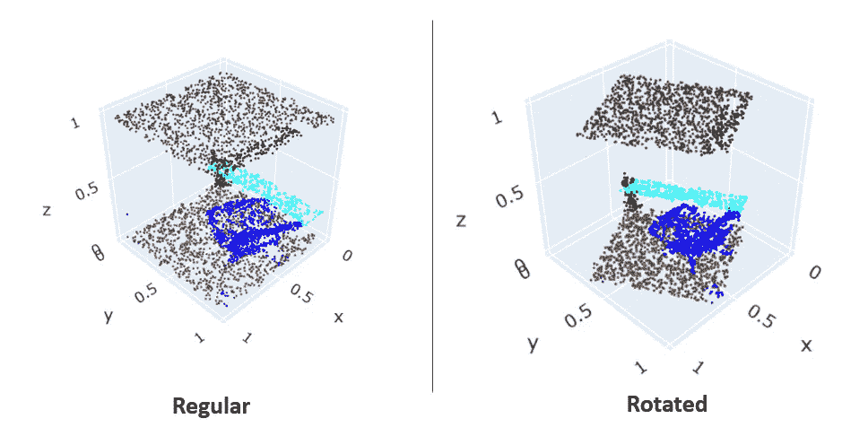

图二。常规与循环训练分区。来源:作者。

现在让我们探索一下培训课程的频率，它们显示在图 3 中。我们可以看到，这个数据集非常不平衡，一些类别似乎构成了背景类别(天花板、地板、墙壁)。我们应该注意到，clutter 类实际上是任何其他杂项对象的一个类别，例如白板或墙上的图片，或者桌上的打印机。

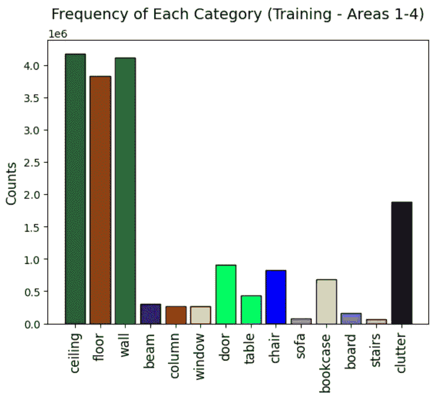

图 3。S3DIS 数据集的类频率。来源:作者。

# 方法学

## 问题定义

当你听到语义分割时，你可能会想到图像，因为它是识别给定图像中每个像素的概念。分割可以推广到高维空间，对于 3D 点云，这是为每个 3D 点分配一个类别的概念。为了更好地理解这个问题，我们应该很好地理解什么是[点云实际上是](https://medium.com/@itberrios6/introduction-to-point-net-d23f43aa87d2)。让我们考虑一下我们想要划分的类，如果你看图 2，你会注意到每个类(除了杂乱的)都有独特和一致的结构。即墙壁、地板和天花板是平坦且连续的平面；像椅子和书柜这样的东西，在许多不同的领域也应该有一致的结构。我们希望我们的模型能够在一定程度上准确地识别不同类的不同结构。我们将需要构建一个损失函数来诱使我们的模型以一种有用的方式学习这些结构。

## 损失函数

在图 2 中，我们可以清楚地看到这个数据集是不平衡的。我们以类似于[分类教程](https://medium.com/@itberrios6/point-net-for-classification-968ca64c57a9)的方式解决这个问题。我们加入了平衡的[聚焦损失](https://arxiv.org/pdf/1708.02002.pdf)，它是基于[交叉熵损失](/cross-entropy-for-classification-d98e7f974451)加上一些额外的项来衡量它。第一个比例因子是类别权重(alpha ),它决定了每个类别的重要性，这就是“平衡”一词的来源。我们可以使用逆类权重或者手动将其设置为超参数。第二项是将平衡的交叉熵损失转换为平衡的焦点损失，这一项被认为是一个调节因素，它迫使模型关注困难的类别，即那些以低置信度预测的类别[ [5](https://arxiv.org/pdf/1708.02002.pdf) ]。如图 4 所示，调制因子通过超参数γ来控制。伽玛项的范围可能从 0 到 5，但实际上取决于具体情况。

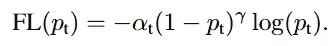

图 4。t 类的聚焦损失。α是类权重，γ幂的项是调制项，对数项是交叉熵损失。来源:[ [5](https://arxiv.org/pdf/1708.02002.pdf) ]

[ [1](https://openaccess.thecvf.com/content_cvpr_2016/papers/Armeni_3D_Semantic_Parsing_CVPR_2016_paper.pdf) 的作者建议，语义分割问题实际上作为检测问题比分割问题更好处理。我们不会在这里展开太多，但是我们会尝试用我们的损失函数来考虑整体的职业结构。我们的模型需要学习类结构的基本表示，它需要学习它们是连续的而不是稀疏的。我们可以结合[骰子损失](https://doi.org/10.1016/j.array.2019.100004)来帮助说明这一点。Dice 分数量化了我们预测的类别与实际情况的重叠程度。骰子损失正好是 1 减去[骰子系数](https://en.wikipedia.org/wiki/S%C3%B8rensen%E2%80%93Dice_coefficient)，如图 5 所示，我们添加了ε以避免被零除[ [6](https://www.sciencedirect.com/science/article/pii/S2590005619300049?via%3Dihub) ]。

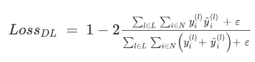

图 5。骰子损失来源[ [6](https://www.sciencedirect.com/science/article/pii/S2590005619300049?via%3Dihub) ]。

我们引入骰子损失来阻止模型预测稀疏结构分类。也就是说，我们更喜欢分割整面墙，而不是墙和杂物的混合体。在训练过程中，我们将焦点损失和骰子损失相加，并将其作为我们的损失。损失函数的代码在[这里](https://github.com/itberrios/3D/blob/main/point_net/point_net_loss.py)可用，PyTorch 中的骰子损失代码如下:

```
@staticmethod
def dice_loss(predictions, targets, eps=1):

    targets = targets.reshape(-1)
    predictions = predictions.reshape(-1)

    cats = torch.unique(targets)

    top = 0
    bot = 0
    for i, c in enumerate(cats):
        locs = targets == c

        y_tru = targets[locs]
        y_hat = predictions[locs]

        top += torch.sum(y_hat == y_tru)
        bot += len(y_tru) + len(y_hat)

    return 1 - 2*((top + eps)/(bot + eps))
```

注意，作者在他们的[实现](https://github.com/charlesq34/pointnet)中，没有使用特征矩阵正则化进行语义分割，所以我们也不会使用它。

# 模特培训

## 模型超参数

模型超参数在下面的训练设置代码中列出，同样，笔记本在这里是。

```
import torch.optim as optim
from point_net_loss import PointNetSegLoss

EPOCHS = 100
LR = 0.0001

# manually set alpha weights
alpha = np.ones(len(CATEGORIES))
alpha[0:3] *= 0.25 # balance background classes
alpha[-1] *= 0.75  # balance clutter class

gamma = 1

optimizer = optim.Adam(seg_model.parameters(), lr=LR)
scheduler = torch.optim.lr_scheduler.CyclicLR(optimizer, base_lr=0.0001, max_lr=0.01, 
                                              step_size_up=2000, cycle_momentum=False)
criterion = PointNetSegLoss(alpha=alpha, gamma=gamma, dice=True).to(DEVICE)
```

我们手动加权背景和杂波类别，并将焦点损失的 gamma 设置为 1。我们使用一个 [Adam](https://pytorch.org/docs/stable/generated/torch.optim.Adam.html) 优化器和一个[循环学习率调度器](https://pytorch.org/docs/stable/generated/torch.optim.lr_scheduler.CyclicLR.html)。[ [7](https://arxiv.org/pdf/1506.01186.pdf) ]的作者指出，学习率是最重要的超参数，并建议循环学习率(CLR)可以更快地产生更好的结果，而无需大量调整学习率。我们采用了 CLR 方法，还应该注意到，本实验的大部分超参数调整工作都集中在数据超参数上。然而，我们应该注意到，与静态学习率相比，使用 CLR 可以提高模型性能。

## 培训结果

在训练期间，我们跟踪了损失、准确性、Mathews 相关系数( [MCC](https://en.wikipedia.org/wiki/Phi_coefficient) )和联合交集(IOU)。训练结果如图 6 所示。

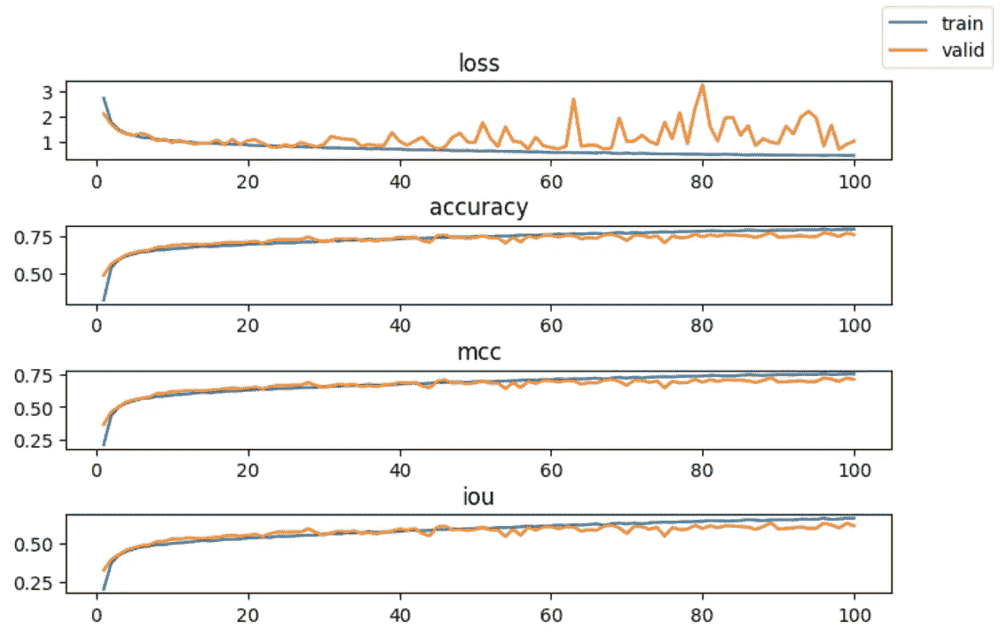

图 6。培训指标。来源:作者。

我们看到在第 30 代左右，验证损失开始变得不稳定，尽管如此，指标仍在改善。指标的参差不齐是循环学习率的典型特征，因为指标往往在每个周期结束时达到峰值[ [7](https://arxiv.org/pdf/1506.01186.pdf) ]。我们从[分类教程](https://medium.com/@itberrios6/point-net-for-classification-968ca64c57a9)中得知，MCC 通常比 F1 分数或准确度[ [8](https://bmcgenomics.biomedcentral.com/articles/10.1186/s12864-019-6413-7) ]更能代表分类。即使我们正在进行细分培训，这仍然是一个很好的观察指标。我们真正感兴趣的是 IOU(或 [Jaccard Index](https://en.wikipedia.org/wiki/Jaccard_index) )。这是因为类不仅仅是类别，它们是包含在点云中的连续结构。我们希望看到我们的预测与 IOU 量化的基本事实的重叠百分比。图 6 显示了如何根据集合计算 IOU。

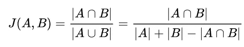

图 6。Jaccard 索引(并集上的交集)。来源:[ [9](https://en.wikipedia.org/wiki/Jaccard_index) ]

我们通过下式计算 PyTorch 中的 IOU:

```
def compute_iou(targets, predictions):

    targets = targets.reshape(-1)
    predictions = predictions.reshape(-1)

    intersection = torch.sum(predictions == targets) # true positives
    union = len(predictions) + len(targets) - intersection

    return intersection / union 
```

# 模型评估

## 试验结果

从我们的训练中，我们发现在第 68 个历元上训练的模型在测试集上产生最好的 IOU 性能。区域 6 的测试指标如下图 7 所示，对于该区域，我们使用每个分区 15000 个点，而不是 4096 个点来进行培训和验证。由模型学习的权重延续到更密集的测试点云，因为所有分割都具有相似的结构。

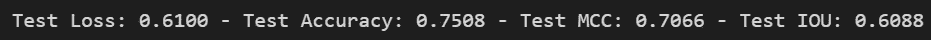

图 7。模型 68 的测试指标。来源:作者。

## 分割结果

为了真正评估我们的模型，我们在数据加载器中创建了一个特殊的函数来获取构成完整空间的分区。然后，我们可以将这些分区缝合在一起，以获得完整的空间。通过这种方式，我们可以看到整个预测空间是如何与地面事实相比较的。同样，数据集的代码位于这里的[处](https://github.com/itberrios/3D/blob/main/point_net/s3dis_dataset.py)，我们可以使用以下内容获取一个随机空间:

```
points, targets = s3dis_test.get_random_partitioned_space()
```

图 8 显示了几个完整测试空间的结果。这是一个在几个办公室布局中获得良好分割结果的例子。您可以看到，杂波(黑色)似乎是随机分配给预测点云中的区域。

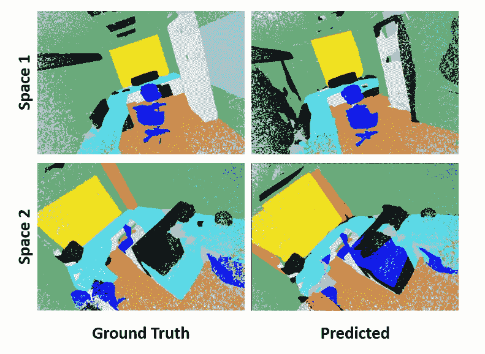

图 8。两个随机测试空间的分割结果。来源:作者。

完整的视图很好看，但是检查模型在每个分区上的执行情况仍然很重要。这让我们真正看到模型学习类的结构有多好。各种分区的分割结果如图 9 所示。

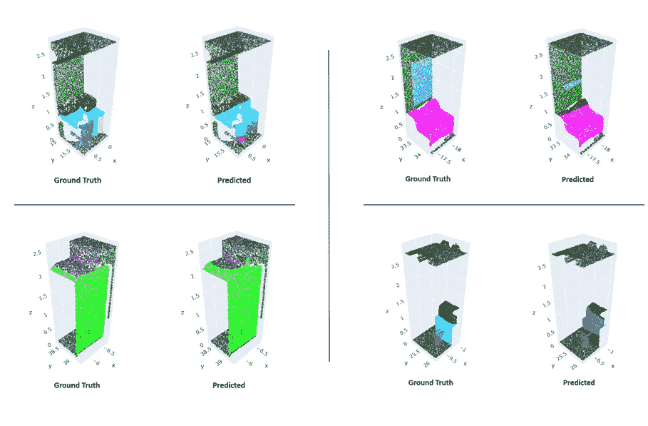

图 9。各种测试分区的分割结果。来源:作者。

在图 9 右上角的分区示例中。你会发现这个模型很难定义杂乱(黑色)和桌子(浅绿色)的边界。一个普遍的观察是，任何过度的扰动都倾向于被称为杂波。总的来说，该模型的性能相当好，因为它能够获得合理的分割性能，如 IOU 所量化的。我们还可以在测试空间中观察到一些相当合理的性能，如图 8 所示。

## 临界集

如果你还记得[介绍点网](https://medium.com/@itberrios6/introduction-to-point-net-d23f43aa87d2)的文章，点网能够学习点云结构的基本框架，也就是[ [2](https://arxiv.org/pdf/1612.00593.pdf) 提到的临界集。在[分类教程](https://arxiv.org/pdf/1612.00593.pdf)中，我们能够查看学到的临界集，我们将在本教程中做同样的事情。我们对每个分区使用 1024 个点，因为这是模型学习的全局特征的维度。下面给出了缝合在一起并显示整个空间的临界集的代码。详情请见[笔记本](https://github.com/itberrios/3D/blob/main/point_net/pointnet_seg.ipynb)。

```
points = points.to('cpu')
crit_idxs = crit_idxs.to('cpu')
targets = targets.to('cpu')

pcds = []
for i in range(points.shape[0]):

    pts = points[i, :]
    cdx = crit_idxs[i, :]
    tgt = targets[i, :]

    critical_points = pts[cdx, :]
    critical_point_colors = np.vstack(v_map_colors(tgt[cdx])).T/255

    pcd = o3.geometry.PointCloud()
    pcd.points = o3.utility.Vector3dVector(critical_points)
    pcd.colors = o3.utility.Vector3dVector(critical_point_colors)

    pcds.append(pcd)

# o3.visualization.draw_plotly([pcds]) # works in Colab
draw(pcds, point_size=5) # Non-Colab
```

我们使用颜色的真实标签来显示临界集，结果如图 9 所示。

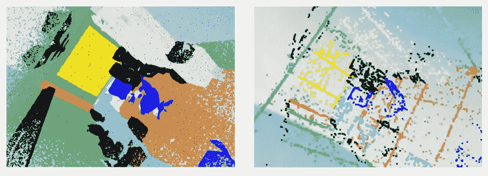

图 9。随机测试空间的基本事实和学习临界集之间的比较。来源:作者。

另一个随机临界集的 GIF 如图 10 所示。由此可以更清楚地看出，临界集维持着室内空间的基本结构。

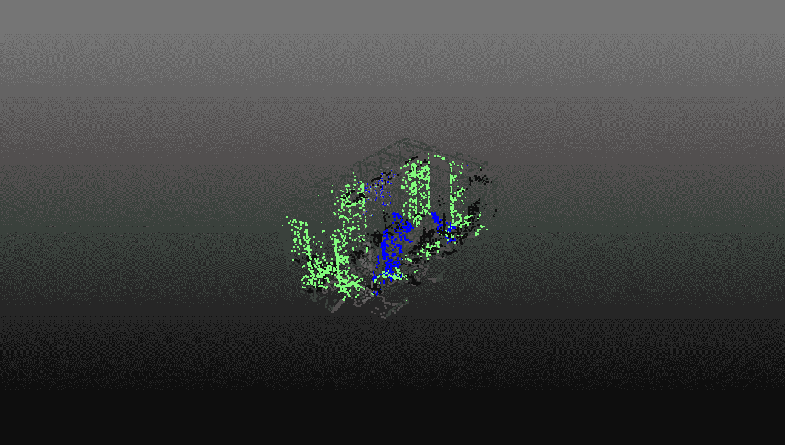

图 10。随机测试空间的临界集。来源:作者。

# 结论

在本教程中，我们学习了 S3DIS 数据集以及如何在其上训练点网。我们已经学习了如何组合损失函数以实现良好的分割性能。即使我们在空间的分区上进行训练，我们也能够将这些分区缝合在一起，并在我们观察到良好性能的测试集上可视化它们的性能。我们能够查看学习到的临界集，并确认该模型实际上正在学习室内空间的底层结构。尽管这个模型已经表现得相当好了，我们仍然有更多的改进空间，下面是对未来工作的一些建议。

## 对未来工作的建议

*   使用不同的损失函数
    -对焦点和骰子损失应用不同的权重
*   使用区域 1-5 的 [k-fold 交叉验证](/k-fold-cross-validation-explained-in-plain-english-659e33c0bc0)来调整超参数
    -一旦发现超参数就在区域 1-5 训练
    -使用区域 6 进行测试
*   随着训练时期的增加，增加增强强度
*   尝试不同的模型
*   按照[ [2](https://arxiv.org/pdf/1612.00593.pdf) 的附录 D 所述实施检测管道

# 参考

[1] Armeni，I .、Sener，o .、Zamir，A. R .、Jiang，h .、Brilakis，I .、Fischer，m .、& Savarese，S. (2016)。大规模室内空间的 3D 语义解析。 *2016 年 IEEE 计算机视觉与模式识别大会(CVPR)* 。[https://doi.org/10.1109/cvpr.2016.170](https://doi.org/10.1109/cvpr.2016.170)

[2]查尔斯，R. Q .，苏，h .，凯春，m .，&吉巴斯，L. J. (2017)。PointNet:用于 3D 分类和分割的点集深度学习。 *2017 年 IEEE 计算机视觉与模式识别大会(CVPR)* 。[https://doi.org/10.1109/cvpr.2017.16](https://doi.org/10.1109/cvpr.2017.16)

[3]奥托尼，A. L .，德阿莫林，R. M .，诺沃，M. S .，&科斯塔，D. B. (2022 年)。调整深度学习中的数据增强超参数以利用小数据集进行建筑物构造图像分类。*国际机器学习与控制论杂志*。[https://doi.org/10.1007/s13042-022-01555-1](https://doi.org/10.1007/s13042-022-01555-1)

[4]王.*语义切分*。【www.cs.toronto.edu】T21。2022 年 12 月 17 日检索，来自[https://www . cs . Toronto . edu/~ ting Wu Wang/semantic _ segmentation . pdf](https://www.cs.toronto.edu/~tingwuwang/semantic_segmentation.pdf)

[5]林，t-y，戈亚尔，p .，吉尔希克，r .，何，k .，&美元，P. (2017)。密集物体探测的聚焦损失。 *2017 IEEE 计算机视觉国际会议(ICCV)* 。[https://doi.org/10.1109/iccv.2017.324](https://doi.org/10.1109/iccv.2017.324)

[6]周，t，阮，s .，&卡努，S. (2019)。基于深度学习的多模态融合医学图像分割综述。*数组*，*3–4*，100004。[https://doi.org/10.1016/j.array.2019.100004](https://doi.org/10.1016/j.array.2019.100004)

[7]史密斯律师事务所(2017 年)。训练神经网络的循环学习率。 *2017 年 IEEE 计算机视觉应用冬季会议(WACV)* 。https://doi.org/10.1109/wacv.2017.58

[8]奇科博士和朱尔曼博士(2020 年)。马修斯相关系数(MCC)在二分类评估中相对于 F1 分数和准确性的优势。 *BMC 基因组*， *21* (1)。[https://doi.org/10.1186/s12864-019-6413-7](https://doi.org/10.1186/s12864-019-6413-7)

[9]维基媒体基金会。(2022 年 10 月 6 日)。 *Jaccard 索引*。维基百科。检索于 2022 年 12 月 17 日，来自[https://en.wikipedia.org/wiki/Jaccard_index](https://en.wikipedia.org/wiki/Jaccard_index)