# PointGAN:可能的最简单 GAN 的分解

> 原文：<https://towardsdatascience.com/pointgan-a-breakdown-of-the-simplest-gan-possible-3a15244dc508>

## 教机器生成一个单点有多难


乔纳森·博尔巴在 [Unsplash](https://unsplash.com/?utm_source=unsplash&utm_medium=referral&utm_content=creditCopyText) 上的照片

# 介绍

本文描述了生成器-鉴别器对的创建，它将是一致的和健壮的(或多或少)。此外，我的目标是获得一个特定的鉴别器函数，它将确保生成器的一致学习(见下图)。

最简单的 GAN 的任务是生成一个点。一个数字，比如“1”生成器将是具有一个权重和一个偏差值的单个神经元。因此，鉴别器必须是钟形的，就像这样:

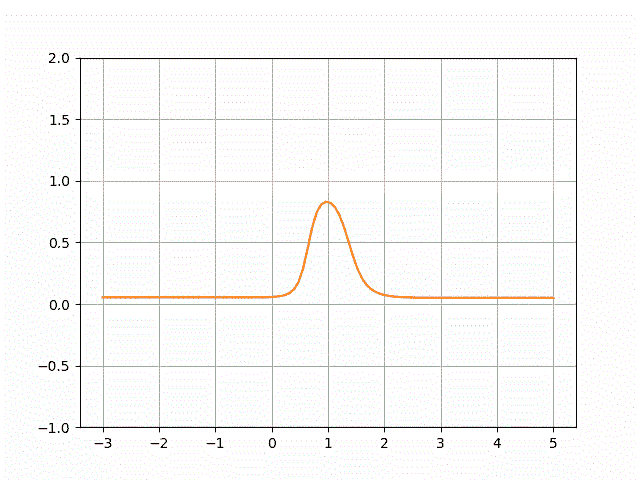

x 轴表示鉴频器的输入，y —是该输入可信的概率。

值“1”被认为是实数，接近“1”的值在某种程度上可能是实数；更远的值——可能是假的。

# 1.基线训练

# 1.1 常用术语

我应该从描述生成器和鉴别器应该是什么样子以及为什么它们应该是这样开始这一部分。

首先，让我们再想想什么是发电机。这是一种将随机输入转换成真实信号的功能。如引言中所述，真实的信号将是单个值“1”对于输入，我将取-1 到+1 之间的一个随机值。

函数本身将是线性的，因为这个例子旨在简单:

```
y = w * x + b
```

其中 y 是输出，x 是输入；w 是神经网络权重，b —是其偏差。这个问题的解决方案是:

```
w = 0
b = 1
```

在这种情况下，不管“x”是什么，“y”总是“1”。在图形上，它由一条垂直线表示，如下图所示。

*这篇文章中有很多情节显示了名为“重量”和“偏差”的训练过程这些值代表我刚刚描述的“w”和“b”。因此，当我们看这些图时，当“权重”收敛于 0 而“偏差”收敛于 1 时，我们应该感到高兴。*

第二，鉴别器。这是另一个函数，它输出其输入可信的概率。在我们的例子中，给定输入“1”，它应该输出接近“1”的值，否则应该输出“0”对于 GAN 网络，它还充当发生器的损耗函数，因此它应该是平滑的。下面是我期望得到的生成器和鉴别器的图:

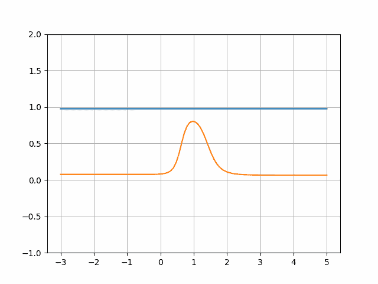

鉴别器函数(橙色)同上，发生器函数(蓝色)为“y = w * x + b”形式。

就公式而言，鉴别器应尽可能简单。然而它不可能是线性的，因为我们的目标是得到一个钟形。因此，最简单的可能解决方案是具有两个隐藏节点的多层感知器:

顺便说一下，如果我想看看我的生成器和鉴别器函数是什么样子，我只需通过它们传递一系列数字:

事实上，我就是这样得到上面的图的。

# 1.2 GAN 培训

在我们开始第一次训练之前，我想讨论一下模型将如何被训练，以及我将如何可视化它。请看下图:

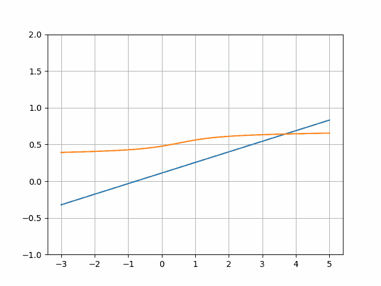

此图像显示了训练开始时的生成器和鉴别器，因此它们的参数是随机的。

由蓝线表示的函数旨在将随机输入转换为实际值(现在它也输出随机值，因为它未经训练)。例如，如果我们生成随机值[-2.05，0.1，2.5]，这个函数会将它们转换为(大约)[-0.2，0.3，0.49]:

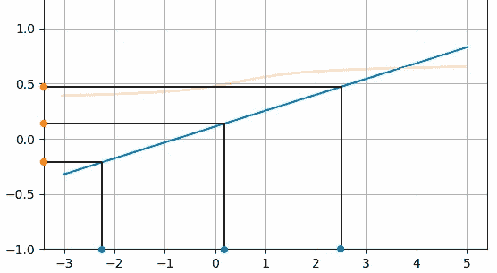

然后将这些值传递给鉴别器(注意刻度差异，纵轴上每个值 2 个方块，横轴上每个值 1 个方块):

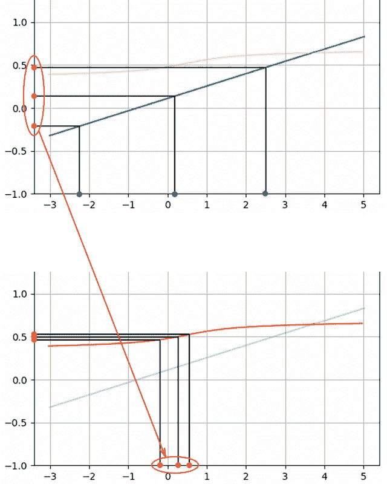

然后收集由鉴别器输出的分数。用真实值重复该过程:

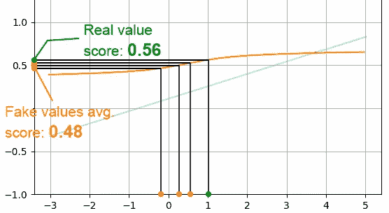

假值的平均输出为 0.48，真值的平均输出为 0.56。之后，发生器和鉴别器将采取不同的行动，以便进行训练。

**鉴别者的观点。**

鉴别器试图通过分数来区分真假值。在这种情况下，可以通过使函数更陡峭来实现:

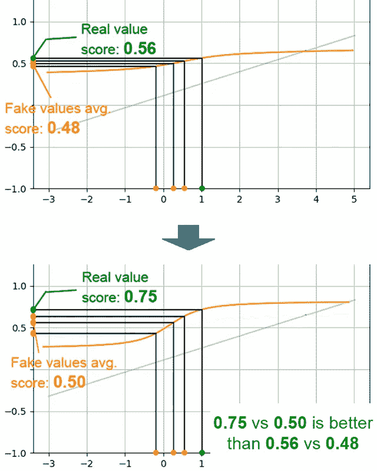

你可能会注意到，我并没有在上图中定义什么是“更好”。稍后我将使用二进制交叉熵来实现这个目的，但是它不会计算原始输出的平均值。现在不要太关注它，因为它只是这个过程的一个粗略说明。甚至这一整节的数字都是编的。

**生成器的观点。**

反过来，生成器试图以这样一种方式更新其函数，即当生成的值通过鉴别器时，它们的得分会更高。这可以通过简单地产生更大的值来实现:

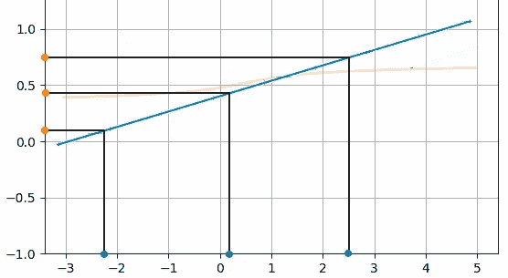

注意，同样的输入[-2.05，0.1，2.5]，输出更大:[0.2，0.4，0.75]。对于新值，鉴别器输出的平均值为 0.51，这更好。

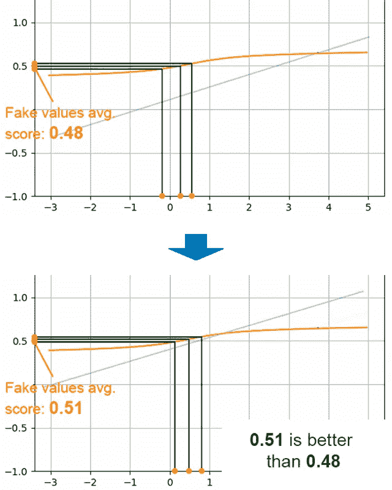

请注意，与上图相比，下图中的输入向右移动。

结合两个模型的训练步骤，我们得到以下转换:


然后用新的随机值作为发生器输入重复该过程。整体训练通过了下图所示的阶段。

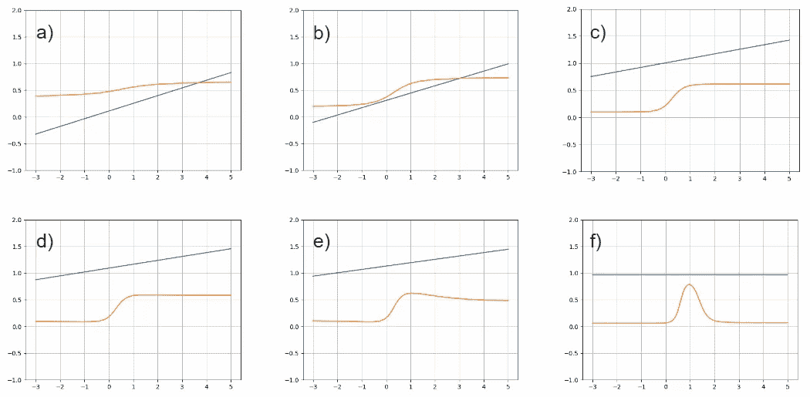

训练进度:a)初始状态。b)生成器试图生成更大的值，鉴别器认为更大的值更真实。c)、d)、e)发电机开始输出大于“1”的值鉴别器也开始将大值评定为假值。f)无论输入是什么，发生器输出“1 ”,鉴别器只将“1”作为最真实的值。

因为我们会有很多这样的小步骤，所以将它们组合成一个动画会很方便，如下所示:

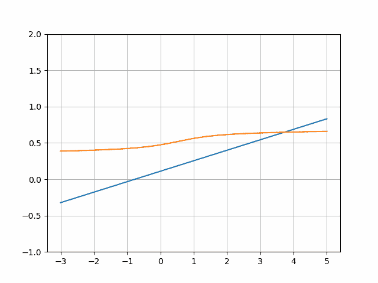

培训期间发生器(蓝色)和鉴别器(橙色)模型的演变。

出于演示的目的，我会大量使用这样的动画。生成它的代码将在下面描述。

# 1.3 基线代码

我们从模型的代码开始，因为我已经在前一节中描述了它们。这基本上是上面的公式，转换成 PyTorch 代码:

该代码将保存在 models.py 文件中。所以每当我导入模型时，我指的是这段代码。

接下来是训练代码，这有点棘手。我们需要两次遍历数据:一次用于生成器训练，一次用于鉴别器。我会用简单的方法来做。我会让他们轮流。鉴别器训练时，发生器将等待，反之亦然:

至于损耗函数，我不会使用常规的 GAN 损耗，只是为了更简单地理解，并表明它不一定是这样的。然而，失败背后的想法将保持不变。给定其输出，生成器希望鉴别器输出 1:

通过 random_input，我将从 0 到 1 取值，生成方式如下:

鉴别器收集来自生成器的输出和真实值，并试图将它们分开:

代码的其余部分是常规例程:

代码已经包含了日志记录，这将在下面描述。

# 1.4 记录

有一件事我想添加到培训-使其生成动画，这是在“1.2 甘培训”一节中描述的除了看起来很酷之外，它还能很好地理解内部的情况。这样一个简单的模型有什么好处呢——我们可以负担得起这种类型的可视化。

我将使用的动画类型是 matplotlib 的 FuncAnimation。想法是我创建一个图形和一个更新图形的函数；该库将为每一帧调用该函数，并生成一个动画:

在某些系统上，可能不存在生成视频所需的某些库。在这种情况下，可以尝试生成 gif:

除了动画日志，我想看看发电机的重量和偏差如何变化，看看训练是否朝着正确的方向移动。我在这个例子中使用了权重和偏差，但是其他选择，比如 MlFlow，也是可以接受的。

训练代码产生以下训练过程(我改变了模型的学习率，并使用不同的随机种子运行代码):

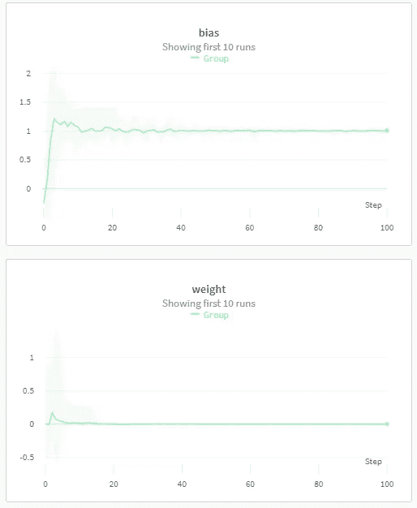

发电机重量和偏差的平均值和标准偏差。

请注意，正确的过程最终会将权重设置为“0”，将偏差设置为“1”

培训大部分是成功的，其中一些描述如下:


但是有几个不好的例子:

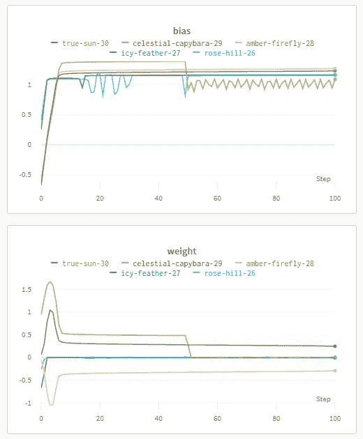

在视觉表现方面，gif，这里有一些例子:

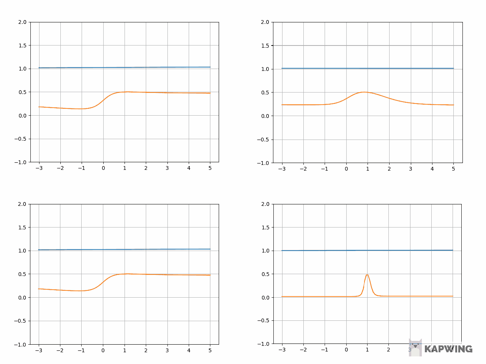

培训期间发生器(蓝色)和鉴别器(橙色)模型的演变。

由于大多数培训都达到了目标，因此可以认为该准则是“有效的”，但人们可能不同意这一点。让我们看看哪里出了问题，以及如何解决它。

# 2.基线的问题

只有两件事让我质疑我的训练是否正确。第一，它有时确实会失败，所以它肯定有些不稳定。其次，是鉴别器功能。只有少数情况下，它看起来像我期待的那样。下面来考察一下我遇到的问题。

# 2.1 发电机正常

在某个时刻，生成器开始输出真实值(因为我们训练它这样做)，鉴别器没有办法找到差异。但是网络不知道这一点，所以它继续训练。由于输入已经是现实的，所以是无效的。而且我们都知道，针对无效数据训练的网络是不充分的。

# 2.2 损失功能不起作用

为了找出问题所在，我从一个失败的案例中取出了一个生成器，并绘制了一些鉴别器参数以及它产生的损耗值。

生成器已经生成了接近真实值的值，在[-0.59，+0.62]的范围内。

我的发现相当令人惊讶，因为一个更好的鉴别函数(作为一个人，我知道更好)——实际上给出了更差的损失值:

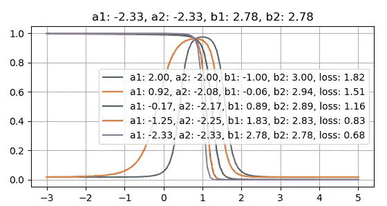

不同鉴别器功能的损失值

这是因为生成的值接近真实值。因此，正确的鉴别器对它们的评估大致相同，只有微小的差异。另一方面，不正确的鉴别器会通过如上图所示的彻底改变来略微提高其性能。

首先想到的是，这个鉴别器以 0.5 的概率将真实的例子评估为真实的。这很容易通过给损失函数加权来解决。这个实验和所有其他实验将在下一节描述。但长话短说，没成功。

# 2.3 设置实验

在继续讨论可行的解决方案之前，我想分享一下基于我上面所做的假设的实验结果。

1.  **损失功能缓解**

当前的交叉熵损失函数希望网络输出为 0 和 1，这使得激活前的值(sigmoid)非常大的正值或负值。因为我们的鉴别器是灵活的，大值不是我们想要的。一个解决办法是让目标不要太极端。我会将它们设置为 0.1 和 0.9，而不是 0 和 1。从而重量不会被迫变大。最后，我们需要从鉴别器得到的只是梯度。

在代码中，我将把鉴别器的目标改为这样(改变缓动参数):

再次训练后，将产生这些曲线:

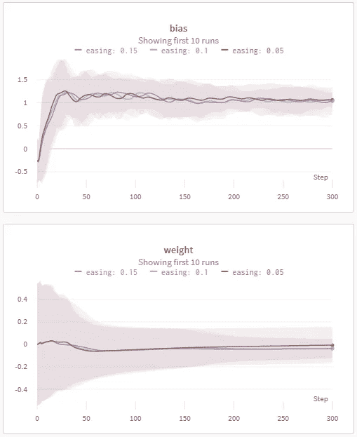

发电机重量和偏差的平均值和标准偏差。

这看起来更稳定，但我仍然不喜欢 gif:

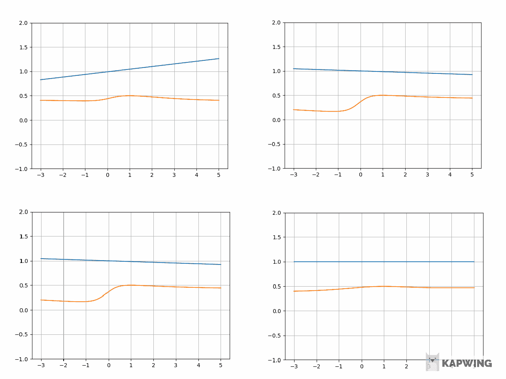

培训期间发生器(蓝色)和鉴别器(橙色)模型的演变。

2.**加权真实事例**

在代码中，我将为假示例设置较小的权重(这里权重是一个小值):

再次运行培训，获得以下图像。简而言之，没用:

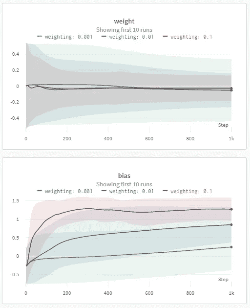

发电机重量和偏差的平均值和标准偏差。

3.**体重衰减**

训练可能失败的原因之一是鉴别器可能在尝试对来自未训练的生成器的输出进行分类时走得太远。尤其是当鉴别器的学习速度明显快于生成器时。

所以给定一个这样的起点

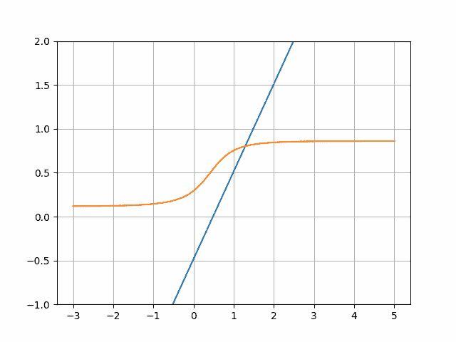

训练开始时的发生器(蓝色)和鉴别器(橙色)功能

鉴别器将很快学习这样一个函数:

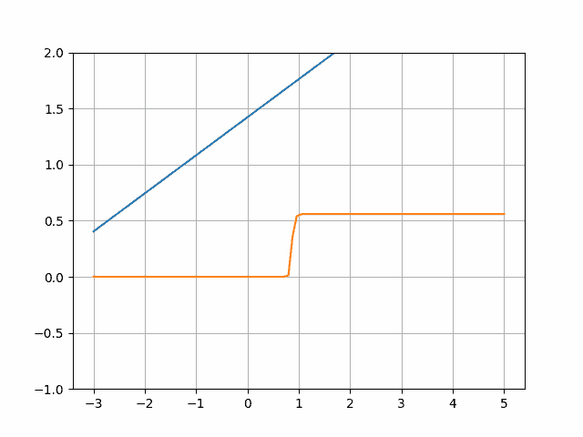

训练结束时，发生器(蓝色)和鉴别器(橙色)起作用

请注意鉴频器功能的清晰度。这意味着它的权重很大，并且(小的)弯曲区域之外的梯度接近于零；所以模型学习非常慢(如果有的话)。

因此，我们的想法是添加一个权重衰减来防止模型达到这种状态:

它给出了以下训练统计数据:

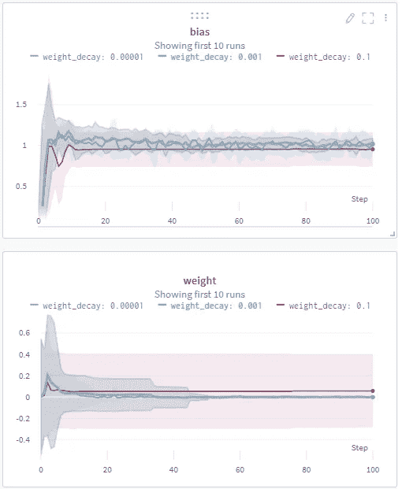

发电机重量和偏差的平均值和标准偏差。

并且可视化如下:

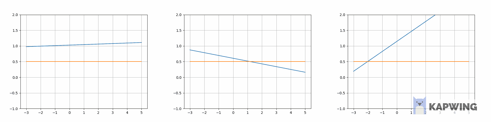

重量衰减= 0.1

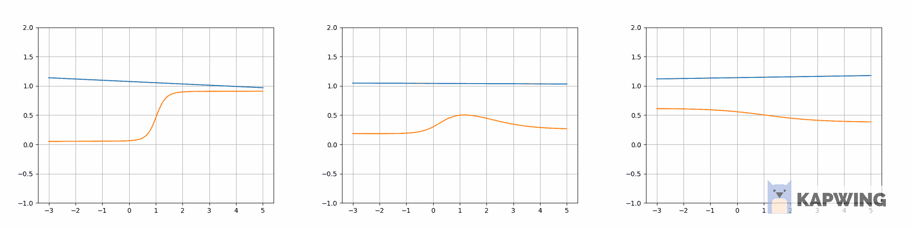

重量衰减= 1e-3

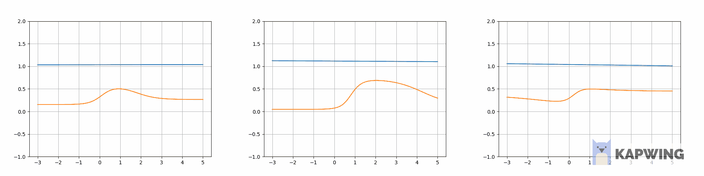

重量衰减= 1e-5

人们可能会看到这种方法能够改善训练，但我仍然对训练过程不满意。

# 3.修复

# 3.1 基本理念

让我们再来看看生成器输出现实答案但鉴别器仍然要学习一些东西的情况。这个问题的一个解决方案是使发电机的输出无效。当然，只是在鉴别训练期间。这类似于某种形式的辍学。这应该是可行的，因为实际的压差是可行的，但是发生器中的参数太少了。如果我们把其中的一个清零，输出会变化太大。

我想出的解决方案包括在生成器的参数(权重和偏差)中添加高斯噪声。这样，即使生成器完全正确，它也会为鉴别器生成稍微无效的数据，以便它可以学习:

剩下的问题是训练噪音太大，因为梯度随着每个优化步骤快速变化。因此，在优化之前，我决定用不同的噪声进行一系列评估——在批次内进行某种批次评估:

这改进了培训过程:

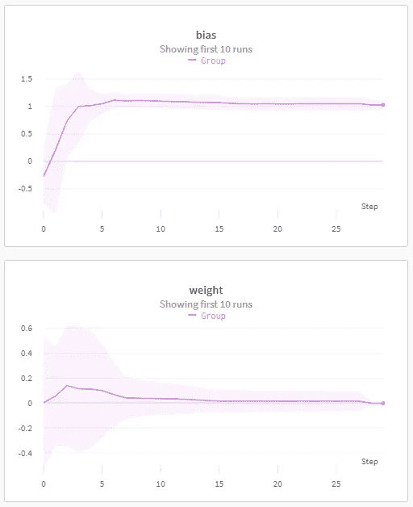

发电机重量和偏差的平均值和标准偏差。

最后生成一个漂亮的生成器函数:

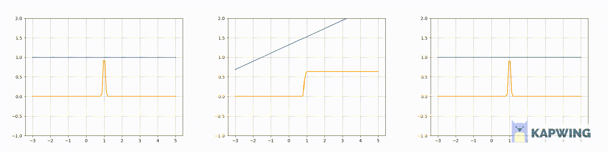

培训期间发生器(蓝色)和鉴别器(橙色)模型的演变。

但是，有些训练并不顺利。以下是培训日志:

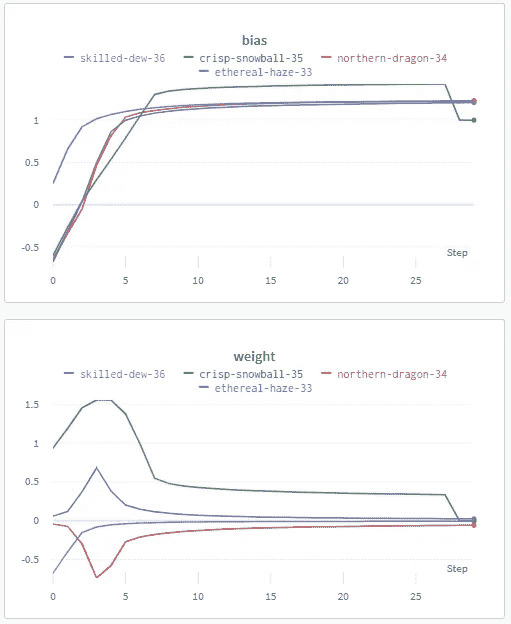

# 3.2 改进

不得不提的是，如果权值的噪声太小，我在“损失函数不起作用”一节中描述的情况也可能出现在这里。它只是没有将模型推进到足以产生一个明显错误的例子。所以我决定提高噪音水平:

```
NOISE_SCALE = 1.5  # Instead of 0.5
```

这一步改进了统计数据，但仍然有失败:

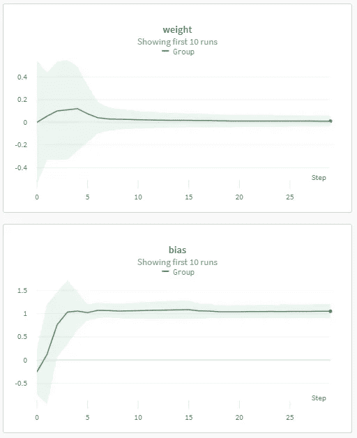

发电机重量和偏差的平均值和标准偏差。

我应用的下一个改进是权重衰减，原因我在上面的“设置实验”部分的“3。体重衰减。”这产生了以下统计信息:

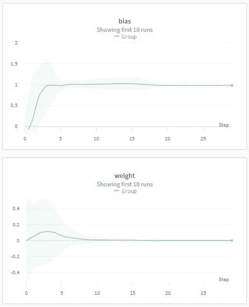

发电机重量和偏差的平均值和标准偏差。

这意味着没有失败的运行。权重衰减有一个副作用，即鉴别器函数变得更平滑，因此 gif 看起来很漂亮:

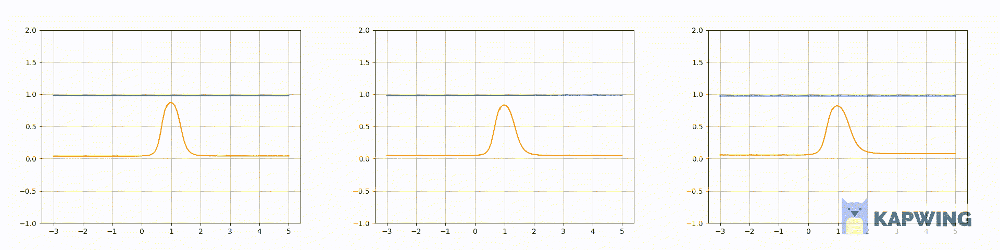

培训期间发生器(蓝色)和鉴别器(橙色)模型的演变。

在我的例子中，我将重量衰减值取为 1e-1:

但请记住，这取决于重量噪音水平。如果它很小，你可能需要减少重量衰减。否则，鉴别器将变平。

更新后的完整代码如下所示:

# 结论

这段代码似乎是一致的和健壮的，至少对于这样一个简单的任务是如此。一些参数仍然需要调整，如内部批量大小或重量衰减值，但总的来说，我对结果感到满意。代码的最终版本不需要像第一个版本那样费力，所以我认为它是成功的。

希望对你有帮助，编码愉快！