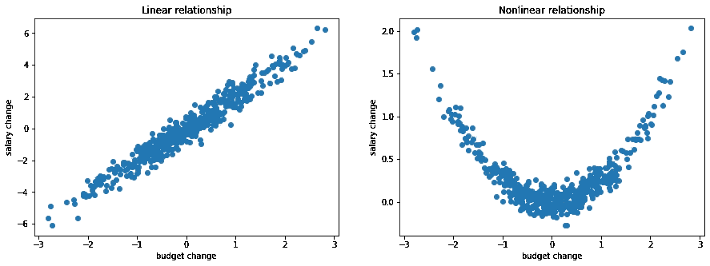
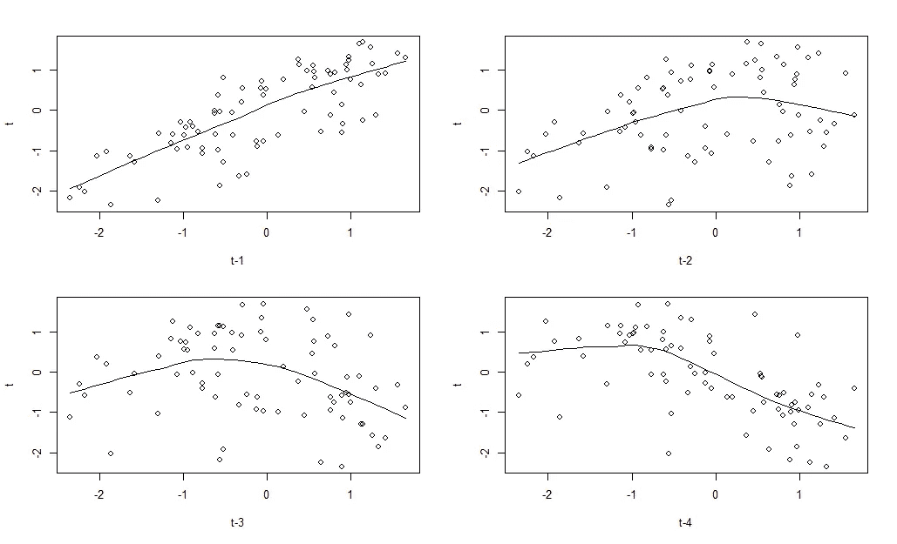
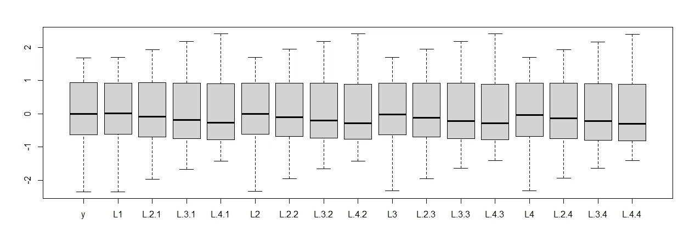
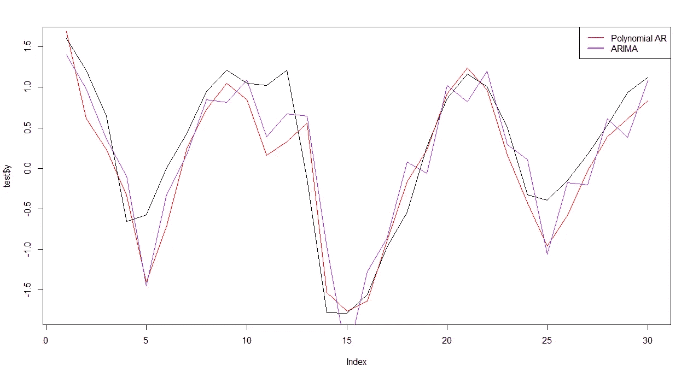
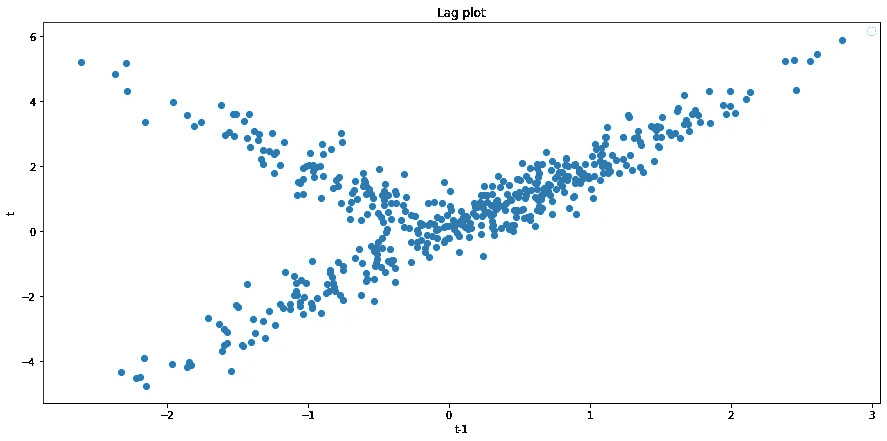

# 多项式自回归:在 2 分钟内改善你的预测

> 原文：<https://towardsdatascience.com/polynomial-autoregression-improve-your-forecasts-in-2-minutes-746d8b57d896>

## 完全初学者的非线性时间序列+代码


by [sebo106](https://pixabay.com/pl/photos/zabytek-czechy-czech-praga-rathaus-92861/)

在人工智能和自动化解决方案的时代，人们相对容易忘记经常产生可比结果的简单技术。你还记得非线性回归吗？

虽然它因其漂亮的分析公式而在学术界非常受欢迎，但自从机器学习爆发以来，它并没有获得太多的关注。尽管我 100%确定你不是真的喜欢数学，但我会告诉你一个非常简单的方法来提高你的时间序列预测的准确性，只需多花两分钟的时间。

**有很多看起来很丑的总结，但是如果你对 r 过敏，你可以跳过其中的大部分。**

如果你对非线性时间序列完全陌生，我强烈建议你从对整个主题的直观介绍开始:

[](/nonlinear-time-series-an-intuitive-introduction-7390aae8b446)  

# 多项式回归

如果你熟悉多项式回归，你可以跳过这一部分。

让我简单介绍一下多项式回归背后的思想。**线性**回归之所以这样叫，是因为它反映了**数据**之间的线性关系。当数据**之间的关系不是线性的**时，使用多项式回归。让我们稍微想象一下:



按作者，用 NumPy 生成

如果我们想要对左边的数据建模，我们将使用标准线性回归:

这显然是我们在学校都学过的经典`f(x)=ax+b`函数。第二张图显示了二次关系。这意味着，我们的回归函数将扩展到:

这个方程的参数α可以用简单的 OLS 很容易地估计出来——这正是我们下一步要做的！

# 认真工作

我认为用 R 来做是最舒服的，然而，我要用的所有工具在 Python、Julia 或其他什么语言中都很容易访问。在我们开始之前，有一个问题我们必须回答:

> **我们如何知道我们的时间序列是非线性的？**

虽然我们可以做一些奇特的统计测试，但我保证这个故事是针对完全初学者的，所以我们保持简单。我希望你们使用的工具非常简单——这是一个滞后图:

```
data <- data.frame(y=log10(datasets::lynx))  #log10 for statistical reasons

{par(mfrow=c(2,2))
  scatter.smooth(lag(train$y, 1), train$y, span = 2/3, degree = 1,
                 family = c("symmetric", "gaussian"), evaluation = 50, xlab = "t-1", ylab = "t")
  scatter.smooth(lag(train$y, 2), train$y, span = 2/3, degree = 1,
                 family = c("symmetric", "gaussian"), evaluation = 50, xlab = "t-2", ylab = "t")
  scatter.smooth(lag(train$y, 3), train$y, span = 2/3, degree = 1,
                 family = c("symmetric", "gaussian"), evaluation = 50, xlab = "t-3", ylab = "t")
  scatter.smooth(lag(train$y, 4), train$y, span = 2/3, degree = 1,
                 family = c("symmetric", "gaussian"), evaluation = 50, xlab = "t-4", ylab = "t")
}
```



按作者

虽然第一个滞后看起来是线性的，但从第二个滞后开始，我们可以清楚地看到非线性关系正在发生。这是使用非线性模型的充分理由。记住——不要在没有看到滞后图的情况下进行时间序列分析！忽略这一点，你可能会被错误地识别。

让我们从正确的数据准备开始建模。为了包含非线性项，我们需要添加多项式特征，然后确保它们都具有相似的方差。我们将通过标准化来实现:

```
th <- 81
for (i in 1:4){ 
  data[paste0("L", i)] <- Hmisc::Lag(data1$y, i) #here we are adding lags
  data[paste0("L.2.", i)] <- Hmisc::Lag(data1$y, i)^2 #from here on we are adding polynomial lags
  data[paste0("L.3.", i)] <- Hmisc::Lag(data1$y, i)^3
  data[paste0("L.4.", i)] <- Hmisc::Lag(data1$y, i)^4
}

data <- data %>% mutate_at(names(data), ~(scale(.) %>% as.vector))  #standarization
data <- na.omit(data)  #get rid of the NAs
boxplot(data)
```



按作者

看起来效果不错。现在，我们将数据集分为训练集和测试集，我们将训练 ARIMA 模型:

```
train <- data[1:80,]
test <- data[th:110,]

ar <- forecast::auto.arima(train$y)
summary(ar)
```

```
Series: train$y 
ARIMA(4,0,1) with zero mean 

Coefficients:
         ar1     ar2      ar3      ar4     ma1
      0.3917  0.4609  -0.4490  -0.2687  0.9339
s.e.  0.1164  0.1346   0.1244   0.1102  0.0619

sigma^2 = 0.1606:  log likelihood = -39.59
AIC=91.18   AICc=92.33   BIC=105.47

Training set error measures:
                      ME      RMSE       MAE     MPE     MAPE      MASE        ACF1
Training set -0.03339086 0.3880593 0.3254522 3.37014 107.7749 0.5795365 -0.01482778
```

ARIMA 模型的最大滞后是 4(为了简单起见，我将它作为最大滞后)。现在让我们训练我们的多项式模型。我们正在做的是:

1.  创建一个包含所有变量+截距的线性回归模型
2.  使用 AIC 网格搜索选择，以找出哪些变量要删除。这也可以通过其他功能选择来完成，但 AIC 是最受欢迎的一个，所以我现在不把它搞得太复杂了。

```
model <- lm(y ~ ., train)

model2 <- stepAIC(model, k=2) # k=log(nrow(train)) - if you want to use BIC
summary(model2)
```

```
Call:
lm(formula = y ~ L1 + L.2.1 + L.3.1 + L.3.2 + L.4.2 + L.2.3 + 
    L.3.3 + L.4.3 + L.3.4, data = train)

Residuals:
     Min       1Q   Median       3Q      Max 
-0.89423 -0.19751 -0.01561  0.24469  0.70938 

Coefficients:
             Estimate Std. Error t value Pr(>|t|)   
(Intercept)  -0.04549    0.03999  -1.137  0.25921   
L1            5.97418    2.63906   2.264  0.02669 * 
L.2.1       -11.85976    5.75545  -2.061  0.04306 * 
L.3.1         7.11220    3.13333   2.270  0.02630 * 
L.3.2         1.39683    0.87505   1.596  0.11493   
L.4.2        -1.95094    0.79889  -2.442  0.01713 * 
L.2.3         7.10425    2.95244   2.406  0.01876 * 
L.3.3       -16.10242    6.24565  -2.578  0.01204 * 
L.4.3         9.00962    3.36456   2.678  0.00923 **
L.3.4        -0.17323    0.11475  -1.510  0.13564   
---
Signif. codes:  0 ‘***’ 0.001 ‘**’ 0.01 ‘*’ 0.05 ‘.’ 0.1 ‘ ’ 1

Residual standard error: 0.3505 on 70 degrees of freedom
Multiple R-squared:  0.8973, Adjusted R-squared:  0.8841 
F-statistic: 67.97 on 9 and 70 DF,  p-value: < 2.2e-16
```

你很容易注意到的有趣细节是，第一个**延迟是唯一一个被认为是线性的**——回到延迟图，你会明白为什么会发生这种情况。

现在，哪种模式更好？我们来做预测吧！

```
refit <- forecast::Arima(data$y, model=ar)
fcast <- predict(model2, test)

plot(test$y, type='l')
lines(refit$fitted[th:110], col='purple')
lines(fcast, col='red')
```



按作者

你可以很容易地看到，多项式 AR 只是更好地拟合数据集——它不像 ARIMA 的预测那样跳跃，特别是在第 15 次观察之后。它的 *MSE* 怎么样？

```
mean(sum((test$y - refit$fitted[th:110])^2))  #for ARIMA
mean(sum((test$y - fcast)^2))  #for Polynomial AR
```

```
ARIMA: 5.749183
Polynomial AR: 5.119633
```

如您所见，我们已经显著改进了样本外预测**，而没有向数据集添加任何额外信息**！

# 摘要

我刚刚展示给你的是*可能是*最简单同时也是最强大的非线性时间序列技术，你可以在两分钟内完成。然而，实际上，非线性有不同的类型——不幸的是，多项式无法涵盖所有类型，因为我相信你已经想到了。举例？没问题:



按作者，用 NumPy 生成

有人会认为这是撒旦的创造。其中一个可能是对的。即使一开始看起来无法解决，但还是有模型可以处理这种非线性。如果你对此感到好奇，请查看:

[](/threshold-autoregressive-models-beyond-arima-r-code-6af3331e2755)  

如果你有任何问题，请在评论中提问！你也可以通过 LinkedIn 联系我。

[将](https://www.picostat.com/dataset/r-dataset-package-datasets-lynx)链接到数据(GNU)。