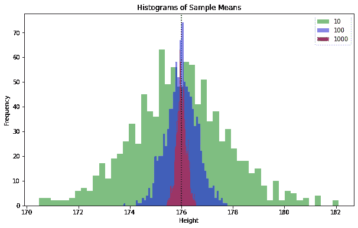
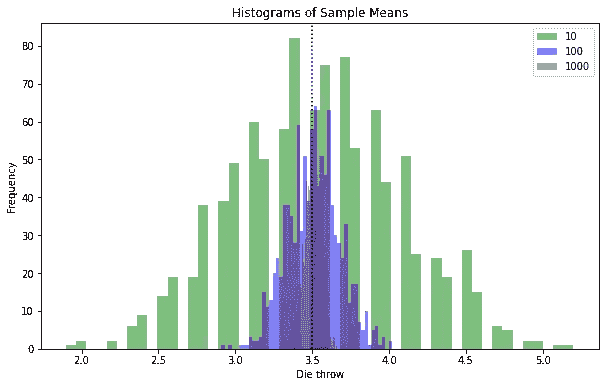
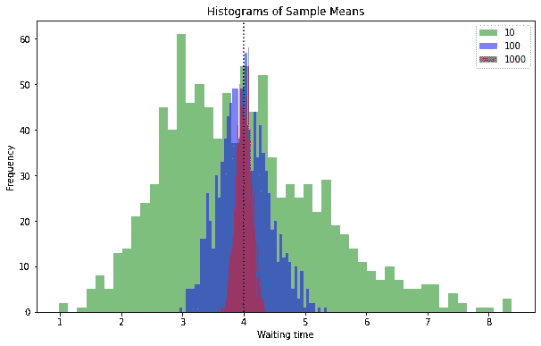
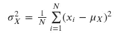
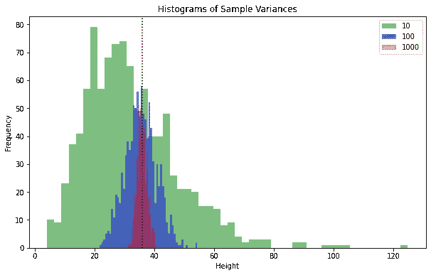
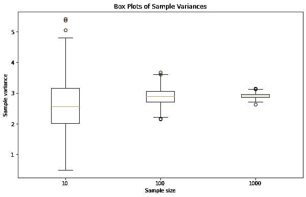
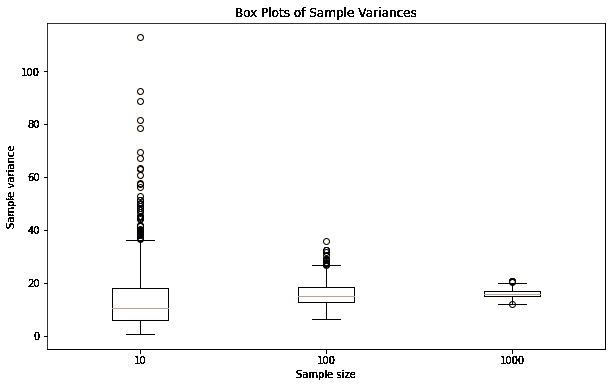

# 总体与样本:我们真的能看到一切吗？

> 原文：<https://towardsdatascience.com/population-versus-sample-b3199d6f1521>

## Python 中的统计实验


照片由[岩田良治](https://unsplash.com/@ryoji__iwata?utm_source=medium&utm_medium=referral)在 [Unsplash](https://unsplash.com?utm_source=medium&utm_medium=referral) 上拍摄

我们大多数人在学校或大学已经学过概率论和统计学。我发现这门学科的难点在于，尽管在实际应用中非常有用，但理论很难理解。其中一个原因是，更仔细地观察一些引入的概念会引出一些近乎哲学的问题。统计学中的人口是什么？基本上我们想看的所有东西。什么是一切？真的能什么都看吗？

第二个挑战是概念的堆积。从随机实验中抽取样本本身就是随机实验。来自总体的样本也遵循概率分布，这与我们想要在总体中得到的统计分布无关。绕过背后苛刻理论的一个方法就是进行实验。这就是我们要做的，来更好地理解总体与样本。

# 填充我们的国家

我们从产生 100 万居民开始。我们想看看不同的理论分布:

*   对于正态分布，我们以身高为例。我国人民的平均身高为 176 厘米，标准差为 6 厘米。
*   为了均匀分布，我们所有的居民扔一个六面骰子，记住结果。
*   对于指数分布，我们假设下一条消息的平均等待时间为 4 分钟。

注意，我们只使用 NumPy，这使得操作速度极快，内存开销很小。NumPy 还提供了大量的统计功能，因此不需要使用像 Pandas 这样更复杂的结构。

我们可以在一台简单的笔记本电脑上用几行 NumPy 代码轻松填充我们的国家。

```
population_size = 1000000population_normal = np.random.normal(loc=176, scale=6, size=population_size)population_uniform = np.random.choice(6, size=population_size) + 1population_exp = np.random.exponential(4, size=population_size)
```

# 看看我们的国家

当我们的国家人口增加后，我们可以很容易地看到整个人口；我们甚至可以立即进行人口普查，从而获得真实的人口参数的平均值和方差。请注意，当谈论现实中的实际人口时，这实际上是不可能的。一般来说，做一次全面的人口普查既费时又费力。这就是为什么我们需要统计数据。

请注意，尽管我们有一个相当大的百万人口，我们人口中的参数均值并不完全是我们在随机生成人口时指定的。随机发生器给了我们这些偏差。世界并不完美，即使在电脑里也是如此。

```
print("Population Mean (normal): %.10f / Population Variance (normal): %.10f" % 
      (np.mean(population_normal), np.var(population_normal)))print("Population Mean (uniform): %.10f / Population Variance (uniform): %.10f" % 
      (np.mean(population_uniform), np.var(population_uniform)))print("Population Mean (exponential): %.10f / Population Variance (exponential): %.10f" % 
      (np.mean(population_exp), np.var(population_exp)))Population Mean (normal): 175.9963010045 / Population Variance (normal): 35.9864004931
Population Mean (uniform): 3.5020720000 / Population Variance (uniform): 2.9197437068
Population Mean (exponential): 4.0014707139 / Population Variance (exponential): 15.9569737141
```

# 大量的统计数据

现在我们开始实际做统计。我们不是观察整个人口，而是取样。与挨家挨户询问 100 万人相比，这是获得大量人口信息的更现实的过程。

最重要的是要明白，每个样本都是随机实验。理想情况下，样本是完全随机的，以避免任何偏差。在我们的随机实验中，情况就是这样。在现实生活中，这种情况更为罕见。除了如果不小心的话可能会引入偏差之外，这并不重要:每个样本都是随机实验。

## 设计实验

我们实验的目的不在于获得人口统计数据，而主要是为了理解整个过程。因为我们有非常有效的方法来获得关于我们的人工种群的信息，所以我们可以做很多实验。

首先，我们将使用三种不同的样本规模:10 人、100 人和 1000 人。请注意，即使是最大的样本也只占总人口的 1%,这让我们节省了 99%的精力。因为我们想了解我们的随机样本在统计上代表我们的总体有多好，所以我们将不止询问一个样本，而是每个样本大小的 1，000 个样本。

在现实生活中，我们通常只取一个样本。这可能是我们一千个样本中的任何一个。如果我们观察 1，000 个样本的分布，我们可以得到一个提示，即选择具有特定统计结果的特定样本的概率。

## 实施实验

想法是在 Python 中使用相对简单的结构。它也只是一个用来玩概念游戏的笔记本。使用函数重构代码并减少笔记本中的复制和粘贴重用将是一个值得做的练习，但我没有做。

在设定了实验次数和样本量之后，我们把我们所知道的关于总体的所有信息打包到一个叫做分布的列表中。为了存储我们的实验结果，我们准备了 NumPy 数组，有足够的空间来保存我们所有实验的结果。我们需要 3 个分布乘以 3 个样本大小的 NumPy 数组。现在我们感兴趣的是随机实验的均值和方差。

在所有这些准备工作之后，它只是一组嵌套的 for 循环来完成所有的工作。再次使用 NumPy 的好处是代码非常快，因为我们可以通过调用 NumPy 函数来完成所有困难的工作。

```
no_experiments = 1000
sample_sizes = [10, 100, 1000]
distributions = [population_normal, population_uniform, population_exp]
# initialize the lists of lists using np.zeros(no_experiments)
sample_means = [...]
sample_variances = [...]s=0
for sample_size in sample_sizes:
    d=0
    for distro in distributions:
        for i in range(no_experiments):
            sample_normal = np.random.choice(distro, sample_size)
            sample_means[s][d][i] = np.mean(sample_normal)
            sample_variances[s][d][i] = np.var(sample_normal)
        d = d+1
    s = s+1
```

注意，代码被缩短了。如果您想详细查看代码，可以在 [Github](https://github.com/Nop287/population_vs_sample) 上获得整个 Python 笔记本。

# 评估方法

在做了大量随机实验后，我们想看看结果。我们使用 Matplotlib 来处理我们的 NumPy 数据结构。请记住，我们有意对总体参数采用三种不同的分布。让我们看看我们得到的关于人口的均值和方差的统计数据。

## 正态分布的平均值

我们首先关注的是人口的高度。我们国家有 100 万人口，平均身高 176 厘米，标准偏差 6 厘米。但现在，我们正在查看分布在 50 个柱状图箱中的 1000 个随机实验的结果。我们查看所有样本大小的直方图。

我们很容易看到我们的结果大致呈正态分布。这与身高在我们人群中也是正态分布的事实无关。正如我们将很快看到的，我们的随机实验将总是正态分布的。因此，从正态或其他分布的总体中抽取随机样本通常会给出正态分布的结果或统计值。

观察三种样本大小，有一些更值得注意的观察结果:

*   直方图箱将总是加起来有 1000 个实验。所以我们总是在柱状图中看到所有的实验。
*   样本越大，我们的直方图越接近正态分布。
*   样本量越大，我们的实验就越接近总体均值。
*   由于 x 轴的标度是绝对的，并且具有较大样本大小的实验的结果不是分散的，所以箱也较小。

我们再次看到，对 1%的人口进行抽样，可以得到非常精确的总体均值结果。实际上所有的实验都在实际群体平均值的 1 厘米以内。由于正态分布不仅非常普遍，而且在数学上也很容易理解，所以你可以计算出在某个区间内你的实验次数。这里我们不做任何数学，只是用 Python 和 NumPy 做实验。

```
fig, ax = plt.subplots(1, 1)
plt.hist(sample_means[0][0], **kwargs, color='g', label=10)
plt.hist(sample_means[1][0], **kwargs, color='b', label=100)
plt.hist(sample_means[2][0], **kwargs, color='r', label=1000)
plt.vlines(176, 0, 1, transform=ax.get_xaxis_transform(), 
           linestyles ="dotted", colors ="k")
plt.gca().set(title='Histograms of Sample Means', 
              xlabel='Height', ylabel='Frequency')
plt.legend()
plt.show()
```



所有其他直方图的代码遵循相同的模式，将被省略。如果您想详细查看代码，可以在 [Github](https://github.com/Nop287/population_vs_sample) 上获得整个 Python 笔记本。

## 离散均匀分布的平均值

现在我们有了人口平均身高的统计数据。现在我们看看我们国家的每个居民扔的六面骰子。每个桌游玩家都应该知道，人口平均值是 3.5。三种样本大小的 1000 次实验的直方图形状也大致呈正态。这是正态分布实际用途的另一个暗示。在这里，我们掷骰子的均匀分布和获得统计平均值的实验的正态分布之间显然没有直接联系。

我们掷骰子的离散性质只给了我们六种可能的结果，再加上大量的条块，给了我们一个样本大小为 10 的奇怪的直方图。原因是投掷六面骰子十次的结果数量有限，即 10 到 60 之间的所有自然数。这在直方图中给了我们一些间隙，但是形状仍然类似于正态分布。

同样，正态分布随着样本数量的增加而变得越来越窄，在 1000 个样本的情况下，我们实际上已经非常接近所有实验中的总体均值 3.5。然而，正如曲线的锯齿状所显示的那样，仍然存在相当多的随机性，就像高度的连续正态分布一样。在我们的设置中，我们可以通过用不同的样本大小做 10，000 次甚至 100，000 次实验来减少这种情况。即使是旧笔记本电脑，这也很容易做到。这在真实人群中是不实际的，因为你最好采取大样本，而不是用小样本做大量的调查。如果你算一下，你会很容易发现，与其问 1000 个随机样本 1000 次，你还不如做一次全面的人口普查，问每个人。



## 指数分布的平均值

图片开始重复，我们得到了非常相似的结果，抽样指数分布的等待时间为下一个信使消息在我们的人口。但是，如果你仔细观察，你会发现 10 人的小样本并不倾向于以 4 人的总体均值为中心。原因是，与均匀分布和正态分布相反，指数分布是非对称的。如果我们在一个随机实验中得到其中一个，我们会得到一些很长的等待时间，这扭曲了我们的平均值。在小样本中，这些异常值会扭曲平均值。在较大的样本中，它是均匀的，我们来看看样本平均值的典型正态分布。

认识到这些异常值实际上是我们数据的一部分是很重要的。我们人群中的一些人等待下一条消息等了 40 分钟，而平均等待时间只有 4 分钟。所以我们不是在处理错误的测量。然而，当处理小样本时，消除这些异常值以获得实际平均值的更精确的图像可能仍然是有益的。当我们不知道你们人口中的分布时，这个问题更难判断，因为我们知道我们正在处理一个指数分布。



# 评估差异

目前，我们正在研究人口平均值，这通常是最相关的信息。还有更多相关的统计参数。最大值或最小值在样本中对我们没有太大帮助，除了检查上面讨论的潜在异常值。我们在样本中获得实际人口最大值或最小值的机会非常小。为了理解我们人口中的分布，方差可能是有帮助的。样本方差是一个合理的计算值。

## 数学

方差的公式为:



你可能还记得一些关于方差的事情:

*   标准差是方差的平方根。我们在这里不需要它，但重要的是要知道我们谈论的基本上是同一件事。
*   样本方差的计算方式不同。我们使用 1*/(𝑁*1)来计算样本方差。

这实际上更复杂，因为我们需要在查看样本方差时考虑[自由度](https://onlinestatbook.com/2/estimation/df.html)。在我们的实验内，每个实验我们都可以用 1，所以我们就不麻烦了。米歇尔·莱什在这个[视频](https://www.youtube.com/watch?v=xJlwSkyeP0k)中很好地解释了数学背景。

## 实验

看看我们的实验，总结是:你可以忘记数学。除以 1000 或者 999 反正差别不大。理论上，样本量为 10 时，我们应该从总体方差中平均抽取 10%的样本。但是，一旦我们观察样本均值的分布，以及在样本量为 10 的 1000 次实验中样本方差是如何分布的，我们的结论是，相差 10%一点也不坏。我们大多数样本大小为 10 的实验都远远偏离了实际的总体方差。



## 从不同的角度来看

在看到大量近似正态分布的直方图后，我们可以尝试另一种可视化。我们的方差实验结果类似于近似正态分布的均值，更接近于样本量较大时的总体方差。为了更好地理解样本大小对方差统计估计质量的影响，我们使用了[箱线图](https://en.wikipedia.org/wiki/Box_plot)。

箱线图给出了 1000 次实验的平均值，加上偏离统计平均值的标准偏差范围。虽然一切听起来都很自然，但更详细的观察是值得的:

*   我们正在使用样本估计方差。
*   对于每个样本量，我们进行 1000 次方差估计。
*   通过实验，我们得到了 1000 个估计值的统计方差的平均值。
*   1000 次实验也有一个方差，就是标准差的平方。

所以这个方框图显示了，在一定样本量下，我们对总体方差估计的方差。当进行实验时，这是很自然的。对正在发生的事情进行理论上的抽象思考并不会让它变得更容易。

结果看起来是合理的:随着样本量的增加，我们得到的总体方差的统计估计值越来越小。有了 1000 个样本，我们非常接近总体方差。箱线图比重叠直方图更清楚地显示了这一点。然而，我们正在处理的近似正态分布随机实验的信息却丢失了。通常，尝试不同的可视化是值得的，因为它们往往会对数据给出不同的见解。

```
fig, ax = plt.subplots(1, 1)
plt.boxplot([sample_variances[0][1], sample_variances[1][1],
             sample_variances[2][1]])
ax.set_xticklabels(['10', '100','1000'])
plt.gca().set(title='Box Plots of Sample Variances', 
              xlabel='Sample size', 
              ylabel='Sample variance')
plt.show()
```



## 极端值

正如我们在均匀分布的方差箱线图中已经看到的，在我们的实验中也有异常值。对于均匀分布，这是很少的，我们有一个大致相似的所有样本大小的数字。对于非常不对称的指数分布，这是非常不同的。同样，使用小样本量的平均值，我们也差得很远。

如果我们得到一个更极端的值，其他样本不能补偿它，我们得到平均值或方差的极端结果。这产生了大量的异常值。如果我们有更大的样本量，在计算均值或方差时，我们有更好的机会让其他样本补偿极值。箱线图明确显示了这一点，而在处理直方图时，尤其是离群值往往会被忽略。



# 结论

从这篇文章中要记住的是，当试图理解复杂的理论事物时，做一些实验是值得的。特别是在概率论和统计学中，这是很容易做到的。Python 是一个很好的工具，因为有许多库可以覆盖甚至最高级的构造。但是即使 Excel 也支持相当大的一组统计函数，并且可以用于实验。

除了对理论有所了解，对实验所用工具的熟练程度也会提高。一旦你有了基本的要素，你就可以很容易地改变你的实验。例如，试着做 100，000 次实验，而不是 1，000 次。你仍然会做随机实验，但是结果的分布将会更接近理论分布。

再次记住，你可以在 [Github](https://github.com/Nop287/population_vs_sample) 上获得整个 Python 笔记本。