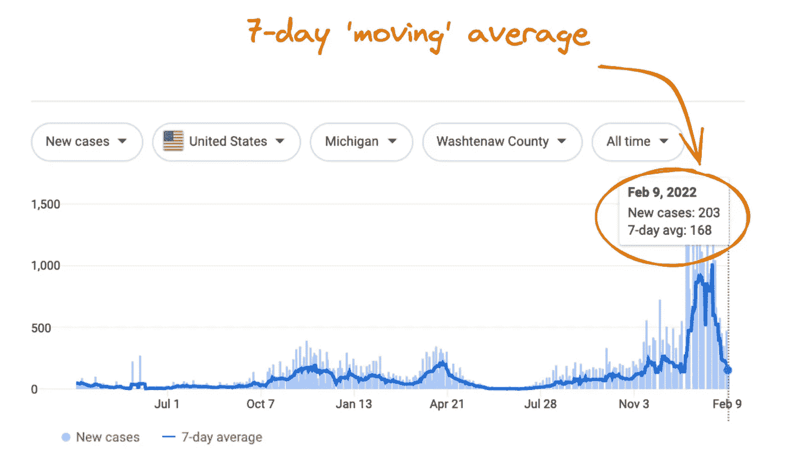
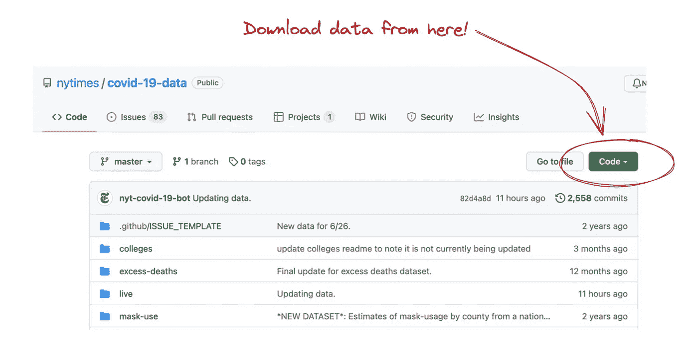
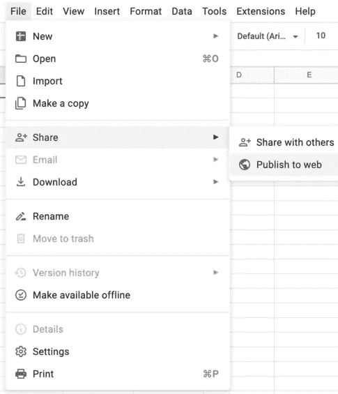
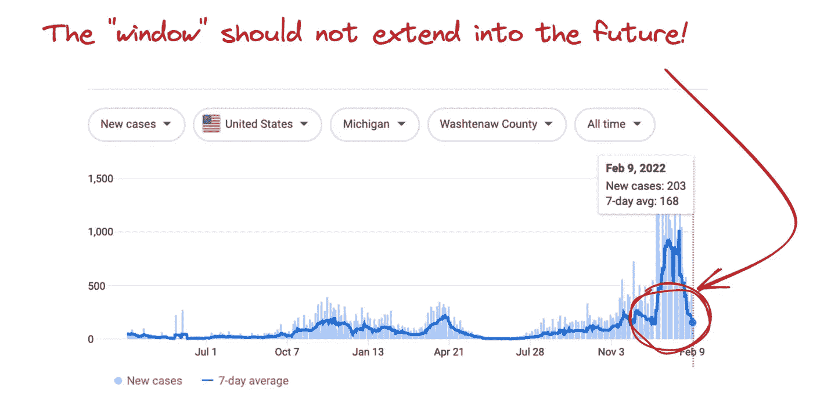

# 展示您的数据技能的组合产品

> 原文：<https://towardsdatascience.com/portfolio-products-to-showcase-your-data-skills-b573e538e094>

## ***调整课程活动，为竞争激烈的就业市场做准备***

中国云南红河哈尼族彝族自治州。图片由作者提供。

我教授数据分析和可视化的入门课程。我的一些学生将从事研究工作，但他们中的大多数人将在基于社区的机构中使用他们的数据技能，这些机构对实用数据技能有强烈的需求。我看到了比以往任何时候都多的利用数据解决社会、公共健康和环境问题的工作机会。随着提供数据专业培训的大学项目和在线项目的增长，就业市场也非常具有竞争力。

如今，每个人似乎都表示他们知道如何处理数据。毕竟，在电子表格中输入一些数字并声称*知道* Excel 有多难？随着就业市场的发展，列出你的软件经验是不够的。雇主希望看到简历上所列技能的证据。这个请求是很好的实践，因为我不知道一个行项目意味着某人*知道*软件或语言，类似于声称[精通微软 Word](https://www.newyorker.com/humor/daily-shouts/i-cannot-begin-to-tell-you-how-proficient-i-am-in-microsoft-word) 。雇主想知道——也想看看——你能用这些工具做什么。

我鼓励我的学生将课程作业转化为投资组合产品，或*产品，以应对市场变化。投资组合产品是你可以与潜在雇主分享的东西，它展示了你在简历和求职信之外的技能和能力。创建组合产品需要时间和精力，但这是一项重大的职业投资。学生们努力满足他们的日常需求，因此这自然会干扰长期游戏的基本活动。为了应对不断发展的就业市场和对学生义务的认识，我一直在重新设计作业和项目，所以最终提交的是作品集产品。*

在这篇文章中，我将引导你思考可以用来展示数据技能的课程作业的方法。我将为你提供一些关于就业市场策略的建议，以及一个我在数据可视化课程中使用的以投资组合为中心的作业的例子。我所在的社会科学领域的工作可能不直接适用于你的领域或技能水平。然而，我提供的战略思维策略可以在许多领域推广。

# 你的就业市场策略

你应该仔细规划你的就业市场策略。毕竟，你已经投入了无数个小时来准备。你不想输掉最后一局。许多学生采取基于垃圾邮件的方法，在时间允许的情况下，向尽可能多的职位发布批量发送相同的材料。基于垃圾邮件的应用程序非常突出，很少受到重视。在竞争激烈的就业市场上，这可不是你想要的那种关注。

花时间为你想要的工作定制你的申请材料。定制材料的一部分需要你了解你的*受众*。谁会看你的材料？他们的背景是什么？他们需要的具体技能是什么？积极思考这些问题可以为你如何准备材料提供战略性的见解。

作为策略的一部分，你还必须考虑打包和分享你的产品组合。如果你正在大学学习，你可能已经有了一个投资组合平台。但是，如果毕业后您的访问权限有限，您可能会想要迁移出这个平台。花点时间让你自己熟悉服务你的投资组合的不同方法和关于这个主题的现有文章。找到一个适合您的需求，但更重要的是，易于访问和导航的目标受众。

# 投资组合产品示例

正如我提到的，我教的学生都是数据处理新手。新手中的一个常见误区是，最好的投资组合产品是复杂的统计和可视化。这是对一般数据和特定组合产品的错误思考方式。数据可视化代表了一种交流形式——一些我见过的使用简单描述性统计的最令人印象深刻的可视化。优雅和影响力来自数据质量和引人注目的故事情节。

我鼓励学生在他们的技能发展中立即准备组合产品。开发组合产品是困难的，但是通过实践，它们会变得更容易和更好。以下部分提供了一个课程活动的例子，该活动产生了与我的研究领域(应用社会科学)的学生相关的*作品集*。认识到创建投资组合产品是一项技能，我通过为新的学习者提供一个建议的工作流程来结束这篇文章。这个工作流程可以推广到其他组合产品。我认识到这项活动可能不直接适用于你的领域或技能水平，所以请随意做出相应的调整。

## 活动概述

如下图所示，报告事例计数的标准做法是滚动平均，也称为移动平均或窗口平均。

来自谷歌搜索结果的冠状病毒病例截图。图片作者。

尽管这是一种常见的做法，但并不是每个人都知道*什么是*滚动平均值，也不知道*为什么*我们使用滚动平均值——一般来说，或者专门用于冠状病毒计数。针对这一困惑，本次作业的可交付成果是一张单页信息图，它解决了以下两个问题:

> 什么是滚动平均？
> 
> 为什么使用滚动平均值来总结冠状病毒病例数(而不是原始的每日计数)？

除了信息图之外，你还应该包括对活动的简短回顾。这种反思的目的是帮助你认识和描述你用来创建可视化和信息图的技能。花时间思考技能。

*   哪些不同类别的技能可能会吸引你的听众？
*   获取和准备数据涉及哪些技能？分析数据？可视化数据？交流数据？设计信息图？

思考超越任务要求。把这当成一个机会，帮助你思考——并获得反馈——高风险面试问题的答案。

## 活动详情

**数据来源。**请使用《纽约时报》数据集中的冠状病毒病例数数据。这些数据是开放的，可以从纽约时报的 Github 网站上免费获得。将数据筛选到单个州或单个县。

NYT Github 冠状病毒案例库截图。图片由作者提供。

**观众是谁？**对于您的所有沟通，包括数据可视化等视觉沟通，您必须始终关注最终用户，即您的受众。您有一个信息图受众(针对此活动)，它不同于您的就业受众。展示与不同受众沟通的能力是你的作品集中需要展示的一项重要技能。想办法用你的设计技能向*展示你的技能。记住，你不是在为自己设计。你是在为观众设计。*

**软件。**您可以使用任何软件进行分析和设计，但不允许使用信息图表软件或预建模板。从一块空白画布开始，使用网格系统来布置信息图的所有元素。请记住，软件只不过是一种工具。寻找设计解决方案，而不是软件解决方案。假设交互特性是合理的，欢迎具有高级技能的学生创建交互可视化。注意不要过分强调你的视觉化。

发布您的信息图。如何以及在哪里发布信息图由你决定。最低要求是创建一个到这个特定组合产品的链接，以及一个高分辨率的静态图像。你的工作质量几乎完全取决于你的创造力、技术技能和设计技能，而不是软件。您可以创建一个优雅而有效的信息图，并使用 Google Sheets 轻松分享:

谷歌工作表菜单截图。图片由作者提供。

**评价。在这项任务中，你最大的障碍是将你的注意力从分数转移到就业市场上。如果你创造了一个适合就业市场的高质量的投资组合产品，你自然会满足分配要求。我提供以下评估标准来帮助指导你的思考。**

*   该信息图解释了什么是移动平均值；
*   该信息图解释了为什么我们使用滚动平均值来报告冠状病毒病例数；
*   解释用通俗易懂的语言，并为你的目标受众量身定制；
*   数据可视化在视觉上强化了解释；
*   数据可视化遵循设计的最佳实践；
*   信息图遵循设计的最佳实践；
*   信息图*是独立的*，意味着目标受众无需搜索更多信息就能理解信息图的主要目标。

## 新学员的建议工作流程

如果您是新手，这里有一个建议的工作流程:

**1。理解任务。不要直接进入数据。相反，确保你理解了可交付物的所有方面。如果您是数据处理新手，并且没有统计学背景，您可能不知道滚动平均值。花点时间熟悉这个问题。在推进之前，确保你理解了任务。这里有一些给正在发展数据技能的学生的提示。**

**2。准备好你的资料。**数据准备是所有数据项目中最耗时的任务。花点时间设置你的数据。查看您的数据，确保您知道列、行和单元格的含义。

**3。分析你的数据。在你的数据整理好之后，继续进行你的分析。新用户应该做好准备，开始时会有被卡住的感觉。努力解决你的问题，而不是寻找神奇的公式。在这篇文章中，我提供了多种解决数据问题的策略。一定要想好窗口计算是怎么规定的。你需要平均每天落后 n 天。不要计算滚动平均值，好像你在展望未来一样！**

**4。可视化您的数据。**获得使用数据准备的一组初始可视化。但是，不要创建一个完美的集合——花时间查看数据。你想重复你的故事。

**5。构建你的故事。**你需要用你的数据讲述一个故事。仅仅因为你有几年的数据并不意味着你应该使用所有的数据。当你有很多变化时，滚动平均特别有用。深入研究您的数据，找出滚动平均值可能会影响我们根据数据做出决策的时间段。创造形象来加强你的解释。请记住，对于冠状病毒计数，标准通常是 5 天或 7 天的滚动平均值。你可以提供不同价值观的例子，但要确保你是在帮助人们理解当前的最佳实践。

截图来自谷歌，基于《纽约时报》的数据。图片由作者提供。

即使你可以访问大约两年的数据，你也应该对你要分析的数据部分有所考虑。当计数非常稳定时，滚动平均不会提供任何信息增益，因此考虑深入到滚动平均最有益的时段。

**6。收集你的元素。**此时，你需要收集信息图的基本要素。你需要一个标题，可能还需要一个副标题(可选)，文本描述和你的可视化。不要担心最终的格式，把所有的元素放在一起。

**7。布局你的元素。避免直接进入软件来构建你的图形。考虑手绘一些*缩略图布局*。确保你正在使用一个网格系统来帮助你考虑以一种支持你的信息的方式来划分你的画布。请记住，您的受众可能会进入左上角的信息图，然后从左到右和从上到下阅读。网格可以帮助您为信息创建一个可视化的层次结构。**

**8。设计您的图形。**这里是学生误入歧途的部分。他们认为对 viz 进行样式化包括使可视化看起来更有吸引力*，*，这导致了对颜色、图标和字体的无限制使用。有意并一致地设计所有元素的样式。我最近发表了一篇关于 [*高风险职业材料的设计*](https://b-r-i-a-n.medium.com/the-design-of-high-stakes-career-materials-3688b6503f5) 的文章，涵盖了与此相关的设计原则。我坚信形式服从功能。

**9。反馈和迭代。**在设计可视化、信息图表和其他职业资料时，注意不要为自己设计。当你处于一个项目的杂草中时，一切对你来说都是有意义的。一切都很清楚。视觉效果很好。一切可能对你有用，但你不是观众。你的工作清楚吗？它是否实现了您预期的信息目标？寻求反馈，而不是拉拉队。

一种*自言自语*的方法可能是有益的。请人们解释他们是如何理解文本和数据的。他们的眼睛画在哪里？他们如何在视觉化图像中移动？这种方法有助于发现错误和改进工作的机会。对于就业市场，你想通过展示你最好的工作来突出你的知识和技能，而不是开发中的产品或有错误的产品。

10。最终检查。发布信息图时，请检查两次链接。在多种浏览器和设备上查看您的作品。确保生成最高分辨率的文件，最好是 PDF 格式。

我建议把这个工作流程看作是一套指导方针，而不是规则。关键的一点是，你对你正在生产的东西有一个明确的方向，并把项目分解成离散的步骤。