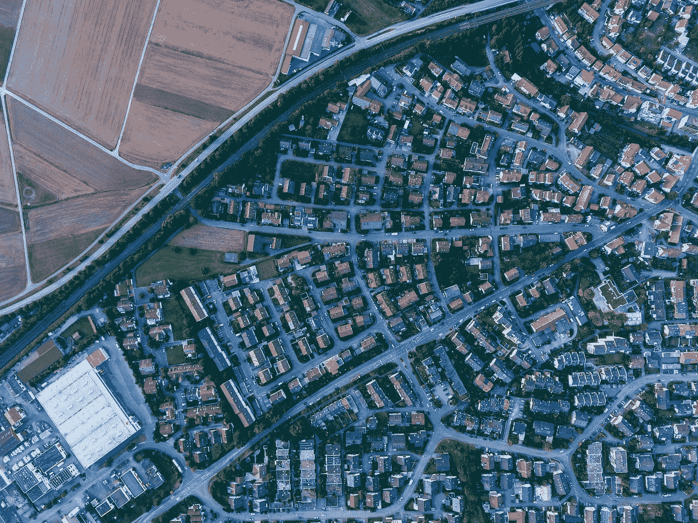
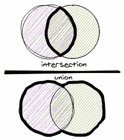
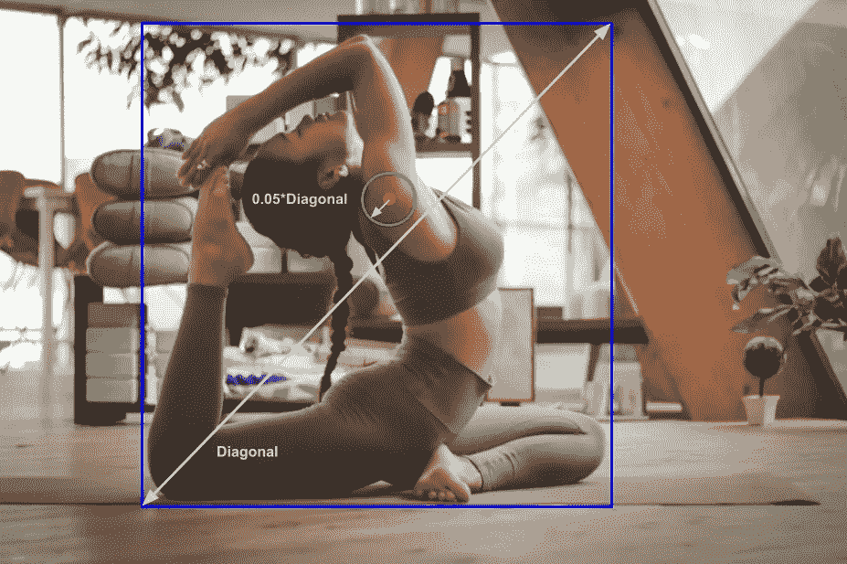
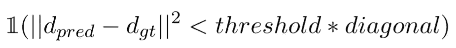
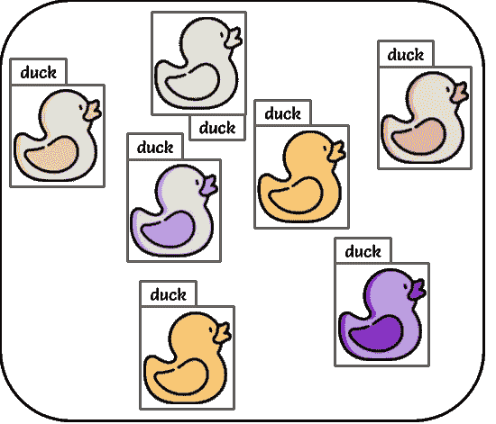

# 计算机视觉开发人员的 PostGIS

> 原文：<https://towardsdatascience.com/postgis-for-computer-vision-developers-5e703e37ad55>

## 直接在 SQL 中分析几何对象，无需额外的 Python 代码



马克斯·博廷格在 [Unsplash](https://unsplash.com?utm_source=medium&utm_medium=referral) 上拍摄的照片

当我们谈论计算机视觉算法的输入和输出时，我们主要谈论两件事——图像和注释。虽然图像大多存储在云存储中，但注释有更广泛的存储选项。在我的例子中，所有的注释都存储在数据库中。

我是一个 Python 爱好者。作为一名计算机视觉开发人员，我的大部分工作都与 Python 有关。但是正如我所说的，注释是我的数据不可分割的一部分，存储在 PostgreSQL 数据库中。我曾经编写简单的查询来提取我的所有数据，然后使用 Pandas/OpenCV/Shapely 或任何其他相关的库在 Python 中进行分析。然后有一天，我被介绍给波斯特吉斯。

在这篇文章中，我想继续介绍 PostGIS——python 的替代品，用于分析几何结果(PostgreSQL 数据库)。

# 波斯特吉斯

[](https://postgis.net/)  

[PostGIS](https://postgis.net/) 是 [PostgreSQL](https://postgresql.org/) 对象关系数据库的空间数据库扩展器。它增加了对地理对象的支持，允许在 SQL 中运行位置查询。

在我们的例子中，计算机视觉任务，PostGIS 允许几何对象表示，如点，线，多边形。使用 PostGIS 的几何表示，我们可以轻松地在 SQL 查询中直接应用几何操作和变换，而无需额外的 Python 代码。

一些 PostGIS 方法相当于 Python 中的 [GeoPandas](https://geopandas.org/en/stable/) 和 [Shapely](https://shapely.readthedocs.io/en/stable/) 。

# 数据概述

## **我在数据库里有什么**

1.  **数据注释** —我们所有的图像注释都存储在数据库中。注记工具直接连接到数据库，每当注记作业完成时，所有数据都会以 PostGIS 格式写入数据库。
2.  **算法结果** —像分割一样，算法结果也存储在数据库中。无论是生产环境的结果还是研究环境的结果。

图像注释和图像算法结果之间的连接可以通过根据图像 ID 进行连接来容易地完成。

在对所有相关数据应用查询后，我们可以使用 PostGIS 轻松操作它。例如，为分段任务计算 IoU。使用 PostGIS，我们不需要编写 Python 脚本，可以在查询中以方便的方式直接分析数据。

当我们想要添加分析层并将分析结果保存回数据库时，它会更加有用。不需要在 Python 中进行分析(需要触发不同的过程，然后写入数据库),而是可以直接使用 SQL 来完成。

## **应该如何表示**

*   **到几何:**为了使用 PostGIS，你所有的对象(多边形、线、点)都应该用 PostGIS 几何格式表示。

```
# Point
SELECT **ST_GeomFromGeoJSON**(‘{“type”:”*Point*”,”coordinates”:[0,1]}’)# Line
SELECT **ST_GeomFromGeoJSON**('{"type":"*LineString*","coordinates":[[0,1], [15,35], [43.2,5.1]]}'))# Polygon
SELECT **ST_GeomFromGeoJSON**
    (
        '{
            "type":"*Polygon*",
            "coordinates":[[
                [7.7, 51.8],
                [3.8,48.3],
                [7.2,43.5],
                [18.6,43.8],
                [17.9,50.2],
                [13.7,54.0],
                [7.7, 51.8]
            ]]
        }'
    )SELECT 'POLYGON((0 0, 0 1000012333334.34545678, 1.0000001 1, 1.0000001 0, 0 0))'::*geometry*
```

其他现有的制图表达包括点、线串、面、多点、多线串、多面和几何集合。

请注意，与 Python 相反，当使用 PostGIS 面表示时，第一个和最后一个点**必须**相同，以便闭合面并获得有效的表示。

*   **从几何:**几何类型可以转换回数组和文本 **ST_AsText** ， **ST_AsGeoJSON** ，

```
SELECT **ST_AsGeoJSON**('LINESTRING(1 2, 4 5)');
---------------------------
{"type":"LineString","coordinates":[[1,2],[4,5]]}SELECT **ST_AsGeoJSON**('LINESTRING(1 2, 4 5)')::json->>'coordinates';
---------------------------
[[1,2],[4,5]]=======================SELECT **ST_AsText**('POINT(111.1111111 1.1111111)'));
---------------------------
POINT(111.1111111 1.1111111)
```

# 计算机视觉的邮政地理信息系统

## 分段—并集交集(IoU)指标



作者图片

```
# Area
**ST_Area**(l.polygon)# Union
**ST_Union**(l1.polygon, l2.polygon)# Intersection
**ST_Intersection**(l1.polygon, l2.polygon)# IoU
**ST_Area**(**ST_Intersection**(l1.polygon, l2.polygon)) /
**ST_Area**(**ST_Union**(l1.polygon, l2.polygon))
```

搞定了。

## 姿势估计-检测到的关节的百分比(PDJ)度量

如果预测关节和真实关节之间的距离在边界框对角线的某个分数之内，则检测到的关节被认为是正确的。



卡尔·巴塞洛在 [Unsplash](https://unsplash.com/s/photos/gymnastic?utm_source=unsplash&utm_medium=referral&utm_content=creditCopyText) 上的照片。作者添加了注释。



作者图片

*   *||d_pred — d_gt||* —真实关键点和预测关键点之间的欧几里德距离

```
**ST_Distance**(**ST_Point**( GTi_x,GTi_y), **ST_Point**( predi_x,predi_y))
```

*   对角线-边界框的对角线距离

```
-- create bounding box
**ST_MakeBox2D**(**ST_Point**(x1,y1),**ST_Point**(x2,y2))-- get diaginal as line string
**ST_BoundingDiagonal**(**ST_MakeBox2D**(**ST_Point**(x1,y1),**ST_Point**(x2,y2)))-- calculate legnth
**ST_Length**(**ST_BoundingDiagonal**(**ST_MakeBox2D**(**ST_Point**(x1,y1),**ST_Point**(x2,y2))))
```

*   阈值-对角线的分数。

最终查询:对于本例，阈值= 0.05。

```
**ST_Distance**(**ST_Point**( GTi_x,GTi_y), **ST_Point**( predi_x,predi_y)) < 0.05 * **ST_Length**(**ST_BoundingDiagonal**(**ST_MakeBox2D**(**ST_Point**(x1,y1),**ST_Point**(x2,y2))))
```

## 检测-多边形的边界框标注



作者图片

在我的例子中，我没有绑定框注释。我有用于分割任务的多边形注释。我可以使用 PostGIS 轻松地从多边形创建检测注释。

*   选项 1-获得左上角和右下角的点

```
SELECT **Box2D**('POLYGON((7.7 51.8,3.8 48.3,7.2 43.5,18.6 43.8,17.9 50.2,13.7 54,7.7 51.8))'::geometry)
----------------------------
BOX(**3.8 43.5,18.6 54**)
```

*   选项 2-获取边界框的所有四个点

```
SELECT **ST_Envelope**('POLYGON((7.7 51.8,3.8 48.3,7.2 43.5,18.6 43.8,17.9 50.2,13.7 54,7.7 51.8))'::geometry)SELECT **ST_AsText**(**ST_Envelope**('POLYGON((7.7 51.8,3.8 48.3,7.2 43.5,18.6 43.8,17.9 50.2,13.7 54,7.7 51.8))'::geometry))
----------------------------
POLYGON((**3.8 43.5**,3.8 54,**18.6 54**,18.6 43.5,3.8 43.5))
--- We have 5 coordinates and the last coordinate is always the first one as it is a polygon representation.
```

## 多边形变换

是否要将多边形旋转 30 度？你想把它放大两倍吗？轻松点。PostGIS 有几个转换选项。

```
# Rotate 30 degrees counter-clockwise with origin x=50, y=160
SELECT **ST_Rotate**(l.polygon, pi()/6, 50, 160));# Scale X,Y
SELECT **ST_Scale**(l.polygon, 0.5, 0.75)# Scale X,Y,Z
SELECT **ST_Scale**(l.polygon, 0.5, 0.75, 0.8)# Translate X, Y
SELECT **ST_Translate**(l.polygon ,1, 0);
```

## 多边形可视化

想要向用户显示您生成的巨大多边形，但不想显示所有的数百个点？使用 **ST_Simplify** ！

ST_Simplify 使用 Douglas-Peucker 算法返回给定几何体的“简化”版本，包含较少的点。

```
SELECT **ST_Simplify**(geom,<tolerance>)
```

## 更多选项

还有更多选择:

*   想计算多边形的凸包？**ST _ 凸包**
*   想要检查多边形是否重叠？ **ST_Overlaps**
*   检查一个点是否在多边形内？ **ST_Within**
*   需要计算几何图形(多边形、线、点)之间的距离吗？ **ST_Distance**
*   检查自相交？ **ST_IsValid。**
*   移除自相交？ **ST_MakeValid**

# 如果你坚持 Python…

如果我没有让您相信 PostGIS 很棒，并且您仍然想要 Python 中的这一功能，请查看:

 [## 匀称的文档

shapely.readthedocs.io](https://shapely.readthedocs.io/en/stable/#) [](https://geopandas.org/en/stable/)  

# 收场白

我希望我说服了你，PostGIS 不仅对于数据分析师，而且对于计算机视觉开发人员都是一个非常有用的扩展。它提供了丰富多样的选项和几何操作。

它帮助我升级了我的查询，并节省了我使用 SQL 提取数据和 Python 分析数据的开销。现在，我可以在一个地方完成这两项工作，并将结果直接保存回数据库。

希望对你也有帮助！