# 带有 pg_trgm 的 Postgres 模糊搜索:智能数据库猜测你想要什么，当没有找到“宠物食品”时返回“猫粮”

> 原文：<https://towardsdatascience.com/postgres-fuzzy-search-with-pg-trgm-smart-database-guesses-what-you-want-and-returns-cat-food-4b174d9bede8>

## Postgres 中基于 pg_trgm 和 Levenshtein 距离的智能搜索

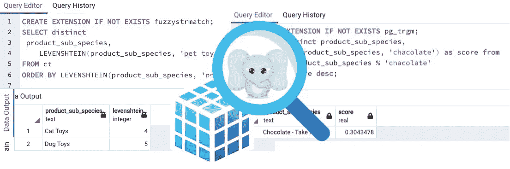

文章中的所有图片均由作者提供

在数据库搜索中，有三种常见的场景超出了传统通配符查询的能力。

首先，当用户搜索“宠物食品”但在您的数据库中没有找到名为“宠物食品”的产品时，数据库会智能地返回“猫粮”或“狗粮”来代替吗？

第二，用户将“chocolate”拼错为“chacolate”，数据库能否尝试猜测用户想要什么并返回最接近的匹配？

第三，词序不同的词仍然可以指代同一事物，如“芒果蛋糕”、“芒果蛋糕”。当单词顺序不同时，数据库能够将搜索字符串与产品名称配对吗？

在传统数据库中，通配符搜索“咖啡机”不会得到“咖啡机”，查找“羊角面包”(拼写错误)不会找到“羊角面包”，查询“洗涤剂手盘”不会返回“手盘洗涤剂”。但是通过 Postgres 中的模糊匹配，pg_trgm 模块支持对相似字符串的快速搜索，并实现了灵活和智能的搜索性能。一些查询结果的对比可以在下图中找到。

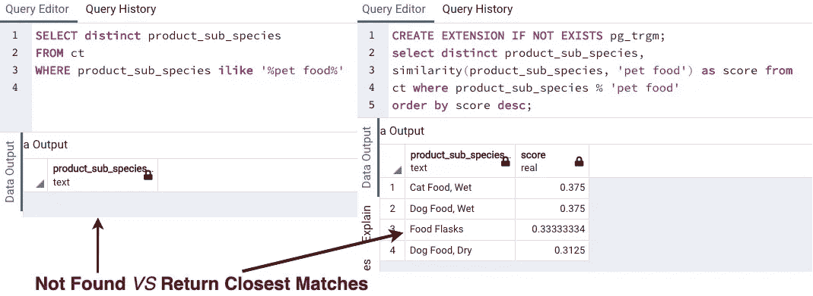

搜索“宠物食品”的比较

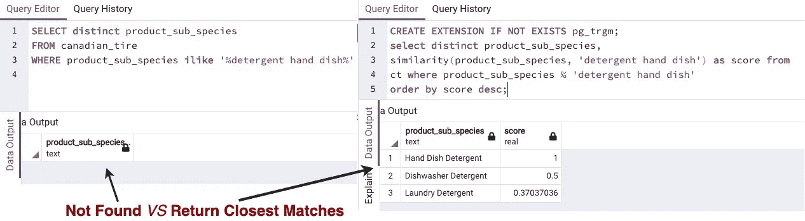

搜索“洗涤剂手盘”的比较

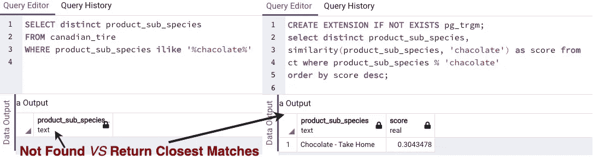

拼写错误的单词“chacolate”的搜索比较

# 大纲

*   **什么是 pg_trgm 和三元模型**
*   **用 pg_trgm 进行模糊搜索**
*   **Postgres 中的 Levenshtein 距离**
*   **Postgres 中的模糊搜索有什么局限性**

# 什么是 pg_trgm

Postgres 的`pg_trgm`模块基于三元组匹配搜索相似的字符串。pg_trgm 中的三元组是忽略非单词字符的三个字符的组。两个给定字符串的相似性可以通过它们共享多少三元组来表示。

# 给定字符串中的三元模型

用例子来理解一个概念总是比较容易的。字符串“mango”中的三元组是

```
m, ma, man, ang, ngo, go
```

“show_trgm”函数返回给定字符串中的所有三元组，它通常用于实际调试。

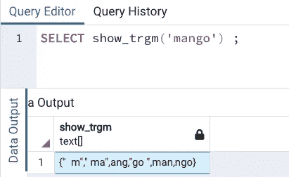

show_trgm '函数

在另一个示例“the|bay”中，我们可以看到只考虑字母数字文本，它们是

```
t, th, the, he, b, ba, bay, ay
```

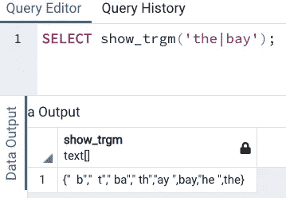

仅考虑字母数字文本

# pg_trgm 相似性评分

两个给定字符串的相似性得分可以通过它们共享的三元模型的数量来衡量。例如，“ ***【芒果蛋糕】*** 和一串不同顺序的“ ***芒果蛋糕”*** 之间的`similarity`得分为 0.68，“ ***猫粮“*** ”和“ ***宠物粮“*** ”得分为 0.38，“ ***椰子“* 【T21”以及拼错的单词“ ***ciconuts*****

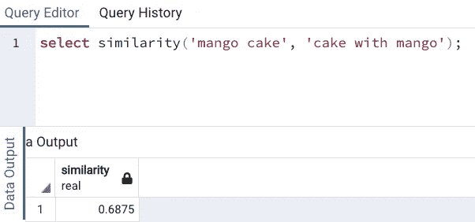

功能`similarity`

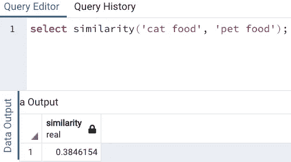

相似的字符串

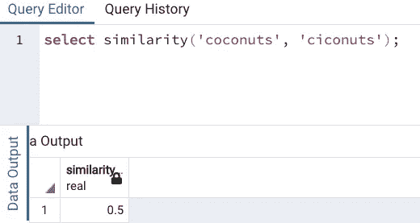

拼写错误的单词

# pg_gram 模糊搜索

首先，为 pg_trgm 创建一个扩展，如果它还没有被加载的话。然后搜索与“咖啡机”相似的目标，并根据相似性得分对结果进行降序排序。如下图截图所示，‘咖啡机’是与‘咖啡机’最相似的产品。

```
**CREATE EXTENSION IF NOT EXISTS pg_trgm;** 
select distinct product_sub_species, 
**similarity**(product_sub_species, 'coffee machine') as score from 
ct where product_sub_species % 'coffee machine'
order by score desc; 
```

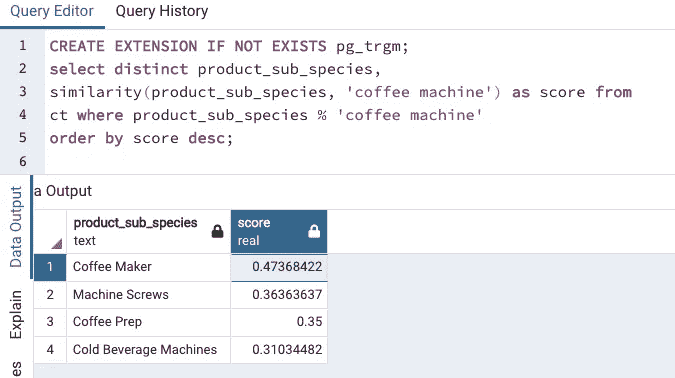

pg_trgm 模糊搜索

让我们来看另一个在查询目标中有拼写错误的例子。用户想要搜索“砧板”,但却输入了“**切肉**板”。我们可以看到 pg_trgm 搜索能够返回“切菜板”作为最接近的匹配，这正是用户想要的。

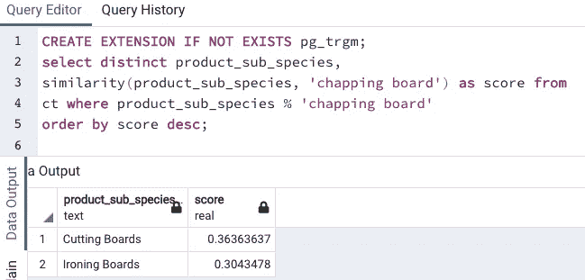

pg_trgm 模糊搜索

# Postgres 中的 Levenshtein 距离

与 pg_trgm 不同，Levenshtein 距离通过查看两个字符串的差异来衡量相似性。正如[维基百科](https://en.wikipedia.org/wiki/Levenshtein_distance#:~:text=Informally%2C%20the%20Levenshtein%20distance%20between,considered%20this%20distance%20in%201965.)、*中所定义的，“非正式地，两个单词之间的 Levenshtein 距离是将一个单词变成另一个单词所需的单个字符编辑(插入、删除或替换)的最小数量。”*

Levenshtein 距离越小，两个字符串越相似。以下示例显示“猫玩具”和“宠物玩具”之间的 Levenshtein 距离为 4，这表明“猫玩具”比“狗玩具”更接近匹配。

```
**CREATE EXTENSION IF NOT EXISTS fuzzystrmatch;**
SELECT distinct
 product_sub_species,
    **LEVENSHTEIN**(product_sub_species, 'pet toy')
FROM ct
ORDER BY LEVENSHTEIN(product_sub_species, 'pet toy') ASC
```

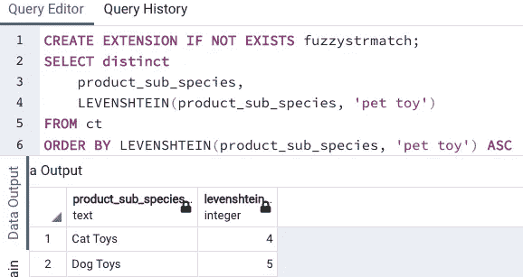

“猫玩具”是具有最小 Levenshtein 距离的最接近匹配。

# Postgres 中模糊搜索的局限性是什么

Postgres 的模糊搜索方法有两个主要的局限性。首先，Postgres 中的字符串匹配不是基于语义的方法。pg_trgm 和 Levenshtein distance，或 soundex，metaphone 都是字符级的比较。例如，SQL 查询搜索“狗咀嚼物”将不会找到“宠物零食”,因为缺少常见的三元模型。

其次，Postgres 中的模糊匹配不能应用于监督学习场景。例如，有两个数据集具有一些公共列:“雇员姓名”、“电子邮件”和“地址”。我们需要将这些数据集中的雇员配对，以加入关于同一个人的信息。典型的解决方案是计算每一列的相似性得分，然后运行随机森林或其他分类器来学习潜在的规则，以从不同的数据集中检测同一个人。这超出了 Postgres。

# 结论

在某些情况下，智能数据库搜索应该表现得像一个搜索引擎，而不是命令行工具。模糊数据库搜索不是向用户抛出“未找到”，而是试图猜测用户想要什么，并返回最接近的匹配。

在本文中，我们通过使用相似的字符串、不同顺序的字符串和拼写错误的字符串进行数据库搜索的例子，讨论了 pg_trgm 和 Levenshtein 距离方法。此外，我们还讨论了模糊匹配在 Postgres 中的局限性。请将这项技术应用到您的项目中，如果您有任何问题，请随时联系我们。🐸 🐣 🐼

参考资料:

*   [F.33\. pg_trgm](https://www.postgresql.org/docs/current/pgtrgm.html)
*   [F.15 .模糊 strmatch](https://www.postgresql.org/docs/14/fuzzystrmatch.html#id-1.11.7.24.7)
*   [在大型数据集上使用 Python 进行模糊字符串匹配，以及为什么不应该使用 FuzzyWuzzy](/fuzzy-string-match-with-python-on-large-dataset-and-why-you-should-not-use-fuzzywuzzy-4ec9f0defcd)

*特别感谢*[*faiz an Qazi*](https://www.linkedin.com/in/faizan-qazi-3b031456)*进行校对。🔆 ✔️ 🐳*